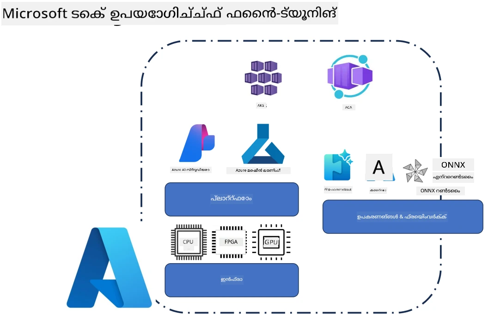
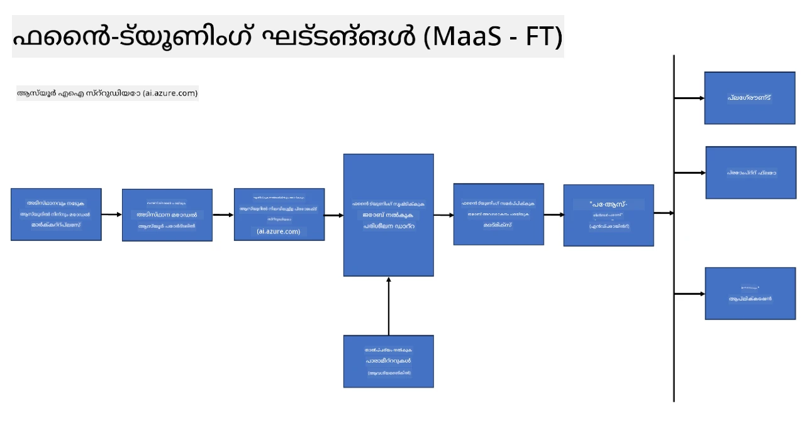
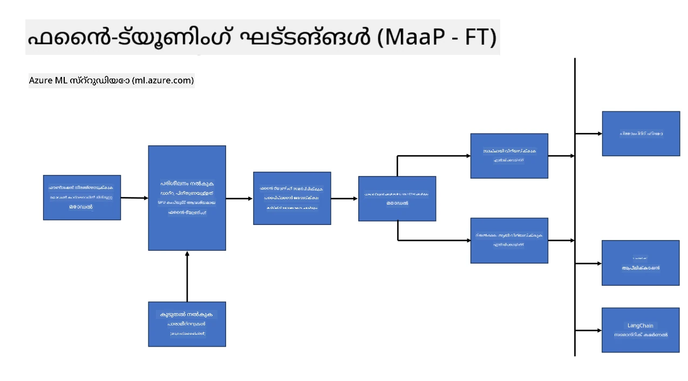
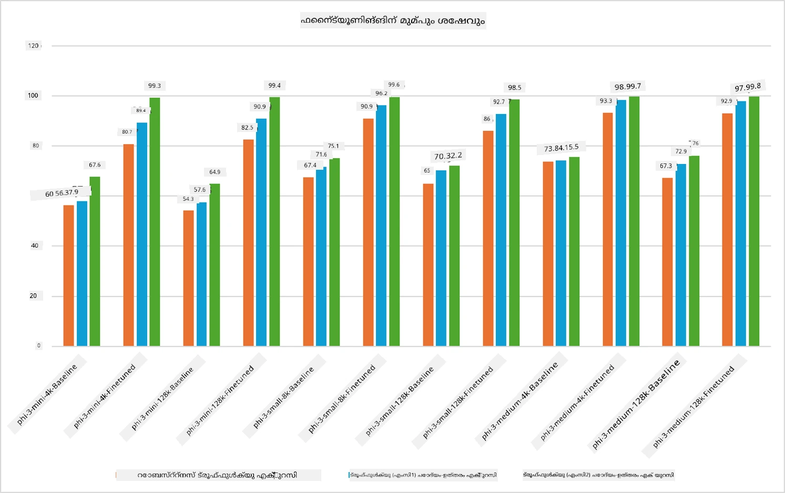

## ഫൈൻ ടിουνിംഗ് സീനാറിയോകൾ

ഈ വിഭാഗം Microsoft Foundry ഉം Azure പരിസ്ഥിതികളിലുള്ള ഫൈൻ-റ്റ്യൂണിംഗ് സേനാറിയോകൾക്ക് ഒരു അവലോകനം നൽകുന്നു, Déployment മോഡലുകൾ, ഇൻഫ്രാസ്ട്രക്ചർ ലയറുകൾ, കൂടാതെ സാധാരണയായി ഉപയോഗിക്കുന്ന ഒപ്റ്റിമൈസേഷൻ സാങ്കേതിക വിദ്യകൾ ഉൾപ്പെടുത്തുന്നു.

**പ്ലാറ്റ്ഫോം**  
ഇത് Microsoft Foundry (ഇതിനകം Azure AI Foundry ആയി അറിയപ്പെട്ടത്)യും Azure Machine Learning ഉം അടങ്ങിയ മാനേജഡ് സർവീസുകൾ ഉൾക്കൊള്ളുന്നു, ഇവ മോഡൽ മാനേജ്‌മെന്റ്, ഓർക്കസ്ട്രേഷൻ, പരീക്ഷണ ട്രാക്കിംഗ്, ഡെപ്ലോയ്മെന്റ് വർക്ക്‌ഫ്ളോസുകൾ എന്നിവ നൽകി നൽകുന്നു.

**ഇൻഫ്രാസ്ട്രക്ചർ**  
ഫൈൻ-റ്റ്യൂണിംഗ് സ്‌കേബിള്‍ കംപ്യൂട്ട് റിസോഴ്‌സുകൾ ആവശ്യമാണ്. Azure പരിസ്ഥിതികളിൽ ഇത് സാധാരണയായി GPU അടിസ്ഥാനത്തിലുള്ള വെർച്വൽ മെഷീനുകളും ലഘുഭാരമുള്ള വർക്ക്‌ലോഡുകൾക്കായി CPU വിഭവങ്ങളും, ഡാറ്റാസെറ്റുകൾക്കും ചെക്ക്പോയിന്റുകൾക്കും സ്കേബിള്‍ സ്റ്റോറേജും ഉൾപ്പെടുന്നു.

**ടൂളുകളും ഫ്രെയിംവർക്കുകളും**  
ഫൈൻ-റ്റ്യൂണിംഗ് വർക്ക്‌ഫ്ളോയുകൾ സാധാരണയായി Hugging Face Transformers, DeepSpeed, PEFT (Parameter-Efficient Fine-Tuning) പോലുള്ള ഫ്രെയിംവർക്കുകളും ഒപ്റ്റിമൈസേഷൻ ലൈബ്രറികളും ആശ്രയിക്കുന്നു.

Microsoft സാങ്കേതിക വിദ്യകളോടെ ഫൈൻ-റ്റ്യൂണിംഗ് പ്രക്രിയ പ്ലാറ്റ്ഫോം സർവീസുകൾ, കംപ്യൂട്ട് ഇൻഫ്രാസ്ട്രക്ചർ, പരിശീലന ഫ്രെയിംവർക്കുകൾ എന്നിവ വ്യാപിപ്പിക്കുന്നു. ഈ ഘടകങ്ങൾ എങ്ങനെ പ്രവർത്തിക്കുന്നുവെന്ന് മനസിലാക്കി, ഡെവലപ്പർമാർ ഫൗണ്ടേഷൻ മോഡലുകളെ പ്രത്യേക ടാസ്കുകളിലും ഉൽ‌പാദന സേനാറിയോകളിലും കാര്യക്ഷമമായി ഇന്റർഡാപ്റ്റ് ചെയ്യാം.

## മോഡൽ ആസ് സർവീസ്

Hosted fine-tuning ഉപയോഗിച്ച്, കംപ്യൂട്ട് സജ്ജമാക്കാനും മാനേജ്മെന്റ് വേണ്ടാതെ മോഡൽ ഫൈൻ-റ്റ്യൂൺ ചെയ്യുക.

Serverless fine-tuning Phi-3, Phi-3.5, Phi-4 മോഡൽ ഫാമിലികൾക്കായി ഇനി ലഭ്യമാണ്, ഇത് ഡെവലപ്പർമാർക്ക് കംപ്യൂട്ട് ഏറെയ്ക്കം ക്രമീകരിക്കാതെ ക്ലൗഡ്, എഞ്ച് സേനാറിയോകൾക്ക് മോഡലുകൾ എളുപ്പത്തിൽ കസ്റ്റമൈസ് ചെയ്യാൻ കഴിയും.

## മോഡൽ ആസ് എ പ്ലാറ്റ്ഫോം

ഉപയോക്താക്കൾക്ക് അവരുടെ തന്നെ കംപ്യൂട്ട് മാനേജു ചെയ്തുകൊണ്ട് മോഡലുകൾ ഫൈൻ-റ്റ്യൂൺ ചെയ്യുന്നതിന്.

[Fine Tuning Sample](https://github.com/Azure/azureml-examples/blob/main/sdk/python/foundation-models/system/finetune/chat-completion/chat-completion.ipynb)

## ഫൈൻ-റ്റ്യൂണിംഗ് സാങ്കേതിക വിദ്യകളുടെ താരതമ്യം

|സിനിമ|LoRA|QLoRA|PEFT|DeepSpeed|ZeRO|DoRA|
|---|---|---|---|---|---|---|
|Pre-trained LLMs പ്രത്യേക ടാസ്ക്കുകൾ അല്ലെങ്കിൽ ഡൊമെയിനുകൾക്ക് അനുയോജ്യമായി മാറ്റിയത്|ഉണ്ട്|ഉണ്ട്|ഉണ്ട്|ഉണ്ട്|ഉണ്ട്|ഉണ്ട്|
|ടെക്സ്റ്റ് ക്ലാസിഫിക്കേഷൻ, നെയിംഡ് എന്റിറ്റി റെക്കഗ്നിഷൻ, മെഷീൻ ട്രാൻസ്ലേഷൻ പോലുള്ള NLP ടാസ്ക്കുകൾക്ക് ഫൈൻ-റ്റ്യൂണിംഗ്|ഉണ്ട്|ഉണ്ട്|ഉണ്ട്|ഉണ്ട്|ഉണ്ട്|ഉണ്ട്|
|QA ടാസ്ക്കുകൾക്ക് ഫൈൻ-റ്റ്യൂണിംഗ്|ഉണ്ട്|ഉണ്ട്|ഉണ്ട്|ഉണ്ട്|ഉണ്ട്|ഉണ്ട്|
|ചാറ്റ്ബോട്ടുകളിൽ മനുഷ്യപോലെ പ്രതികരണങ്ങൾ സൃഷ്ടിക്കുന്നതിനുള്ള ഫൈൻ-റ്റ്യൂണിംഗ്|ഉണ്ട്|ഉണ്ട്|ഉണ്ട്|ഉണ്ട്|ഉണ്ട്|ഉണ്ട്|
|സംഗീതം, കലയോ മറ്റ് സൃഷ്ടികൾ സൃഷ്ടിക്കുന്നതിനുള്ള ഫൈൻ-റ്റ്യൂണിംഗ്|ഉണ്ട്|ഉണ്ട്|ഉണ്ട്|ഉണ്ട്|ഉണ്ട്|ഉണ്ട്|
|കമ്പ്യൂട്ടേഷൻലും സാമ്പത്തികവുമായ ചെലവുകൾ കുറയ്ക്കൽ|ഉണ്ട്|ഉണ്ട്|ഉണ്ട്|ഉണ്ട്|ഉണ്ട്|ഉണ്ട്|
|മെമ്മറി ഉപയോഗം കുറയ്ക്കൽ|ഉണ്ട്|ഉണ്ട്|ഉണ്ട്|ഉണ്ട്|ഉണ്ട്|ഉണ്ട്|
|പരിഷ്കൃത ഫൈൻ-റ്റ്യൂണിംഗിന് കുറവ് പരാമീറ്ററുകൾ ഉപയോഗിക്കൽ|ഉണ്ട്|ഉണ്ട്|ഉണ്ട്|ഇല്ല|ഇല്ല|ഉണ്ട്|
|സമ്പൂർണ്ണ GPU ഉപകരണങ്ങളുടെ GPU മെമ്മറി ആക്സസ് നൽകുന്ന മെമ്മറി-ക്ഷമമായ ഡാറ്റ പാരലലിസത്തിനായുള്ള ഫോർം|ഇല്ല|ഇല്ല|ഇല്ല|ഉണ്ട്|ഉണ്ട്|ഇല്ല|

> [!NOTE]
> LoRA, QLoRA, PEFT, DoRA എന്നിവ പരാമീറ്റർ-ക്ഷമമായ ഫൈൻ-റ്റ്യൂണിംഗ് രീതികളാണ്, DeepSpeed, ZeRO എന്നിവ വിതരിച്ച പരിശീലനവും മെമ്മറി ഓപ്റ്റിമൈസേഷനുമാണ് ലക്ഷ്യമിട്ടിരിക്കുന്നത്.

## ഫൈൻ-റ്റ്യൂണിംഗ് പെർഫോർമൻസ് ഉദാഹരണങ്ങൾ

---

<!-- CO-OP TRANSLATOR DISCLAIMER START -->
**അമുഖിക കുറിപ്പ്**:  
ഈ രേഖ AI പരിഭാഷ സേവനം [Co-op Translator](https://github.com/Azure/co-op-translator) ഉപയോഗിച്ച് പരിഭാഷപ്പെടുത്തിയതാണ്. ഞങ്ങൾ ശരിതഥ്യത്തിനായി പരിശ്രമിക്കുന്നവരാണ്, എന്നാല്‍ സ്വയം പ്രവർത്തിക്കുന്ന പരിഭാഷയിൽ പിഴവുകൾ അല്ലെങ്കിൽ അസംഗതികൾ ഉണ്ടാകാമെന്ന് അറിയുക. അതിന്റെ പാടവമുള്ള ഭാഷയിലെ യഥാർത്ഥ രേഖ അധികൃതമായ ഒരു സ്രോതസ്സായി പരിഗണിക്കേണ്ടതാണ്. നിർണായകമായ വിവരങ്ങൾക്ക് പ്രൊഫഷണൽ മാനവ പരിഭാഷ ശുപാർശ ചെയ്യപ്പെടുന്നു. ഈ പരിഭാഷയുടെ ഉപയോഗം മൂലം ഉണ്ടാകുന്ന ഏതെങ്കിലും തെറ്റിദ്ധാരണകൾക്കോ വ്യാഖ്യാനക്കേടുകൾക്കോ ഞങ്ങൾ ഉത്തരവാദികൾ അല്ല.
<!-- CO-OP TRANSLATOR DISCLAIMER END -->