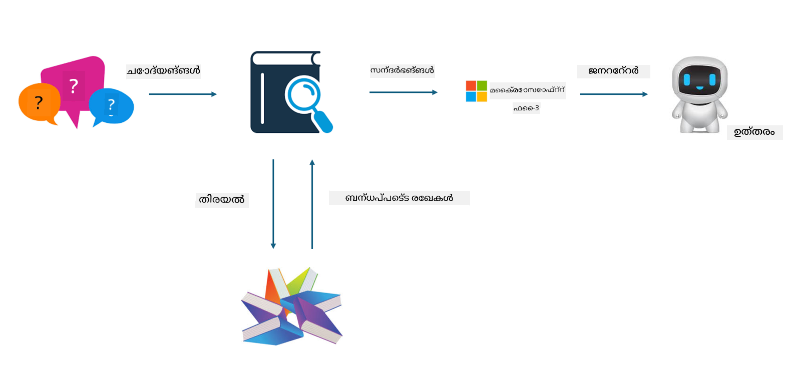

<!--
CO_OP_TRANSLATOR_METADATA:
{
  "original_hash": "e4e010400c2918557b36bb932a14004c",
  "translation_date": "2025-12-21T18:47:38+00:00",
  "source_file": "md/03.FineTuning/FineTuning_vs_RAG.md",
  "language_code": "ml"
}
-->
## ഫൈൻ-ട്യൂണിംഗ് vs RAG

## റിട്രീവൽ ഓഗ്മെന്റഡ് ജനറേഷൻ

RAG ഡേറ്റാ റിട്രീവലും ടെക്സ്റ്റ് ജനറേഷനും എന്നിവയുടെ സംഘം ആണ്. സംരംഭത്തിലെ ഘടനാപരമായ ഡാറ്റയും അസംഘടിത ഡാറ്റയും വെക്റ്റർ ഡേറ്റാബേസിൽ സൂക്ഷിക്കുന്നു. യോജിച്ച ഉള്ളടക്കം തിരയുമ്പോൾ, ബന്ധപ്പെട്ട സംഗ്രഹവും ഉള്ളടക്കവും കണ്ടെത്തി ഒരു കോൺടെക്സ്റ്റ് രൂപപ്പെടുത്തുന്നു, പിന്നെ LLM/SLM ന്റെ ടെക്സ്റ്റ് പൂർത്തീകരണ ശേഷി ചേർത്ത് ഉള്ളടക്കം സൃഷ്ടിക്കുന്നു.

## RAG Process

## ഫൈൻ-ട്യൂണിംഗ്
ഫൈൻ-ട്യൂണിംഗ് ഒരു നിശ്ചിത മോഡലിന്റെ മെച്ചപ്പെടുത്തലിനെ അടിസ്ഥാനമാക്കുന്നു. ഇത് മോഡൽ ആൽഗോറിതം മുതൽ ആരംഭിക്കേണ്ട ആവശ്യം ഇല്ല, പക്ഷേ ഡാറ്റ തുടർച്ചയായി സമാഹരിക്കേണ്ടതുണ്ട്. വ്യവസായ ഉപയോഗങ്ങളിൽ കൂടുതൽ നಿಖരമായ ടെർമിനോളജിയും ഭാഷാ പ്രകടനവും ആവശ്യമുണ്ടെങ്കിൽ, ഫൈൻ-ട്യൂണിംഗ് മികച്ച തിരഞ്ഞെടുപ്പാണ്. എന്നാൽ നിങ്ങളുടെ ഡാറ്റ പതിവായി മാറ്റം കാണുന്നുവെങ്കിൽ, ഫൈൻ-ട്യൂണിംഗ് beachityingly സങ്കീർണമായേക്കാം.

## How to choose
If our answer requires the introduction of external data, RAG is the best choice

If you need to output stable and precise industry knowledge, fine-tuning will be a good choice. RAG prioritizes pulling relevant content but might not always nail the specialized nuances.

ഫൈൻ-ട്യൂണിംഗ് ഉയർന്ന ഗുണമേൻമയുള്ള ഡാറ്റാസെറ്റ് ആവശ്യപ്പെടുന്നു, കൂടാതെ അത് ചെറിയ പരിധിയുള്ള ഡാറ്റയാണെങ്കിൽ, വലിയ വ്യത്യാസമുണ്ടാകാൻ സാധ്യതയില്ല. RAG കൂടുതൽ ലവകരമാണ്
ഫൈൻ-ട്യൂണിംഗ് ഒരു ബ്ലാക്ക് ബോക്സാണ്, അതിന്റെ ആന്തര ഭാഷ്യം മനസ്സിലാക്കാൻ ബുദ്ധിമുട്ടാണ്. പക്ഷേ RAG ഡാറ്റയുടെ ഉറവിടം കണ്ടെത്താൻ എളുപ്പമാക്കുന്നു, അതിലൂടെ ഹല്യൂസിനേഷനുകളും ഉള്ളടക്കത്തിലെ പിശകുകളും ഫലപ്രദമായി സന്നിഹിതമാക്കി രൂപെത്തു നൽകാനും നല്ലതായ പരദർശിത്വം നൽകാനുമാണ് ഇത് സഹായിക്കുക.

---

<!-- CO-OP TRANSLATOR DISCLAIMER START -->
ഡിസ്‌ക്ലെയിമർ:
ഈ രേഖ AI പരിഭാഷാ സേവനമായ [Co-op Translator](https://github.com/Azure/co-op-translator) ഉപയോഗിച്ച് പരിഭാഷ ചെയ്തതാണ്. നാം കൃത്യതയ്ക്ക് പരിശ്രമിക്കുമ്പോഴും, ഓട്ടോമേറ്റഡ് പരിഭാഷകളിൽ പിശകുകളോ അനിശ്ചിതത്വങ്ങളോ ഉണ്ടാകാമെന്ന് ദയവായി ശ്രദ്ധിക്കുക. അസൽ ഭാഷയിലുള്ള മൗലിക രേഖയാണ് ഔദ്യോഗിക ഉറവിടമായി കണക്കാക്കേണ്ടത്. നിർണ്ണായകമായ വിവരങ്ങൾക്ക് പ്രൊഫഷണൽ മനുഷ്യപരിഭാഷ ശുപാർശ ചെയ്യുന്നു. ഈ പരിഭാഷ ഉപയോഗിച്ചതിന consequenceഉള്ളെങ്കിൽ ഉണ്ടായേക്കാവുന്ന ഏതെങ്കിലും തെറ്റിദ്ധാരണങ്ങൾക്കും അല്ലെങ്കിൽ തെറ്റായി വ്യാഖ്യാനിക്കപ്പെട്ടതിൽ നിന്നുള്ള നഷ്ടങ്ങൾക്ക് ഞങ്ങൾക്ക് ഉത്തരവാദിത്വം ഉണ്ടാകില്ല.
<!-- CO-OP TRANSLATOR DISCLAIMER END -->