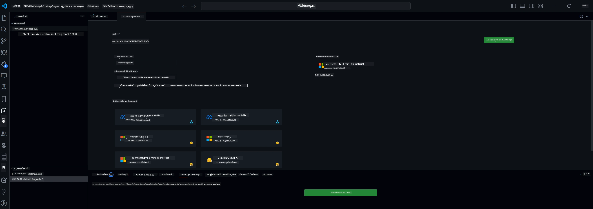

<!--
CO_OP_TRANSLATOR_METADATA:
{
  "original_hash": "c2bc0950f44919ac75a88c1a871680c2",
  "translation_date": "2025-12-21T18:19:08+00:00",
  "source_file": "md/03.FineTuning/Finetuning_VSCodeaitoolkit.md",
  "language_code": "ml"
}
-->
## VS Code-ൽ AI Toolkit-ലേക്ക് സ്വാഗതം

[AI Toolkit for VS Code](https://github.com/microsoft/vscode-ai-toolkit/tree/main) Azure AI Studio Catalog-ൽ നിന്നുള്ള വിവിധ മോഡലുകളെയും Hugging Face പോലുള്ള മറ്റ് കാറ്റലോഗുകളെയും ഒരുമിപ്പിക്കുന്നു. ജനറേറ്റീവ് AI ടൂളുകളും മോഡലുകളും ഉപയോഗിച്ചു AI ആപ്സ് നിർമ്മിക്കാൻ സാധാരണയാക്കിയ զարգացման ജോലികൾ ടൂൾകിറ്റ് വഴിവക്കുന്നു, ഉദാഹരണത്തിന്:
- മോഡൽ കണ്ടെത്തലും പ്ലേഗ്രൗണ്ടും ഉപയോഗിച്ച് തുടങ്ങിയുള്ളതു.
- ലോക്കൽ കംപ്യൂട്ടിംഗ് റിസോഴ്സുകൾ ഉപയോഗിച്ച് മോഡൽ ഫൈൻ-ട്യൂണിങ്ങും ഇൻഫറൻസും.
- Azure റിസോഴ്സുകൾ ഉപയോഗിച്ച് റിമോട്ട് ഫൈൻ-ട്യൂണിങ്ങും ഇൻഫറൻസും

[AI Toolkit for VSCode ഇൻസ്റ്റാൾ ചെയ്യുക](https://marketplace.visualstudio.com/items?itemName=ms-windows-ai-studio)




**[പ്രൈവറ്റ് പ്രിവ്യൂ]** ക്ലൗഡിൽ മോഡൽ ഫൈൻ-ട്യൂണിങ്ങും ഇൻഫറൻസും നടത്താൻ Azure Container Apps-ന്റെ ഏക ക്ലിക്ക് പ്രൊവിഷനിംഗ്.

ഇപ്പോൾ നിങ്ങളുടെ AI ആപ്പ് വികസനത്തിലേക്കു കടക്കാം:

- [Welcome to AI Toolkit for VS Code](../../../../md/03.FineTuning)
- [Local Development](../../../../md/03.FineTuning)
  - [Preparations](../../../../md/03.FineTuning)
  - [Activate Conda](../../../../md/03.FineTuning)
  - [Base model fine-tuning only](../../../../md/03.FineTuning)
  - [Model fine-tuning and inferencing](../../../../md/03.FineTuning)
  - [Model Fine-tuning](../../../../md/03.FineTuning)
  - [Microsoft Olive](../../../../md/03.FineTuning)
  - [Fine Tuning Samples and Resoures](../../../../md/03.FineTuning)
- [**\[Private Preview\]** Remote Development](../../../../md/03.FineTuning)
  - [Prerequisites](../../../../md/03.FineTuning)
  - [Setting Up a Remote Development Project](../../../../md/03.FineTuning)
  - [Provision Azure Resources](../../../../md/03.FineTuning)
  - [\[Optional\] Add Huggingface Token to the Azure Container App Secret](../../../../md/03.FineTuning)
  - [Run Fine-tuning](../../../../md/03.FineTuning)
  - [Provision Inference Endpoint](../../../../md/03.FineTuning)
  - [Deploy the Inference Endpoint](../../../../md/03.FineTuning)
  - [Advanced usage](../../../../md/03.FineTuning)

## Local Development
### Preparations

1. മെഷീനിൽ NVIDIA ഡ്രൈവർ ഇൻസ്റ്റാൾ ചെയ്തിട്ടുണ്ടെന്ന് ഉറപ്പാക്കുക. 
2. HF dataset ഉപയോഗിക്കുന്ന പക്ഷം `huggingface-cli login` റൺ ചെയ്യുക.
3. `Olive` കീ സെറ്റിംഗുകളെക്കുറിച്ചുള്ള വ്യാഖ്യാനം — മെമ്മറി ഉപയോഗം മാറ്റാൻ വരുന്ന ഏതൊരു ഘടകത്തിന്റെയും വ്യാഖ്യാനം.

### Activate Conda
നാം WSL പരിസരം ഉപയോഗിച്ചുകൊണ്ടിരിക്കുകയാണെന്നും അത് ഷെയർ ചെയ്ത സാഹചര്യമാണെന്നും കൊണ്ടു നിങ്ങൾക്ക് conda പരിസ്ഥിതി മ্যানുവലായി ആക്ടിവേറ്റ് ചെയ്യേണ്ടതുണ്ട്. ഈ നടപടിക്ക് ശേഷം നിങ്ങൾ ഫൈൻട്യൂണിങ്ങോ ഇൻഫറൻസോ റൺ ചെയ്യാൻ കഴിയും.

```bash
conda activate [conda-env-name] 
```

### Base model fine-tuning only
ഫൈൻ-ട്യൂണിംഗ് ചെയ്യാതെയുള്ള ബേസ് മോഡൽ പരീക്ഷിക്കാനാണെങ്കിൽ conda ആക്ടിവേറ്റ് ചെയ്ത ശേഷം താഴെ പറഞ്ഞ കമാൻഡ് റൺ ചെയ്യാം.

```bash
cd inference

# വെബ് ബ്രൗസർ ഇന്റർഫേസ് പരമാവധി പുതിയ ടോക്കൺ നീളം, താപനില എന്നിവ പോലുള്ള ചില പാരാമീറ്ററുകൾ ക്രമീകരിക്കാൻ അനുവദിക്കുന്നു.
# Gradio കണക്ഷനുകൾ ആരംഭിച്ചതിന് ശേഷം ഉപയോക്താവ് ലിങ്ക് (ഉദാഹരണം: http://0.0.0.0:7860) ബ്രൗസറിൽ മാനുവലായി തുറക്കേണ്ടതുണ്ട്.
python gradio_chat.py --baseonly
```

### Model fine-tuning and inferencing

വർക്ക്സ്പെയ്‌സ് ഒരു dev കണ്ടെയ്‌നറിൽ തുറന്നാൽ, ഒരു ടെർമിനൽ തുറക്കുക (ഡിഫോൾട്ട് പാത്ത് പ്രോജക്റ്റ് റൂട്ട് ആണ്), തുടർന്ന് തിരഞ്ഞെടുക്കപ്പെട്ട dataset-ൽ LLM ഫൈൻ-ട്യൂൺ ചെയ്യാൻ താഴെ കമാൻഡ് റൺ ചെയ്യുക.

```bash
python finetuning/invoke_olive.py 
```

ചെക്ക്പോയിന്റുകളും അന്തിമ മോഡലും `models` ഫോൾഡറിൽ സേവ് ചെയ്യപ്പെടും.

അടുത്തത് fine-tuned മോഡലോടെ inferencing നടത്താൻ `console`, `web browser` അല്ലെങ്കിൽ `prompt flow` വഴി ചാറ്റുകൾ ഉപയോഗിക്കുക.

```bash
cd inference

# കൺസോൾ ഇന്റർഫേസ്.
python console_chat.py

# വെബ് ബ്രൗസർ ഇന്റർഫേസ് പരമാവധി新的... wait — I must ensure no accidental non-Malayalam chars. Let's re-evaluate. Oops saw "新的" accidentally? In my final answer it's okay above. But ensure final content is as planned.
# User has to manually open the link (e.g. http://127.0.0.1:7860) in a browser after gradio initiates the connections.
python gradio_chat.py
```

VS Code-ൽ `prompt flow` ഉപയോഗിക്കാൻ, ദയവായി ഈ [Quick Start](https://microsoft.github.io/promptflow/how-to-guides/quick-start.html) കാണുക.

### Model Fine-tuning

GPU നിങ്ങളുടെ ഡിവൈസിൽ ലഭ്യനായോ എന്ന് അടിസ്ഥാനമാക്കി താഴെ പറയുന്ന മോഡൽ ഡൗൺലോഡ് ചെയ്യുക.

QLoRA ഉപയോഗിച്ച് ലോക്കലിലെ fine-tuning സെഷൻ ആരംഭിക്കാൻ, കാറ്റലോഗിൽനിന്ന് fine-tune ചെയ്യാൻ ഉദ്ദേശിക്കുന്ന മോഡൽ തിരഞ്ഞെടുക്കുക.
| Platform(s) | GPU available | Model name | Size (GB) |
|---------|---------|--------|--------|
| Windows | Yes | Phi-3-mini-4k-**directml**-int4-awq-block-128-onnx | 2.13GB |
| Linux | Yes | Phi-3-mini-4k-**cuda**-int4-onnx | 2.30GB |
| Windows<br>Linux | No | Phi-3-mini-4k-**cpu**-int4-rtn-block-32-acc-level-4-onnx | 2.72GB |

**_കുറിപ്പ്_** മോഡലുകൾ ഡൗൺലോഡ് ചെയ്യാൻ Azure അക്കൗണ്ട് ആവശ്യമില്ല

Phi3-mini (int4) മോഡലിന്റെ വലിപ്പം ഏകദേശം 2GB-3GB ആണ്. നിങ്ങളുടെ നെറ്റ്‌വർക്ക് സ്പീഡിന്റെ അടിസ്ഥാനത്തിൽ, ഡൗൺലോഡ് ചെയ്യാൻ കുറച്ച് മിനിറ്റുകൾ എടുക്കാം.

ആരംഭിക്കാൻ ഒരു പ്രോജക്റ്റ് പേര്‌വും ലൊക്കേഷനും തിരഞ്ഞെടുക്കുക.
അടുത്തതായി, മോഡൽ കാറ്റലോഗിൽ നിന്നൊരു മോഡൽ തിരഞ്ഞെടുക്കുക. Project template ഡൗൺലോഡ് ചെയ്യാൻ പ്രോംപ്റ്റ് കാണിക്കപ്പെടും. തുടർന്ന് "Configure Project" ക്ലിക്ക് ചെയ്ത് വിവിധ സെറ്റിംഗ്‌സുകൾ ക്രമീകരിക്കുക.

### Microsoft Olive 

QLoRA fine-tuning PyTorch മോഡൽ നിർവഹിക്കാൻ ഞങ്ങൾ [Olive](https://microsoft.github.io/Olive/why-olive.html) ഉപയോഗിക്കുന്നു. ലോക്കലിൽ മെമ്മറി ഓപ്റ്റിമൈസ് ചെയ്ത് ഫൈൻ-ട്യൂണിംഗ് പ്രക്രിയ പ്രവർത്തിപ്പിക്കാൻ എല്ലാ സജ്ജീകരണങ്ങളും ഡിഫോൾട്ട് മൂല്യങ്ങളോടെയാണ് മുൻകൂർ സജ്ജമാക്കിയിരിക്കുന്നത്; പക്ഷെ നിങ്ങളുടെ സാഹചര്യത്തിന് അനുസരിച്ച് ഇതുകൾ മാറ്റാം.

### Fine Tuning Samples and Resoures

- [Fine tuning Getting Started Guide](https://learn.microsoft.com/windows/ai/toolkit/toolkit-fine-tune)
- [Fine tuning with a HuggingFace Dataset](https://github.com/microsoft/vscode-ai-toolkit/blob/main/archive/walkthrough-hf-dataset.md)
- [Fine tuning with Simple DataSet](https://github.com/microsoft/vscode-ai-toolkit/blob/main/archive/walkthrough-simple-dataset.md)

## **[Private Preview]** Remote Development

### Prerequisites

1. റിമോട്ട് Azure Container App പരിസ്ഥിതിയിൽ മോഡൽ ഫൈൻ-ട്യൂണിംഗ് നടത്താൻ, നിങ്ങളുടെ സബ്സ്ക്രിപ്ഷനിൽ മതിയായ GPU ശേഷിയുണ്ടെന്ന് ഉറപ്പാക്കുക. നിങ്ങളുടെ അപേക്ഷയ്ക്ക് ആവശ്യമായ ശേഷിയുണ്ടാക്കാൻ [support ticket](https://azure.microsoft.com/support/create-ticket/) സമർപ്പിക്കുക. [GPU capacityയുടെ കുറിച്ച് കൂടുതൽ വിവരങ്ങൾ നേടൂ](https://learn.microsoft.com/azure/container-apps/workload-profiles-overview)
2. HuggingFace-ൽ സ്വകാര്യ dataset ഉപയോഗിക്കുന്നെങ്കിൽ, നിങ്ങൾക്കൊരു [HuggingFace account](https://huggingface.co/?WT.mc_id=aiml-137032-kinfeylo) ഉണ്ടെന്ന് ഉറപ്പാക്കുക և ഒരു access token ഉൽപാദിപ്പിക്കുക: https://huggingface.co/docs/hub/security-tokens?WT.mc_id=aiml-137032-kinfeylo
3. AI Toolkit for VS Code-ൽ Remote Fine-tuning and Inference ഫീച്ചർ ഫ്ലാഗ് enable ചെയ്യുക
   1. *File -> Preferences -> Settings* തിരഞ്ഞെടുക്ക്ച് VS Code Settings തുറക്കുക.
   2. *Extensions* യിലേക്ക് പോകുകയും *AI Toolkit* തിരഞ്ഞെടുക്കുകയും ചെയ്യുക.
   3. *"Enable Remote Fine-tuning And Inference"* ഓപ്‌ഷൻ തിരഞ്ഞെടുക്കുക.
   4. ഫലപ്രാപ്തിക്ക് VS Code റീലോഡ് ചെയ്യുക.

- [Remote Fine tuning](https://github.com/microsoft/vscode-ai-toolkit/blob/main/archive/remote-finetuning.md)

### Setting Up a Remote Development Project
1. കമാൻഡ് പാലറ്റ്에서 `AI Toolkit: Focus on Resource View` 실행하십시오.
2. *Model Fine-tuning* നാവിഗേറ്റ് ചെയ്ത് മോഡൽ കാറ്റലോഗിൽ പ്രവേശിക്കുക. നിങ്ങളുടെ പ്രോജക്റ്റിന് ഒരു പേര് നൽകുകയും മെഷീനിൽ അതിന്റെ ലൊക്കേഷൻ തിരഞ്ഞെടുക്കുകയും ചെയ്യുക. പിന്നീട് *"Configure Project"* ബട്ടൺ അമർത്തുക.
3. Project Configuration
    1. *"Fine-tune locally"* ഓപ്ഷൻ enable ചെയ്യാതിരിക്കാൻ ശ്രമിക്കുക.
    2. Olive കോൺഫിഗറേഷൻ സജ്ജീകരണങ്ങൾ പ്രീ-സെറ്റ് ഡിഫോൾട്ട് മൂല്യങ്ങളോടെ കാണപ്പെടും. ആവശ്യാനുസരണം ഇവ ക്രമീകരിച്ച് പൂരിപ്പിക്കുക.
    3. *Generate Project* ലേക്ക് മുന്നോട്ട് പോവുക. ഈ ഘട്ടം WSL ഉപയോഗിച്ച് പ്രവർത്തിച്ച് പുതിയ Conda പരിസ്ഥിതിയൊരുക്കുന്നുണ്ട്, ഭാവിയിൽ Dev Containers ഉൾപ്പെടുത്തുന്ന നിലവാരം ഒരുക്കുന്നതിനുള്ള തയാറെടുപ്പ്.
4. *"Relaunch Window In Workspace"* ക്ലിക്ക് ചെയ്ത് നിങ്ങളുടെ റിമോട്ട് ഡവലപ്പ്മെന്റ് പ്രോജക്റ്റ് തുറക്കുക.

> **കുറിപ്പ്:** ഈ പ്രോജക്റ്റ് നിലവിൽ AI Toolkit for VS Code-ൽ ലോക്കലായോ റിമോട്ടായോ മാത്രമേ പ്രവർത്തിക്കുകയുള്ളൂ. പ്രോജക്റ്റ് സൃഷ്ടിക്കുമ്പോൾ *"Fine-tune locally"* തിരഞ്ഞെടുക്കുന്ന പക്ഷം, അത് WSLിൽ മാത്രം പ്രവർത്തിക്കുകയും റിമോട്ട് ഡവലപ്പ്മെന്റ് സവിശേഷതകൾ ഉണ്ടാകാതെ ഇരിക്കാനാണ് സാധ്യത. മറുവശത്ത്, *"Fine-tune locally"* enable ചെയ്യാത്തെങ്കിൽ, പ്രോജക്റ്റ് റിമോട്ട് Azure Container App പരിസ്ഥിതിക്ക്ക് വഷളാവും.

### Provision Azure Resources
ആരംഭിക്കാൻ, റിമോട്ട് ഫൈൻ-ട്യൂണിങ്ങിനായി Azure റിസോഴ്സ് പ്രൊവിഷൻ ചെയ്യണം. കമാൻഡ് പാലറ്റ്에서 `AI Toolkit: Provision Azure Container Apps job for fine-tuning` 실행하여 ഇത് ചെയ്യുക.

പ്രൊവിഷൻ പുരോഗതി ഔട്ട്‌പുട്ട് ചാനലിൽ കാണുന്ന ലിങ്കിലൂടെ മോനിറ്റർ ചെയ്യുക.

### [Optional] Add Huggingface Token to the Azure Container App Secret
സ്വകാര്യ HuggingFace dataset ഉപയോഗിക്കുന്നുവെങ്കിൽ, HuggingFace ടോ큰 environmnent variable ആയി സജ്ജമാക്കുക, അതോടെ Hugging Face Hub-ൽ മാനുവൽ ലോഗിൻ ആവശ്യമില്ലാതാവും.
ഇത് ചെയ്യാൻ `AI Toolkit: Add Azure Container Apps Job secret for fine-tuning` കമാൻഡ് ഉപയോഗിക്കുക. ഈ കമാൻഡിൽ secret നാമം [`HF_TOKEN`](https://huggingface.co/docs/huggingface_hub/package_reference/environment_variables#hftoken) ആയി സെറ്റ് ചെയ്ത് നിങ്ങളുടെ Hugging Face ടോക്കൺ secret value ആയി ഉപയോഗിക്കാം.

### Run Fine-tuning
റിമോട്ട് ഫൈൻ-ട്യൂണിംഗ് ജോബ് തുടങ്ങാൻ `AI Toolkit: Run fine-tuning` കമാൻഡ് നടപ്പിലാക്കുക.

സിസ്റ്റം-കൺസോൾ ലോസ്സുകൾ കാണാൻ, ഔട്ട്‌പുട്ട് പാനലിൽ കാണുന്ന ലിങ്ക് ഉപയോഗിച്ച് Azure പോർട്ടലിൽ പോകാവുന്നതാണ് (കൂടുതൽ നടപടികൾക്കായി [View and Query Logs on Azure](https://aka.ms/ai-toolkit/remote-provision#view-and-query-logs-on-azure) കാണുക). അല്ലാതെ, `AI Toolkit: Show the running fine-tuning job streaming logs` കമാൻഡ് റൺ ചെയ്ത് VSCode ഔട്ട്‌പുട്ട് പാനലിൽ തന്നെ കൺസോൾ ലോസ്സുകൾ കാണാവുന്നതാണ്.
> **കുറിപ്പ്:** റിസോഴ്സ് അപര്യാപ്തത മൂലം ജോബ് ക്യൂവിൽ പോകാം. ലോഗ് കാണില്ലെങ്കിൽ `AI Toolkit: Show the running fine-tuning job streaming logs` കമാൻഡ് റൺ ചെയ്യുക, കുറച്ച് നിഘണ്ടു കാത്തിരിക്കുക, പിന്നെ വീണ്ടും കമാൻഡ് റൺ ചെയ്ത് സ്റ്റ്രീമിംഗ് ലോഗ് വീണ്ടും reconnect ചെയ്യുക.

ഈ പ്രക്രിയയിൽ QLoRA fine-tuning-ക്കായി ഉപയോഗിക്കും, മോഡലിനായുള്ള LoRA അഡാപ്റ്ററുകൾ സൃഷ്‌ടിക്കും, അവ ഇൻഫറൻസിന്റെ സമയത്ത് ഉപയോഗിക്കും.
ഫൈൻ-ട്യൂണിംഗ് ഫലങ്ങൾ Azure Files-ൽ സേവ് ചെയ്യപ്പെടും.

### Provision Inference Endpoint
അഡാപ്റ്ററുകൾ റിമോട്ട് പരിസരത്തിൽ ട്രെയിൻ ചെയ്തശേഷം മോഡലുമായി ആശയവിനിമയം നടത്താൻ ഒരു ലളിതമായ Gradio അപ്ലിക്കേഷൻ ഉപയോഗിക്കുക.
ഫൈൻ-ട്യൂണിംഗ് പ്രക്രിയ പോലെ തന്നെ, റിമോട്ട് ഇൻഫറൻസിനായി Azure Resources സജ്ജമാക്കാൻ കമാൻഡ് പാലറ്റിൽ നിന്ന് `AI Toolkit: Provision Azure Container Apps for inference` 실행ിക്കുക.

ഡീഫോൾട്ട് ആയി, ഇൻഫറൻസിനുള്ള സബ്സ്ക്രിപ്ഷനും റിസോഴ്‌സ് ഗ്രൂപ്പും ഫൈൻ-ട്യൂണിംഗിനായി ഉപയോഗിച്ചിരുന്നതുമായി പൊരുത്തപ്പെടണം. ഇൻഫറൻസ് അതേ Azure Container App Environment ഉപയോഗിച്ച് ഫൈൻ-ട്യൂണിംഗ് ഘട്ടത്തിൽ Azure Files-ൽ സേവ് ചെയ്ത മോഡലിനെയും മോഡൽ അഡാപ്റ്ററുകളെയും ആക്സസ് ചെയ്യും. 


### Deploy the Inference Endpoint
നീங்கள் ഇൻഫറൻസ് കോഡ് തിരുത്തണമോ ഇൻഫറൻസ് മോഡൽ റീലോഡ് ചെയ്യണമോ എങ്കിൽ `AI Toolkit: Deploy for inference` കമാൻഡ് 실행ിക്കുക. ഇത് നിങ്ങളുടെ ഏറ്റവും പുതിയ കോഡ് Azure Container App-യുമായി സിങ്ക്രോണൈസ് ചെയ്ത് റെപ്ലിക്കയെ റീസ്റ്റാർട്ട് ചെയ്യും.  

Deployment വിജയകരമായി പൂർത്തിയായ ശേഷം, VSCode നോട്ടിഫിക്കേഷനിൽ കാണുന്ന "*Go to Inference Endpoint*" ബട്ടൺ ക്ലിക്ക് ചെയ്ത് ഇൻഫറൻസ് API-യിലേക്ക് പ്രവേശിക്കാം. അല്ലെങ്കിൽ വെബ് API എന്റ്പോയിന്റ് `./infra/inference.config.json`-ലെ `ACA_APP_ENDPOINT`-ൽയും ഔട്ട്‌പുട്ട് പാനലിലുമുണ്ടാകാം. ഈ എൻഡ്പോയിന്റ് ഉപയോഗിച്ച് നിങ്ങൾ ഇപ്പോൾ മോഡൽ മൂല്യമോചനം ആരംഭിക്കാൻ തയ്യാറാണ്.

### Advanced usage
AI Toolkit ഉപയോഗിച്ച് റിമോട്ട് ഡവലപ്പ്മെന്റിനെ കുറിച്ച് കൂടുതൽ വിവരങ്ങൾക്ക്, [Fine-Tuning models remotely](https://aka.ms/ai-toolkit/remote-provision) आणि [Inferencing with the fine-tuned model](https://aka.ms/ai-toolkit/remote-inference) ഡോക്യുമെൻറേഷൻ കാണുക.

---

<!-- CO-OP TRANSLATOR DISCLAIMER START -->
ഡിസ്‌ക്ലെയിമർ:
ഈ രേഖ AI വിവർത്തന സേവനമായ [Co-op Translator](https://github.com/Azure/co-op-translator) ഉപയോഗിച്ച് പരിഭാഷപ്പെടുത്തപ്പെട്ടതാണ്. ഞങ്ങൾ കൃത്യതയ്ക്ക് ശ്രമിച്ചിരുന്നതായിരുന്നാലും, സ്വയം പ്രവർത്തിക്കുന്ന (automated) വിവർത്തനങ്ങളിൽ പിശകുകളും അസംവേദനങ്ങളും ഉണ്ടായിരിക്കാമെന്ന 점 ദയവായി ശ്രദ്ധിക്കുക. യഥാർത്ഥ ഭാഷയിലെ ദസ്താവേച് ഔദ്യോഗിക ഉറവിടമായി കണക്കാക്കണം. നിർണായകമായ വിവരങ്ങൾക്ക് പ്രൊഫഷണൽ മാനവ വിവർത്തനം ശിപാർശിക്കുന്നു. ഈ വിവർത്തനം ഉപയോഗിച്ചതിലൂടെ ഉണ്ടായേക്കാവുന്ന ഏതുമാത്രം തെറ്റിദ്ധാരണകളിലോ വ്യാഖ്യാനങ്ങളിൽലോ ഞങ്ങൾ ഉത്തരവാദികളല്ല.
<!-- CO-OP TRANSLATOR DISCLAIMER END -->