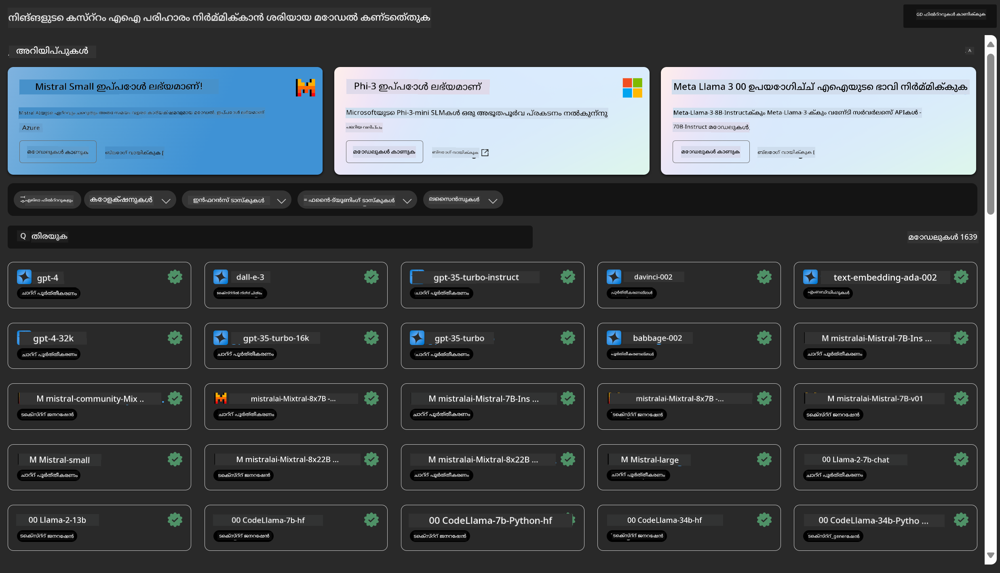
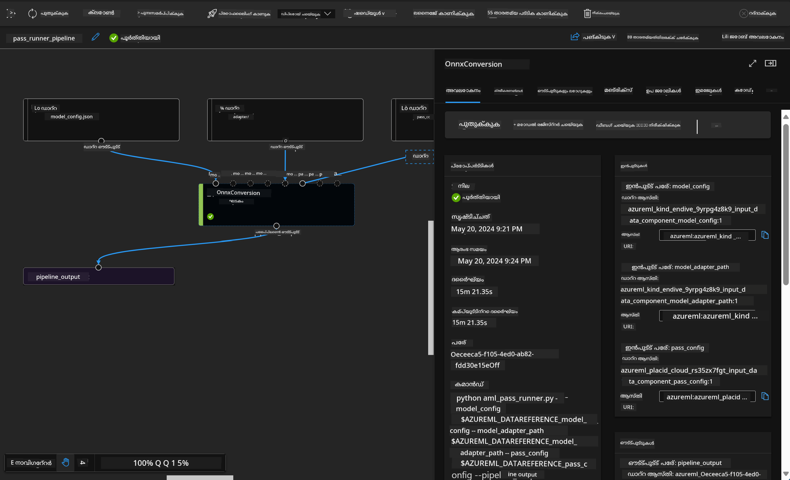

<!--
CO_OP_TRANSLATOR_METADATA:
{
  "original_hash": "7fe541373802e33568e94e13226d463c",
  "translation_date": "2025-12-21T18:10:09+00:00",
  "source_file": "md/03.FineTuning/Introduce_AzureML.md",
  "language_code": "ml"
}
-->
# **ആസ്യൂർ മെഷീൻ ലേണിംഗ് സർവീസിനെ പരിചയപ്പെടുത്തൽ**

[ആസ്യൂർ മെഷീൻ ലേണിംഗ്](https://ml.azure.com?WT.mc_id=aiml-138114-kinfeylo) എന്നത് മെഷീൻ ലേണിംഗ് (ML) പ്രോജക്റ്റ് ലൈഫ്സൈകിളിനെ വേഗത്തിൽ മുന്നേറാനും മാനേജ് ചെയ്യാനും സഹായിക്കുന്ന ഒരു ക്ലൗഡ് സർവീസ് ആണ്.

ML പ്രൊഫഷണലുകളും ഡാറ്റ സയന്റിസ്റ്റുകളും എഞ്ചിനിയർമാരും തങ്ങളുടെ ദിനചര്യ വർക്ക്‌ഫ്ലോകളിൽ ഇത് ഉപയോഗിക്കുക വഴി:

- മോഡലുകൾ പരിശീലിപ്പിക്കുകയും വിന്യസിക്കുകയും ചെയ്യുക.
Manage machine learning operations (MLOps).
- നിങ്ങൾക്ക് Azure Machine Learning ൽ ഒരു മോഡൽ സൃഷ്ടിക്കാനോ PyTorch, TensorFlow, അല്ലെങ്കിൽ scikit-learn പോലുള്ള ഓപ്പൺ-സോഴ്സ് ప్లാറ്റ്‌ഫോമിൽ തയ്യാറാക്കപ്പെട്ട ഒരു മോഡൽ ഉപയോഗിക്കാനോ കഴിയും.
- MLOps ടൂൾസ് മോഡലുകൾ നിരീക്ഷിക്കാൻ, പുനഃപരിശീലിപ്പിക്കാൻ, വീണ്ടും വിന്യസിക്കാൻ സഹായിക്കുന്നു.

## ആര്‍ക്ക് Azure Machine Learning ആണ്?

**ഡാറ്റ സയന്റിസ്റ്റുകളും ML എഞ്ചിനീയർമാരും**

തങ്ങളുടെ ദിനചര്യ പ്രവൃത്തികൾ വേഗത്തിൽ നടത്താനും സ്വയംമാറ്റാൻ ഇവർ ടൂളുകൾ ഉപയോഗിക്കാം.
ആസ്യൂർ ML നീതിയും വിശദീകരണശേഷിയും, ട്രാക്കിങ്, ആഡിറ്റബിലിറ്റി എന്നിവയ്ക്കുള്ള സവിശേഷതകൾ നൽകുന്നു.
അപ്ലിക്കേഷൻ ഡെവലപ്പർമാർ:
അവർക്കു മോഡലുകൾ അപ്ലിക്കേഷനുകൾക്കോ സർവീസുകൾക്കോ സുഗമമായി സംയോജിപ്പിക്കാം.

**പ്ലാറ്റ്‌ഫോം ഡെവലപ്പർമാർ**

അവർക്കു സ്ഥിരതയുള്ള Azure Resource Manager API-കളാൽ പിന്തുണയ്ക്കപ്പെട്ട ശക്തമായ ടൂൾസെറ്റ് ലഭ്യമാണ്.
ഈ ടൂളുകൾ ആധുനിക ML ടൂളിംഗ് നിർമ്മിക്കാൻ അനുവദിക്കുന്നു.

**എന്റർപ്രൈസുകൾ**

Microsoft Azure ക്ലൗഡിൽ പ്രവർത്തിക്കുന്ന എന്റർപ്രൈസുകൾക്ക് പരിചിതമായ സുരക്ഷയും റോള അടിസ്ഥാനമുള്ള ആക്‌സസ് നിയന്ത്രണവും ലഭിക്കുന്നു.
സംരക്ഷിത ഡേറ്റയിലേക്കും പ്രത്യേക ഓപ്പറേഷനുകളിലേക്കുള്ള ആക്‌സസ് നിയന്ത്രിക്കാൻ പ്രോജക്റ്റുകൾ ക്രമീകരിക്കാം.

## ടീമിലെ എല്ലാവർക്കും ഉത്പാദകക്ഷമത
ML പ്രോജക്റ്റുകൾ സാധారణമായി ഒരു വ്യത്യസ്ത കഴിവുകൾ ഉള്ള ടീത്തെ ആവശ്യപ്പെടുന്നു നിർമ്മിക്കാൻയും പരിപാലിക്കാൻയും.

ആസ്യൂർ ML നിങ്ങൾക്ക് അനുവദിക്കുന്ന ടൂൾസ്:
- പങ്കുവെച്ച നോട്ട്ബുക്കുകൾ, കംപ്യൂട്ട് റിസോഴ്സുകൾ, സര്‍വര്‍ലെസ് കംപ്യൂട്ട്, ഡാറ്റ, എൻവയോൺമെന്റുകൾ എന്നിവ മുഖേന നിങ്ങളുടെ ടീമുമായി സഹകരിക്കുക.
- ലൈനേജ് ഒപ്പം ആഡിറ്റ് പാലന ആവശ്യകതകൾ നിറവേറ്റാൻ നീതി, വിശദീകരണം, ട്രാക്കിങ്, ആഡിറ്റബിലിറ്റി എന്നിവ ഉൾക്കൊള്ളുന്ന മോഡലുകൾ വികസിപ്പിക്കുക.
- സ്കെയിലിൽ ML മോഡലുകൾ വേഗത്തിൽയും എളുപ്പത്തിൽ വിന്യസിക്കുകയും MLOps മുഖേന അവയെ കാര്യക്ഷമമായി മാനേജു ചെയ്യുകയും ഗവർൺ ചെയ്യുകയും ചെയ്യുക.
- ഉൾപ്പെടുത്തിയ ഗവർണൻസും സുരക്ഷയും പാലനവും കൂടിയുള്ള നിലയിൽ എവിടെയെങ്കിലും മെഷീൻ ലേണിംഗ് വർക്ക്‌ലോഡ്‌സ് ഓടിക്കുക.

## ക്രോസ്-കമ്പാറ്റിബിൾ പ്ലാറ്റ്‌ഫോം ടൂളുകൾ

ML ടീമിലെ ആരും തങ്ങളുടെ ഇഷ്ടപ്പെട്ട ടൂളുകൾ ഉപയോഗിച്ച് ജോലി പൂർത്തിയാക്കാം.
തക്കാട് പരീക്ഷണങ്ങൾ നടത്തുകയാണോ, ഹൈപ്പർപരാമീറ്റർ ട്യൂണിംഗ്, പൈപ്പ്‌ലൈൻ നിർമ്മാണം, ഇൻഫറൻസുകൾ മാനേജ് ചെയ്യൽ എന്നിവ ചെയ്യുന്നുവെങ്കിൽ, നിങ്ങൾക്ക് പരിചിതമായ ഇന്റർഫേസുകൾ ഉപയോഗിക്കാം, ഉൾപ്പെടെ:
- Azure Machine Learning Studio
- Python SDK (v2)
- Azure CLI (v2)
- Azure Resource Manager REST APIs

മോഡലുകൾ സുതാര്യമായി മെച്ചപ്പെടുത്തുന്നതിനും വികസന ചക്രം മുഴുവൻ സഹകരിക്കുന്നതിനും, നിങ്ങൾക്ക് ആസ്യൂർ മെഷീൻ ലേണിംഗ് സ്റ്റുഡിയോ UI-യിൽ ഉള്ള അസറ്റുകൾ, റിസോഴ്സുകൾ, മെട്രിക്‌സ് എന്നിവ പങ്കിടാനും കണ്ടെത്താനും കഴിയും.

## **LLM/SLM in Azure ML**

ആസ്യൂർ ML LLM/SLM-സംബന്ധിച്ച നിരവധി ഫംഗ്ഷനുകൾ ചേർത്തിട്ടുണ്ട്, LLMOps-യും SLMOps-ഉം സംയോജിപ്പിച്ച് എന്റർപ്രൈസ്-തൊട്ടുള്ള ജനറേറ്റീവ് ആർട്ടിഫിഷ്യൽ ഇന്റലിജൻസ് ടെക്നോളജി പ്ലാറ്റ്‌ഫോം സൃഷ്ടിക്കുന്നു.

### **മോഡൽ കാറ്റലോഗ്**

എന്റർപ്രൈസ് ഉപയോക്താക്കൾ വ്യത്യസ്ത ബിസിനസ് സീനാരിയോകൾ അനുസരിച്ച് മോഡലുകൾ മോഡൽ കാറ്റലോഗിലൂടെ വിന്യസിക്കാൻ കഴിയും, കൂടാതെ എന്റർപ്രൈസ് ഡെവലപ്പർമാർക്കും ഉപയോക്താക്കൾക്കുമായി Model as Service എന്ന നിലയിലാണ് സേവനങ്ങൾ നൽകാൻ സാധിക്കുന്നു.

ആസ്യൂർ മെഷീൻ ലേണിംഗ് സ്റ്റുഡിയോയിലെ മോഡൽ കാറ്റലോഗ് ജനറേറ്റീവ് AI ആപ്ലിക്കേഷനുകൾ നിർമ്മിക്കാൻ സഹായിക്കുന്ന വിവിധ മോഡലുകൾ കണ്ടെത്താനും ഉപയോഗിക്കാനുമുള്ള കേന്ദ്രമാണ്. മോഡൽ കാറ്റലോഗിൽ Azure OpenAI service, Mistral, Meta, Cohere, Nvidia, Hugging Face എന്നിവ പോലുള്ള മോഡൽ അവകാശികളിൽ നിന്നുള്ള നൂറുകണക്കിന് മോഡലുകൾ ഉൾക്കൊള്ളുന്നു, കൂടാതെ Microsoft ഉറപ്പോടെ പരിശീലിപ്പിച്ച മോഡലുകളും ഉൾപ്പെടുന്നു. Microsoft അല്ലാത്ത ദാതാക്കളിൽ നിന്നുള്ള മോഡലുകൾ Microsoft നിന്നുള്ളവയല്ലാത്ത ഉൽപ്പന്നങ്ങളായി (Non-Microsoft Products) നിർവചിക്കുന്നു, Microsoft-ന്റെ ഉൽപ്പന്ന നിബന്ധനകളിലുണ്ടായ നിർവചനപ്രകാരം, മോഡലിനൊപ്പം നൽകിയ നിബന്ധനകളുടെ വിധേയമാണ്.

### **ജോബ് പൈപ്പ്‌ലൈൻ**

ഒരു മെഷീൻ ലേണിംഗ് പൈപ്പ്‌ലൈന്റെ മുഖ്യ ലക്ഷ്യം ഒരു മുഴുവൻ മെഷീൻ ലേണിംഗ് ജോലി ബഹുചവുവഴി (multistep) വർക്ക്‌ഫ്ലോയിലേക്ക് വിഭജിക്കുകയാണ്. ഓരോ ചുവടും സ്വതന്ത്രമായി വികസിപ്പിക്കപ്പെടാവുന്ന, ഒപ്റ്റിമൈസ് ചെയ്യാവുന്ന, കോൺഫിഗർ ചെയ്യാവുന്ന, സ്വയമവതരിപ്പിക്കാവുന്ന ഒരു മാനേജബിള്‍ ഘടകമാണ്. ചുവടുകൾ നല്ലതായി നിർവചിച്ച ഇന്റർഫേസുകൾ വഴി miteinander കണക്ട് ചെയ്യുന്നു. Azure Machine Learning പൈപ്പ്‌ലൈൻ സർവീസ് പൈപ്പ്‌ലൈൻ ചുവടുകൾ തമ്മിലുള്ള എല്ലാ ആശ്രിതത്വങ്ങളും സ്വയം ഓർക്കസ്ട്രേറ്റ് ചെയ്യുന്നു.

SLM / LLM ഫൈൻ-ട്യൂണിംഗിൽ, Pipeline മുഖേന ഞങ്ങൾ നമ്മുടെ ഡാറ്റ, പരിശീലനം, ജനറേഷൻ പ്രക്രിയകൾ നിയന്ത്രിക്കാം

### **പ്രോംപ്റ്റ് ഫ്ലോ**

Azure Machine Learning പ്രോംപ്റ്റ് ഫ്ലോ ഉപയോഗിക്കുന്നതിന്റെ നേട്ടങ്ങൾ
ആസ്യൂർ മെഷീൻ ലേണിങ്ങിന്റെ പ്രോംപ്റ്റ് ഫ്ലോ ആശയം മുതൽ പരീക്ഷണവ ažേക്ക് ഉൽപ്പാദനയോഗ്യമായ LLM അടിസ്ഥാനമാക്കിയ ആപ്ലിക്കേഷനുകൾ വരെ പ്രവേശിക്കാൻ ഉപയോക്താക്കളെ സഹായിക്കുന്നവ വിവിധ നേട്ടങ്ങൾ വാഗ്ദാനം ചെയ്യുന്നു:

**പ്രോംപ്റ്റ് എഞ്ചിനീയറിങ്ങിന്റെ സൗകര്യം**

ഇന്ററാക്ടീവ് ആന്തരവൽ അനുഭവം: ആസ്യൂർ മെഷീൻ ലേണിംഗ് പ്രോംപ്റ്റ് ഫ്ലോ ഫ്ലോയുടെ ഘടനയുടെ ദൃശ്യ പ്രതിരൂപം നൽകുന്നുവെന്ന്, ഇതോടെ ഉപയോക്താക്കൾക്ക് അവരുടെ പ്രോജക്ടുകൾ എളുപ്പത്തിൽ മനസ്സിലാക്കാനും നാവിഗേറ്റ് ചെയ്യാനുമാകും. ഫ്ലോ വികസനം અને ഡീബഗ്ഗിംഗിനായി നോട്ട്‌ബുക്ക് പോലുള്ള കോഡിംഗ് അനുഭവവും ഇത് നൽകുന്നു.
പ്രോംപ്റ്റ് ട്യൂണിംഗിനുള്ള വേരിയന്റുകൾ: ഉപയോക്താക്കൾ നിരവധി പ്രോംപ്റ്റ് വേരിയന്റുകൾ സൃഷ്ടിച്ച് താരതമ്യം ചെയ്യാൻ കഴിയും, തുടർച്ചയായ മെച്ചപ്പെടുത്തൽ പ്രക്രിയയ്ക്ക് സഹായകരം.

മൂല്യനിർണയം: നിർമിച്ചിരിക്കുന്ന മൂല്യനിർണയ ഫ്ലോകൾ ഉപയോക്താക്കൾക്ക് അവരുടെ പ്രോംപ്റ്റുകളും ഫ്‌ളോകളും എന്നിവയുടെ ഗുണമേന്മയും ഫലപ്രാപ്തിയും അളക്കാൻ സഹായിക്കുന്നു.

വിശദമായ സ്രോതസുകൾ: ആസ്യൂർ മെഷീൻ ലേണിംഗ് പ്രോംപ്റ്റ് ഫ്ലോ നിർമ്മാണത്തിന് ഒരു ആരംഭബിന്ദുവായി സേവനങ്ങളായ ഇൻബിൽറ്റ് ടൂൾസ്, സാമ്പിൾ, ടെംപ്ലേറ്റുകൾ എന്നിവയുടെ ലൈബ്രറി ഉൾക്കൊള്ളുന്നു, സൃഷ്ടിനൈപുണ്യത്തിന് പ്രചോദനമേകിയും പ്രക്രിയയെ ദ്രുതമാക്കിയും ചെയ്യുന്നു.

**LLM അടിസ്ഥാനമാക്കിയ ആപ്ലിക്കേഷനുകൾക്കുള്ള എന്റർപ്രൈസ് റെഡിനസ്**

സഹകരണം: ആസ്യൂർ മെഷീൻ ലേണിംഗ് പ്രോംപ്റ്റ് ഫ്ലോ ടീം സഹകരണത്തെ പിന്തുണയ്ക്കുന്നു, متعدد ഉപയോക്താക്കൾ പ്രോംപ്റ്റ് എഞ്ചിനിയറിങ് പ്രോജക്ടുകളിൽ ഒന്നിച്ച് പ്രവർത്തിക്കാനും জ്ഞാനം പങ്കുവയ്ക്കാനും വേർഷൻ കണ്ട്രോൾ നിലനിർത്താനുമാകുന്നു.

ആൾ-ഇൻ-വൺ പ്ലാറ്റ്‌ഫോം: ആസ്യൂർ മെഷീൻ ലേണിംഗ് പ്രോംപ്റ്റ് ഫ്ലോ വികസനത്തിൽ നിന്നാരംഭിച്ച് മൂല്യനിർണയത്തിലേക്കും വിന്യസനത്തിലും നിരീക്ഷണത്തിലേക്കും മുഴുവൻ പ്രോംപ്റ്റ് എഞ്ചിനീയറിങ് പ്രക്രിയയെ ലളിതമാക്കി. ഉപയോക്താക്കൾ അവരുടെ ഫ്ലോകൾ ആസ്യൂർ മെഷീൻ ലേണിംഗ് എൻഡ്പോയിന്റുകളായി വേഗത്തിൽ വിന്യസിക്കാനും അവരുടെ പ്രകടനം യഥാർത്ഥ സമയത്ത് നിരീക്ഷിക്കാനുമാകുന്നു, കൃത്യമായ പ്രവർത്തനം ഉറപ്പാക്കാനും തുടർച്ചയായ മെച്ചപ്പെടുത്തലിനും.

Azure Machine Learning Enterprise Readiness Solutions: Prompt flow ആസ്യൂർ മെഷീൻ ലേണിങിന്റെ ശക്തമായ എന്റർപ്രൈസ് റെഡിനസ് പരിഹാരങ്ങളെ ആശ്രയിക്കുന്നു, ഫ്ലോകളുടെ വികസനം, പരീക്ഷണം, വിന്യസനം എന്നിവയ്ക്കുള്ള സുരക്ഷിതവും സ്കെയിലബിളുമായി വിശ്വസനീയമായ ഫൗണ്ടേഷൻ നൽകുന്നു.

ആസ്യൂർ മെഷീൻ ലേണിംഗ് പ്രോംപ്റ്റ് ഫ്ലോയോടുകൂടി, ഉപയോക്താക്കൾ അവരുടെ പ്രോംപ്റ്റ് എഞ്ചിനിയറിങ് കഴിവുകൾ വിമോചിപ്പിക്കുകയും ഫലപ്രദമായി സഹകരിക്കുകയും വിജയകരമായ LLM അടിസ്ഥാനമാക്കിയ ആപ്ലിക്കേഷൻ വികസനവും വിന്യസനവും നടത്താൻ എന്റർപ്രൈസ്-ഗ്രേഡ് പരിഹാരങ്ങൾ പ്രയോജനം ചെയ്യുകയും ചെയ്യുന്നു.

കമ്പ്യൂട്ടിംഗ് പവർ, ഡാറ്റ, ആസ്യൂർ ML-ന്റെ വിവിധ ഘടകങ്ങൾ സംയോജിപ്പിച്ചുകൊണ്ട്, എന്റർപ്രൈസ് ഡെവലപ്പർമാർക്ക് അവരുടെ സ്വന്തം ആർട്ടിഫിഷ്യൽ ഇന്റലിജൻസ് ആപ്ലിക്കേഷനുകൾ എളുപ്പത്തിൽ നിർമ്മിക്കാൻ കഴിയും.

---

<!-- CO-OP TRANSLATOR DISCLAIMER START -->
ഡിസ്‌ക്ലെയിമർ:
ഈ ദസ്താവേജ് AI വിവർത്തനസേവനമായ [Co-op Translator](https://github.com/Azure/co-op-translator) ഉപയോഗിച്ച് വിവർത്തനം ചെയ്തതാണ്. നാം കൃത്യതയ്ക്കായി ശ്രമിക്കുമ്പോഴും, ഓട്ടോമേറ്റഡ് വിവർത്തനങ്ങളിൽ പിഴവുകൾ ഉണ്ടാകാൻ സാധ്യതയുണ്ടെന്ന് ദയവായി ശ്രദ്ധിക്കുക. മൂല ദസ്താവേജ് അതിന്റെ ആദി ഭാഷയിൽ ഔദ്യോഗിക ഉറവിടമായി കരുതപ്പെടണം. നിർണായകമായ വിവരങ്ങൾക്ക് പ്രൊഫഷണൽ മനുഷ്യവിവർത്തനം ശുപാർശ ചെയ്യുന്നു. ഈ വിവർത്തനം ഉപയോഗിക്കുന്നതിൽ നിന്ന് ഉണ്ടാകുന്ന ഏതെങ്കിലും തെറ്റിദ്ധാരണകളോ തെറ്റായ വ്യാഖ്യാനങ്ങളോ ഞങ്ങൾക്ക് ഉത്തരവാദിത്വം ലഭ്യമല്ല.
<!-- CO-OP TRANSLATOR DISCLAIMER END -->