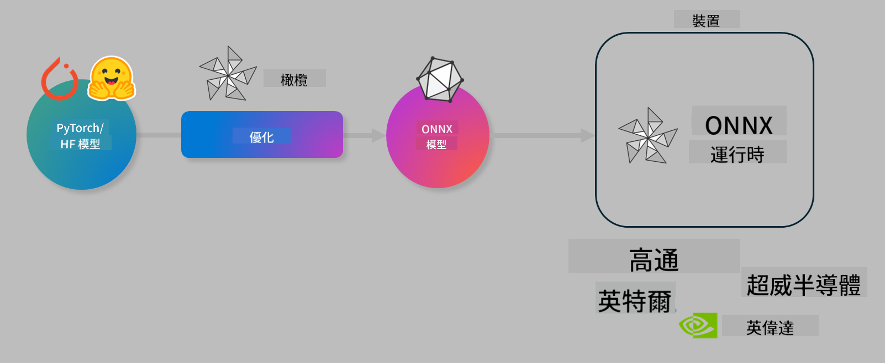

<!--
CO_OP_TRANSLATOR_METADATA:
{
  "original_hash": "6bbe47de3b974df7eea29dfeccf6032b",
  "translation_date": "2025-05-07T15:17:24+00:00",
  "source_file": "code/03.Finetuning/olive-lab/readme.md",
  "language_code": "mo"
}
-->
# Lab. Optimize AI models for on-device inference

## Introduction 

> [!IMPORTANT]
> This lab requires an **Nvidia A10 or A100 GPU** with associated drivers and CUDA toolkit (version 12+) installed.

> [!NOTE]
> This is a **35-minute** lab that will give you a hands-on introduction to the core concepts of optimizing models for on-device inference using OLIVE.

## Learning Objectives

By the end of this lab, you will be able to use OLIVE to:

- Quantize an AI Model using the AWQ quantization method.
- Fine-tune an AI model for a specific task.
- Generate LoRA adapters (fine-tuned model) for efficient on-device inference on the ONNX Runtime.

### What is Olive

Olive (*O*NNX *live*) is a model optimization toolkit with accompanying CLI that enables you to ship models for the ONNX runtime +++https://onnxruntime.ai+++ with quality and performance.



The input to Olive is typically a PyTorch or Hugging Face model and the output is an optimized ONNX model that runs on a device (deployment target) using the ONNX runtime. Olive optimizes the model for the deployment target’s AI accelerator (NPU, GPU, CPU) provided by hardware vendors such as Qualcomm, AMD, Nvidia or Intel.

Olive runs a *workflow*, which is a sequence of individual model optimization tasks called *passes* — example passes include: model compression, graph capture, quantization, graph optimization. Each pass has parameters that can be adjusted to achieve the best metrics, like accuracy and latency, which are evaluated by a corresponding evaluator. Olive uses a search strategy with an algorithm to auto-tune each pass individually or sets of passes together.

#### Benefits of Olive

- **Save time and reduce frustration** from trial-and-error manual experiments with various techniques for graph optimization, compression, and quantization. Define your quality and performance goals and let Olive find the best model automatically.
- **40+ built-in model optimization components** covering state-of-the-art methods in quantization, compression, graph optimization, and fine-tuning.
- **User-friendly CLI** for common optimization tasks such as olive quantize, olive auto-opt, olive finetune.
- Built-in model packaging and deployment support.
- Supports generating models for **Multi LoRA serving**.
- Create workflows using YAML/JSON to coordinate optimization and deployment tasks.
- **Hugging Face** and **Azure AI** integration.
- Built-in **caching** system to **reduce costs**.

## Lab Instructions
> [!NOTE]
> Make sure you have provisioned your Azure AI Hub and Project and set up your A100 compute as described in Lab 1.

### Step 0: Connect to your Azure AI Compute

Connect to the Azure AI compute using the remote feature in **VS Code.** 

1. Open your **VS Code** desktop app:
1. Open the **command palette** using **Shift+Ctrl+P**
1. Search for **AzureML - remote: Connect to compute instance in New Window**.
1. Follow the prompts to connect to the Compute, selecting your Azure Subscription, Resource Group, Project, and Compute name set up in Lab 1.
1. Once connected, your Azure ML Compute node will appear in the **bottom left of Visual Studio Code** `><Azure ML: Compute Name`

### Step 1: Clone this repo

Open a new terminal in VS Code with **Ctrl+J** and clone this repo:

In the terminal you will see the prompt

```
azureuser@computername:~/cloudfiles/code$ 
```
Clone the solution 

```bash
cd ~/localfiles
git clone https://github.com/microsoft/phi-3cookbook.git
```

### Step 2: Open Folder in VS Code

Run the following command in the terminal to open VS Code in the relevant folder, which will launch a new window:

```bash
code phi-3cookbook/code/04.Finetuning/Olive-lab
```

Alternatively, open the folder via **File** > **Open Folder**.

### Step 3: Dependencies

Open a terminal in your Azure AI Compute instance in VS Code (tip: **Ctrl+J**) and run the following commands to install dependencies:

```bash
conda create -n olive-ai python=3.11 -y
conda activate olive-ai
pip install -r requirements.txt
az extension remove -n azure-cli-ml
az extension add -n ml
```

> [!NOTE]
> Installing all dependencies will take about 5 minutes.

In this lab, you’ll download and upload models to the Azure AI Model catalog. To access the catalog, log in to Azure with:

```bash
az login
```

> [!NOTE]
> During login, you will be prompted to select your subscription. Make sure to choose the subscription provided for this lab.

### Step 4: Execute Olive commands 

Open a terminal in your Azure AI Compute instance in VS Code (tip: **Ctrl+J**) and activate the `olive-ai` conda environment:

```bash
conda activate olive-ai
```

Then run the following Olive commands in the terminal.

1. **Inspect the data:** In this example, you will fine-tune the Phi-3.5-Mini model to specialize in answering travel-related questions. The code below shows the first few records of the dataset in JSON lines format:
   
    ```bash
    head data/data_sample_travel.jsonl
    ```
1. **Quantize the model:** Before training, quantize the model using Active Aware Quantization (AWQ) +++https://arxiv.org/abs/2306.00978+++. AWQ quantizes model weights considering the activations during inference, which better preserves accuracy compared to traditional methods.
    
    ```bash
    olive quantize \
       --model_name_or_path microsoft/Phi-3.5-mini-instruct \
       --trust_remote_code \
       --algorithm awq \
       --output_path models/phi/awq \
       --log_level 1
    ```
    
    AWQ quantization takes about **8 minutes** and reduces the model size from approximately **7.5GB to 2.5GB**.
   
   In this lab, we demonstrate how to input models from Hugging Face (e.g., `microsoft/Phi-3.5-mini-instruct`). However, Olive also allows you to input models from the Azure AI catalog by updating the `model_name_or_path` argument to an Azure AI asset ID (for example:  `azureml://registries/azureml/models/Phi-3.5-mini-instruct/versions/4`). 

1. **Train the model:** Next, the `olive finetune` command fine-tunes the quantized model. Quantizing *before* fine-tuning yields better accuracy since fine-tuning recovers some accuracy lost during quantization.
    
    ```bash
    olive finetune \
        --method lora \
        --model_name_or_path models/phi/awq \
        --data_files "data/data_sample_travel.jsonl" \
        --data_name "json" \
        --text_template "<|user|>\n{prompt}<|end|>\n<|assistant|>\n{response}<|end|>" \
        --max_steps 100 \
        --output_path ./models/phi/ft \
        --log_level 1
    ```
    
    Fine-tuning (100 steps) takes about **6 minutes**.

1. **Optimize:** After training, optimize the model using Olive’s `auto-opt` command, which will capture the ONNX graph and automatically perform a number of optimizations to improve the model performance for CPU by compressing the model and doing fusions. It should be noted, that you can also optimize for other devices such as NPU or GPU by just updating the `--device` and `--provider` arguments. For this lab, we will use CPU.

    ```bash
    olive auto-opt \
       --model_name_or_path models/phi/ft/model \
       --adapter_path models/phi/ft/adapter \
       --device cpu \
       --provider CPUExecutionProvider \
       --use_ort_genai \
       --output_path models/phi/onnx-ao \
       --log_level 1
    ```
    
    Optimization takes about **5 minutes**.

### Step 5: Model inference quick test

To test inference, create a Python file named **app.py** in your folder and paste the following code:

```python
import onnxruntime_genai as og
import numpy as np

print("loading model and adapters...", end="", flush=True)
model = og.Model("models/phi/onnx-ao/model")
adapters = og.Adapters(model)
adapters.load("models/phi/onnx-ao/model/adapter_weights.onnx_adapter", "travel")
print("DONE!")

tokenizer = og.Tokenizer(model)
tokenizer_stream = tokenizer.create_stream()

params = og.GeneratorParams(model)
params.set_search_options(max_length=100, past_present_share_buffer=False)
user_input = "what is the best thing to see in chicago"
params.input_ids = tokenizer.encode(f"<|user|>\n{user_input}<|end|>\n<|assistant|>\n")

generator = og.Generator(model, params)

generator.set_active_adapter(adapters, "travel")

print(f"{user_input}")

while not generator.is_done():
    generator.compute_logits()
    generator.generate_next_token()

    new_token = generator.get_next_tokens()[0]
    print(tokenizer_stream.decode(new_token), end='', flush=True)

print("\n")
```

Run the script using:

```bash
python app.py
```

### Step 6: Upload model to Azure AI

Uploading your model to an Azure AI repository lets your team share the model and manages version control. To upload, run:

> [!NOTE]
> Update the `{}` placeholders with the name of your resource group and Azure AI Project Name. 

To find your resource group `"resourceGroup"` and Azure AI Project name in the command below:

```
az ml workspace show
```

Alternatively, go to +++ai.azure.com+++ and select **management center** > **project** > **overview**

Replace the `{}` placeholders with your resource group and Azure AI Project names.

```bash
az ml model create \
    --name ft-for-travel \
    --version 1 \
    --path ./models/phi/onnx-ao \
    --resource-group {RESOURCE_GROUP_NAME} \
    --workspace-name {PROJECT_NAME}
```

You can then view and deploy your uploaded model at https://ml.azure.com/model/list

**Disclaimer**:  
Thiz documént haz bin translaited yusing AI translaition serviz [Co-op Translator](https://github.com/Azure/co-op-translator). Whil wi striv for accurasi, pliz bi awér dat otomaited translaitions may contain erors or inakuracis. Th original documént in its nativ langwaj shud bi considérd th authoritativ sours. For kritikál informátion, proféshonal hyuman translaition iz rekoménded. Wi ar not liabl for eni misandérstandings or misinterpretéshons arising from th yus of this translaition.