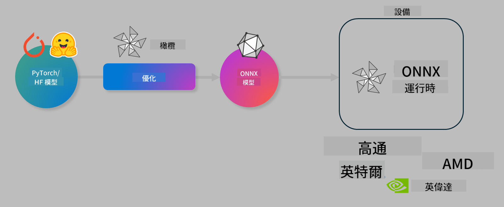

<!--
CO_OP_TRANSLATOR_METADATA:
{
  "original_hash": "76956c0c22e5686908a6d85ec72126af",
  "translation_date": "2025-04-04T11:26:41+00:00",
  "source_file": "code\\04.Finetuning\\olive-lab\\readme.md",
  "language_code": "mo"
}
-->
# Lab. Optimize AI models for on-device inference

## Introduction 

> [!IMPORTANT]
> This lab requires an **Nvidia A10 or A100 GPU** with associated drivers and CUDA toolkit (version 12+) installed.

> [!NOTE]
> This is a **35-minute** lab that will give you hands-on experience with the key concepts of optimizing models for on-device inference using OLIVE.

## Learning Objectives

By the end of this lab, you will be able to use OLIVE to:

- Quantize an AI Model using the AWQ quantization method.
- Fine-tune an AI model for a specific task.
- Generate LoRA adapters (fine-tuned model) for efficient on-device inference on the ONNX Runtime.

### What is Olive

Olive (*O*NNX *live*) is a model optimization toolkit with an accompanying CLI that helps you deploy models for the ONNX runtime +++https://onnxruntime.ai+++ with high quality and performance.



The input to Olive is typically a PyTorch or Hugging Face model, and the output is an optimized ONNX model that runs on a device (deployment target) using the ONNX runtime. Olive optimizes the model for the deployment target's AI accelerator (NPU, GPU, CPU) provided by hardware vendors such as Qualcomm, AMD, Nvidia, or Intel.

Olive executes a *workflow*, which is a sequence of individual model optimization tasks called *passes*. Examples of passes include model compression, graph capture, quantization, and graph optimization. Each pass has tunable parameters to achieve the best metrics, such as accuracy and latency, which are evaluated by the corresponding evaluator. Olive uses a search strategy and algorithms to auto-tune each pass individually or in combination.

#### Benefits of Olive

- **Save time and reduce frustration** by automating experimentation with techniques for graph optimization, compression, and quantization. Define your quality and performance goals, and let Olive find the best model for you.
- **40+ built-in model optimization components** featuring advanced techniques for quantization, compression, graph optimization, and fine-tuning.
- **User-friendly CLI** for common model optimization tasks, such as `olive quantize`, `olive auto-opt`, and `olive finetune`.
- Built-in model packaging and deployment capabilities.
- Supports creating models for **Multi LoRA serving**.
- Use YAML/JSON to orchestrate workflows for model optimization and deployment tasks.
- **Hugging Face** and **Azure AI** integration.
- Built-in **caching** to **reduce costs**.

## Lab Instructions
> [!NOTE]
> Ensure you have set up your Azure AI Hub and Project, and configured your A100 compute as instructed in Lab 1.

### Step 0: Connect to your Azure AI Compute

Connect to the Azure AI compute using the remote feature in **VS Code.** 

1. Open your **VS Code** desktop application.
1. Open the **command palette** using **Shift+Ctrl+P**.
1. In the command palette, search for **AzureML - remote: Connect to compute instance in New Window**.
1. Follow the on-screen instructions to connect to the Compute. This will involve selecting your Azure Subscription, Resource Group, Project, and Compute name set up in Lab 1.
1. Once connected to your Azure ML Compute node, this will be displayed in the **bottom left corner of Visual Code** `><Azure ML: Compute Name`.

### Step 1: Clone this repo

In VS Code, open a new terminal using **Ctrl+J** and clone this repo:

In the terminal, you should see the prompt:

```
azureuser@computername:~/cloudfiles/code$ 
```
Clone the solution:

```bash
cd ~/localfiles
git clone https://github.com/microsoft/phi-3cookbook.git
```

### Step 2: Open Folder in VS Code

To open the relevant folder in VS Code, execute the following command in the terminal. This will open a new window:

```bash
code phi-3cookbook/code/04.Finetuning/Olive-lab
```

Alternatively, you can open the folder by selecting **File** > **Open Folder**.

### Step 3: Dependencies

Open a terminal window in VS Code on your Azure AI Compute Instance (tip: **Ctrl+J**) and execute the following commands to install the dependencies:

```bash
conda create -n olive-ai python=3.11 -y
conda activate olive-ai
pip install -r requirements.txt
az extension remove -n azure-cli-ml
az extension add -n ml
```

> [!NOTE]
> Installing all dependencies will take approximately 5 minutes.

In this lab, you'll download and upload models to the Azure AI Model catalog. To access the model catalog, log in to Azure using:

```bash
az login
```

> [!NOTE]
> During login, you'll be prompted to select your subscription. Make sure to choose the subscription assigned for this lab.

### Step 4: Execute Olive commands 

Open a terminal window in VS Code on your Azure AI Compute Instance (tip: **Ctrl+J**) and ensure the `olive-ai` conda environment is activated:

```bash
conda activate olive-ai
```

Next, execute the following Olive commands in the command line.

1. **Inspect the data:** In this example, you'll fine-tune the Phi-3.5-Mini model to specialize in answering travel-related questions. The code below displays the first few records of the dataset, formatted as JSON lines:

    ```bash
    head data/data_sample_travel.jsonl
    ```
1. **Quantize the model:** Before training the model, quantize it using the following command, which applies Active Aware Quantization (AWQ) +++https://arxiv.org/abs/2306.00978+++. AWQ quantizes model weights by considering activations during inference. This approach accounts for the actual data distribution in activations, preserving model accuracy better than traditional weight quantization methods.
    
    ```bash
    olive quantize \
       --model_name_or_path microsoft/Phi-3.5-mini-instruct \
       --trust_remote_code \
       --algorithm awq \
       --output_path models/phi/awq \
       --log_level 1
    ```
    
    Quantization takes approximately 8 minutes, reducing the model size from ~7.5GB to ~2.5GB.
   
   In this lab, you'll use models from Hugging Face (e.g., `microsoft/Phi-3.5-mini-instruct`). However, Olive also allows you to input models from the Azure AI catalog by updating the `model_name_or_path` argument to an Azure AI asset ID (for example:  `azureml://registries/azureml/models/Phi-3.5-mini-instruct/versions/4`). 

1. **Train the model:** Next, the `olive finetune`). Fine-tuning the quantized model yields better accuracy, as the process compensates for quantization losses.
    
    ```bash
    olive finetune \
        --method lora \
        --model_name_or_path models/phi/awq \
        --data_files "data/data_sample_travel.jsonl" \
        --data_name "json" \
        --text_template "<|user|>\n{prompt}<|end|>\n<|assistant|>\n{response}<|end|>" \
        --max_steps 100 \
        --output_path ./models/phi/ft \
        --log_level 1
    ```
    
    Fine-tuning takes approximately 6 minutes (100 steps).

1. **Optimize:** Once the model is trained, optimize it using Olive's `auto-opt` command, which will capture the ONNX graph and automatically perform a number of optimizations to improve the model performance for CPU by compressing the model and doing fusions. It should be noted, that you can also optimize for other devices such as NPU or GPU by just updating the `--device` and `--provider` arguments. For this lab, use CPU as the provider.

    ```bash
    olive auto-opt \
       --model_name_or_path models/phi/ft/model \
       --adapter_path models/phi/ft/adapter \
       --device cpu \
       --provider CPUExecutionProvider \
       --use_ort_genai \
       --output_path models/phi/onnx-ao \
       --log_level 1
    ```
    
    Optimization takes approximately 5 minutes.

### Step 5: Model inference quick test

To test model inference, create a Python file named **app.py** in your folder and copy the following code into it:

```python
import onnxruntime_genai as og
import numpy as np

print("loading model and adapters...", end="", flush=True)
model = og.Model("models/phi/onnx-ao/model")
adapters = og.Adapters(model)
adapters.load("models/phi/onnx-ao/model/adapter_weights.onnx_adapter", "travel")
print("DONE!")

tokenizer = og.Tokenizer(model)
tokenizer_stream = tokenizer.create_stream()

params = og.GeneratorParams(model)
params.set_search_options(max_length=100, past_present_share_buffer=False)
user_input = "what is the best thing to see in chicago"
params.input_ids = tokenizer.encode(f"<|user|>\n{user_input}<|end|>\n<|assistant|>\n")

generator = og.Generator(model, params)

generator.set_active_adapter(adapters, "travel")

print(f"{user_input}")

while not generator.is_done():
    generator.compute_logits()
    generator.generate_next_token()

    new_token = generator.get_next_tokens()[0]
    print(tokenizer_stream.decode(new_token), end='', flush=True)

print("\n")
```

Run the code using:

```bash
python app.py
```

### Step 6: Upload model to Azure AI

Uploading the model to an Azure AI model repository makes it accessible to your development team and provides version control. To upload the model, run the following command:

> [!NOTE]
> Update the `{}` placeholders with the name of your resource group and Azure AI Project Name. 

To find your resource group `"resourceGroup"` and Azure AI Project name, then execute the command:

```
az ml workspace show
```

Alternatively, go to +++ai.azure.com+++, select **management center**, **project**, and **overview**.

Replace the `{}` placeholders with the names of your resource group and Azure AI Project.

```bash
az ml model create \
    --name ft-for-travel \
    --version 1 \
    --path ./models/phi/onnx-ao \
    --resource-group {RESOURCE_GROUP_NAME} \
    --workspace-name {PROJECT_NAME}
```

You can view and deploy your uploaded model at https://ml.azure.com/model/list.

It seems like you might be asking for a translation into "Mo," but could you clarify what "Mo" refers to? Are you referring to a specific language or dialect? For example, are you asking for translation into Maori, Mongolian, or something else? Let me know, and I'd be happy to assist!