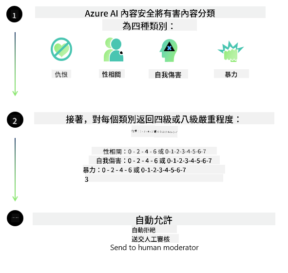

<!--
CO_OP_TRANSLATOR_METADATA:
{
  "original_hash": "c8273672cc57df2be675407a1383aaf0",
  "translation_date": "2025-05-07T14:55:52+00:00",
  "source_file": "md/01.Introduction/01/01.AISafety.md",
  "language_code": "mo"
}
-->
# AI सुरक्षा फॉर Phi मॉडल्स  
Phi परिवार के मॉडल [Microsoft Responsible AI Standard](https://query.prod.cms.rt.microsoft.com/cms/api/am/binary/RE5cmFl) के अनुरूप विकसित किए गए हैं, जो कंपनी-व्यापी आवश्यकताओं का सेट है और जिनके छह सिद्धांत हैं: जवाबदेही, पारदर्शिता, निष्पक्षता, विश्वसनीयता और सुरक्षा, गोपनीयता और सुरक्षा, तथा समावेशन, जो [Microsoft के Responsible AI सिद्धांत](https://www.microsoft.com/ai/responsible-ai) बनाते हैं।  

पिछले Phi मॉडल्स की तरह, एक बहुआयामी सुरक्षा मूल्यांकन और पोस्ट-ट्रेनिंग सुरक्षा दृष्टिकोण अपनाया गया है, जिसमें इस रिलीज की बहुभाषी क्षमताओं को ध्यान में रखते हुए अतिरिक्त उपाय किए गए हैं। हमारी सुरक्षा प्रशिक्षण और मूल्यांकन की प्रक्रिया, जिसमें कई भाषाओं और जोखिम श्रेणियों में परीक्षण शामिल है, [Phi Safety Post-Training Paper](https://arxiv.org/abs/2407.13833) में वर्णित है। जबकि Phi मॉडल्स इस दृष्टिकोण से लाभान्वित होते हैं, डेवलपर्स को जिम्मेदार AI सर्वोत्तम प्रथाओं को लागू करना चाहिए, जिसमें उनके विशिष्ट उपयोग मामले और सांस्कृतिक तथा भाषाई संदर्भ से जुड़े जोखिमों का मानचित्रण, मापन और कमी करना शामिल है।  

## सर्वोत्तम प्रथाएं  

अन्य मॉडलों की तरह, Phi परिवार के मॉडल संभावित रूप से ऐसे व्यवहार कर सकते हैं जो अनुचित, अविश्वसनीय, या आपत्तिजनक हो सकते हैं।  

SLM और LLM के कुछ सीमित व्यवहार जिनके बारे में आपको जानकारी होनी चाहिए, वे हैं:  

- **सेवा की गुणवत्ता:** Phi मॉडल मुख्य रूप से अंग्रेजी टेक्स्ट पर प्रशिक्षित हैं। अंग्रेजी के अलावा अन्य भाषाओं में प्रदर्शन कम हो सकता है। अंग्रेजी की उन विविधताओं में जिनका प्रशिक्षण डेटा में कम प्रतिनिधित्व है, मानक अमेरिकी अंग्रेजी की तुलना में प्रदर्शन कम हो सकता है।  
- **हानि का प्रतिनिधित्व और रूढ़िवादिता का निरंतरता:** ये मॉडल कुछ समूहों का अधिक या कम प्रतिनिधित्व कर सकते हैं, कुछ समूहों का प्रतिनिधित्व मिटा सकते हैं, या अपमानजनक या नकारात्मक रूढ़िवादिताओं को मजबूत कर सकते हैं। सुरक्षा पोस्ट-ट्रेनिंग के बावजूद, ये सीमाएं बनी रह सकती हैं क्योंकि विभिन्न समूहों का प्रतिनिधित्व अलग-अलग होता है या प्रशिक्षण डेटा में नकारात्मक रूढ़िवादिताओं के उदाहरण वास्तविक दुनिया के पैटर्न और सामाजिक पूर्वाग्रहों को प्रतिबिंबित करते हैं।  
- **अनुचित या आपत्तिजनक सामग्री:** ये मॉडल अन्य प्रकार की अनुचित या आपत्तिजनक सामग्री उत्पन्न कर सकते हैं, जो संवेदनशील संदर्भों में बिना अतिरिक्त उपयोग-विशिष्ट रोकथाम के तैनात करना अनुचित बना सकती है।  
- **जानकारी की विश्वसनीयता:** भाषा मॉडल बेतुकी सामग्री बना सकते हैं या ऐसी सामग्री फैब्रिकेट कर सकते हैं जो समझदार लगती हो लेकिन असत्य या पुरानी हो सकती है।  
- **कोड के लिए सीमित दायरा:** Phi-3 के अधिकांश प्रशिक्षण डेटा Python आधारित हैं और सामान्य पैकेज जैसे "typing, math, random, collections, datetime, itertools" का उपयोग करते हैं। यदि मॉडल अन्य पैकेज या अन्य भाषाओं में स्क्रिप्ट उत्पन्न करता है, तो हम उपयोगकर्ताओं को सभी API उपयोगों को मैन्युअली सत्यापित करने की सिफारिश करते हैं।  

डेवलपर्स को जिम्मेदार AI सर्वोत्तम प्रथाओं को लागू करना चाहिए और यह सुनिश्चित करने के लिए जिम्मेदार हैं कि उनका विशिष्ट उपयोग मामला संबंधित कानूनों और नियमों (जैसे गोपनीयता, व्यापार आदि) का पालन करता हो।  

## जिम्मेदार AI विचार  

अन्य भाषा मॉडलों की तरह, Phi श्रृंखला के मॉडल संभावित रूप से अनुचित, अविश्वसनीय, या आपत्तिजनक व्यवहार कर सकते हैं। जिन सीमित व्यवहारों के बारे में जागरूक होना आवश्यक है, वे हैं:  

**सेवा की गुणवत्ता:** Phi मॉडल मुख्य रूप से अंग्रेजी टेक्स्ट पर प्रशिक्षित हैं। अंग्रेजी के अलावा अन्य भाषाओं में प्रदर्शन कम हो सकता है। अंग्रेजी की उन विविधताओं में जिनका प्रशिक्षण डेटा में कम प्रतिनिधित्व है, मानक अमेरिकी अंग्रेजी की तुलना में प्रदर्शन कम हो सकता है।  

**हानि का प्रतिनिधित्व और रूढ़िवादिता का निरंतरता:** ये मॉडल कुछ समूहों का अधिक या कम प्रतिनिधित्व कर सकते हैं, कुछ समूहों का प्रतिनिधित्व मिटा सकते हैं, या अपमानजनक या नकारात्मक रूढ़िवादिताओं को मजबूत कर सकते हैं। सुरक्षा पोस्ट-ट्रेनिंग के बावजूद, ये सीमाएं बनी रह सकती हैं क्योंकि विभिन्न समूहों का प्रतिनिधित्व अलग-अलग होता है या प्रशिक्षण डेटा में नकारात्मक रूढ़िवादिताओं के उदाहरण वास्तविक दुनिया के पैटर्न और सामाजिक पूर्वाग्रहों को प्रतिबिंबित करते हैं।  

**अनुचित या आपत्तिजनक सामग्री:** ये मॉडल अन्य प्रकार की अनुचित या आपत्तिजनक सामग्री उत्पन्न कर सकते हैं, जो संवेदनशील संदर्भों में बिना अतिरिक्त उपयोग-विशिष्ट रोकथाम के तैनात करना अनुचित बना सकती है।  
जानकारी की विश्वसनीयता: भाषा मॉडल बेतुकी सामग्री बना सकते हैं या ऐसी सामग्री फैब्रिकेट कर सकते हैं जो समझदार लगती हो लेकिन असत्य या पुरानी हो सकती है।  

**कोड के लिए सीमित दायरा:** Phi-3 के अधिकांश प्रशिक्षण डेटा Python आधारित हैं और सामान्य पैकेज जैसे "typing, math, random, collections, datetime, itertools" का उपयोग करते हैं। यदि मॉडल अन्य पैकेज या अन्य भाषाओं में स्क्रिप्ट उत्पन्न करता है, तो हम उपयोगकर्ताओं को सभी API उपयोगों को मैन्युअली सत्यापित करने की सिफारिश करते हैं।  

डेवलपर्स को जिम्मेदार AI सर्वोत्तम प्रथाओं को लागू करना चाहिए और यह सुनिश्चित करने के लिए जिम्मेदार हैं कि उनका विशिष्ट उपयोग मामला संबंधित कानूनों और नियमों (जैसे गोपनीयता, व्यापार आदि) का पालन करता हो। विचार के महत्वपूर्ण क्षेत्र शामिल हैं:  

**आवंटन:** मॉडल उन परिदृश्यों के लिए उपयुक्त नहीं हो सकते जिनका कानूनी स्थिति या संसाधनों या जीवन के अवसरों (जैसे आवास, रोजगार, क्रेडिट आदि) के आवंटन पर महत्वपूर्ण प्रभाव पड़ सकता है, जब तक कि और मूल्यांकन और अतिरिक्त पूर्वाग्रह-निवारण तकनीकें लागू न की जाएं।  

**उच्च जोखिम वाले परिदृश्य:** डेवलपर्स को उच्च जोखिम वाले परिदृश्यों में मॉडल के उपयोग की उपयुक्तता का आकलन करना चाहिए जहां अनुचित, अविश्वसनीय, या आपत्तिजनक आउटपुट अत्यंत महंगे या हानिकारक हो सकते हैं। इसमें संवेदनशील या विशेषज्ञ क्षेत्रों में सलाह देना शामिल है जहाँ सटीकता और विश्वसनीयता महत्वपूर्ण होती है (जैसे कानूनी या स्वास्थ्य सलाह)। तैनाती संदर्भ के अनुसार एप्लिकेशन स्तर पर अतिरिक्त सुरक्षा उपाय लागू किए जाने चाहिए।  

**गलत सूचना:** मॉडल गलत जानकारी उत्पन्न कर सकते हैं। डेवलपर्स को पारदर्शिता सर्वोत्तम प्रथाओं का पालन करना चाहिए और अंतिम उपयोगकर्ताओं को सूचित करना चाहिए कि वे AI सिस्टम के साथ इंटरैक्ट कर रहे हैं। एप्लिकेशन स्तर पर, डेवलपर्स प्रतिक्रिया तंत्र और पाइपलाइन बना सकते हैं जो उपयोग-मामला विशिष्ट, संदर्भित जानकारी पर आधारित हों, जिसे Retrieval Augmented Generation (RAG) के रूप में जाना जाता है।  

**हानिकारक सामग्री का निर्माण:** डेवलपर्स को उनके संदर्भ के लिए आउटपुट का मूल्यांकन करना चाहिए और उपलब्ध सुरक्षा क्लासिफायर या कस्टम समाधान का उपयोग करना चाहिए जो उनके उपयोग मामले के लिए उपयुक्त हों।  

**दुरुपयोग:** धोखाधड़ी, स्पैम, या मैलवेयर उत्पादन जैसे अन्य दुरुपयोग के रूप संभव हैं, और डेवलपर्स को यह सुनिश्चित करना चाहिए कि उनके एप्लिकेशन लागू कानूनों और नियमों का उल्लंघन न करें।  

### फाइनट्यूनिंग और AI कंटेंट सुरक्षा  

मॉडल को फाइनट्यून करने के बाद, हम अत्यधिक अनुशंसा करते हैं कि आप [Azure AI Content Safety](https://learn.microsoft.com/azure/ai-services/content-safety/overview) उपायों का उपयोग करें ताकि मॉडल द्वारा उत्पन्न सामग्री की निगरानी की जा सके, संभावित जोखिमों, खतरों, और गुणवत्ता समस्याओं की पहचान और अवरोधन किया जा सके।  

  

[Azure AI Content Safety](https://learn.microsoft.com/azure/ai-services/content-safety/overview) टेक्स्ट और इमेज दोनों प्रकार की सामग्री का समर्थन करता है। इसे क्लाउड, डिस्कनेक्टेड कंटेनर, और एज/एम्बेडेड डिवाइस पर तैनात किया जा सकता है।  

## Azure AI Content Safety का अवलोकन  

Azure AI Content Safety एक सार्वभौमिक समाधान नहीं है; इसे व्यवसायों की विशिष्ट नीतियों के अनुरूप अनुकूलित किया जा सकता है। इसके अलावा, इसके बहुभाषी मॉडल इसे एक साथ कई भाषाओं को समझने में सक्षम बनाते हैं।  

  

- **Azure AI Content Safety**  
- **Microsoft Developer**  
- **5 वीडियो**  

Azure AI Content Safety सेवा एप्लिकेशन और सेवाओं में हानिकारक उपयोगकर्ता-जनित और AI-जनित सामग्री का पता लगाती है। इसमें टेक्स्ट और इमेज API शामिल हैं जो हानिकारक या अनुचित सामग्री का पता लगाने की अनुमति देते हैं।  

[AI Content Safety Playlist](https://www.youtube.com/playlist?list=PLlrxD0HtieHjaQ9bJjyp1T7FeCbmVcPkQ)

**Disclaimer**:  
This document has been translated using AI translation service [Co-op Translator](https://github.com/Azure/co-op-translator). While we strive for accuracy, please be aware that automated translations may contain errors or inaccuracies. The original document in its native language should be considered the authoritative source. For critical information, professional human translation is recommended. We are not liable for any misunderstandings or misinterpretations arising from the use of this translation.

---

If by "mo" you meant a specific language or dialect, could you please clarify which language "mo" refers to? There are several possibilities (e.g., Moldovan, Moro, or a shorthand), and I want to ensure an accurate translation.