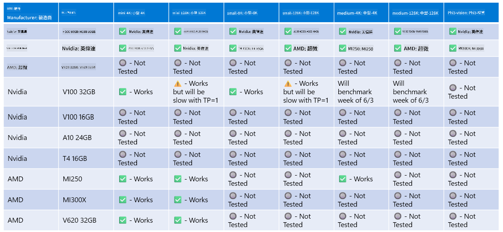

<!--
CO_OP_TRANSLATOR_METADATA:
{
  "original_hash": "c4afa6ffd13f29eb34e5f204b94310ff",
  "translation_date": "2025-04-04T11:48:10+00:00",
  "source_file": "md\\01.Introduction\\01\\01.Hardwaresupport.md",
  "language_code": "mo"
}
-->
# Phi Hardware Support

Microsoft Phi đã được tối ưu hóa cho ONNX Runtime và hỗ trợ Windows DirectML. Nó hoạt động tốt trên nhiều loại phần cứng khác nhau, bao gồm GPU, CPU và thậm chí cả thiết bị di động.

## Phần cứng thiết bị
Cụ thể, phần cứng được hỗ trợ bao gồm:

- GPU SKU: RTX 4090 (DirectML)
- GPU SKU: 1 A100 80GB (CUDA)
- CPU SKU: Standard F64s v2 (64 vCPUs, 128 GiB bộ nhớ)

## SKU di động

- Android - Samsung Galaxy S21
- Apple iPhone 14 hoặc cao hơn với bộ xử lý A16/A17

## Thông số kỹ thuật phần cứng Phi

- Cấu hình tối thiểu yêu cầu.
- Windows: GPU hỗ trợ DirectX 12 và ít nhất 4GB RAM tổng hợp

CUDA: NVIDIA GPU với Compute Capability >= 7.02



## Chạy onnxruntime trên nhiều GPU

Hiện tại, các mô hình Phi ONNX chỉ hỗ trợ 1 GPU. Có thể hỗ trợ nhiều GPU cho mô hình Phi, nhưng ORT với 2 GPU không đảm bảo rằng nó sẽ mang lại thông lượng cao hơn so với việc chạy 2 phiên bản ORT riêng biệt. Vui lòng xem [ONNX Runtime](https://onnxruntime.ai/) để biết các cập nhật mới nhất.

Tại [Build 2024, nhóm GenAI ONNX](https://youtu.be/WLW4SE8M9i8?si=EtG04UwDvcjunyfC) đã thông báo rằng họ đã kích hoạt chế độ nhiều phiên bản thay vì nhiều GPU cho các mô hình Phi.

Hiện tại, điều này cho phép bạn chạy một phiên bản onnnxruntime hoặc onnxruntime-genai với biến môi trường CUDA_VISIBLE_DEVICES như sau.

```Python
CUDA_VISIBLE_DEVICES=0 python infer.py
CUDA_VISIBLE_DEVICES=1 python infer.py
```

Hãy thoải mái khám phá Phi thêm tại [Azure AI Foundry](https://ai.azure.com)

It seems like "mo" might refer to a specific language or abbreviation. Could you clarify what "mo" stands for? For example, is it Maori, Montenegrin, or something else? Once clarified, I'd be happy to assist with the translation!