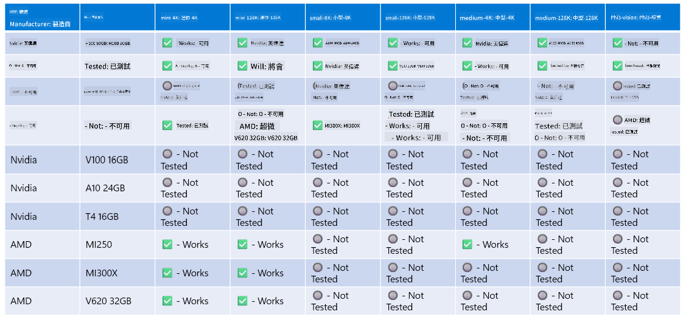

<!--
CO_OP_TRANSLATOR_METADATA:
{
  "original_hash": "8cdc17ce0f10535da30b53d23fe1a795",
  "translation_date": "2025-05-07T14:57:03+00:00",
  "source_file": "md/01.Introduction/01/01.Hardwaresupport.md",
  "language_code": "mo"
}
-->
# Phi Hardware Support

Microsoft Phi သည် ONNX Runtime အတွက် အထူးပြုလုပ်ထားပြီး Windows DirectML ကို ထောက်ပံ့သည်။ GPU, CPU နှင့် မိုဘိုင်း စက်များအပါအဝင် မျိုးစုံသော hardware များတွင် ကောင်းစွာ လည်ပတ်နိုင်သည်။

## Device Hardware  
ထူးခြားစွာ ထောက်ပံ့ထားသော hardware များမှာ အောက်ပါအတိုင်း ဖြစ်သည်-

- GPU SKU: RTX 4090 (DirectML)
- GPU SKU: 1 A100 80GB (CUDA)
- CPU SKU: Standard F64s v2 (64 vCPUs, 128 GiB memory)

## Mobile SKU

- Android - Samsung Galaxy S21
- Apple iPhone 14 သို့မဟုတ် အထက် A16/A17 Processor

## Phi Hardware Specification

- အနည်းဆုံး တပ်ဆင်ရမည့် ဖွဲ့စည်းမှု။
- Windows: DirectX 12 ကို ထောက်ပံ့သော GPU နှင့် စုစုပေါင်း RAM 4GB အနည်းဆုံးရှိရမည်။

CUDA: Compute Capability >= 7.02 ပါဝင်သော NVIDIA GPU



## onnxruntime ကို multi-GPU ပေါ်တွင် ပြေးဆွဲခြင်း

လက်ရှိ Phi ONNX မော်ဒယ်များသည် GPU 1 ခုအတွက်သာ ရရှိနိုင်သည်။ Phi မော်ဒယ်များအတွက် multi-gpu ထောက်ပံ့နိုင်ပေမယ့် ORT ကို GPU 2 ခုပြေးဆွဲသည်မှာ ort 2 instance ပေါင်းထက် ပိုမိုမြန်ဆန်မှု မအာမခံနိုင်ပါ။ နောက်ဆုံးရ သတင်းအချက်အလက်များအတွက် [ONNX Runtime](https://onnxruntime.ai/) ကို ကြည့်ရှုပါ။

[Build 2024 the GenAI ONNX Team](https://youtu.be/WLW4SE8M9i8?si=EtG04UwDvcjunyfC) တွင် Phi မော်ဒယ်များအတွက် multi-gpu အစား multi-instance ကို ဖွင့်လှစ်ခဲ့ကြောင်း ကြေညာခဲ့သည်။

လက်ရှိတွင် CUDA_VISIBLE_DEVICES environment variable ဖြင့် onnxruntime သို့မဟုတ် onnxruntime-genai instance တစ်ခုကို အောက်ပါအတိုင်း ပြေးဆွဲနိုင်သည်။

```Python
CUDA_VISIBLE_DEVICES=0 python infer.py
CUDA_VISIBLE_DEVICES=1 python infer.py
```

Phi ကို ပိုမိုလေ့လာလိုပါက [Azure AI Foundry](https://ai.azure.com) တွင် ကြည့်ရှုနိုင်ပါသည်။

**Disclaimer**:  
This document has been translated using AI translation service [Co-op Translator](https://github.com/Azure/co-op-translator). While we strive for accuracy, please be aware that automated translations may contain errors or inaccuracies. The original document in its native language should be considered the authoritative source. For critical information, professional human translation is recommended. We are not liable for any misunderstandings or misinterpretations arising from the use of this translation.

---

(Note: "mo" is not a recognized language code or language name. If you intended a specific language or dialect, please clarify so I can provide an accurate translation.)