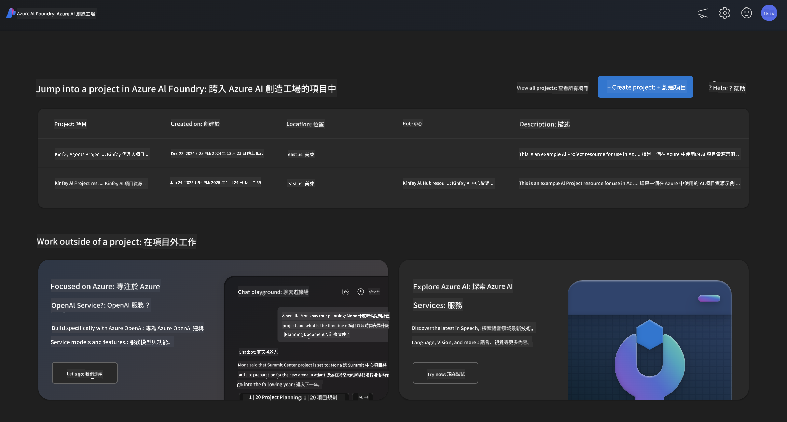
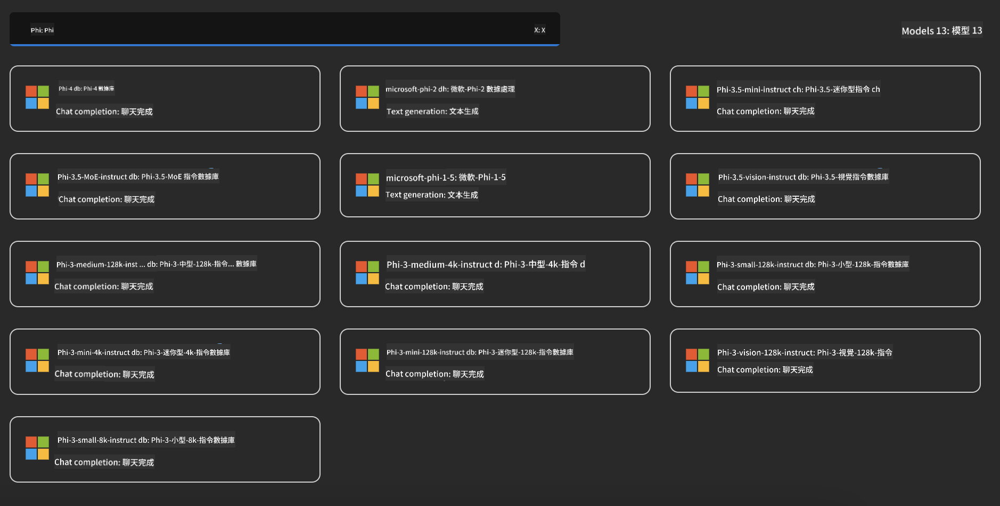
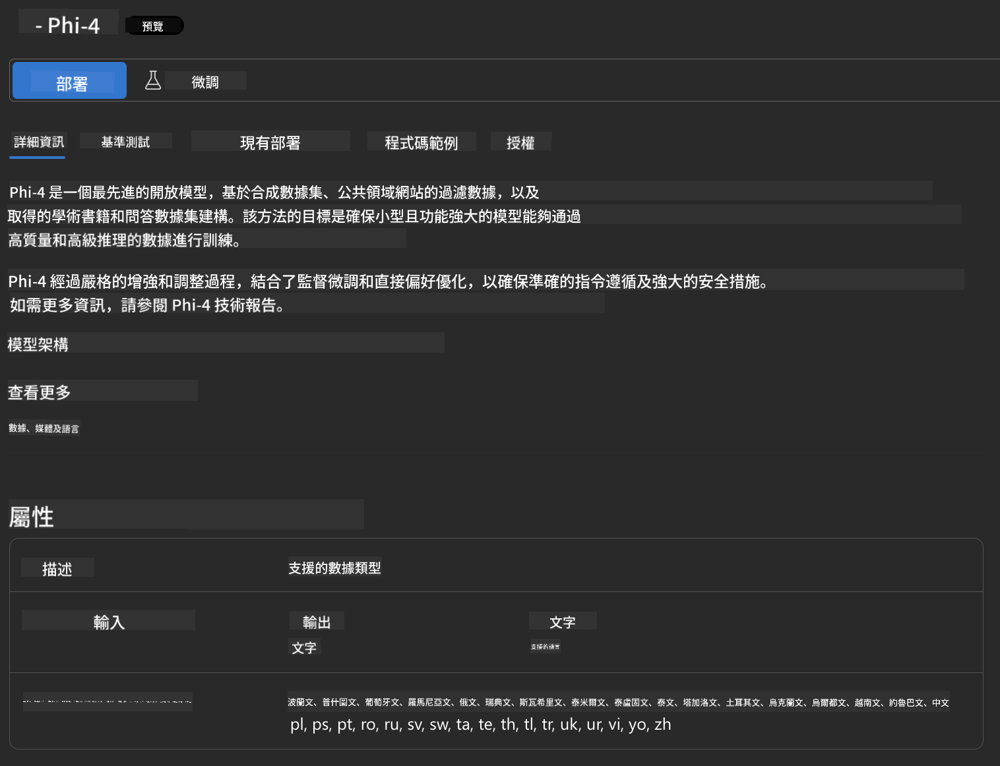
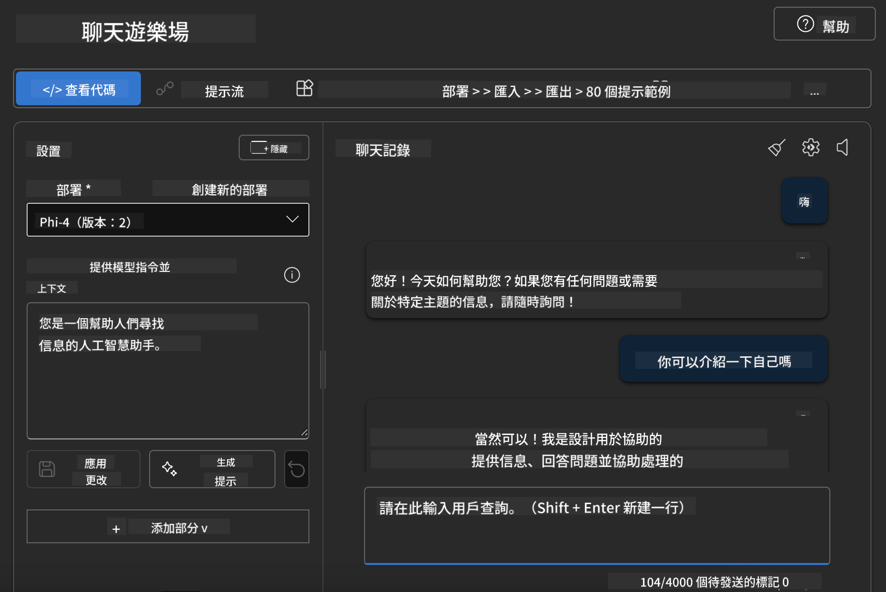

<!--
CO_OP_TRANSLATOR_METADATA:
{
  "original_hash": "70dc9bd6453f70f1a5f6833fe6e24bd0",
  "translation_date": "2025-04-04T11:53:16+00:00",
  "source_file": "md\\01.Introduction\\02\\03.AzureAIFoundry.md",
  "language_code": "mo"
}
-->
## Phi Family in Azure AI Foundry

[Azure AI Foundry](https://ai.azure.com) jẹ pẹpẹ igbẹkẹle ti o fun awọn onitumọ ni agbara lati ṣe idasi awọn imotuntun ati ṣe agbekalẹ ojo iwaju pẹlu AI ni ọna ailewu, aabo, ati ti o ni ojuse.

[Azure AI Foundry](https://ai.azure.com) jẹ apẹrẹ fun awọn onitumọ lati:

- Ṣẹda awọn ohun elo AI ti o ṣe ipilẹ lori pẹpẹ ti o ni ipele ile-iṣẹ.
- Ṣawari, kọ, idanwo, ati ṣe ifilọlẹ nipa lilo awọn irinṣẹ AI ti o ni ilọsiwaju ati awọn awoṣe ML, ti o ni ipilẹ ninu awọn ilana AI ti o ni ojuse.
- Ṣepọ pẹlu ẹgbẹ fun gbogbo ọna igbesi aye ti idagbasoke ohun elo.

Pẹlu Azure AI Foundry, o le ṣawari ọpọlọpọ awọn awoṣe, awọn iṣẹ ati awọn agbara, ki o bẹrẹ si ṣiṣẹda awọn ohun elo AI ti o ba awọn ibi-afẹde rẹ mu julọ. Pẹpẹ Azure AI Foundry n ṣakoso iwọn didun fun yiyi awọn imọran idanwo sinu awọn ohun elo iṣelọpọ ti o pari ni irọrun. Atẹle igbagbogbo ati atunṣe ṣe atilẹyin aṣeyọri igba pipẹ.



Ni afikun si lilo Iṣẹ Azure AOAI ninu Azure AI Foundry, o tun le lo awọn awoṣe ẹnikẹta ninu Akojo Awoṣe Azure AI Foundry. Eyi jẹ aṣayan ti o dara ti o ba fẹ lo Azure AI Foundry bi pẹpẹ ojutu AI rẹ.

A le yara fi awọn awoṣe Phi Family sori ẹrọ nipasẹ Akojo Awoṣe ninu Azure AI Foundry.



### **Fi Phi-4 sori ẹrọ ni Azure AI Foundry**



### **Ṣayẹwo Phi-4 ninu Azure AI Foundry Playground**



### **Ṣiṣe koodu Python lati pe Azure AI Foundry Phi-4**

```python

import os  
import base64
from openai import AzureOpenAI  
from azure.identity import DefaultAzureCredential, get_bearer_token_provider  
        
endpoint = os.getenv("ENDPOINT_URL", "Your Azure AOAI Service Endpoint")  
deployment = os.getenv("DEPLOYMENT_NAME", "Phi-4")  
      
token_provider = get_bearer_token_provider(  
    DefaultAzureCredential(),  
    "https://cognitiveservices.azure.com/.default"  
)  
  
client = AzureOpenAI(  
    azure_endpoint=endpoint,  
    azure_ad_token_provider=token_provider,  
    api_version="2024-05-01-preview",  
)  
  

chat_prompt = [
    {
        "role": "system",
        "content": "You are an AI assistant that helps people find information."
    },
    {
        "role": "user",
        "content": "can you introduce yourself"
    }
] 
    
# Include speech result if speech is enabled  
messages = chat_prompt 

completion = client.chat.completions.create(  
    model=deployment,  
    messages=messages,
    max_tokens=800,  
    temperature=0.7,  
    top_p=0.95,  
    frequency_penalty=0,  
    presence_penalty=0,
    stop=None,  
    stream=False  
)  
  
print(completion.to_json())  

```

It seems there might be a typo or misunderstanding in your request. Could you clarify what "mo" refers to? Are you asking for a translation into a specific language, such as Maori, Mongolian, or something else? Let me know, and I'd be happy to assist!