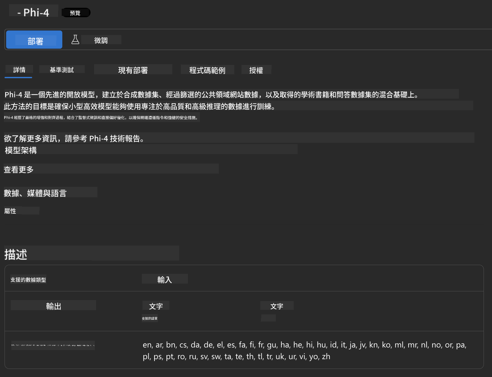
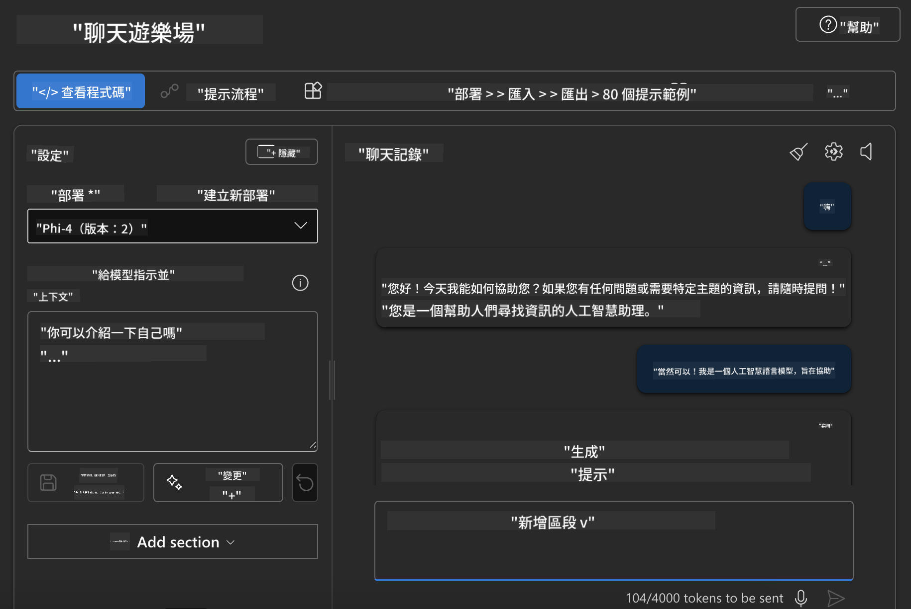

<!--
CO_OP_TRANSLATOR_METADATA:
{
  "original_hash": "3ae21dc5554e888defbe57946ee995ee",
  "translation_date": "2025-05-07T15:07:25+00:00",
  "source_file": "md/01.Introduction/02/03.AzureAIFoundry.md",
  "language_code": "mo"
}
-->
## Phi Family in Azure AI Foundry

[Azure AI Foundry](https://ai.azure.com) היא פלטפורמה מהימנה המאפשרת למפתחים לקדם חדשנות ולעצב את העתיד עם AI בצורה בטוחה, מאובטחת ואחראית.

[Azure AI Foundry](https://ai.azure.com) מיועדת למפתחים כדי:

- לבנות יישומי AI גנרטיביים על פלטפורמה ברמת ארגון.
- לחקור, לבנות, לבדוק ולפרוס באמצעות כלי AI מתקדמים ודגמי ML, המבוססים על עקרונות AI אחראי.
- לשתף פעולה עם צוות לאורך כל מחזור חיי פיתוח היישומים.

עם Azure AI Foundry, ניתן לחקור מגוון רחב של דגמים, שירותים ויכולות, ולהתחיל לבנות יישומי AI המתאימים ביותר למטרות שלך. פלטפורמת Azure AI Foundry מאפשרת גמישות בהרחבה להמרת אב טיפוס ליישומים מלאים בפרודקשן בקלות. ניטור ושיפור מתמידים תומכים בהצלחה ארוכת טווח.


בנוסף לשימוש ב-Azure AOAI Service בתוך Azure AI Foundry, ניתן להשתמש גם בדגמים של צד שלישי ב-Model Catalog של Azure AI Foundry. זו בחירה טובה אם ברצונך להשתמש ב-Azure AI Foundry כפלטפורמת פתרונות AI שלך.

ניתן לפרוס במהירות דגמי Phi Family דרך Model Catalog ב-Azure AI Foundry

[Microsoft Phi Models in Azure AI Foundry Models](https://ai.azure.com/explore/models/?selectedCollection=phi)


### **פריסת Phi-4 ב-Azure AI Foundry**



### **בדיקת Phi-4 ב-Azure AI Foundry Playground**



### **הרצת קוד Python לקריאה ל-Azure AI Foundry Phi-4**

```python

import os  
import base64
from openai import AzureOpenAI  
from azure.identity import DefaultAzureCredential, get_bearer_token_provider  
        
endpoint = os.getenv("ENDPOINT_URL", "Your Azure AOAI Service Endpoint")  
deployment = os.getenv("DEPLOYMENT_NAME", "Phi-4")  
      
token_provider = get_bearer_token_provider(  
    DefaultAzureCredential(),  
    "https://cognitiveservices.azure.com/.default"  
)  
  
client = AzureOpenAI(  
    azure_endpoint=endpoint,  
    azure_ad_token_provider=token_provider,  
    api_version="2024-05-01-preview",  
)  
  

chat_prompt = [
    {
        "role": "system",
        "content": "You are an AI assistant that helps people find information."
    },
    {
        "role": "user",
        "content": "can you introduce yourself"
    }
] 
    
# Include speech result if speech is enabled  
messages = chat_prompt 

completion = client.chat.completions.create(  
    model=deployment,  
    messages=messages,
    max_tokens=800,  
    temperature=0.7,  
    top_p=0.95,  
    frequency_penalty=0,  
    presence_penalty=0,
    stop=None,  
    stream=False  
)  
  
print(completion.to_json())  

```

**Disclaimer**:  
This document has been translated using AI translation service [Co-op Translator](https://github.com/Azure/co-op-translator). While we strive for accuracy, please be aware that automated translations may contain errors or inaccuracies. The original document in its native language should be considered the authoritative source. For critical information, professional human translation is recommended. We are not liable for any misunderstandings or misinterpretations arising from the use of this translation.

---

If you intended "mo" as a language code or shorthand, could you please clarify which language you mean? For example, "mo" might refer to Moldovan (Romanian), or something else. This will help me provide an accurate translation.