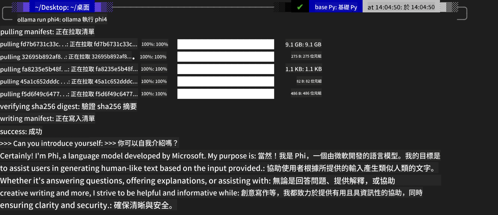
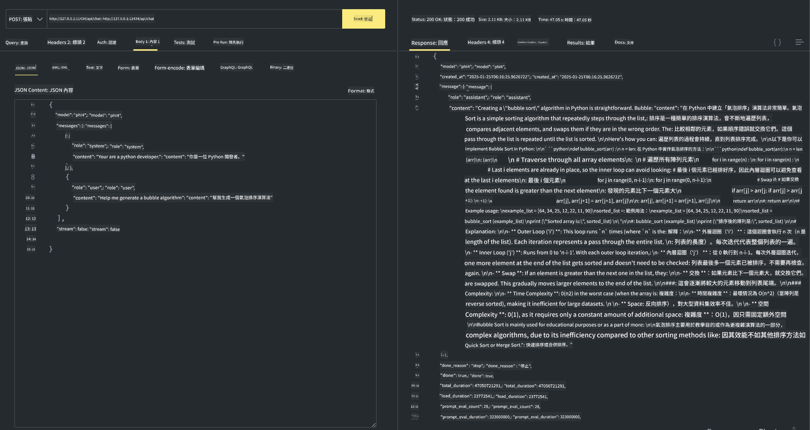

<!--
CO_OP_TRANSLATOR_METADATA:
{
  "original_hash": "0b38834693bb497f96bf53f0d941f9a1",
  "translation_date": "2025-05-07T15:12:30+00:00",
  "source_file": "md/01.Introduction/02/04.Ollama.md",
  "language_code": "mo"
}
-->
## Phi Family in Ollama


[Ollama](https://ollama.com) מאפשרת ליותר אנשים לפרוס ישירות מודלי LLM או SLM בקוד פתוח דרך סקריפטים פשוטים, ויכולה גם לבנות APIs כדי לסייע בתרחישי שימוש מקומיים של Copilot.

## **1. התקנה**

Ollama תומכת בהרצה על Windows, macOS ו-Linux. ניתן להתקין את Ollama דרך הקישור הזה ([https://ollama.com/download](https://ollama.com/download)). לאחר התקנה מוצלחת, ניתן להשתמש בסקריפט של Ollama כדי לקרוא ל-Phi-3 ישירות דרך חלון טרמינל. ניתן לראות את כל [הספריות הזמינות ב-Ollama](https://ollama.com/library). אם תפתחו את המאגר הזה ב-Codespace, Ollama כבר תהיה מותקנת.

```bash

ollama run phi4

```

> [!NOTE]
> המודל יורד בפעם הראשונה כשמריצים אותו. כמובן, ניתן גם לציין ישירות את מודל Phi-4 שהורדתם. אנו משתמשים בדוגמה של WSL להריץ את הפקודה. לאחר שהמודל יורד בהצלחה, ניתן לתקשר ישירות דרך הטרמינל.



## **2. קריאה ל-phi-4 API מ-Ollama**

אם רוצים לקרוא ל-API של Phi-4 שנוצר על ידי Ollama, ניתן להשתמש בפקודה הבאה בטרמינל כדי להפעיל את שרת Ollama.

```bash

ollama serve

```

> [!NOTE]
> אם מריצים על MacOS או Linux, שימו לב שאולי תיתקלו בשגיאה הבאה **"Error: listen tcp 127.0.0.1:11434: bind: address already in use"** ייתכן ותקבלו שגיאה זו כשמריצים את הפקודה. ניתן להתעלם משגיאה זו, כיוון שבדרך כלל היא מצביעה שהשרת כבר פועל, או שתוכלו לעצור ולהפעיל מחדש את Ollama:

**macOS**

```bash

brew services restart ollama

```

**Linux**

```bash

sudo systemctl stop ollama

```

Ollama תומכת בשני APIs: generate ו-chat. ניתן לקרוא ל-API של המודל שמספקת Ollama לפי הצורך, על ידי שליחת בקשות לשירות המקומי שרץ על פורט 11434.

**Chat**

```bash

curl http://127.0.0.1:11434/api/chat -d '{
  "model": "phi3",
  "messages": [
    {
      "role": "system",
      "content": "Your are a python developer."
    },
    {
      "role": "user",
      "content": "Help me generate a bubble algorithm"
    }
  ],
  "stream": false
  
}'

This is the result in Postman



## Additional Resources

Check the list of available models in Ollama in [their library](https://ollama.com/library).

Pull your model from the Ollama server using this command

```bash
ollama pull phi4
```

Run the model using this command

```bash
ollama run phi4
```

***Note:*** Visit this link [https://github.com/ollama/ollama/blob/main/docs/api.md](https://github.com/ollama/ollama/blob/main/docs/api.md) to learn more

## Calling Ollama from Python

You can use `requests` or `urllib3` to make requests to the local server endpoints used above. However, a popular way to use Ollama in Python is via the [openai](https://pypi.org/project/openai/) SDK, since Ollama provides OpenAI-compatible server endpoints as well.

Here is an example for phi3-mini:

```python
import openai

client = openai.OpenAI(
    base_url="http://localhost:11434/v1",
    api_key="nokeyneeded",
)

response = client.chat.completions.create(
    model="phi4",
    temperature=0.7,
    n=1,
    messages=[
        {"role": "system", "content": "You are a helpful assistant."},
        {"role": "user", "content": "Write a haiku about a hungry cat"},
    ],
)

print("Response:")
print(response.choices[0].message.content)
```

## Calling Ollama from JavaScript 

```javascript
// דוגמה לסיכום קובץ עם Phi-4
script({
    model: "ollama:phi4",
    title: "Summarize with Phi-4",
    system: ["system"],
})

// דוגמה לסיכום
const file = def("FILE", env.files)
$`Summarize ${file} in a single paragraph.`
```

## Calling Ollama from C#

Create a new C# Console application and add the following NuGet package:

```bash
dotnet add package Microsoft.SemanticKernel --version 1.34.0
```

Then replace this code in the `Program.cs` file

```csharp
using Microsoft.SemanticKernel;
using Microsoft.SemanticKernel.ChatCompletion;

// הוספת שירות השלמת שיחה באמצעות נקודת הקצה המקומית של ollama
#pragma warning disable SKEXP0001, SKEXP0003, SKEXP0010, SKEXP0011, SKEXP0050, SKEXP0052
builder.AddOpenAIChatCompletion(
    modelId: "phi4",
    endpoint: new Uri("http://localhost:11434/"),
    apiKey: "non required");

// קריאה פשוטה לשירות השיחה עם פרומפט
string prompt = "Write a joke about kittens";
var response = await kernel.InvokePromptAsync(prompt);
Console.WriteLine(response.GetValue<string>());
```

Run the app with the command:

```bash
dotnet run


**Disclaimer**:  
Thi documint has bin translaitid yusing AI translaition sarvis [Co-op Translator](https://github.com/Azure/co-op-translator). Wile wi striv for accurasi, pliz bi awar that otomaitid translaitions mei contain erors or inakuracis. Thi orijinal documint in its nativ langwaj shud bi konsiderd thi autoritativ sors. For kritikel informasion, profesonal human translaition is rekomendid. Wi ar not laybl for eni misanderstandings or misinterpretations arizing from thi yus of this translaition.