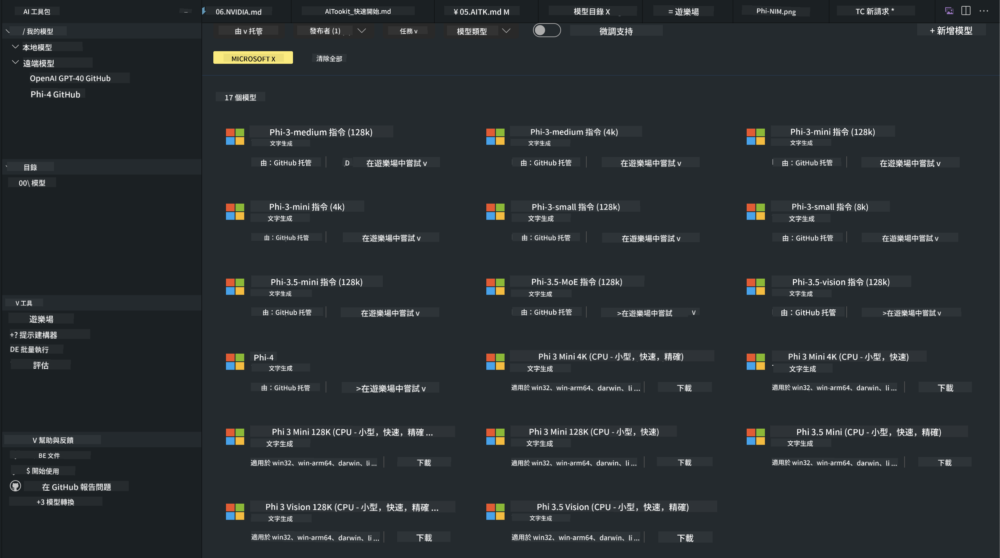
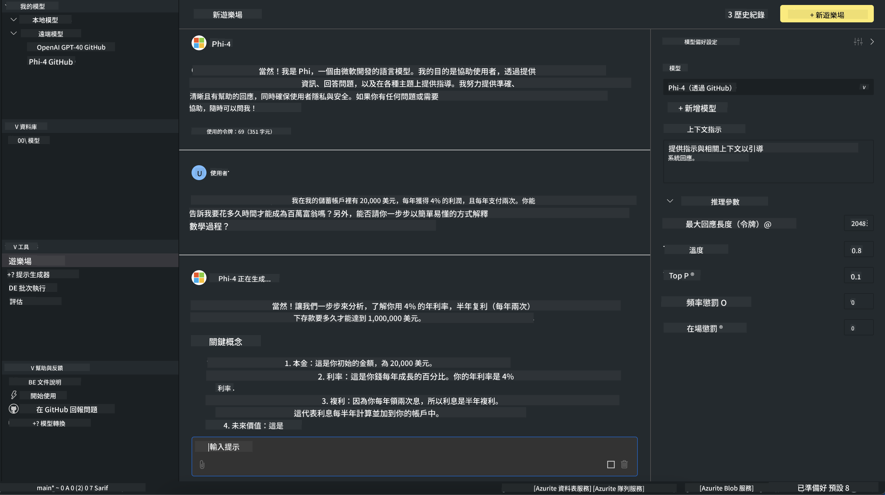

<!--
CO_OP_TRANSLATOR_METADATA:
{
  "original_hash": "4951d458c0b60c02cd1e751b40903877",
  "translation_date": "2025-07-16T19:22:18+00:00",
  "source_file": "md/01.Introduction/02/05.AITK.md",
  "language_code": "mo"
}
-->
# Phi 家族在 AITK

[AI Toolkit for VS Code](https://marketplace.visualstudio.com/items?itemName=ms-windows-ai-studio.windows-ai-studio) 透過整合來自 Azure AI Foundry Catalog 及其他目錄（如 Hugging Face）的先進 AI 開發工具和模型，簡化生成式 AI 應用程式的開發。您可以瀏覽由 GitHub Models 和 Azure AI Foundry Model Catalogs 提供的 AI 模型目錄，將模型下載到本地或遠端，進行微調、測試並在應用程式中使用。

AI Toolkit 預覽版將在本地執行。根據您選擇的模型，進行本地推論或微調時，可能需要具備 NVIDIA CUDA GPU 等 GPU。您也可以直接使用 AITK 執行 GitHub Models。

## 快速開始

[了解如何安裝 Windows 子系統 Linux](https://learn.microsoft.com/windows/wsl/install?WT.mc_id=aiml-137032-kinfeylo)

以及 [更改預設發行版](https://learn.microsoft.com/windows/wsl/install#change-the-default-linux-distribution-installed)。

[AI Toolkit GitHub 倉庫](https://github.com/microsoft/vscode-ai-toolkit/)

- 支援 Windows、Linux、macOS
  
- 在 Windows 和 Linux 上進行微調時，您需要 Nvidia GPU。此外，**Windows** 需要安裝 Ubuntu 18.4 或更新版本的 Linux 子系統。請參考 [了解如何安裝 Windows 子系統 Linux](https://learn.microsoft.com/windows/wsl/install) 及 [更改預設發行版](https://learn.microsoft.com/windows/wsl/install#change-the-default-linux-distribution-installed)。

### 安裝 AI Toolkit

AI Toolkit 以 [Visual Studio Code 擴充套件](https://code.visualstudio.com/docs/setup/additional-components#_vs-code-extensions) 形式發佈，因此您需要先安裝 [VS Code](https://code.visualstudio.com/docs/setup/windows?WT.mc_id=aiml-137032-kinfeylo)，然後從 [VS Marketplace](https://marketplace.visualstudio.com/items?itemName=ms-windows-ai-studio.windows-ai-studio) 下載 AI Toolkit。  
[AI Toolkit 可在 Visual Studio Marketplace 取得](https://marketplace.visualstudio.com/items?itemName=ms-windows-ai-studio.windows-ai-studio)，安裝方式與其他 VS Code 擴充套件相同。

如果您不熟悉如何安裝 VS Code 擴充套件，請依照以下步驟操作：

### 登入

1. 在 VS Code 的活動列中選擇 **Extensions**
2. 在擴充套件搜尋欄輸入 "AI Toolkit"
3. 選擇 "AI Toolkit for Visual Studio code"
4. 點選 **Install**

現在，您已準備好使用此擴充套件！

系統會提示您登入 GitHub，請點選「Allow」繼續。您將被導向 GitHub 登入頁面。

請登入並依照流程操作。完成後，您會被導回 VS Code。

安裝完成後，您會在活動列看到 AI Toolkit 的圖示。

讓我們來探索可用的功能吧！

### 可用功能

AI Toolkit 的主側邊欄分為  

- **Models**
- **Resources**
- **Playground**  
- **Fine-tuning**
- **Evaluation**

這些功能都在 Resources 區域。要開始，請選擇 **Model Catalog**。

### 從目錄下載模型

從 VS Code 側邊欄啟動 AI Toolkit 後，您可以選擇以下選項：



- 從 **Model Catalog** 找到支援的模型並下載到本地
- 在 **Model Playground** 測試模型推論
- 在 **Model Fine-tuning** 進行本地或遠端微調
- 透過 AI Toolkit 的命令面板將微調後的模型部署到雲端
- 評估模型

> [!NOTE]
>
> **GPU 與 CPU**
>
> 您會注意到模型卡片會顯示模型大小、平台及加速器類型（CPU、GPU）。若您使用的 **Windows 裝置至少有一張 GPU**，請選擇僅針對 Windows 優化的模型版本，以獲得最佳效能。
>
> 這樣可確保模型針對 DirectML 加速器進行優化。
>
> 模型名稱格式為
>
> - `{model_name}-{accelerator}-{quantization}-{format}`。
>
>要確認您的 Windows 裝置是否有 GPU，請開啟 **工作管理員**，然後選擇 **效能** 分頁。如果有 GPU，會以「GPU 0」或「GPU 1」等名稱列出。

### 在 Playground 執行模型

設定好所有參數後，點選 **Generate Project**。

模型下載完成後，於目錄中的模型卡片選擇 **Load in Playground**：

- 啟動模型下載
- 安裝所有前置需求與相依套件
- 建立 VS Code 工作區



### 在應用程式中使用 REST API

AI Toolkit 內建本地 REST API 網頁伺服器，**監聽在 5272 埠口**，採用 [OpenAI chat completions 格式](https://platform.openai.com/docs/api-reference/chat/create)。

這讓您能在本地測試應用程式，無需依賴雲端 AI 模型服務。例如，以下 JSON 檔案示範如何設定請求主體：

```json
{
    "model": "Phi-4",
    "messages": [
        {
            "role": "user",
            "content": "what is the golden ratio?"
        }
    ],
    "temperature": 0.7,
    "top_p": 1,
    "top_k": 10,
    "max_tokens": 100,
    "stream": true
}
```

您可以使用（例如）[Postman](https://www.postman.com/) 或 CURL（Client URL）工具測試 REST API：

```bash
curl -vX POST http://127.0.0.1:5272/v1/chat/completions -H 'Content-Type: application/json' -d @body.json
```

### 使用 Python 的 OpenAI 用戶端函式庫

```python
from openai import OpenAI

client = OpenAI(
    base_url="http://127.0.0.1:5272/v1/", 
    api_key="x" # required for the API but not used
)

chat_completion = client.chat.completions.create(
    messages=[
        {
            "role": "user",
            "content": "what is the golden ratio?",
        }
    ],
    model="Phi-4",
)

print(chat_completion.choices[0].message.content)
```

### 使用 .NET 的 Azure OpenAI 用戶端函式庫

透過 NuGet 將 [Azure OpenAI 用戶端函式庫 for .NET](https://www.nuget.org/packages/Azure.AI.OpenAI/) 加入您的專案：

```bash
dotnet add {project_name} package Azure.AI.OpenAI --version 1.0.0-beta.17
```

新增一個名為 **OverridePolicy.cs** 的 C# 檔案，並貼上以下程式碼：

```csharp
// OverridePolicy.cs
using Azure.Core.Pipeline;
using Azure.Core;

internal partial class OverrideRequestUriPolicy(Uri overrideUri)
    : HttpPipelineSynchronousPolicy
{
    private readonly Uri _overrideUri = overrideUri;

    public override void OnSendingRequest(HttpMessage message)
    {
        message.Request.Uri.Reset(_overrideUri);
    }
}
```

接著，將以下程式碼貼到您的 **Program.cs** 檔案中：

```csharp
// Program.cs
using Azure.AI.OpenAI;

Uri localhostUri = new("http://localhost:5272/v1/chat/completions");

OpenAIClientOptions clientOptions = new();
clientOptions.AddPolicy(
    new OverrideRequestUriPolicy(localhostUri),
    Azure.Core.HttpPipelinePosition.BeforeTransport);
OpenAIClient client = new(openAIApiKey: "unused", clientOptions);

ChatCompletionsOptions options = new()
{
    DeploymentName = "Phi-4",
    Messages =
    {
        new ChatRequestSystemMessage("You are a helpful assistant. Be brief and succinct."),
        new ChatRequestUserMessage("What is the golden ratio?"),
    }
};

StreamingResponse<StreamingChatCompletionsUpdate> streamingChatResponse
    = await client.GetChatCompletionsStreamingAsync(options);

await foreach (StreamingChatCompletionsUpdate chatChunk in streamingChatResponse)
{
    Console.Write(chatChunk.ContentUpdate);
}
```


## 使用 AI Toolkit 進行微調

- 從模型探索與 Playground 開始
- 使用本地運算資源進行模型微調與推論
- 使用 Azure 資源進行遠端微調與推論

[使用 AI Toolkit 進行微調](../../03.FineTuning/Finetuning_VSCodeaitoolkit.md)

## AI Toolkit 問答資源

請參考我們的 [問答頁面](https://github.com/microsoft/vscode-ai-toolkit/blob/main/archive/QA.md) 以了解常見問題及解決方案

**免責聲明**：  
本文件係使用 AI 翻譯服務 [Co-op Translator](https://github.com/Azure/co-op-translator) 進行翻譯。雖然我們致力於確保準確性，但請注意，自動翻譯可能包含錯誤或不準確之處。原始文件的母語版本應視為權威來源。對於重要資訊，建議採用專業人工翻譯。我們不對因使用本翻譯而產生的任何誤解或誤釋承擔責任。