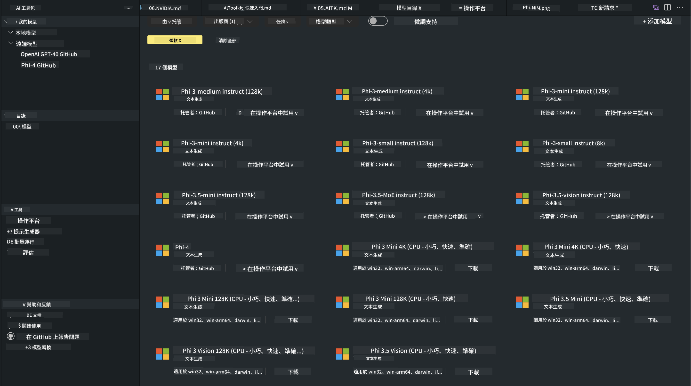
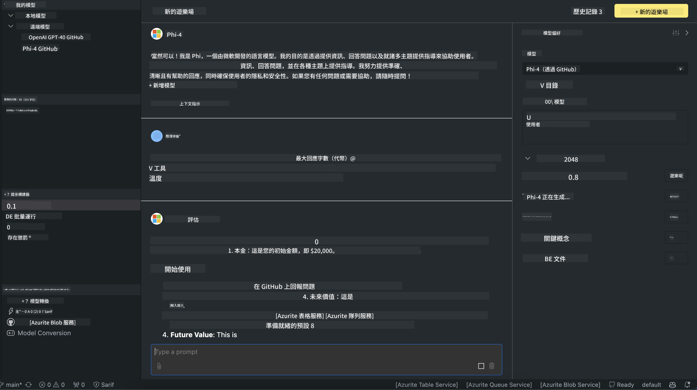

<!--
CO_OP_TRANSLATOR_METADATA:
{
  "original_hash": "9365fb38f5c75c4d7ac9b9a4baa7c9d1",
  "translation_date": "2025-04-04T11:55:18+00:00",
  "source_file": "md\\01.Introduction\\02\\05.AITK.md",
  "language_code": "mo"
}
-->
# Phi Family in AITK

[AI Toolkit for VS Code](https://marketplace.visualstudio.com/items?itemName=ms-windows-ai-studio.windows-ai-studio) makes developing generative AI applications easier by combining advanced AI tools and models from Azure AI Foundry Catalog and other sources like Hugging Face. You can browse AI model catalogs powered by GitHub Models and Azure AI Foundry Model Catalogs, download them locally or remotely, fine-tune them, test them, and use them in your applications.

AI Toolkit Preview operates locally. Depending on the model you choose, local inference or fine-tuning may require a GPU like an NVIDIA CUDA GPU. You can also directly run GitHub Models using AITK.

## Getting Started

[Learn how to install Windows subsystem for Linux](https://learn.microsoft.com/windows/wsl/install?WT.mc_id=aiml-137032-kinfeylo)

and [change the default distribution](https://learn.microsoft.com/windows/wsl/install#change-the-default-linux-distribution-installed).

[AI Toolkit GitHub Repository](https://github.com/microsoft/vscode-ai-toolkit/)

- Windows, Linux, macOS

- For fine-tuning on both Windows and Linux, an Nvidia GPU is required. Additionally, **Windows** needs the subsystem for Linux with Ubuntu distro 18.4 or newer. [Learn how to install Windows subsystem for Linux](https://learn.microsoft.com/windows/wsl/install) and [change the default distribution](https://learn.microsoft.com/windows/wsl/install#change-the-default-linux-distribution-installed).

### Install AI Toolkit

AI Toolkit is distributed as a [Visual Studio Code Extension](https://code.visualstudio.com/docs/setup/additional-components#_vs-code-extensions), so you first need to install [VS Code](https://code.visualstudio.com/docs/setup/windows?WT.mc_id=aiml-137032-kinfeylo) and then download AI Toolkit from the [VS Marketplace](https://marketplace.visualstudio.com/items?itemName=ms-windows-ai-studio.windows-ai-studio).  
The [AI Toolkit is available in the Visual Studio Marketplace](https://marketplace.visualstudio.com/items?itemName=ms-windows-ai-studio.windows-ai-studio) and can be installed like any other VS Code extension.

If you are new to installing VS Code extensions, follow these steps:

### Sign In

1. In VS Code, select **Extensions** from the Activity Bar.
2. In the Extensions Search bar, type "AI Toolkit."
3. Select "AI Toolkit for Visual Studio Code."
4. Click **Install.**

Now you’re ready to use the extension!

You’ll be prompted to sign in to GitHub. Click "Allow" to continue. This will redirect you to the GitHub sign-in page.

Sign in and follow the steps provided. Once completed successfully, you’ll be redirected back to VS Code.

After the extension is installed, the AI Toolkit icon will appear in your Activity Bar.

Let’s explore the available actions!

### Available Actions

The main sidebar of AI Toolkit is divided into the following sections:

- **Models**
- **Resources**
- **Playground**
- **Fine-tuning**
- **Evaluation**

These can be found in the Resources section. To begin, select **Model Catalog**.

### Download a model from the catalog

When you launch AI Toolkit from the VS Code sidebar, you’ll see the following options:



- Choose a supported model from **Model Catalog** and download it locally.
- Test model inference in the **Model Playground.**
- Fine-tune the model locally or remotely in **Model Fine-tuning.**
- Deploy fine-tuned models to the cloud via the AI Toolkit command palette.
- Evaluate models.

> [!NOTE]
>
> **GPU vs CPU**
>
> Model cards will display the model size, platform, and accelerator type (CPU, GPU). For optimal performance on **Windows devices with at least one GPU**, select model versions that are specifically designed for Windows.
>
> This ensures the model is optimized for the DirectML accelerator.
>
> Model names follow the format:
>
> - `{model_name}-{accelerator}-{quantization}-{format}`.
>
> To check if your Windows device has a GPU, open **Task Manager** and go to the **Performance** tab. If you have GPU(s), they will be listed under names like "GPU 0" or "GPU 1."

### Run the model in the playground

After setting all parameters, click **Generate Project.**

Once the model is downloaded, click **Load in Playground** on the model card in the catalog:

- Start the model download.
- Install all necessary prerequisites and dependencies.
- Create a VS Code workspace.



### Use the REST API in your application

AI Toolkit provides a local REST API web server **on port 5272** that uses the [OpenAI chat completions format](https://platform.openai.com/docs/api-reference/chat/create).

This allows you to test your application locally without depending on a cloud AI model service. For example, the following JSON file illustrates how to configure the request body:

```json
{
    "model": "Phi-4",
    "messages": [
        {
            "role": "user",
            "content": "what is the golden ratio?"
        }
    ],
    "temperature": 0.7,
    "top_p": 1,
    "top_k": 10,
    "max_tokens": 100,
    "stream": true
}
```

You can test the REST API using tools like [Postman](https://www.postman.com/) or the CURL (Client URL) utility:

```bash
curl -vX POST http://127.0.0.1:5272/v1/chat/completions -H 'Content-Type: application/json' -d @body.json
```

### Using the OpenAI client library for Python

```python
from openai import OpenAI

client = OpenAI(
    base_url="http://127.0.0.1:5272/v1/", 
    api_key="x" # required for the API but not used
)

chat_completion = client.chat.completions.create(
    messages=[
        {
            "role": "user",
            "content": "what is the golden ratio?",
        }
    ],
    model="Phi-4",
)

print(chat_completion.choices[0].message.content)
```

### Using Azure OpenAI client library for .NET

Add the [Azure OpenAI client library for .NET](https://www.nuget.org/packages/Azure.AI.OpenAI/) to your project using NuGet:

```bash
dotnet add {project_name} package Azure.AI.OpenAI --version 1.0.0-beta.17
```

Add a C# file named **OverridePolicy.cs** to your project and paste the following code:

```csharp
// OverridePolicy.cs
using Azure.Core.Pipeline;
using Azure.Core;

internal partial class OverrideRequestUriPolicy(Uri overrideUri)
    : HttpPipelineSynchronousPolicy
{
    private readonly Uri _overrideUri = overrideUri;

    public override void OnSendingRequest(HttpMessage message)
    {
        message.Request.Uri.Reset(_overrideUri);
    }
}
```

Next, paste the following code into your **Program.cs** file:

```csharp
// Program.cs
using Azure.AI.OpenAI;

Uri localhostUri = new("http://localhost:5272/v1/chat/completions");

OpenAIClientOptions clientOptions = new();
clientOptions.AddPolicy(
    new OverrideRequestUriPolicy(localhostUri),
    Azure.Core.HttpPipelinePosition.BeforeTransport);
OpenAIClient client = new(openAIApiKey: "unused", clientOptions);

ChatCompletionsOptions options = new()
{
    DeploymentName = "Phi-4",
    Messages =
    {
        new ChatRequestSystemMessage("You are a helpful assistant. Be brief and succinct."),
        new ChatRequestUserMessage("What is the golden ratio?"),
    }
};

StreamingResponse<StreamingChatCompletionsUpdate> streamingChatResponse
    = await client.GetChatCompletionsStreamingAsync(options);

await foreach (StreamingChatCompletionsUpdate chatChunk in streamingChatResponse)
{
    Console.Write(chatChunk.ContentUpdate);
}
```

## Fine-Tuning with AI Toolkit

- Begin with model discovery and the playground.
- Perform model fine-tuning and inference using local computing resources.
- Carry out remote fine-tuning and inference using Azure resources.

[Fine-Tuning with AI Toolkit](../../03.FineTuning/Finetuning_VSCodeaitoolkit.md)

## AI Toolkit Q&A Resources

Visit our [Q&A page](https://github.com/microsoft/vscode-ai-toolkit/blob/main/archive/QA.md) for answers to common issues and solutions.

It seems like "mo" might refer to a specific language or dialect. Could you clarify what "mo" stands for? For example, is it Māori, Mon (spoken in Myanmar and Thailand), or another language?