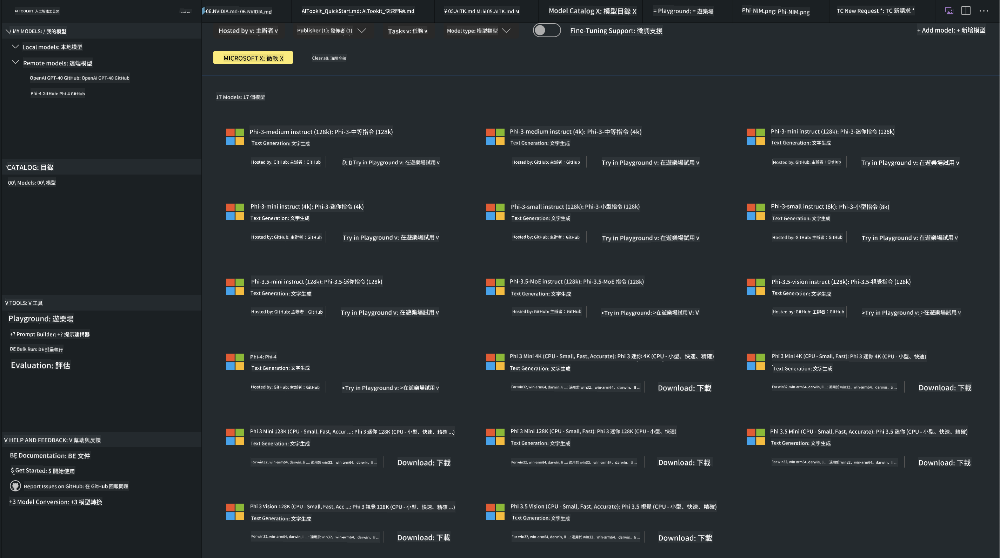

<!--
CO_OP_TRANSLATOR_METADATA:
{
  "original_hash": "4951d458c0b60c02cd1e751b40903877",
  "translation_date": "2025-05-07T15:06:32+00:00",
  "source_file": "md/01.Introduction/02/05.AITK.md",
  "language_code": "mo"
}
-->
# Phi Family in AITK

[AI Toolkit for VS Code](https://marketplace.visualstudio.com/items?itemName=ms-windows-ai-studio.windows-ai-studio) מסייע בפיתוח אפליקציות AI גנרטיביות על ידי איחוד כלי פיתוח AI מתקדמים ודגמים מקטלוג Azure AI Foundry וקטלוגים נוספים כמו Hugging Face. תוכל לגלוש בקטלוג דגמי AI המופעל על ידי GitHub Models ו-Azure AI Foundry Model Catalogs, להוריד אותם למחשב או מרחוק, לכוונן, לבדוק ולהשתמש בהם באפליקציה שלך.

AI Toolkit Preview ירוץ מקומית. אינפרנס מקומי או כיוונון תלוי בדגם שבחרת, ייתכן שתצטרך GPU כמו NVIDIA CUDA GPU. ניתן להריץ גם דגמי GitHub ישירות עם AITK.

## Getting Started

[למידע נוסף על התקנת Windows subsystem for Linux](https://learn.microsoft.com/windows/wsl/install?WT.mc_id=aiml-137032-kinfeylo)

ו-[שינוי ההפצה ברירת המחדל](https://learn.microsoft.com/windows/wsl/install#change-the-default-linux-distribution-installed).

[AI Tooklit GitHub Repo](https://github.com/microsoft/vscode-ai-toolkit/)

- Windows, Linux, macOS

- עבור כיוונון גם ב-Windows וגם ב-Linux, תזדקק ל-Nvidia GPU. בנוסף, **Windows** דורש subsystem for Linux עם הפצת Ubuntu 18.4 ומעלה. [למידע נוסף על התקנת Windows subsystem for Linux](https://learn.microsoft.com/windows/wsl/install) ו-[שינוי ההפצה ברירת המחדל](https://learn.microsoft.com/windows/wsl/install#change-the-default-linux-distribution-installed).

### Install AI Toolkit

AI Toolkit מגיע כהרחבה ל-[Visual Studio Code](https://code.visualstudio.com/docs/setup/additional-components#_vs-code-extensions), לכן יש להתקין קודם [VS Code](https://code.visualstudio.com/docs/setup/windows?WT.mc_id=aiml-137032-kinfeylo) ולהוריד את AI Toolkit מ-[VS Marketplace](https://marketplace.visualstudio.com/items?itemName=ms-windows-ai-studio.windows-ai-studio).
[AI Toolkit זמין ב-Visual Studio Marketplace](https://marketplace.visualstudio.com/items?itemName=ms-windows-ai-studio.windows-ai-studio) וניתן להתקין אותו כמו כל הרחבה אחרת ל-VS Code.

אם אינך מכיר את התקנת הרחבות VS Code, בצע את השלבים הבאים:

### Sign In

1. בסרגל הפעילות ב-VS Code בחר **Extensions**
1. בשורת החיפוש של ההרחבות הקלד "AI Toolkit"
1. בחר את "AI Toolkit for Visual Studio code"
1. לחץ על **Install**

כעת אתה מוכן להשתמש בהרחבה!

תתבקש להיכנס ל-GitHub, אז לחץ "Allow" כדי להמשיך. תועבר לדף ההתחברות של GitHub.

התחבר ופעל לפי השלבים. לאחר השלמת התהליך בהצלחה, תועבר בחזרה ל-VS Code.

לאחר ההתקנה תראה את סמל AI Toolkit מופיע בסרגל הפעילות.

בוא נחקור את הפעולות הזמינות!

### Available Actions

סרגל הצד הראשי של AI Toolkit מאורגן ל-

- **Models**
- **Resources**
- **Playground**  
- **Fine-tuning**
- **Evaluation**

זמינים תחת Resources. כדי להתחיל בחר **Model Catalog**.

### Download a model from the catalog

כשתפעיל את AI Toolkit מסרגל הצד של VS Code, תוכל לבחור באפשרויות הבאות:



- מצא דגם נתמך ב-**Model Catalog** והורד אותו למחשב
- בדוק אינפרנס של הדגם ב-**Model Playground**
- כוונן דגם מקומית או מרחוק ב-**Model Fine-tuning**
- פרוס דגמים מכווננים לענן דרך פלטת הפקודות של AI Toolkit
- הערכת דגמים

> [!NOTE]
>
> **GPU לעומת CPU**
>
> תבחין שכרטיסי הדגם מציגים את גודל הדגם, הפלטפורמה וסוג המואץ (CPU, GPU). לביצועים מיטביים על **מכשירי Windows עם לפחות GPU אחד**, בחר גרסאות דגם המיועדות רק ל-Windows.
>
> זה מבטיח שהדגם מותאם למואץ DirectML.
>
> שמות הדגמים הם בפורמט של
>
> - `{model_name}-{accelerator}-{quantization}-{format}`.
>
>כדי לבדוק אם יש לך GPU במכשיר Windows, פתח את **Task Manager** ואז בחר בכרטיסיית **Performance**. אם יש לך GPU, הם יופיעו תחת שמות כמו "GPU 0" או "GPU 1".

### Run the model in the playground

לאחר שכל הפרמטרים הוגדרו, לחץ על **Generate Project**.

כשתוריד את הדגם, בחר **Load in Playground** בכרטיס הדגם בקטלוג:

- הפעלת הורדת הדגם
- התקנת כל התלויות והדרישות
- יצירת סביבת עבודה ב-VS Code


### Use the REST API in your application

AI Toolkit מגיע עם שרת REST API מקומי **בפורט 5272** שמשתמש ב-[פורמט השלמות צ'אט של OpenAI](https://platform.openai.com/docs/api-reference/chat/create).

זה מאפשר לך לבדוק את האפליקציה שלך מקומית בלי להסתמך על שירותי דגם AI בענן. לדוגמה, קובץ JSON הבא מראה איך להגדיר את גוף הבקשה:

```json
{
    "model": "Phi-4",
    "messages": [
        {
            "role": "user",
            "content": "what is the golden ratio?"
        }
    ],
    "temperature": 0.7,
    "top_p": 1,
    "top_k": 10,
    "max_tokens": 100,
    "stream": true
}
```

תוכל לבדוק את REST API באמצעות (למשל) [Postman](https://www.postman.com/) או כלי CURL:

```bash
curl -vX POST http://127.0.0.1:5272/v1/chat/completions -H 'Content-Type: application/json' -d @body.json
```

### Using the OpenAI client library for Python

```python
from openai import OpenAI

client = OpenAI(
    base_url="http://127.0.0.1:5272/v1/", 
    api_key="x" # required for the API but not used
)

chat_completion = client.chat.completions.create(
    messages=[
        {
            "role": "user",
            "content": "what is the golden ratio?",
        }
    ],
    model="Phi-4",
)

print(chat_completion.choices[0].message.content)
```

### Using Azure OpenAI client library for .NET

הוסף את [ספריית הלקוח Azure OpenAI ל-.NET](https://www.nuget.org/packages/Azure.AI.OpenAI/) לפרויקט שלך באמצעות NuGet:

```bash
dotnet add {project_name} package Azure.AI.OpenAI --version 1.0.0-beta.17
```

הוסף קובץ C# בשם **OverridePolicy.cs** לפרויקט והדבק את הקוד הבא:

```csharp
// OverridePolicy.cs
using Azure.Core.Pipeline;
using Azure.Core;

internal partial class OverrideRequestUriPolicy(Uri overrideUri)
    : HttpPipelineSynchronousPolicy
{
    private readonly Uri _overrideUri = overrideUri;

    public override void OnSendingRequest(HttpMessage message)
    {
        message.Request.Uri.Reset(_overrideUri);
    }
}
```

לאחר מכן, הדבק את הקוד הבא בקובץ **Program.cs** שלך:

```csharp
// Program.cs
using Azure.AI.OpenAI;

Uri localhostUri = new("http://localhost:5272/v1/chat/completions");

OpenAIClientOptions clientOptions = new();
clientOptions.AddPolicy(
    new OverrideRequestUriPolicy(localhostUri),
    Azure.Core.HttpPipelinePosition.BeforeTransport);
OpenAIClient client = new(openAIApiKey: "unused", clientOptions);

ChatCompletionsOptions options = new()
{
    DeploymentName = "Phi-4",
    Messages =
    {
        new ChatRequestSystemMessage("You are a helpful assistant. Be brief and succinct."),
        new ChatRequestUserMessage("What is the golden ratio?"),
    }
};

StreamingResponse<StreamingChatCompletionsUpdate> streamingChatResponse
    = await client.GetChatCompletionsStreamingAsync(options);

await foreach (StreamingChatCompletionsUpdate chatChunk in streamingChatResponse)
{
    Console.Write(chatChunk.ContentUpdate);
}
```


## Fine Tuning with AI Toolkit

- התחל בגילוי דגמים ובמגרש המשחקים.
- כיוונון ואינפרנס של דגמים באמצעות משאבי מחשוב מקומיים.
- כיוונון ואינפרנס מרחוק באמצעות משאבי Azure.

[Fine Tuning with AI Toolkit](../../03.FineTuning/Finetuning_VSCodeaitoolkit.md)

## AI Toolkit Q&A Resources

אנא עיין ב[דף השאלות והתשובות שלנו](https://github.com/microsoft/vscode-ai-toolkit/blob/main/archive/QA.md) עבור הבעיות והפתרונות הנפוצים ביותר

**Disclaimer**:  
This document has been translated using AI translation service [Co-op Translator](https://github.com/Azure/co-op-translator). While we strive for accuracy, please be aware that automated translations may contain errors or inaccuracies. The original document in its native language should be considered the authoritative source. For critical information, professional human translation is recommended. We are not liable for any misunderstandings or misinterpretations arising from the use of this translation.

---

If by "mo" you meant a specific language or code, please clarify which language or dialect "mo" refers to, so I can provide an accurate translation.