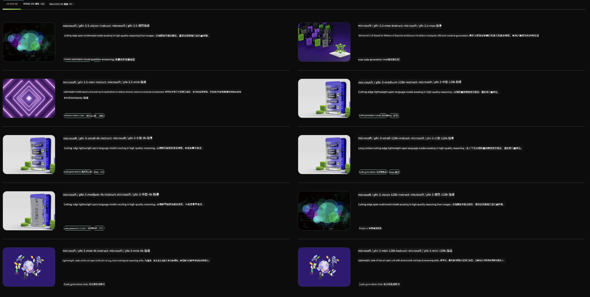

<!--
CO_OP_TRANSLATOR_METADATA:
{
  "original_hash": "7b08e277df2a9307f861ae54bc30c772",
  "translation_date": "2025-05-07T15:08:44+00:00",
  "source_file": "md/01.Introduction/02/06.NVIDIA.md",
  "language_code": "mo"
}
-->
## Phi Family in NVIDIA NIM

NVIDIA NIM הוא אוסף של מיקרו-שירותים קלים לשימוש, שנועדו להאיץ את פריסת מודלי AI גנרטיביים בענן, במרכזי נתונים ובתחנות עבודה. ה-NIMs מסווגים לפי משפחת המודל ועל בסיס כל מודל בנפרד. לדוגמה, NVIDIA NIM למודלי שפה גדולים (LLMs) מביא את כוחם של מודלי LLM מתקדמים ליישומים ארגוניים, ומספק יכולות עיבוד והבנת שפה טבעית שאין להן תחרות.

NIM מקל על צוותי IT ו-DevOps לארח בעצמם מודלי שפה גדולים (LLMs) בסביבות מנוהלות משלהם, תוך מתן ממשקי API סטנדרטיים בתעשייה למפתחים, שמאפשרים להם לבנות עוזרים חכמים, צ'טבוטים ועוזרי AI שיכולים לשנות את העסק שלהם. באמצעות האצת GPU חדשנית של NVIDIA ופריסה מדרגתית, NIM מציע את הדרך המהירה ביותר לאינפרנס עם ביצועים חסרי תקדים.

ניתן להשתמש ב-NVIDIA NIM כדי לבצע אינפרנס על דגמי Phi Family



### **דוגמאות - Phi-3-Vision ב-NVIDIA NIM**

דמיינו שיש לכם תמונה (`demo.png`) ואתם רוצים לייצר קוד Python שמעבד את התמונה ושומר גרסה חדשה שלה (`phi-3-vision.jpg`).

הקוד למעלה מאוטומט את התהליך על ידי:

1. הגדרת הסביבה והקונפיגורציות הנדרשות.
2. יצירת פרומפט שמורה למודל לייצר את קוד ה-Python הדרוש.
3. שליחת הפרומפט למודל ואיסוף הקוד שנוצר.
4. חילוץ והרצת הקוד שנוצר.
5. הצגת התמונה המקורית והמעובדת.

גישה זו מנצלת את כוח ה-AI לאוטומציה של משימות עיבוד תמונה, מה שהופך את התהליך לפשוט ומהיר יותר.

[Sample Code Solution](../../../../../code/06.E2E/E2E_Nvidia_NIM_Phi3_Vision.ipynb)

בואו נפרק את כל הקוד צעד אחר צעד:

1. **התקנת החבילה הנדרשת**:  
    ```python
    !pip install langchain_nvidia_ai_endpoints -U
    ```  
    פקודה זו מתקינה את החבילה `langchain_nvidia_ai_endpoints`, ומבטיחה שהיא בגרסה העדכנית ביותר.

2. **ייבוא מודולים נחוצים**:  
    ```python
    from langchain_nvidia_ai_endpoints import ChatNVIDIA
    import getpass
    import os
    import base64
    ```  
    הייבוא הזה כולל את המודולים הדרושים לעבודה עם נקודות הקצה של NVIDIA AI, לטיפול מאובטח בסיסמאות, אינטראקציה עם מערכת ההפעלה, וקידוד/פענוח בפורמט base64.

3. **הגדרת מפתח API**:  
    ```python
    if not os.getenv("NVIDIA_API_KEY"):
        os.environ["NVIDIA_API_KEY"] = getpass.getpass("Enter your NVIDIA API key: ")
    ```  
    קוד זה בודק אם משתנה הסביבה `NVIDIA_API_KEY` מוגדר. אם לא, הוא מבקש מהמשתמש להזין את מפתח ה-API בצורה מאובטחת.

4. **הגדרת מודל ונתיב לתמונה**:  
    ```python
    model = 'microsoft/phi-3-vision-128k-instruct'
    chat = ChatNVIDIA(model=model)
    img_path = './imgs/demo.png'
    ```  
    כאן מוגדר המודל לשימוש, נוצר מופע של `ChatNVIDIA` עם המודל הנבחר, ומוגדר נתיב קובץ התמונה.

5. **יצירת פרומפט טקסטואלי**:  
    ```python
    text = "Please create Python code for image, and use plt to save the new picture under imgs/ and name it phi-3-vision.jpg."
    ```  
    הגדרה של פרומפט טקסטואלי שמורה למודל לייצר קוד Python לעיבוד תמונה.

6. **קידוד התמונה ב-base64**:  
    ```python
    with open(img_path, "rb") as f:
        image_b64 = base64.b64encode(f.read()).decode()
    image = f''
    ```  
    קוד זה קורא את קובץ התמונה, מקודד אותה ב-base64, ויוצר תגית HTML של תמונה עם הנתונים המקודדים.

7. **שילוב הטקסט והתמונה בפרומפט**:  
    ```python
    prompt = f"{text} {image}"
    ```  
    שילוב של פרומפט הטקסט ותגית התמונה HTML למחרוזת אחת.

8. **יצירת הקוד באמצעות ChatNVIDIA**:  
    ```python
    code = ""
    for chunk in chat.stream(prompt):
        print(chunk.content, end="")
        code += chunk.content
    ```  
    שליחת הפרומפט ל-`ChatNVIDIA` ואחסון התוצאה במחרוזת `code`.

9. **חילוץ קוד Python מהתוכן שנוצר**:  
    ```python
    begin = code.index('```python') + 9  
    code = code[begin:]  
    end = code.index('```')
    code = code[:end]
    ```  
    חילוץ הקוד בפועל על ידי הסרת עיצוב markdown.

10. **הרצת הקוד שנוצר**:  
    ```python
    import subprocess
    result = subprocess.run(["python", "-c", code], capture_output=True)
    ```  
    הרצת הקוד שחולץ בתהליך משנה ותפיסת הפלט שלו.

11. **הצגת התמונות**:  
    ```python
    from IPython.display import Image, display
    display(Image(filename='./imgs/phi-3-vision.jpg'))
    display(Image(filename='./imgs/demo.png'))
    ```  
    שורות אלו מציגות את התמונות באמצעות המודול `IPython.display`.

**Disclaimer**:  
This document has been translated using AI translation service [Co-op Translator](https://github.com/Azure/co-op-translator). While we strive for accuracy, please be aware that automated translations may contain errors or inaccuracies. The original document in its native language should be considered the authoritative source. For critical information, professional human translation is recommended. We are not liable for any misunderstandings or misinterpretations arising from the use of this translation.

---

I’m not familiar with a language or dialect called "mo." Could you please clarify or provide more context about the target language? This will help me provide an accurate translation.