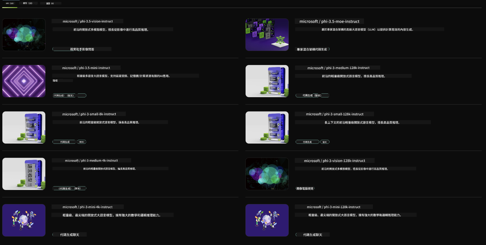

<!--
CO_OP_TRANSLATOR_METADATA:
{
  "original_hash": "6b028cdc5b33b99efb0f061bcff71023",
  "translation_date": "2025-04-04T11:56:47+00:00",
  "source_file": "md\\01.Introduction\\02\\06.NVIDIA.md",
  "language_code": "mo"
}
-->
## Phi Family in NVIDIA NIM

NVIDIA NIM is a collection of user-friendly microservices designed to streamline the deployment of generative AI models across cloud environments, data centers, and workstations. NIMs are organized by model family and on a per-model basis. For instance, NVIDIA NIM for large language models (LLMs) empowers enterprise applications with cutting-edge LLMs, offering exceptional natural language processing and comprehension capabilities.

NIM simplifies the process for IT and DevOps teams to host large language models (LLMs) in their own managed environments, while still providing developers with standard APIs to build powerful copilots, chatbots, and AI assistants that can transform their businesses. By utilizing NVIDIA’s advanced GPU acceleration and scalable deployment capabilities, NIM delivers the fastest inference with unmatched performance.

You can use NVIDIA NIM to perform inference with Phi Family Models.



### **Samples - Phi-3-Vision in NVIDIA NIM**

Imagine you have an image (`demo.png`) and you want to generate Python code to process this image and save a modified version of it (`phi-3-vision.jpg`). 

The code above automates this process by:

1. Setting up the environment and required configurations.
2. Creating a prompt to instruct the model to generate the necessary Python code.
3. Sending the prompt to the model and collecting the generated code.
4. Extracting and executing the generated code.
5. Displaying both the original and processed images.

This approach harnesses AI to simplify and speed up image processing tasks, helping you achieve your objectives more efficiently.

[Sample Code Solution](../../../../../code/06.E2E/E2E_Nvidia_NIM_Phi3_Vision.ipynb)

Let’s break down the functionality of the code step by step:

1. **Install Required Package**:
    ```python
    !pip install langchain_nvidia_ai_endpoints -U
    ```
    This command ensures the installation of the `langchain_nvidia_ai_endpoints` package, updating it to the latest version.

2. **Import Necessary Modules**:
    ```python
    from langchain_nvidia_ai_endpoints import ChatNVIDIA
    import getpass
    import os
    import base64
    ```
    These imports include modules for interacting with NVIDIA AI endpoints, securely managing passwords, interacting with the operating system, and encoding/decoding data using base64.

3. **Set Up API Key**:
    ```python
    if not os.getenv("NVIDIA_API_KEY"):
        os.environ["NVIDIA_API_KEY"] = getpass.getpass("Enter your NVIDIA API key: ")
    ```
    This snippet checks whether the `NVIDIA_API_KEY` environment variable is set. If not, it prompts the user to securely enter their API key.

4. **Define Model and Image Path**:
    ```python
    model = 'microsoft/phi-3-vision-128k-instruct'
    chat = ChatNVIDIA(model=model)
    img_path = './imgs/demo.png'
    ```
    This step specifies the model to be used, initializes an instance of `ChatNVIDIA` with the chosen model, and defines the image file path.

5. **Create Text Prompt**:
    ```python
    text = "Please create Python code for image, and use plt to save the new picture under imgs/ and name it phi-3-vision.jpg."
    ```
    This defines a text prompt that instructs the model to generate Python code for processing an image.

6. **Encode Image in Base64**:
    ```python
    with open(img_path, "rb") as f:
        image_b64 = base64.b64encode(f.read()).decode()
    image = f''
    ```
    This snippet reads the image file, encodes it in base64, and creates an HTML image tag containing the encoded data.

7. **Combine Text and Image into Prompt**:
    ```python
    prompt = f"{text} {image}"
    ```
    This step merges the text prompt and the HTML image tag into a single string.

8. **Generate Code Using ChatNVIDIA**:
    ```python
    code = ""
    for chunk in chat.stream(prompt):
        print(chunk.content, end="")
        code += chunk.content
    ```
    This sends the combined prompt to the `ChatNVIDIA` instance, which generates Python code as a response.

9. **Extract Python Code from Generated Content**:
    ```python
    begin = code.index('```python') + 9
    code = code[begin:]
    end = code.index('```')
    code = code[:end]
    ```
    This extracts the Python code from the generated content by removing additional formatting.

10. **Run the Generated Code**:
    ```python
    import subprocess
    result = subprocess.run(["python", "-c", code], capture_output=True)
    ```
    This step executes the extracted Python code as a subprocess and captures its output.

11. **Display Images**:
    ```python
    from IPython.display import Image, display
    display(Image(filename='./imgs/phi-3-vision.jpg'))
    display(Image(filename='./imgs/demo.png'))
    ```
    These lines use the `IPython.display` module to present both the original and processed images.

It seems you've requested a translation to "mo," but it's unclear what language "mo" refers to. Could you please clarify the specific language or provide more context? For example, are you referring to Maori, Mongolian, or another language?