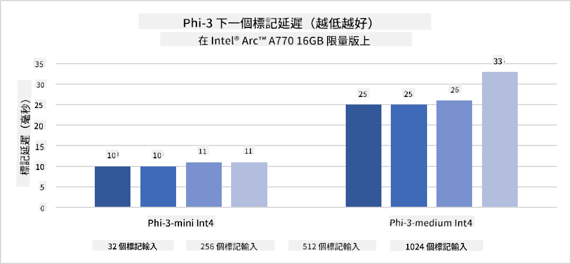
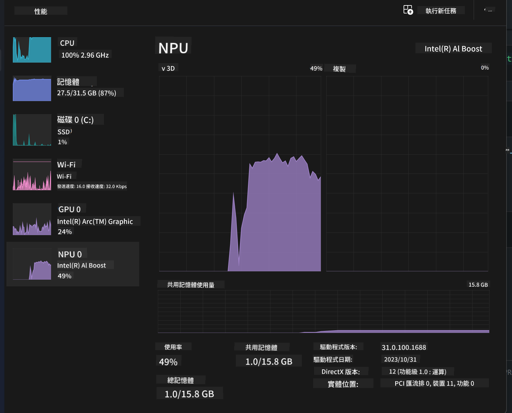
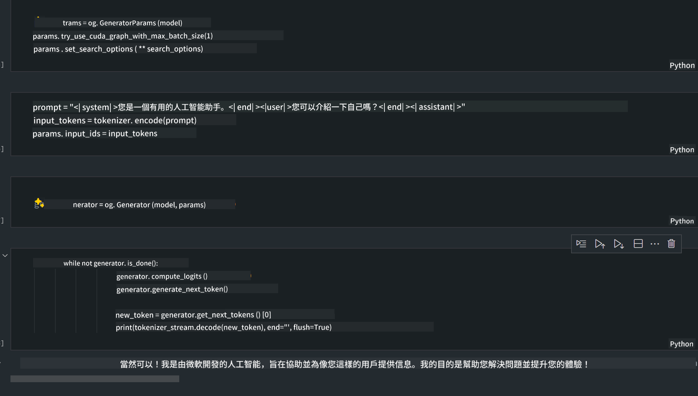
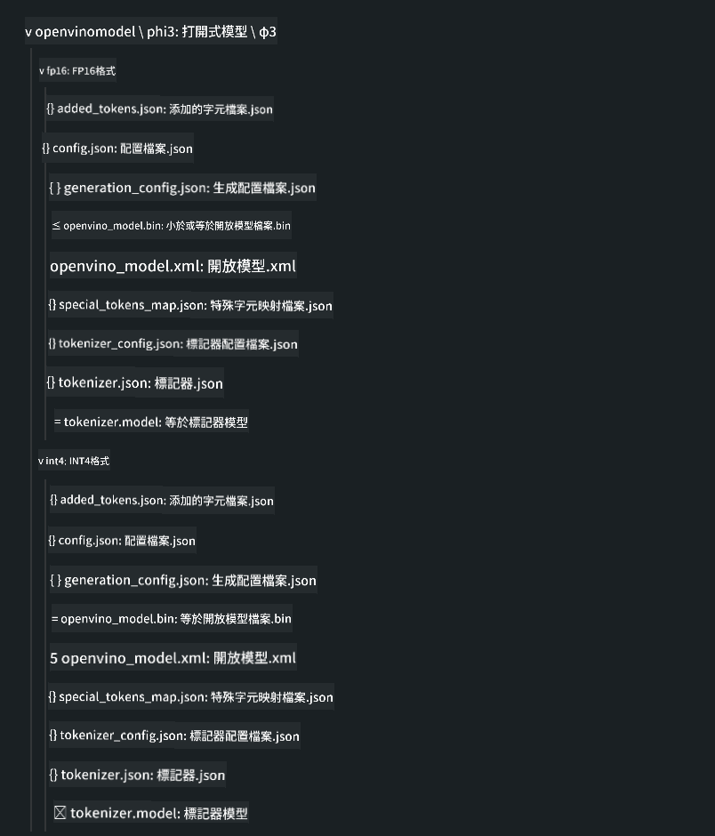
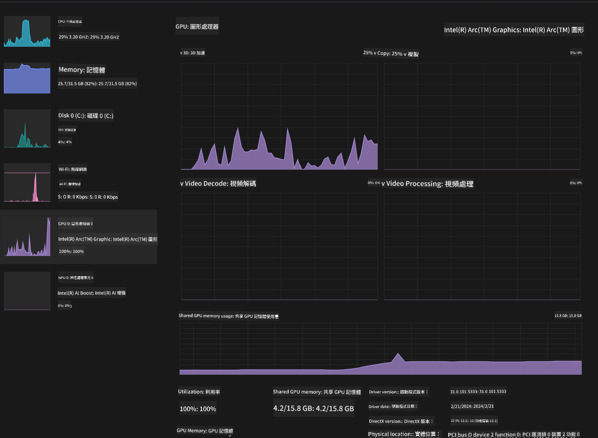

<!--
CO_OP_TRANSLATOR_METADATA:
{
  "original_hash": "5ca6ea8da7aa1335ef287124462b2833",
  "translation_date": "2025-04-04T11:57:48+00:00",
  "source_file": "md\\01.Introduction\\03\\AIPC_Inference.md",
  "language_code": "mo"
}
-->
# **Inference Phi-3 in AI PC**

Faʻatasi ai ma le alualu i luma o le generative AI ma le fa'aleleia atili o masini i luga o masini edge, o lo'o mafai nei ona tu'ufa'atasia le tele o faʻataʻitaʻiga AI i luga o masini BYOD (Bring Your Own Device) a tagata faʻaoga. O AI PCs o se tasi lea o nei fa'ata'ita'iga. Amata mai le 2024, ua galulue fa'atasi Intel, AMD, ma Qualcomm ma kamupani gaosi PC e fa'alauiloa AI PCs e mafai ai ona fa'atino faʻataʻitaʻiga generative AI i luga o masini i le lotoifale e ala i suiga i meafaigaluega. I lenei talanoaga, o le a tatou taulaʻi atu i Intel AI PCs ma suʻesuʻe pe faʻafefea ona faʻatino le Phi-3 i luga o le Intel AI PC.

### O le a le NPU

O le NPU (Neural Processing Unit) o se masini faʻapitoa poʻo se iunite i luga o le SoC e sili ona fuafuaina mo le faʻavaveina o galuega tau neural network ma galuega AI. E ese mai i CPUs ma GPUs lautele, o NPUs e fa'alelei mo le fa'ata'ita'iga fa'amaumauga fa'atasi, lea e avea ai i latou ma tagata sili ona lelei i le fa'agaioia o fa'amaumauga tele e pei o vitio ma ata, ma le fa'agaioia o fa'amaumauga mo neural networks. E matua talafeagai lava mo galuega tau AI, e pei o le iloaina o le tautalaga, fa'aitiitia o tua i vala'au vitio, ma fa'agaioiga ata po'o vitio e pei o le su'esu'eina o mea.

## NPU vs GPU

E ui o le tele o galuega AI ma le aʻoaʻoina o masini e faʻatino i luga o GPUs, e iai le eseesega taua i le va o GPUs ma NPUs.  
E taʻutaʻua GPUs mo lo latou mafai i le faʻagasologa fa'atasi, ae le o GPUs uma e tutusa lelei i tua atu o le faʻagasologa o ata. Ae o NPUs, e fa'apitoa lava mo fa'atatauga faigata e aofia ai galuega neural network, lea e sili ona aoga mo galuega tau AI.

I se aotelega, o NPUs o "matai o le matematika" e fa'avavevave galuega fa'amatematika mo AI, ma o lo'o avea ma vaega taua i le vaitau fou o AI PCs!

***O lenei faʻataʻitaʻiga e faʻavae i luga o le fou a Intel Core Ultra Processor***

## **1. Fa'aoga le NPU e fa'agaioi ai le Phi-3 model**

O le Intel® NPU device o se fa'avavevave mo AI inference lea e tu'ufa'atasia i CPUs a Intel client, amata mai le Intel® Core™ Ultra augatupulaga o CPUs (sa lauiloa muamua o Meteor Lake). E mafai ai ona fa'atino galuega neural network i se auala e sili ona fa'asaoina le malosi.




**Intel NPU Acceleration Library**

O le Intel NPU Acceleration Library [https://github.com/intel/intel-npu-acceleration-library](https://github.com/intel/intel-npu-acceleration-library) o se faletusi Python ua fuafuaina e fa'ateleina le lelei o au talosaga e ala i le fa'aogaina o le malosi o le Intel Neural Processing Unit (NPU) mo fa'atatauga maualuga i meafaigaluega e fetaui.

Fa'ata'ita'iga o le Phi-3-mini i luga o AI PC e fa'aaogaina ai Intel® Core™ Ultra processors.


Fa'apipi'i le faletusi Python i le pip

```bash

   pip install intel-npu-acceleration-library

```

***Manatua*** O lo'o fa'atino pea le galuega i le poloketi, ae o le faʻataʻitaʻiga faʻasino ua matua maeʻa lava.

### **Fa'agaioi le Phi-3 i le Intel NPU Acceleration Library**

I le fa'aogaina o le fa'avavevave a le Intel NPU, o lenei faletusi e le afaina ai le faiga masani o le encoding. E tatau lava ona e fa'aogaina lenei faletusi e fa'aitiiti ai le faʻataʻitaʻiga muamua o le Phi-3, e pei o FP16, INT8, INT4, e pei o

```python
from transformers import AutoTokenizer, pipeline,TextStreamer
from intel_npu_acceleration_library import NPUModelForCausalLM, int4
from intel_npu_acceleration_library.compiler import CompilerConfig
import warnings

model_id = "microsoft/Phi-3-mini-4k-instruct"

compiler_conf = CompilerConfig(dtype=int4)
model = NPUModelForCausalLM.from_pretrained(
    model_id, use_cache=True, config=compiler_conf, attn_implementation="sdpa"
).eval()

tokenizer = AutoTokenizer.from_pretrained(model_id)

text_streamer = TextStreamer(tokenizer, skip_prompt=True)
```

A maeʻa le faʻaitiitiga, faʻaauau le faiga e valaʻau ai le NPU e faʻatino le Phi-3 model.

```python
generation_args = {
   "max_new_tokens": 1024,
   "return_full_text": False,
   "temperature": 0.3,
   "do_sample": False,
   "streamer": text_streamer,
}

pipe = pipeline(
   "text-generation",
   model=model,
   tokenizer=tokenizer,
)

query = "<|system|>You are a helpful AI assistant.<|end|><|user|>Can you introduce yourself?<|end|><|assistant|>"

with warnings.catch_warnings():
    warnings.simplefilter("ignore")
    pipe(query, **generation_args)
```

A fa'agaioi le code, e mafai ona tatou va'ai i le tulaga o le NPU i le taimi moni e ala i le Task Manager.



***Fa'ata'ita'iga*** : [AIPC_NPU_DEMO.ipynb](../../../../../code/03.Inference/AIPC/AIPC_NPU_DEMO.ipynb)

## **2. Fa'aoga DirectML + ONNX Runtime e fa'agaioi ai le Phi-3 Model**

### **O le a le DirectML**

[DirectML](https://github.com/microsoft/DirectML) o se faletusi maualuga-fa'atinoga, fa'avavevaveina masini e fa'avae i luga o DirectX 12 mo galuega tau masini aʻoaʻoina. E maua ai le GPU acceleration mo galuega masani o le aʻoaʻoina o masini i luga o masini ma aveta'avale lagolago, e aofia ai GPUs uma e mafai ona fa'aaogaina DirectX 12 mai tagata gaosi e pei o AMD, Intel, NVIDIA, ma Qualcomm.

Pe a fa'aaogaina na'o ia, o le DirectML API o se faletusi maualalo i luga o le DirectX 12 ma e talafeagai mo talosaga maualuga-fa'atinoga, maualalo-leai taimi, e pei o fa'avae, ta'aloga, ma isi talosaga i le taimi moni. O le seamless interoperability a DirectML ma Direct3D 12 faʻapea foʻi ma lona maualalo o le faʻaogaina ma le faʻatuatuaina i luga o meafaigaluega e avea ai ma filifiliga lelei mo le faʻavavevaveina o le aʻoaʻoina o masini pe a manaʻomia le maualuga o le faʻatinoga ma le faʻatuatuaina o taunuuga i luga o meafaigaluega eseese e taua.

***Manatua*** : O le DirectML fou ua uma ona lagolagoina le NPU (https://devblogs.microsoft.com/directx/introducing-neural-processor-unit-npu-support-in-directml-developer-preview/)

###  DirectML ma CUDA i tulaga o latou gafatia ma fa'atinoga:

**DirectML** o se faletusi aʻoaʻo masini na atiaʻe e Microsoft. E fuafuaina e faʻavavevave galuega tau masini aʻoaʻo i luga o masini Windows, e aofia ai desktops, laptops, ma masini edge.  
- DX12-Based: DirectML e fausia i luga o le DirectX 12 (DX12), lea e maua ai le lagolago lautele i GPUs, e aofia ai NVIDIA ma AMD GPUs.  
- Lagolago Lautele: Ona o le fa'aogaina o DX12, e mafai ona galulue DirectML ma so'o se GPU e lagolagoina DX12, e o'o lava i GPUs tu'ufa'atasia.  
- Fa'agaioiga Ata: E fa'agaoioi ata ma isi fa'amaumauga e fa'aaoga ai neural networks, lea e talafeagai mo galuega e pei o le iloa o ata, su'esu'e mea, ma isi.  
- Faigofie o Fa'atulagaga: O le fa'atulagaina o DirectML e faigofie, ma e le mana'omia ni SDK po'o faletusi fa'apitoa mai tagata gaosi GPU.  
- Fa'atinoga: I nisi tulaga, e lelei le fa'atinoga o DirectML ma e mafai ona sili atu le saoasaoa nai lo CUDA, aemaise lava mo nisi galuega.  
- Tapula'a: Peita'i, o lo'o i ai tulaga e mafai ai ona fa'agesegese DirectML, aemaise lava mo float16 ma lapopo'a fa'aputuga.

**CUDA** o le NVIDIA's parallel computing platform ma programming model. E mafai ai e le au atiaʻe ona faʻaaogaina le malosi o NVIDIA GPUs mo le faʻamoemoega lautele o le faʻagasologa, e aofia ai le aʻoaʻoina o masini ma faʻataʻitaʻiga faʻasaienisi.  
- NVIDIA-Specific: CUDA e feso'ota'i lelei ma NVIDIA GPUs ma ua fuafuaina fa'apitoa mo i latou.  
- Fa'alelei Maualuga: E maua ai le fa'atinoga lelei mo galuega fa'agaioiga GPU, aemaise lava pe a fa'aaogaina NVIDIA GPUs.  
- Lautele Fa'aoga: Tele fa'avae ma faletusi mo le aʻoaʻoina o masini (e pei o TensorFlow ma PyTorch) e lagolagoina CUDA.  
- Fa'alelei: E mafai e atia'e ona fa'alelei fa'atonuga CUDA mo galuega fa'apitoa, lea e mafai ona o'o atu ai i le fa'atinoga sili ona lelei.  
- Tapula'a: Ae peita'i, o le fa'alagolago o CUDA i meafaigaluega NVIDIA e mafai ona fa'aitiitia pe afai e te mana'o i le fetaui lautele i GPUs eseese.  

### Filifiliga i le va o DirectML ma CUDA

O le filifiliga i le va o DirectML ma CUDA e fa'alagolago i lau fa'aoga fa'apitoa, masini o lo'o avanoa, ma mea e te fiafia i ai.  
Afai o lo'o e su'eina se fetaui lautele ma le faigofie o le fa'atulagaina, e mafai ona avea DirectML ma filifiliga lelei. Ae peita'i, afai e iai sau NVIDIA GPUs ma e mana'omia le fa'atinoga sili ona lelei, CUDA o lo'o tumau pea o se filifiliga malosi. I se aotelega, o lo'o i ai malosiaga ma vaivaiga o DirectML ma CUDA, o lea ia mafaufau i ou mana'oga ma masini o lo'o avanoa pe a faia se filifiliga.  

### **Generative AI ma ONNX Runtime**

I le vaitaimi o le AI, o le mafai ona feavea'i o faʻataʻitaʻiga AI e taua tele. E mafai e ONNX Runtime ona faigofie ona tuʻuina atu faʻataʻitaʻiga ua aʻoaʻoina i masini eseese. E le mana'omia e atia'e ona taula'i atu i le fa'avae o le fa'atinoga ma fa'aoga se API tu'ufa'atasi e fa'amae'a ai le fa'atinoga o faʻataʻitaʻiga. I le vaitaimi o generative AI, ua faia foi e ONNX Runtime le faʻaleleia o le code (https://onnxruntime.ai/docs/genai/). E ala i le fa'aleleia o le ONNX Runtime, e mafai ona fa'ata'ita'iina le faʻataʻitaʻiga generative AI ua faʻaitiitia i terminals eseese. I le Generative AI ma ONNX Runtime, e mafai ona e faia le fa'atinoga o le AI model API e ala i Python, C#, C / C++. Ma, o le fa'atinoga i luga o le iPhone e mafai ona fa'aogaina le Generative AI ma le ONNX Runtime API a le C++.  

[Fa'ata'ita'iga Code](https://github.com/Azure-Samples/Phi-3MiniSamples/tree/main/onnx)

***compile generative AI with ONNX Runtime library***

```bash

winget install --id=Kitware.CMake  -e

git clone https://github.com/microsoft/onnxruntime.git

cd .\onnxruntime\

./build.bat --build_shared_lib --skip_tests --parallel --use_dml --config Release

cd ../

git clone https://github.com/microsoft/onnxruntime-genai.git

cd .\onnxruntime-genai\

mkdir ort

cd ort

mkdir include

mkdir lib

copy ..\onnxruntime\include\onnxruntime\core\providers\dml\dml_provider_factory.h ort\include

copy ..\onnxruntime\include\onnxruntime\core\session\onnxruntime_c_api.h ort\include

copy ..\onnxruntime\build\Windows\Release\Release\*.dll ort\lib

copy ..\onnxruntime\build\Windows\Release\Release\onnxruntime.lib ort\lib

python build.py --use_dml


```

**Fa'apipi'i le faletusi**

```bash

pip install .\onnxruntime_genai_directml-0.3.0.dev0-cp310-cp310-win_amd64.whl

```

O le i'uga o le fa'agaioiga o lo'o i lalo.



***Fa'ata'ita'iga*** : [AIPC_DirectML_DEMO.ipynb](../../../../../code/03.Inference/AIPC/AIPC_DirectML_DEMO.ipynb)

## **3. Fa'aoga Intel OpenVino e fa'agaioi ai le Phi-3 Model**

### **O le a le OpenVINO**

[OpenVINO](https://github.com/openvinotoolkit/openvino) o se meafaigaluega tatala mo le faʻaleleia ma le faʻatinoina o faʻataʻitaʻiga loloto o aʻoaʻoga. E maua ai le faʻatinoga faʻaleleia mo faʻataʻitaʻiga mo vaʻaiga, leo, ma gagana mai fa'avae lauiloa e pei o TensorFlow, PyTorch, ma isi. Amata i le OpenVINO. E mafai fo'i ona fa'aaoga OpenVINO fa'atasi ma CPU ma GPU e fa'agaioi ai le Phi-3 model.

***Manatua***: I le taimi nei, e le lagolagoina e OpenVINO le NPU.

### **Fa'apipi'i le OpenVINO Library**

```bash

 pip install git+https://github.com/huggingface/optimum-intel.git

 pip install git+https://github.com/openvinotoolkit/nncf.git

 pip install openvino-nightly

```

### **Fa'agaioi le Phi-3 ma OpenVINO**

E pei o le NPU, e fa'amae'a e OpenVINO le vala'auina o faʻataʻitaʻiga generative AI e ala i le fa'agaioia o faʻataʻitaʻiga ua faʻaitiitia. E tatau ona tatou faʻaitiitia le faʻataʻitaʻiga Phi-3 muamua ma maeʻa le faʻaitiitiga faʻataʻitaʻiga i luga o le laina faʻatonu e ala i le optimum-cli.

**INT4**

```bash

optimum-cli export openvino --model "microsoft/Phi-3-mini-4k-instruct" --task text-generation-with-past --weight-format int4 --group-size 128 --ratio 0.6  --sym  --trust-remote-code ./openvinomodel/phi3/int4

```

**FP16**

```bash

optimum-cli export openvino --model "microsoft/Phi-3-mini-4k-instruct" --task text-generation-with-past --weight-format fp16 --trust-remote-code ./openvinomodel/phi3/fp16

```

O le fa'avae ua suia e foliga mai lenei.



Utaina ala o faʻataʻitaʻiga (model_dir), faʻatulagaga fesoʻotaʻi (ov_config = {"PERFORMANCE_HINT": "LATENCY", "NUM_STREAMS": "1", "CACHE_DIR": ""}), ma masini faʻavavevave masini (GPU.0) e ala i le OVModelForCausalLM.

```python

ov_model = OVModelForCausalLM.from_pretrained(
     model_dir,
     device='GPU.0',
     ov_config=ov_config,
     config=AutoConfig.from_pretrained(model_dir, trust_remote_code=True),
     trust_remote_code=True,
)

```

A fa'agaioi le code, e mafai ona tatou va'ai i le tulaga o le GPU i le taimi moni e ala i le Task Manager.



***Fa'ata'ita'iga*** : [AIPC_OpenVino_Demo.ipynb](../../../../../code/03.Inference/AIPC/AIPC_OpenVino_Demo.ipynb)

### ***Manatua*** : O auala e tolu o lo'o i luga o lo'o iai a latou lava lelei, ae o lo'o fautuaina e fa'aoga le NPU acceleration mo le fa'atinoga o AI PC.

It seems like you've requested a translation to "mo," but it's unclear what language or context "mo" refers to. Could you clarify the target language or provide additional details? For example, are you referring to Maori, a specific dialect, or something else?