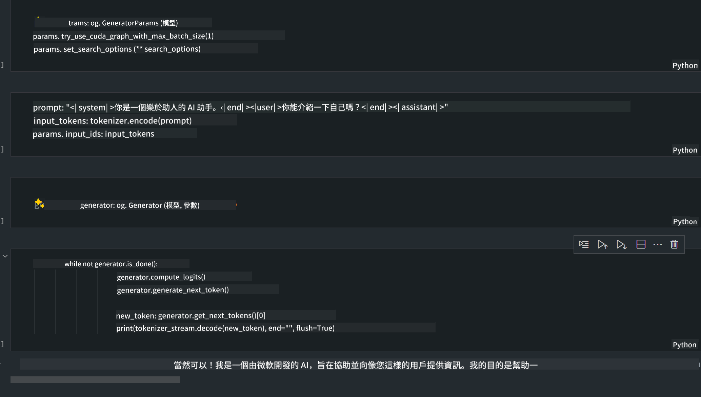

<!--
CO_OP_TRANSLATOR_METADATA:
{
  "original_hash": "e08ce816e23ad813244a09ca34ebb8ac",
  "translation_date": "2025-05-07T14:36:36+00:00",
  "source_file": "md/01.Introduction/03/AIPC_Inference.md",
  "language_code": "mo"
}
-->
# **Inference Phi-3 in AI PC**

With the advancement of generative AI and the improvement in edge device hardware capabilities, more and more generative AI models can now be integrated into users' Bring Your Own Device (BYOD) devices. AI PCs are among these models. Starting in 2024, Intel, AMD, and Qualcomm have partnered with PC manufacturers to launch AI PCs that enable the deployment of localized generative AI models through hardware upgrades. In this discussion, we will focus on Intel AI PCs and explore how to deploy Phi-3 on an Intel AI PC.

### What's NPU

An NPU (Neural Processing Unit) is a specialized processor or processing unit within a larger SoC designed specifically to accelerate neural network operations and AI tasks. Unlike general-purpose CPUs and GPUs, NPUs are optimized for data-driven parallel computing, making them highly efficient at handling large multimedia data like videos and images as well as neural network data. They excel at AI-related tasks such as speech recognition, background blurring during video calls, and photo or video editing processes like object detection.

## NPU vs GPU

Although many AI and machine learning workloads run on GPUs, there is an important difference between GPUs and NPUs. GPUs are known for their parallel computing power, but not all GPUs are equally efficient beyond graphics processing. NPUs, in contrast, are purpose-built for the complex computations involved in neural network operations, making them highly effective for AI workloads.

In short, NPUs are the math experts that supercharge AI computations, playing a key role in the emerging era of AI PCs!

***This example is based on Intel's latest Intel Core Ultra Processor***

## **1. Use NPU to run Phi-3 model**

Intel® NPU device is an AI inference accelerator integrated with Intel client CPUs, starting from Intel® Core™ Ultra generation of CPUs (formerly Meteor Lake). It enables energy-efficient execution of artificial neural network tasks.


**Intel NPU Acceleration Library**

The Intel NPU Acceleration Library [https://github.com/intel/intel-npu-acceleration-library](https://github.com/intel/intel-npu-acceleration-library) is a Python library designed to improve the efficiency of your applications by leveraging the power of the Intel Neural Processing Unit (NPU) for high-speed computations on compatible hardware.

Example of Phi-3-mini on AI PC powered by Intel® Core™ Ultra processors.


Install the Python Library with pip

```bash

   pip install intel-npu-acceleration-library

```

***Note*** The project is still under development, but the reference model is already quite complete.

### **Running Phi-3 with Intel NPU Acceleration Library**

Using Intel NPU acceleration, this library does not change the traditional encoding process. You only need to use this library to quantize the original Phi-3 model, such as FP16, INT8, INT4, for example:

```python
from transformers import AutoTokenizer, pipeline,TextStreamer
from intel_npu_acceleration_library import NPUModelForCausalLM, int4
from intel_npu_acceleration_library.compiler import CompilerConfig
import warnings

model_id = "microsoft/Phi-3-mini-4k-instruct"

compiler_conf = CompilerConfig(dtype=int4)
model = NPUModelForCausalLM.from_pretrained(
    model_id, use_cache=True, config=compiler_conf, attn_implementation="sdpa"
).eval()

tokenizer = AutoTokenizer.from_pretrained(model_id)

text_streamer = TextStreamer(tokenizer, skip_prompt=True)
```

After successful quantization, continue execution to call the NPU to run the Phi-3 model.

```python
generation_args = {
   "max_new_tokens": 1024,
   "return_full_text": False,
   "temperature": 0.3,
   "do_sample": False,
   "streamer": text_streamer,
}

pipe = pipeline(
   "text-generation",
   model=model,
   tokenizer=tokenizer,
)

query = "<|system|>You are a helpful AI assistant.<|end|><|user|>Can you introduce yourself?<|end|><|assistant|>"

with warnings.catch_warnings():
    warnings.simplefilter("ignore")
    pipe(query, **generation_args)
```

When running the code, you can monitor the NPU’s activity through Task Manager.


***Samples*** : [AIPC_NPU_DEMO.ipynb](../../../../../code/03.Inference/AIPC/AIPC_NPU_DEMO.ipynb)

## **2. Use DirectML + ONNX Runtime to run Phi-3 Model**

### **What is DirectML**

[DirectML](https://github.com/microsoft/DirectML) is a high-performance, hardware-accelerated DirectX 12 library for machine learning. DirectML provides GPU acceleration for common machine learning tasks across a broad range of supported hardware and drivers, including all DirectX 12-capable GPUs from vendors such as AMD, Intel, NVIDIA, and Qualcomm.

When used standalone, the DirectML API is a low-level DirectX 12 library suitable for high-performance, low-latency applications like frameworks, games, and other real-time applications. The seamless interoperability of DirectML with Direct3D 12, combined with its low overhead and hardware conformance, makes DirectML ideal for accelerating machine learning where both high performance and consistent results across hardware are critical.

***Note*** : The latest DirectML already supports NPU (https://devblogs.microsoft.com/directx/introducing-neural-processor-unit-npu-support-in-directml-developer-preview/)

### DirectML and CUDA in terms of their capabilities and performance:

**DirectML** is a machine learning library developed by Microsoft, designed to accelerate machine learning workloads on Windows devices including desktops, laptops, and edge devices.
- DX12-Based: Built on DirectX 12 (DX12), supporting a wide range of GPUs from vendors like NVIDIA and AMD.
- Broader Support: Because it leverages DX12, DirectML can work with any GPU that supports DX12, including integrated GPUs.
- Image Processing: DirectML processes images and other data using neural networks, suitable for tasks like image recognition and object detection.
- Easy Setup: Setting up DirectML is straightforward and doesn’t require specific SDKs or libraries from GPU vendors.
- Performance: In some cases, DirectML performs well and can outperform CUDA, especially on certain workloads.
- Limitations: However, in some scenarios, DirectML may be slower, particularly with float16 large batch sizes.

**CUDA** is NVIDIA’s parallel computing platform and programming model, enabling developers to harness NVIDIA GPUs for general-purpose computing including machine learning and scientific simulations.
- NVIDIA-Specific: CUDA is tightly integrated with NVIDIA GPUs and designed specifically for them.
- Highly Optimized: It delivers excellent performance for GPU-accelerated tasks, especially on NVIDIA hardware.
- Widely Used: Many machine learning frameworks and libraries (like TensorFlow and PyTorch) support CUDA.
- Customizable: Developers can fine-tune CUDA settings for specific tasks, achieving optimal performance.
- Limitations: CUDA’s dependency on NVIDIA hardware limits compatibility across different GPU brands.

### Choosing Between DirectML and CUDA

Choosing between DirectML and CUDA depends on your use case, available hardware, and preferences. If you want broader compatibility and easy setup, DirectML is a good option. If you have NVIDIA GPUs and need highly optimized performance, CUDA remains a strong choice. Both have their strengths and weaknesses, so consider your requirements and hardware when deciding.

### **Generative AI with ONNX Runtime**

In the AI era, portability of AI models is very important. ONNX Runtime enables easy deployment of trained models across different devices. Developers don’t need to worry about the inference framework and can use a unified API to perform model inference. In generative AI, ONNX Runtime also offers code optimization (https://onnxruntime.ai/docs/genai/). With the optimized ONNX Runtime, quantized generative AI models can run on various devices. You can call the generative AI model API through Python, C#, C/C++. Deployment on iPhone can leverage C++’s Generative AI with ONNX Runtime API.

[Sample Code](https://github.com/Azure-Samples/Phi-3MiniSamples/tree/main/onnx)

***compile generative AI with ONNX Runtime library***

```bash

winget install --id=Kitware.CMake  -e

git clone https://github.com/microsoft/onnxruntime.git

cd .\onnxruntime\

./build.bat --build_shared_lib --skip_tests --parallel --use_dml --config Release

cd ../

git clone https://github.com/microsoft/onnxruntime-genai.git

cd .\onnxruntime-genai\

mkdir ort

cd ort

mkdir include

mkdir lib

copy ..\onnxruntime\include\onnxruntime\core\providers\dml\dml_provider_factory.h ort\include

copy ..\onnxruntime\include\onnxruntime\core\session\onnxruntime_c_api.h ort\include

copy ..\onnxruntime\build\Windows\Release\Release\*.dll ort\lib

copy ..\onnxruntime\build\Windows\Release\Release\onnxruntime.lib ort\lib

python build.py --use_dml


```

**Install library**

```bash

pip install .\onnxruntime_genai_directml-0.3.0.dev0-cp310-cp310-win_amd64.whl

```

This is the running result



***Samples*** : [AIPC_DirectML_DEMO.ipynb](../../../../../code/03.Inference/AIPC/AIPC_DirectML_DEMO.ipynb)

## **3. Use Intel OpenVino to run Phi-3 Model**

### **What is OpenVINO**

[OpenVINO](https://github.com/openvinotoolkit/openvino) is an open-source toolkit for optimizing and deploying deep learning models. It boosts deep learning performance for vision, audio, and language models from popular frameworks like TensorFlow, PyTorch, and more. Get started with OpenVINO. OpenVINO can also be used with CPU and GPU to run the Phi-3 model.

***Note***: Currently, OpenVINO does not support NPU.

### **Install OpenVINO Library**

```bash

 pip install git+https://github.com/huggingface/optimum-intel.git

 pip install git+https://github.com/openvinotoolkit/nncf.git

 pip install openvino-nightly

```

### **Running Phi-3 with OpenVINO**

Like with NPU, OpenVINO runs generative AI models by executing quantized models. First, you need to quantize the Phi-3 model using optimum-cli on the command line.

**INT4**

```bash

optimum-cli export openvino --model "microsoft/Phi-3-mini-4k-instruct" --task text-generation-with-past --weight-format int4 --group-size 128 --ratio 0.6  --sym  --trust-remote-code ./openvinomodel/phi3/int4

```

**FP16**

```bash

optimum-cli export openvino --model "microsoft/Phi-3-mini-4k-instruct" --task text-generation-with-past --weight-format fp16 --trust-remote-code ./openvinomodel/phi3/fp16

```

The converted format looks like this:


Load model paths (model_dir), related configurations (ov_config = {"PERFORMANCE_HINT": "LATENCY", "NUM_STREAMS": "1", "CACHE_DIR": ""}), and hardware-accelerated devices (GPU.0) via OVModelForCausalLM

```python

ov_model = OVModelForCausalLM.from_pretrained(
     model_dir,
     device='GPU.0',
     ov_config=ov_config,
     config=AutoConfig.from_pretrained(model_dir, trust_remote_code=True),
     trust_remote_code=True,
)

```

When running the code, you can check GPU usage through Task Manager.


***Samples*** : [AIPC_OpenVino_Demo.ipynb](../../../../../code/03.Inference/AIPC/AIPC_OpenVino_Demo.ipynb)

### ***Note*** : Each of the above three methods has its own advantages, but it is recommended to use NPU acceleration for AI PC inference.

**Disclaimer**:  
This document has been translated using AI translation service [Co-op Translator](https://github.com/Azure/co-op-translator). While we strive for accuracy, please be aware that automated translations may contain errors or inaccuracies. The original document in its native language should be considered the authoritative source. For critical information, professional human translation is recommended. We are not liable for any misunderstandings or misinterpretations arising from the use of this translation.  

---

(Note: "mo" is not a recognized language code or standard language name. If you meant a specific language or dialect, please clarify so I can provide an accurate translation.)