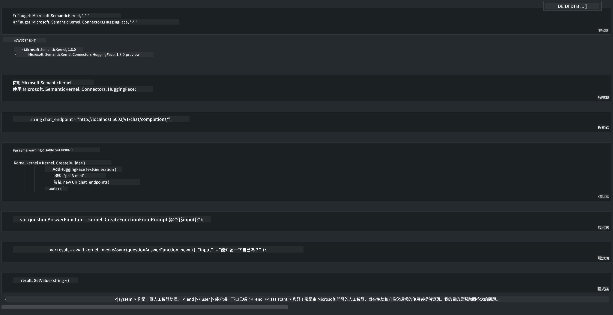

<!--
CO_OP_TRANSLATOR_METADATA:
{
  "original_hash": "12c0d9afaa23861ad5be655fcff4f71d",
  "translation_date": "2025-04-04T12:05:31+00:00",
  "source_file": "md\\01.Introduction\\03\\Local_Server_Inference.md",
  "language_code": "mo"
}
-->
# **Inference Phi-3 da Servidor Local**

Podemos implementar o Phi-3 em um servidor local. Os usuários podem optar pelas soluções [Ollama](https://ollama.com) ou [LM Studio](https://llamaedge.com), ou podem escrever seu próprio código. É possível conectar os serviços locais do Phi-3 através do [Semantic Kernel](https://github.com/microsoft/semantic-kernel?WT.mc_id=aiml-138114-kinfeylo) ou [Langchain](https://www.langchain.com/) para construir aplicações de Copilot.

## **Usar Semantic Kernel para acessar o Phi-3-mini**

Na aplicação Copilot, criamos aplicações utilizando o Semantic Kernel / LangChain. Esse tipo de estrutura de aplicação é geralmente compatível com Azure OpenAI Service / modelos da OpenAI e também pode oferecer suporte a modelos de código aberto no Hugging Face e modelos locais. O que devemos fazer se quisermos usar o Semantic Kernel para acessar o Phi-3-mini? Usando .NET como exemplo, podemos combiná-lo com o Hugging Face Connector no Semantic Kernel. Por padrão, ele pode se conectar ao id do modelo no Hugging Face (na primeira utilização, o modelo será baixado do Hugging Face, o que pode levar um tempo considerável). Também é possível se conectar ao serviço local configurado. Comparando os dois, recomendamos usar o último, pois oferece maior autonomia, especialmente em aplicações empresariais.

Na figura, acessar serviços locais através do Semantic Kernel permite conectar facilmente ao servidor do modelo Phi-3-mini configurado. Aqui está o resultado da execução:

***Código de Exemplo*** https://github.com/kinfey/Phi3MiniSamples/tree/main/semantickernel

It seems like you want the text translated to "mo," but it's unclear what language "mo" refers to. Could you clarify or specify the language you're referring to? For example, are you asking for Maori, Mongolian, or another language?