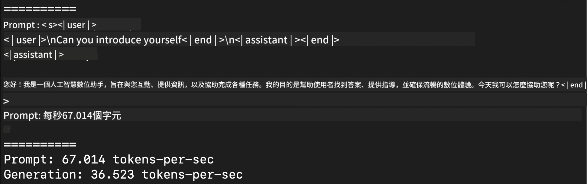
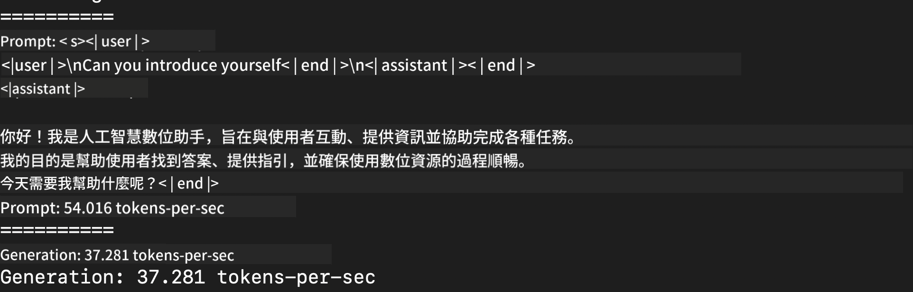
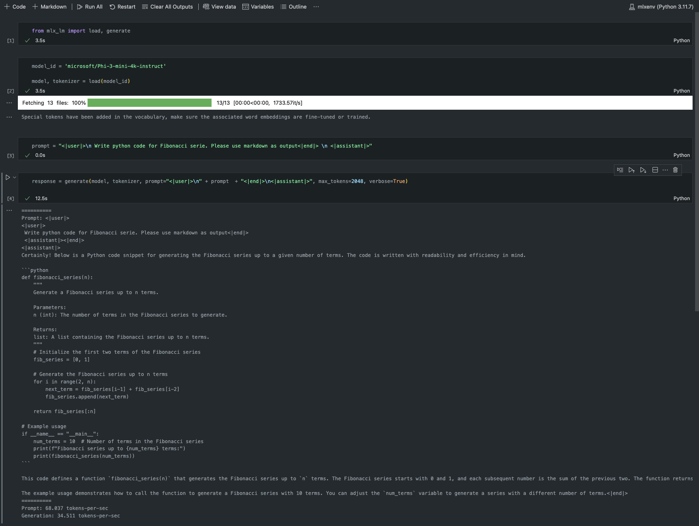

<!--
CO_OP_TRANSLATOR_METADATA:
{
  "original_hash": "700b9a537ce4426de5a7ccfa8e96e581",
  "translation_date": "2025-04-04T12:06:32+00:00",
  "source_file": "md\\01.Introduction\\03\\MLX_Inference.md",
  "language_code": "mo"
}
-->
# **Inference Phi-3 with Apple MLX Framework**

## **What is MLX Framework**

MLX is an advanced framework developed by Apple for machine learning research on Apple silicon devices.

Designed specifically for machine learning researchers, MLX combines user-friendly features with efficient model training and deployment capabilities. Its straightforward design allows researchers to easily extend and enhance the framework, enabling rapid experimentation with new ideas.

Large Language Models (LLMs) can leverage the power of Apple Silicon through MLX, making it convenient to run models locally.

## **Using MLX to inference Phi-3-mini**

### **1. Set up your MLX environment**

1. Python 3.11.x  
2. Install the MLX Library  

```bash

pip install mlx-lm

```

### **2. Running Phi-3-mini in Terminal with MLX**

```bash

python -m mlx_lm.generate --model microsoft/Phi-3-mini-4k-instruct --max-token 2048 --prompt  "<|user|>\nCan you introduce yourself<|end|>\n<|assistant|>"

```

On my setup (Apple M1 Max, 64GB), the result is as follows:



### **3. Quantizing Phi-3-mini with MLX in Terminal**

```bash

python -m mlx_lm.convert --hf-path microsoft/Phi-3-mini-4k-instruct

```

***Note：*** The model can be quantized using mlx_lm.convert, with INT4 as the default quantization format. This example demonstrates how to quantize Phi-3-mini into INT4.

Once quantized, the model will be stored in the default directory `./mlx_model`.

You can test the quantized model with MLX directly from the terminal:

```bash

python -m mlx_lm.generate --model ./mlx_model/ --max-token 2048 --prompt  "<|user|>\nCan you introduce yourself<|end|>\n<|assistant|>"

```

The result is:



### **4. Running Phi-3-mini with MLX in Jupyter Notebook**



***Note:*** For a detailed example, refer to this sample: [click this link](../../../../../code/03.Inference/MLX/MLX_DEMO.ipynb)

## **Resources**

1. Learn about Apple MLX Framework [https://ml-explore.github.io](https://ml-explore.github.io/mlx/build/html/index.html)  

2. Apple MLX GitHub Repo [https://github.com/ml-explore](https://github.com/ml-explore)  

It seems like you want the text translated to "mo," but could you clarify what "mo" refers to? Are you asking for a specific language or abbreviation? For example, are you referring to Māori, Montenegrin, or something else?