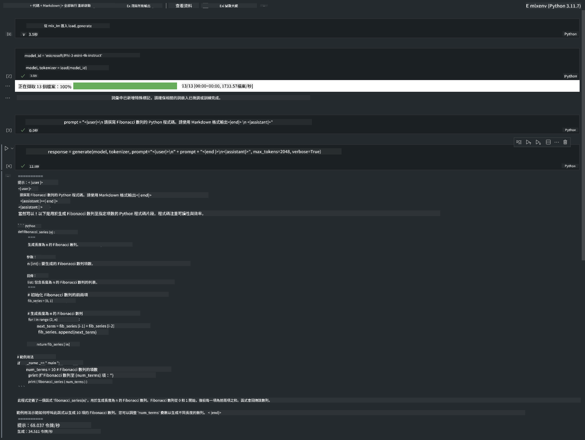

<!--
CO_OP_TRANSLATOR_METADATA:
{
  "original_hash": "dcb656f3d206fc4968e236deec5d4384",
  "translation_date": "2025-05-07T14:37:40+00:00",
  "source_file": "md/01.Introduction/03/MLX_Inference.md",
  "language_code": "mo"
}
-->
# **Inference Phi-3 עם מסגרת Apple MLX**

## **מהי מסגרת MLX**

MLX היא מסגרת מערך למחקר למידת מכונה על שבבי Apple, מבית Apple machine learning research.

MLX עוצבה על ידי חוקרי למידת מכונה עבור חוקרי למידת מכונה. המסגרת מיועדת להיות ידידותית למשתמש, אך עדיין יעילה לאימון והפעלת מודלים. העיצוב של המסגרת עצמה גם פשוט מבחינה קונספטואלית. אנו שואפים להקל על החוקרים להרחיב ולשפר את MLX במטרה לחקור במהירות רעיונות חדשים.

ניתן להאיץ מודלים גדולים (LLMs) במכשירי Apple Silicon דרך MLX, והמודלים יכולים לרוץ מקומית בנוחות רבה.

## **שימוש ב-MLX ל-inference של Phi-3-mini**

### **1. הקמת סביבת MLX**

1. Python 3.11.x  
2. התקנת ספריית MLX


```bash

pip install mlx-lm

```

### **2. הרצת Phi-3-mini בטרמינל עם MLX**


```bash

python -m mlx_lm.generate --model microsoft/Phi-3-mini-4k-instruct --max-token 2048 --prompt  "<|user|>\nCan you introduce yourself<|end|>\n<|assistant|>"

```

התוצאה (הסביבה שלי היא Apple M1 Max, 64GB) היא


### **3. כימות Phi-3-mini עם MLX בטרמינל**


```bash

python -m mlx_lm.convert --hf-path microsoft/Phi-3-mini-4k-instruct

```

***Note：*** ניתן לכמת את המודל דרך mlx_lm.convert, והכימות ברירת המחדל הוא INT4. בדוגמה זו כימות Phi-3-mini ל-INT4

ניתן לכמת את המודל דרך mlx_lm.convert, והכימות ברירת המחדל הוא INT4. בדוגמה זו הכוונה לכמת את Phi-3-mini ל-INT4. לאחר הכימות, המודל יישמר בתיקיית ברירת המחדל ./mlx_model

ניתן לבדוק את המודל המכווץ עם MLX מהטרמינל


```bash

python -m mlx_lm.generate --model ./mlx_model/ --max-token 2048 --prompt  "<|user|>\nCan you introduce yourself<|end|>\n<|assistant|>"

```

התוצאה היא


### **4. הרצת Phi-3-mini עם MLX ב-Jupyter Notebook**




***Note:*** אנא קראו את הדוגמה הזו [click this link](../../../../../code/03.Inference/MLX/MLX_DEMO.ipynb)


## **משאבים**

1. למידה על מסגרת Apple MLX [https://ml-explore.github.io](https://ml-explore.github.io/mlx/build/html/index.html)

2. מאגר GitHub של Apple MLX [https://github.com/ml-explore](https://github.com/ml-explore)

**Disclaimer**:  
This document has been translated using AI translation service [Co-op Translator](https://github.com/Azure/co-op-translator). While we strive for accuracy, please be aware that automated translations may contain errors or inaccuracies. The original document in its native language should be considered the authoritative source. For critical information, professional human translation is recommended. We are not liable for any misunderstandings or misinterpretations arising from the use of this translation.

---

It appears you requested a translation to "mo." Could you please clarify what language or dialect "mo" refers to? This will help me provide an accurate translation.