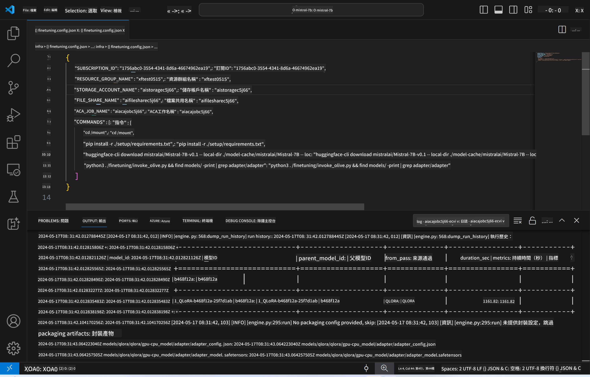
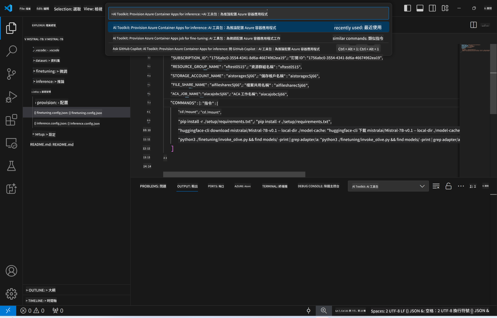
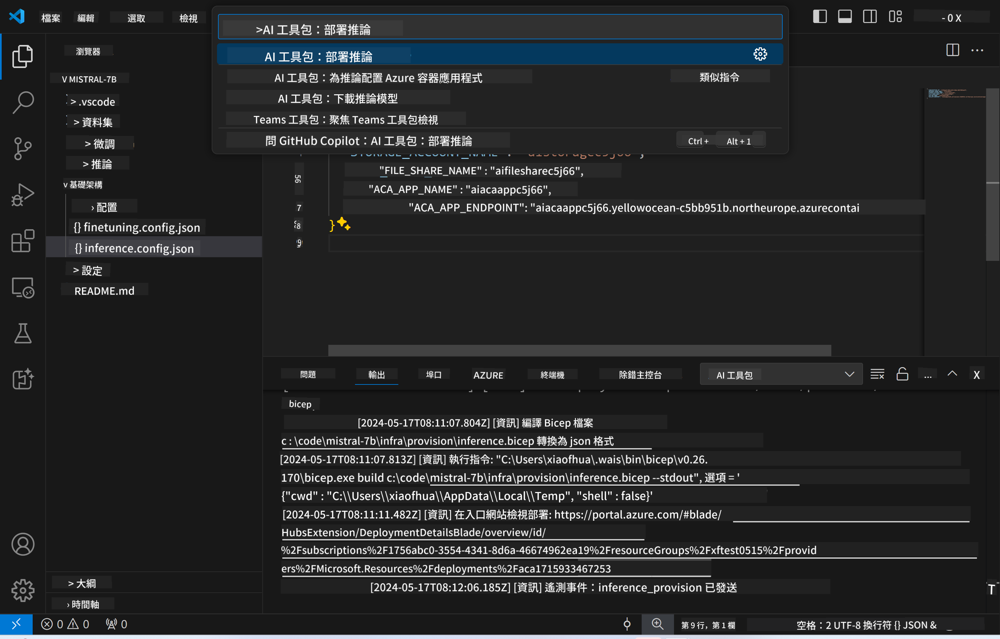
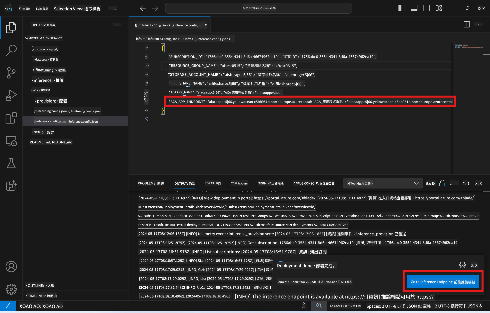

<!--
CO_OP_TRANSLATOR_METADATA:
{
  "original_hash": "a54cd3d65b6963e4e8ce21e143c3ab04",
  "translation_date": "2025-05-07T14:33:01+00:00",
  "source_file": "md/01.Introduction/03/Remote_Interence.md",
  "language_code": "mo"
}
-->
# Remote Inferencing with the fine-tuned model

After the adapters are trained in the remote environment, use a simple Gradio application to interact with the model.



### Provision Azure Resources
You need to set up the Azure Resources for remote inference by executing the `AI Toolkit: Provision Azure Container Apps for inference` from the command palette. During this setup, you will be asked to select your Azure Subscription and resource group.  

   
By default, the subscription and the resource group for inference should match those used for fine-tuning. The inference will use the same Azure Container App Environment and access the model and model adapter stored in Azure Files, which were generated during the fine-tuning step. 

## Using AI Toolkit 

### Deployment for Inference  
If you want to update the inference code or reload the inference model, run the `AI Toolkit: Deploy for inference` command. This will sync your latest code with ACA and restart the replica.  



Once the deployment finishes successfully, the model is ready for evaluation via this endpoint.

### Accessing the Inference API

You can reach the inference API by clicking the "*Go to Inference Endpoint*" button in the VSCode notification. Alternatively, the web API endpoint is available under `ACA_APP_ENDPOINT` in `./infra/inference.config.json` and in the output panel.



> **Note:** The inference endpoint may take a few minutes before it becomes fully operational.

## Inference Components Included in the Template
 
| Folder | Contents |
| ------ |--------- |
| `infra` | Contains all necessary configurations for remote operations. |
| `infra/provision/inference.parameters.json` | Holds parameters for the bicep templates, used for provisioning Azure resources for inference. |
| `infra/provision/inference.bicep` | Contains templates for provisioning Azure resources for inference. |
| `infra/inference.config.json` |The configuration file generated by the `AI Toolkit: Provision Azure Container Apps for inference` command. It serves as input for other remote command palettes. |

### Using AI Toolkit to configure Azure Resource Provision
Set up the [AI Toolkit](https://marketplace.visualstudio.com/items?itemName=ms-windows-ai-studio.windows-ai-studio)

Provision Azure Container Apps for inference using the `./infra/provision/inference.parameters.json` file. Then, run the `AI Toolkit: Provision Azure Container Apps for inference` command from the command palette. This updates any specified resources and creates any that are missing.

For example, if you have an existing Azure container environment, your `./infra/finetuning.parameters.json` should look like this:

```json
{
    "$schema": "https://schema.management.azure.com/schemas/2019-04-01/deploymentParameters.json#",
    "contentVersion": "1.0.0.0",
    "parameters": {
      ...
      "acaEnvironmentName": {
        "value": "<your-aca-env-name>"
      },
      "acaEnvironmentStorageName": {
        "value": null
      },
      ...
    }
  }
```

### Manual Provision  
If you prefer to configure Azure resources manually, you can use the provided bicep files in the `./infra/provision` folder along with the `inference.config.json` file.

For example:

```json
{
  "SUBSCRIPTION_ID": "<your-subscription-id>",
  "RESOURCE_GROUP_NAME": "<your-resource-group-name>",
  "STORAGE_ACCOUNT_NAME": "<your-storage-account-name>",
  "FILE_SHARE_NAME": "<your-file-share-name>",
  "ACA_APP_NAME": "<your-aca-name>",
  "ACA_APP_ENDPOINT": "<your-aca-endpoint>"
}
```

**Disclaimer**:  
This document has been translated using AI translation service [Co-op Translator](https://github.com/Azure/co-op-translator). While we strive for accuracy, please be aware that automated translations may contain errors or inaccuracies. The original document in its native language should be considered the authoritative source. For critical information, professional human translation is recommended. We are not liable for any misunderstandings or misinterpretations arising from the use of this translation.

---

Could you please clarify what language or code "mo" refers to? It is not a standard language code, so I want to ensure I provide the correct translation.