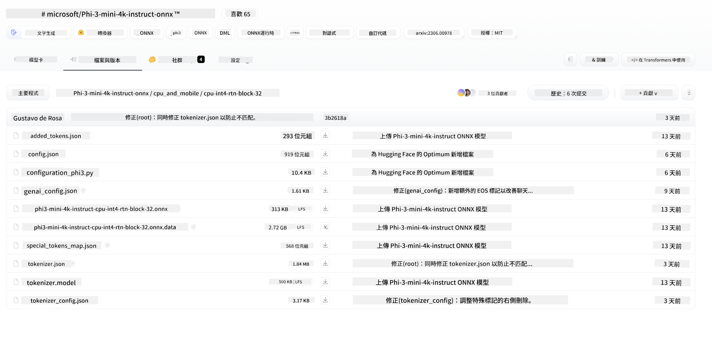

<!--
CO_OP_TRANSLATOR_METADATA:
{
  "original_hash": "82af197df38d25346a98f1f0e84d1698",
  "translation_date": "2025-05-07T14:30:09+00:00",
  "source_file": "md/01.Introduction/03/iOS_Inference.md",
  "language_code": "mo"
}
-->
# **Inference Phi-3 in iOS**

Phi-3-mini هو سلسلة جديدة من النماذج من Microsoft تتيح نشر نماذج اللغة الكبيرة (LLMs) على أجهزة الحافة وأجهزة إنترنت الأشياء. يتوفر Phi-3-mini لنشره على iOS وAndroid وأجهزة الحافة، مما يسمح بنشر الذكاء الاصطناعي التوليدي في بيئات BYOD. المثال التالي يوضح كيفية نشر Phi-3-mini على iOS.

## **1. التحضير**

- **أ.** macOS 14+
- **ب.** Xcode 15+
- **ج.** iOS SDK 17.x (iPhone 14 A16 أو أحدث)
- **د.** تثبيت Python 3.10+ (يوصى باستخدام Conda)
- **هـ.** تثبيت مكتبة Python: `python-flatbuffers`
- **و.** تثبيت CMake

### Semantic Kernel والاستدلال

Semantic Kernel هو إطار عمل لتطبيقات يسمح لك بإنشاء تطبيقات متوافقة مع Azure OpenAI Service، ونماذج OpenAI، وحتى النماذج المحلية. يتيح الوصول إلى الخدمات المحلية عبر Semantic Kernel دمجًا سهلاً مع خادم نموذج Phi-3-mini المستضاف ذاتيًا.

### استدعاء النماذج الكمّية باستخدام Ollama أو LlamaEdge

يفضل العديد من المستخدمين استخدام النماذج الكمّية لتشغيل النماذج محليًا. يتيح [Ollama](https://ollama.com) و[LlamaEdge](https://llamaedge.com) للمستخدمين استدعاء نماذج كمّية مختلفة:

#### **Ollama**

يمكنك تشغيل `ollama run phi3` مباشرة أو تكوينه بدون اتصال. أنشئ ملف Modelfile بمسار ملف `gguf` الخاص بك. هذا مثال على كود لتشغيل نموذج Phi-3-mini الكمّي:

```gguf
FROM {Add your gguf file path}
TEMPLATE \"\"\"<|user|> .Prompt<|end|> <|assistant|>\"\"\"
PARAMETER stop <|end|>
PARAMETER num_ctx 4096
```

#### **LlamaEdge**

إذا كنت ترغب في استخدام `gguf` في كل من السحابة وأجهزة الحافة في نفس الوقت، فإن LlamaEdge خيار ممتاز.

## **2. تجميع ONNX Runtime لـ iOS**

```bash

git clone https://github.com/microsoft/onnxruntime.git

cd onnxruntime

./build.sh --build_shared_lib --ios --skip_tests --parallel --build_dir ./build_ios --ios --apple_sysroot iphoneos --osx_arch arm64 --apple_deploy_target 17.5 --cmake_generator Xcode --config Release

cd ../

```

### **ملاحظة**

- **أ.** قبل التجميع، تأكد من أن Xcode مضبوط بشكل صحيح واضبطه كمجلد المطور النشط في الطرفية:

    ```bash
    sudo xcode-select -switch /Applications/Xcode.app/Contents/Developer
    ```

- **ب.** يحتاج ONNX Runtime إلى التجميع لمنصات مختلفة. بالنسبة لـ iOS، يمكنك التجميع لـ `arm64` or `x86_64`.

- **ج.** يُفضل استخدام أحدث إصدار من iOS SDK للتجميع. ومع ذلك، يمكنك استخدام إصدار أقدم إذا كنت بحاجة إلى التوافق مع SDKs السابقة.

## **3. تجميع الذكاء الاصطناعي التوليدي مع ONNX Runtime لـ iOS**

> **Note:** نظرًا لأن الذكاء الاصطناعي التوليدي مع ONNX Runtime في مرحلة المعاينة، يرجى الانتباه إلى احتمال وجود تغييرات.

```bash

git clone https://github.com/microsoft/onnxruntime-genai
 
cd onnxruntime-genai
 
mkdir ort
 
cd ort
 
mkdir include
 
mkdir lib
 
cd ../
 
cp ../onnxruntime/include/onnxruntime/core/session/onnxruntime_c_api.h ort/include
 
cp ../onnxruntime/build_ios/Release/Release-iphoneos/libonnxruntime*.dylib* ort/lib
 
export OPENCV_SKIP_XCODEBUILD_FORCE_TRYCOMPILE_DEBUG=1
 
python3 build.py --parallel --build_dir ./build_ios --ios --ios_sysroot iphoneos --ios_arch arm64 --ios_deployment_target 17.5 --cmake_generator Xcode --cmake_extra_defines CMAKE_XCODE_ATTRIBUTE_CODE_SIGNING_ALLOWED=NO

```

## **4. إنشاء تطبيق App في Xcode**

اخترت Objective-C كأسلوب تطوير التطبيق، لأن استخدام الذكاء الاصطناعي التوليدي مع ONNX Runtime C++ API يجعل Objective-C أكثر توافقًا. بالطبع، يمكنك أيضًا إتمام الاستدعاءات ذات الصلة من خلال الربط مع Swift.


## **5. نسخ نموذج ONNX الكمّي INT4 إلى مشروع تطبيق App**

نحتاج إلى استيراد نموذج الكمّية INT4 بصيغة ONNX، والذي يجب تنزيله أولاً.



بعد التنزيل، تحتاج إلى إضافته إلى مجلد Resources الخاص بالمشروع في Xcode.


## **6. إضافة واجهة برمجة التطبيقات C++ في ViewControllers**

> **ملاحظة:**

- **أ.** أضف ملفات الرأس C++ المقابلة إلى المشروع.

  

- **ب.** قم بتضمين `onnxruntime-genai` dynamic library in Xcode.

  

- **c.** Use the C Samples code for testing. You can also add additional features like ChatUI for more functionality.

- **d.** Since you need to use C++ in your project, rename `ViewController.m` to `ViewController.mm` لتمكين دعم Objective-C++.

```objc

    NSString *llmPath = [[NSBundle mainBundle] resourcePath];
    char const *modelPath = llmPath.cString;

    auto model =  OgaModel::Create(modelPath);

    auto tokenizer = OgaTokenizer::Create(*model);

    const char* prompt = "<|system|>You are a helpful AI assistant.<|end|><|user|>Can you introduce yourself?<|end|><|assistant|>";

    auto sequences = OgaSequences::Create();
    tokenizer->Encode(prompt, *sequences);

    auto params = OgaGeneratorParams::Create(*model);
    params->SetSearchOption("max_length", 100);
    params->SetInputSequences(*sequences);

    auto output_sequences = model->Generate(*params);
    const auto output_sequence_length = output_sequences->SequenceCount(0);
    const auto* output_sequence_data = output_sequences->SequenceData(0);
    auto out_string = tokenizer->Decode(output_sequence_data, output_sequence_length);
    
    auto tmp = out_string;

```

## **7. تشغيل التطبيق**

بمجرد الانتهاء من الإعداد، يمكنك تشغيل التطبيق لرؤية نتائج استدلال نموذج Phi-3-mini.


للمزيد من أمثلة الكود والتعليمات التفصيلية، قم بزيارة [مستودع عينات Phi-3 Mini](https://github.com/Azure-Samples/Phi-3MiniSamples/tree/main/ios).

**Disclaimer**:  
This document has been translated using AI translation service [Co-op Translator](https://github.com/Azure/co-op-translator). While we strive for accuracy, please be aware that automated translations may contain errors or inaccuracies. The original document in its native language should be considered the authoritative source. For critical information, professional human translation is recommended. We are not liable for any misunderstandings or misinterpretations arising from the use of this translation.

---

Could you please clarify what language or code "mo" refers to? There are multiple possibilities (e.g., Moldovan, a programming language, or something else). Providing more details will help me deliver an accurate translation.