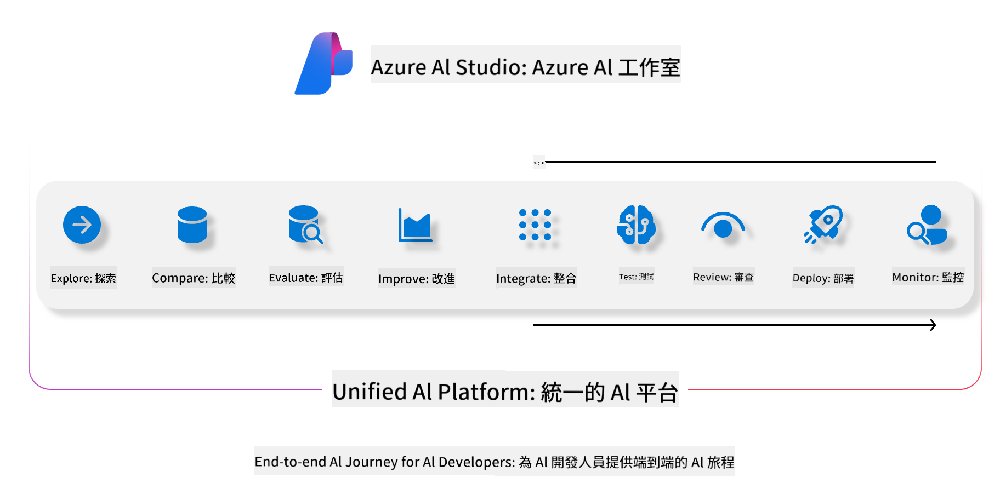

<!--
CO_OP_TRANSLATOR_METADATA:
{
  "original_hash": "5dfb4983a2e74e4b5e8317eb16fc2154",
  "translation_date": "2025-04-04T12:18:19+00:00",
  "source_file": "md\\01.Introduction\\05\\AIFoundry.md",
  "language_code": "mo"
}
-->
# **Azure AI Foundry ke amfani da shi don tantancewa**

Yadda ake tantance aikace-aikacen AI na generative ta amfani da [Azure AI Foundry](https://ai.azure.com?WT.mc_id=aiml-138114-kinfeylo). Ko kuna tantance tattaunawa guda ko mai yawa, Azure AI Foundry yana ba da kayan aikin tantance aikin samfurin da tsaro.

## Yadda ake tantance aikace-aikacen AI na generative tare da Azure AI Foundry
Don karin bayani duba [Azure AI Foundry Documentation](https://learn.microsoft.com/azure/ai-studio/how-to/evaluate-generative-ai-app?WT.mc_id=aiml-138114-kinfeylo)

Ga matakai don farawa:

## Tantance Samfuran AI na Generative a cikin Azure AI Foundry

**Abubuwan da ake bukata**

- Bayanai na gwaji a cikin tsarin CSV ko JSON.
- Samfurin AI na generative da aka sanya (kamar Phi-3, GPT 3.5, GPT 4, ko Davinci models).
- Lokaci tare da kwamfuta don gudanar da tantancewa.

## Ma'auni Na Tantancewa Da Aka Gina

Azure AI Foundry yana ba ku damar tantance tattaunawa guda da tattaunawa masu rikitarwa, masu yawa.
Don yanayin Retrieval Augmented Generation (RAG), inda samfurin ya dogara da bayanai na musamman, za ku iya tantance aiki ta amfani da ma'auni na tantancewa da aka gina.
Bugu da ƙari, za ku iya tantance yanayin amsa tambaya guda (ba RAG).

## Ƙirƙirar Gudun Tantancewa

Daga cikin UI na Azure AI Foundry, ku je zuwa shafin Evaluate ko shafin Prompt Flow.
Bi wizard na ƙirƙirar tantancewa don saita gudun tantancewa. Ba da sunan zaɓi don tantancewarku.
Zaɓi yanayin da ya dace da burin aikace-aikacenku.
Zaɓi ɗaya ko fiye da ma'auni na tantancewa don tantance fitarwar samfurin.

## Tsarin Tantancewa Na Musamman (Zabi)

Don ƙarin sassauci, za ku iya kafa tsarin tantancewa na musamman. Musanya tsarin tantancewa bisa ga bukatunku na musamman.

## Duba Sakamako

Bayan gudanar da tantancewa, ku shiga, ku duba, kuma ku bincika ma'auni na tantancewa da aka yi a Azure AI Foundry. Samu fahimta game da ƙwarewar aikace-aikacenku da gazawarsa.

**Lura** Azure AI Foundry a halin yanzu yana cikin gwajin jama'a, don haka ku yi amfani da shi don gwaji da dalilai na ci gaba. Don nauyin aikin samarwa, ku yi la'akari da sauran zaɓuɓɓuka. Ku bincika [AI Foundry documentation](https://learn.microsoft.com/azure/ai-studio/?WT.mc_id=aiml-138114-kinfeylo) don ƙarin bayani da umarnin mataki-mataki.

It seems like you are requesting translation into "mo," but could you clarify what "mo" refers to? Is it a specific language or abbreviation? For example, are you referring to Maori, Mongolian, or another language? Please provide more details so I can assist you accurately!