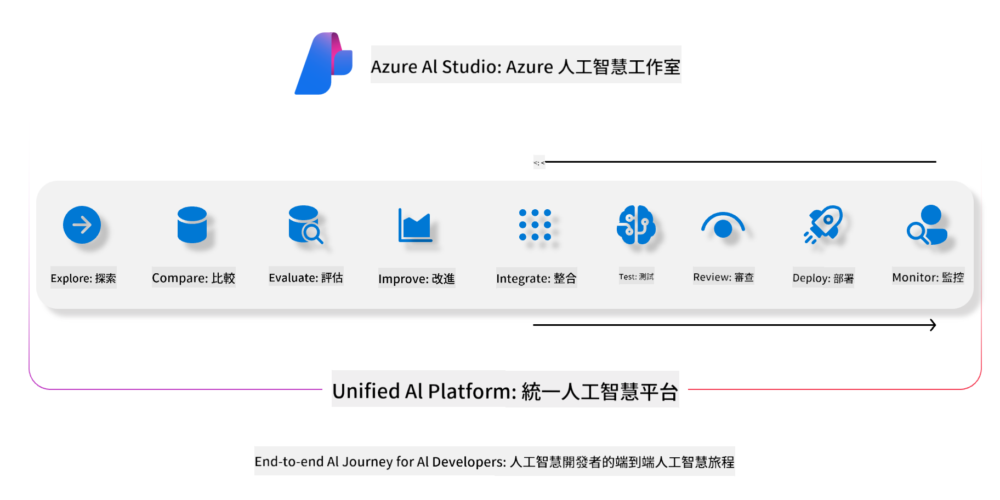

<!--
CO_OP_TRANSLATOR_METADATA:
{
  "original_hash": "7b4235159486df4000e16b7b46ddfec3",
  "translation_date": "2025-05-07T14:43:13+00:00",
  "source_file": "md/01.Introduction/05/AIFoundry.md",
  "language_code": "mo"
}
-->
# **استخدام Azure AI Foundry للتقييم**

كيفية تقييم تطبيق الذكاء الاصطناعي التوليدي الخاص بك باستخدام [Azure AI Foundry](https://ai.azure.com?WT.mc_id=aiml-138114-kinfeylo). سواء كنت تقوم بتقييم محادثات ذات دور واحد أو متعددة الأدوار، يوفر Azure AI Foundry أدوات لتقييم أداء النموذج والسلامة.

## كيفية تقييم تطبيقات الذكاء الاصطناعي التوليدي باستخدام Azure AI Foundry
لمزيد من التعليمات التفصيلية، راجع [توثيق Azure AI Foundry](https://learn.microsoft.com/azure/ai-studio/how-to/evaluate-generative-ai-app?WT.mc_id=aiml-138114-kinfeylo)

فيما يلي الخطوات للبدء:

## تقييم نماذج الذكاء الاصطناعي التوليدي في Azure AI Foundry

**المتطلبات الأساسية**

- مجموعة بيانات اختبار بصيغة CSV أو JSON.
- نموذج ذكاء اصطناعي توليدي منشور (مثل Phi-3، GPT 3.5، GPT 4، أو نماذج Davinci).
- بيئة تشغيل مع جهاز حوسبة لتشغيل التقييم.

## مقاييس التقييم المدمجة

يتيح Azure AI Foundry تقييم المحادثات ذات الدور الواحد والمعقدة متعددة الأدوار.
بالنسبة لسيناريوهات Retrieval Augmented Generation (RAG)، حيث يكون النموذج مستندًا إلى بيانات محددة، يمكنك تقييم الأداء باستخدام مقاييس التقييم المدمجة.
بالإضافة إلى ذلك، يمكنك تقييم سيناريوهات الإجابة على الأسئلة ذات الدور الواحد العامة (غير RAG).

## إنشاء جلسة تقييم

من واجهة Azure AI Foundry، انتقل إلى صفحة Evaluate أو صفحة Prompt Flow.
اتبع معالج إنشاء التقييم لإعداد جلسة تقييم. يمكنك إدخال اسم اختياري للتقييم.
اختر السيناريو الذي يتوافق مع أهداف تطبيقك.
حدد مقياسًا واحدًا أو أكثر لتقييم مخرجات النموذج.

## سير تقييم مخصص (اختياري)

للمزيد من المرونة، يمكنك إنشاء سير تقييم مخصص. قم بتخصيص عملية التقييم وفقًا لمتطلباتك الخاصة.

## عرض النتائج

بعد تشغيل التقييم، قم بتسجيل وعرض وتحليل مقاييس التقييم التفصيلية في Azure AI Foundry. احصل على رؤى حول قدرات وقيود تطبيقك.

**Note** Azure AI Foundry حاليًا في المعاينة العامة، لذا استخدمه لأغراض التجربة والتطوير. للعمليات الإنتاجية، فكر في خيارات أخرى. استكشف التوثيق الرسمي لـ [AI Foundry](https://learn.microsoft.com/azure/ai-studio/?WT.mc_id=aiml-138114-kinfeylo) لمزيد من التفاصيل والتعليمات خطوة بخطوة.

**Disclaimer**:  
This document has been translated using AI translation service [Co-op Translator](https://github.com/Azure/co-op-translator). While we strive for accuracy, please be aware that automated translations may contain errors or inaccuracies. The original document in its native language should be considered the authoritative source. For critical information, professional human translation is recommended. We are not liable for any misunderstandings or misinterpretations arising from the use of this translation.

---

Could you please clarify what language or code "mo" refers to? There are multiple possibilities (e.g., Moldovan, a constructed language, or something else). Once confirmed, I can provide the accurate translation.