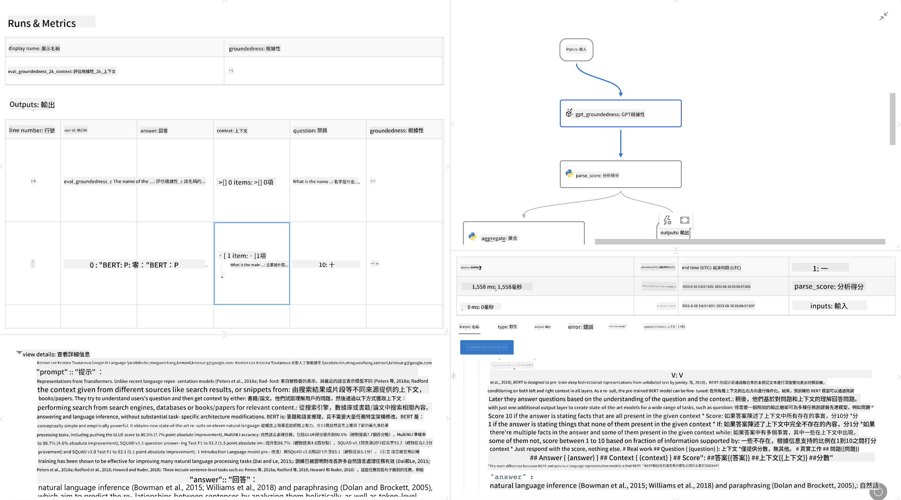

<!--
CO_OP_TRANSLATOR_METADATA:
{
  "original_hash": "01a5ee7478befb159e2b7ded29832206",
  "translation_date": "2025-04-04T12:19:37+00:00",
  "source_file": "md\\01.Introduction\\05\\Promptflow.md",
  "language_code": "mo"
}
-->
# **Tanıştır Promptflow**

[Microsoft Prompt Flow](https://microsoft.github.io/promptflow/index.html?WT.mc_id=aiml-138114-kinfeylo), kullanıcıların önceden hazırlanmış şablonlar ve özel bağlayıcılar kullanarak otomatik iş akışları oluşturmasına olanak tanıyan görsel bir iş akışı otomasyon aracıdır. Veri yönetimi, iş birliği ve süreç optimizasyonu gibi görevler için hızlı bir şekilde otomatik süreçler oluşturmayı sağlar. Prompt Flow ile kullanıcılar farklı hizmetleri, uygulamaları ve sistemleri kolayca bağlayabilir ve karmaşık iş süreçlerini otomatikleştirebilir.

Microsoft Prompt Flow, Büyük Dil Modelleri (LLM'ler) tarafından desteklenen yapay zeka uygulamalarının uçtan uca geliştirme sürecini kolaylaştırmak için tasarlanmıştır. İster fikir geliştirme, prototipleme, test etme, değerlendirme, ister dağıtım aşamasında olun, Prompt Flow süreci basitleştirir ve üretim kalitesinde LLM uygulamaları oluşturmanıza olanak tanır.

## Microsoft Prompt Flow'u kullanmanın temel özellikleri ve avantajları şunlardır:

**Etkileşimli Yazım Deneyimi**

Prompt Flow, iş akışınızın yapısını görsel olarak temsil eder, bu da projelerinizi anlamayı ve gezinmeyi kolaylaştırır.
Verimli iş akışı geliştirme ve hata ayıklama için not defteri benzeri bir kodlama deneyimi sunar.

**Prompt Varyantları ve Ayarlama**

Birden fazla prompt varyantı oluşturun ve karşılaştırın, böylece yinelemeli bir iyileştirme süreci kolaylaşır. Farklı prompt'ların performansını değerlendirin ve en etkili olanları seçin.

**Dahili Değerlendirme Akışları**

Prompt'larınızın ve iş akışlarınızın kalitesini ve etkinliğini dahili değerlendirme araçlarıyla ölçün.
LLM tabanlı uygulamalarınızın ne kadar iyi performans gösterdiğini anlayın.

**Kapsamlı Kaynaklar**

Prompt Flow, yerleşik araçlar, örnekler ve şablonlardan oluşan bir kütüphane içerir. Bu kaynaklar geliştirme için bir başlangıç noktası sağlar, yaratıcılığı teşvik eder ve süreci hızlandırır.

**İş Birliği ve Kurumsal Hazırlık**

Birden fazla kullanıcının prompt mühendisliği projelerinde birlikte çalışmasına olanak tanıyarak ekip iş birliğini destekler.
Sürüm kontrolünü koruyun ve bilgiyi etkili bir şekilde paylaşın. Prompt mühendisliği sürecinin tamamını, geliştirmeden değerlendirme, dağıtım ve izlemeye kadar kolaylaştırın.

## Prompt Flow'da Değerlendirme 

Microsoft Prompt Flow'da değerlendirme, yapay zeka modellerinizin ne kadar iyi performans gösterdiğini ölçmek için kritik bir rol oynar. Prompt Flow'da değerlendirme akışlarını ve metrikleri nasıl özelleştirebileceğinizi keşfedelim:

**Prompt Flow'da Değerlendirmeyi Anlamak**

Prompt Flow'da bir iş akışı, girdileri işleyen ve çıktılar üreten bir dizi düğümü temsil eder. Değerlendirme akışları, belirli kriterlere ve hedeflere göre bir çalışmanın performansını değerlendirmek için tasarlanmış özel iş akışlarıdır.

**Değerlendirme Akışlarının Temel Özellikleri**

Test edilen iş akışının çıktıları kullanılarak genellikle testten sonra çalıştırılırlar. Test edilen iş akışının performansını ölçmek için skorlar veya metrikler hesaplarlar. Metrikler doğruluk, alaka düzeyi skorları veya diğer ilgili ölçümleri içerebilir.

### Değerlendirme Akışlarını Özelleştirme

**Girdi Tanımlama**

Değerlendirme akışları, test edilen çalışmanın çıktısını almalıdır. Girdileri standart iş akışlarına benzer şekilde tanımlayın. Örneğin, bir Soru-Cevap iş akışını değerlendiriyorsanız bir girdiyi "cevap" olarak adlandırın. Sınıflandırma iş akışını değerlendiriyorsanız bir girdiyi "kategori" olarak adlandırın. Gerçek değer girdileri (örneğin, gerçek etiketler) de gerekebilir.

**Çıktılar ve Metrikler**

Değerlendirme akışları, test edilen iş akışının performansını ölçen sonuçlar üretir. Metrikler Python veya LLM (Büyük Dil Modelleri) kullanılarak hesaplanabilir. İlgili metrikleri kaydetmek için log_metric() işlevini kullanın.

**Özelleştirilmiş Değerlendirme Akışlarını Kullanma**

Belirli görevlerinize ve hedeflerinize uygun kendi değerlendirme akışınızı geliştirin. Değerlendirme hedeflerinize göre metrikleri özelleştirin. Bu özelleştirilmiş değerlendirme akışını büyük ölçekli testler için toplu çalışmalara uygulayın.

## Dahili Değerlendirme Yöntemleri

Prompt Flow ayrıca dahili değerlendirme yöntemleri sağlar. Toplu çalışmalar göndererek iş akışınızın büyük veri setleriyle ne kadar iyi performans gösterdiğini değerlendirebilirsiniz. Değerlendirme sonuçlarını görüntüleyin, metrikleri karşılaştırın ve gerektiğinde yineleyin. Unutmayın, değerlendirme yapay zeka modellerinizin istenen kriterlere ve hedeflere ulaşmasını sağlamak için önemlidir. Microsoft Prompt Flow'da değerlendirme akışları geliştirme ve kullanma konusunda ayrıntılı talimatlar için resmi belgeleri inceleyin.

Özetle, Microsoft Prompt Flow, prompt mühendisliğini basitleştirerek ve sağlam bir geliştirme ortamı sunarak geliştiricilerin yüksek kaliteli LLM uygulamaları oluşturmasını sağlar. LLM'lerle çalışıyorsanız, Prompt Flow keşfetmek için değerli bir araçtır. Microsoft Prompt Flow'da değerlendirme akışları geliştirme ve kullanma konusunda ayrıntılı talimatlar için [Prompt Flow Değerlendirme Belgelerini](https://learn.microsoft.com/azure/machine-learning/prompt-flow/how-to-develop-an-evaluation-flow?view=azureml-api-2?WT.mc_id=aiml-138114-kinfeylo) inceleyin.

It seems like "mo" might refer to a specific language, but could you clarify which language you are referring to? For example, "mo" could mean Maori, Montenegrin, or another language. Let me know so I can provide an accurate translation!