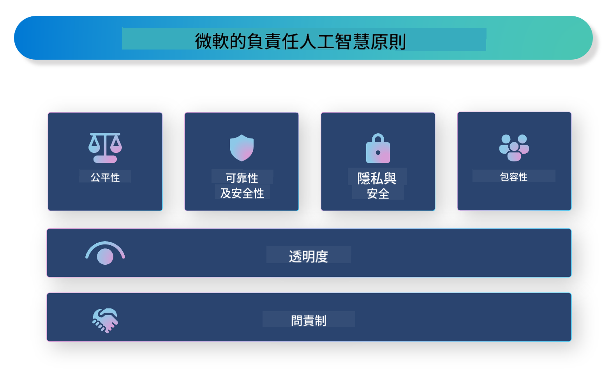

<!--
CO_OP_TRANSLATOR_METADATA:
{
  "original_hash": "805b96b20152936d8f4c587d90d6e06e",
  "translation_date": "2025-05-07T14:44:55+00:00",
  "source_file": "md/01.Introduction/05/ResponsibleAI.md",
  "language_code": "mo"
}
-->
# **Presentar Responsible AI**

[Microsoft Responsible AI](https://www.microsoft.com/ai/responsible-ai?WT.mc_id=aiml-138114-kinfeylo) es una iniciativa que busca ayudar a desarrolladores y organizaciones a crear sistemas de IA que sean transparentes, confiables y responsables. La iniciativa ofrece orientación y recursos para desarrollar soluciones de IA responsables que se alineen con principios éticos, como la privacidad, la equidad y la transparencia. También exploraremos algunos de los desafíos y las mejores prácticas relacionados con la construcción de sistemas de IA responsables.

## Resumen de Microsoft Responsible AI

**Principios éticos**

Microsoft Responsible AI se guía por un conjunto de principios éticos, como la privacidad, la equidad, la transparencia, la responsabilidad y la seguridad. Estos principios están diseñados para garantizar que los sistemas de IA se desarrollen de manera ética y responsable.

**IA transparente**

Microsoft Responsible AI destaca la importancia de la transparencia en los sistemas de IA. Esto incluye ofrecer explicaciones claras sobre cómo funcionan los modelos de IA, así como asegurar que las fuentes de datos y los algoritmos estén disponibles públicamente.

**IA responsable**

[Microsoft Responsible AI](https://www.microsoft.com/ai/responsible-ai?WT.mc_id=aiml-138114-kinfeylo) promueve el desarrollo de sistemas de IA responsables, que puedan proporcionar información sobre cómo los modelos de IA toman decisiones. Esto ayuda a los usuarios a comprender y confiar en los resultados de los sistemas de IA.

**Inclusividad**

Los sistemas de IA deben diseñarse para beneficiar a todos. Microsoft busca crear una IA inclusiva que considere diversas perspectivas y evite sesgos o discriminación.

**Confiabilidad y seguridad**

Garantizar que los sistemas de IA sean confiables y seguros es fundamental. Microsoft se enfoca en construir modelos robustos que funcionen de manera constante y eviten resultados perjudiciales.

**Equidad en la IA**

Microsoft Responsible AI reconoce que los sistemas de IA pueden perpetuar sesgos si se entrenan con datos o algoritmos sesgados. La iniciativa ofrece orientación para desarrollar sistemas de IA justos que no discriminen por factores como raza, género o edad.

**Privacidad y seguridad**

Microsoft Responsible AI enfatiza la importancia de proteger la privacidad de los usuarios y la seguridad de los datos en los sistemas de IA. Esto incluye implementar cifrado de datos fuerte y controles de acceso, además de auditar regularmente los sistemas de IA para detectar vulnerabilidades.

**Responsabilidad y rendición de cuentas**

Microsoft Responsible AI fomenta la responsabilidad y la rendición de cuentas en el desarrollo y despliegue de la IA. Esto implica asegurarse de que desarrolladores y organizaciones estén conscientes de los riesgos potenciales asociados con los sistemas de IA y tomen medidas para mitigarlos.

## Mejores prácticas para construir sistemas de IA responsables

**Desarrollar modelos de IA utilizando conjuntos de datos diversos**

Para evitar sesgos en los sistemas de IA, es importante usar conjuntos de datos variados que representen diferentes perspectivas y experiencias.

**Usar técnicas de IA explicable**

Las técnicas de IA explicable ayudan a los usuarios a entender cómo los modelos de IA toman decisiones, lo que puede aumentar la confianza en el sistema.

**Auditar regularmente los sistemas de IA para detectar vulnerabilidades**

Las auditorías periódicas de los sistemas de IA pueden ayudar a identificar riesgos y vulnerabilidades que deben ser abordados.

**Implementar cifrado fuerte de datos y controles de acceso**

El cifrado de datos y los controles de acceso ayudan a proteger la privacidad y la seguridad de los usuarios en los sistemas de IA.

**Seguir principios éticos en el desarrollo de IA**

Seguir principios éticos, como la equidad, la transparencia y la responsabilidad, contribuye a generar confianza en los sistemas de IA y asegura que se desarrollen de manera responsable.

## Uso de AI Foundry para Responsible AI

[Azure AI Foundry](https://ai.azure.com?WT.mc_id=aiml-138114-kinfeylo) es una plataforma potente que permite a desarrolladores y organizaciones crear rápidamente aplicaciones inteligentes, innovadoras, listas para el mercado y responsables. Aquí algunas características y capacidades clave de Azure AI Foundry:

**APIs y modelos listos para usar**

Azure AI Foundry ofrece APIs y modelos preconstruidos y personalizables. Cubren una amplia gama de tareas de IA, incluyendo IA generativa, procesamiento de lenguaje natural para conversaciones, búsqueda, monitoreo, traducción, voz, visión y toma de decisiones.

**Prompt Flow**

Prompt Flow en Azure AI Foundry permite crear experiencias de IA conversacional. Facilita diseñar y gestionar flujos conversacionales, lo que simplifica la construcción de chatbots, asistentes virtuales y otras aplicaciones interactivas.

**Retrieval Augmented Generation (RAG)**

RAG es una técnica que combina enfoques basados en recuperación y generación. Mejora la calidad de las respuestas generadas al aprovechar tanto el conocimiento preexistente (recuperación) como la generación creativa (generación).

**Métricas de evaluación y monitoreo para IA generativa**

Azure AI Foundry ofrece herramientas para evaluar y monitorear modelos de IA generativa. Puedes medir su rendimiento, equidad y otras métricas importantes para asegurar un despliegue responsable. Además, si has creado un panel de control, puedes usar la interfaz sin código en Azure Machine Learning Studio para personalizar y generar un Responsible AI Dashboard y la tarjeta de puntuación asociada basada en las bibliotecas Python del [Responsible AI Toolbox](https://responsibleaitoolbox.ai/?WT.mc_id=aiml-138114-kinfeylo). Esta tarjeta ayuda a compartir información clave relacionada con la equidad, la importancia de características y otras consideraciones para un despliegue responsable, tanto con partes interesadas técnicas como no técnicas.

Para usar AI Foundry con Responsible AI, puedes seguir estas mejores prácticas:

**Definir el problema y los objetivos de tu sistema de IA**

Antes de comenzar el desarrollo, es importante definir claramente el problema u objetivo que tu sistema de IA busca resolver. Esto te ayudará a identificar los datos, algoritmos y recursos necesarios para construir un modelo efectivo.

**Recolectar y preprocesar datos relevantes**

La calidad y cantidad de datos usados en el entrenamiento de un sistema de IA impactan significativamente su desempeño. Por eso, es importante recopilar datos relevantes, limpiarlos, preprocesarlos y asegurarse de que representen la población o el problema que intentas resolver.

**Elegir la evaluación adecuada**

Existen diversos algoritmos de evaluación disponibles. Es importante seleccionar el más apropiado según tus datos y problema.

**Evaluar e interpretar el modelo**

Una vez construido el modelo de IA, es esencial evaluar su desempeño usando métricas adecuadas e interpretar los resultados de manera transparente. Esto ayuda a identificar sesgos o limitaciones y a realizar mejoras cuando sea necesario.

**Asegurar transparencia y explicabilidad**

Los sistemas de IA deben ser transparentes y explicables para que los usuarios entiendan cómo funcionan y cómo se toman las decisiones. Esto es especialmente importante en aplicaciones con impacto significativo en vidas humanas, como salud, finanzas y sistemas legales.

**Monitorear y actualizar el modelo**

Los sistemas de IA deben ser monitoreados y actualizados continuamente para mantener su precisión y eficacia a lo largo del tiempo. Esto requiere mantenimiento constante, pruebas y reentrenamiento del modelo.

En conclusión, Microsoft Responsible AI es una iniciativa que busca ayudar a desarrolladores y organizaciones a crear sistemas de IA que sean transparentes, confiables y responsables. Recuerda que la implementación responsable de la IA es fundamental, y Azure AI Foundry busca hacerla práctica para las organizaciones. Siguiendo principios éticos y mejores prácticas, podemos garantizar que los sistemas de IA se desarrollen y desplieguen de manera responsable, beneficiando a la sociedad en su conjunto.

**Disclaimer**:  
This document has been translated using AI translation service [Co-op Translator](https://github.com/Azure/co-op-translator). While we strive for accuracy, please be aware that automated translations may contain errors or inaccuracies. The original document in its native language should be considered the authoritative source. For critical information, professional human translation is recommended. We are not liable for any misunderstandings or misinterpretations arising from the use of this translation.

---

Could you please clarify what language "mo" refers to? There are several possibilities (e.g., Moldovan, a constructed language, or another language code). Once confirmed, I can provide the translation.