<!--
CO_OP_TRANSLATOR_METADATA:
{
  "original_hash": "7799f9e2960966adc296d24cdf0d6486",
  "translation_date": "2025-04-04T12:23:36+00:00",
  "source_file": "md\\02.Application\\01.TextAndChat\\Phi3\\E2E_Phi-3-Evaluation_AIFoundry.md",
  "language_code": "mo"
}
-->
# Evaluate the Fine-tuned Phi-3 / Phi-3.5 Model in Azure AI Foundry Focusing on Microsoft's Responsible AI Principles

This complete example is based on the guide "[Evaluate Fine-tuned Phi-3 / 3.5 Models in Azure AI Foundry Focusing on Microsoft's Responsible AI](https://techcommunity.microsoft.com/t5/educator-developer-blog/evaluate-fine-tuned-phi-3-3-5-models-in-azure-ai-studio-focusing/ba-p/4227850?WT.mc_id=aiml-137032-kinfeylo)" from the Microsoft Tech Community.

## Overview

### How can you evaluate the safety and performance of a fine-tuned Phi-3 / Phi-3.5 model in Azure AI Foundry?

Fine-tuning a model can sometimes result in unexpected or undesired responses. To ensure the model remains safe and effective, it’s important to assess its ability to generate harmful content as well as its capacity to produce accurate, relevant, and coherent answers. This tutorial teaches you how to evaluate the safety and performance of a fine-tuned Phi-3 / Phi-3.5 model integrated with Prompt flow in Azure AI Foundry.

Below is the evaluation process in Azure AI Foundry.

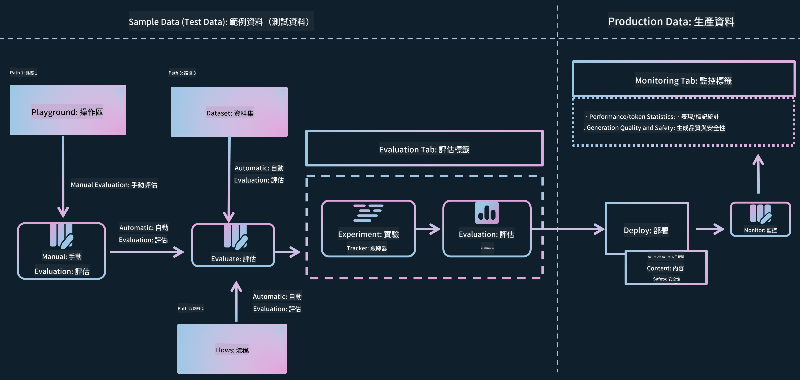

*Image Source: [Evaluation of generative AI applications](https://learn.microsoft.com/azure/ai-studio/concepts/evaluation-approach-gen-ai?wt.mc_id%3Dstudentamb_279723)*

> [!NOTE]
>
> For more detailed information and additional resources about Phi-3 / Phi-3.5, please visit the [Phi-3CookBook](https://github.com/microsoft/Phi-3CookBook?wt.mc_id=studentamb_279723).

### Prerequisites

- [Python](https://www.python.org/downloads)
- [Azure subscription](https://azure.microsoft.com/free?wt.mc_id=studentamb_279723)
- [Visual Studio Code](https://code.visualstudio.com)
- Fine-tuned Phi-3 / Phi-3.5 model

### Table of Contents

1. [**Scenario 1: Introduction to Azure AI Foundry's Prompt flow evaluation**](../../../../../../md/02.Application/01.TextAndChat/Phi3)

    - [Introduction to safety evaluation](../../../../../../md/02.Application/01.TextAndChat/Phi3)
    - [Introduction to performance evaluation](../../../../../../md/02.Application/01.TextAndChat/Phi3)

1. [**Scenario 2: Evaluating the Phi-3 / Phi-3.5 model in Azure AI Foundry**](../../../../../../md/02.Application/01.TextAndChat/Phi3)

    - [Before you begin](../../../../../../md/02.Application/01.TextAndChat/Phi3)
    - [Deploy Azure OpenAI to evaluate the Phi-3 / Phi-3.5 model](../../../../../../md/02.Application/01.TextAndChat/Phi3)
    - [Evaluate the fine-tuned Phi-3 / Phi-3.5 model using Azure AI Foundry's Prompt flow evaluation](../../../../../../md/02.Application/01.TextAndChat/Phi3)

1. [Congratulations!](../../../../../../md/02.Application/01.TextAndChat/Phi3)

## **Scenario 1: Introduction to Azure AI Foundry's Prompt flow evaluation**

### Introduction to safety evaluation

To ensure your AI model is ethical and safe, it’s critical to evaluate it against Microsoft’s Responsible AI Principles. Azure AI Foundry provides safety evaluations that help assess the model’s vulnerability to jailbreak attacks and its potential to generate harmful content, aligning with these principles.


*Image Source: [Evaluation of generative AI applications](https://learn.microsoft.com/azure/ai-studio/concepts/evaluation-approach-gen-ai?wt.mc_id%3Dstudentamb_279723)*

#### Microsoft’s Responsible AI Principles

Before diving into the technical steps, it’s essential to understand Microsoft’s Responsible AI Principles. This ethical framework guides the responsible development, deployment, and operation of AI systems, ensuring fairness, transparency, and inclusiveness. These principles form the foundation for evaluating the safety of AI models.

Microsoft’s Responsible AI Principles include:

- **Fairness and Inclusiveness**: AI systems should treat everyone fairly and avoid disproportionately impacting groups of people with similar circumstances. For instance, when AI systems offer advice on medical treatments, loan applications, or job opportunities, they should provide consistent recommendations to individuals with similar qualifications or conditions.

- **Reliability and Safety**: Building trust requires AI systems to operate reliably, safely, and consistently. These systems should function as intended, respond appropriately to unexpected situations, and resist harmful manipulation. Their behavior reflects the range of scenarios developers anticipated during design and testing.

- **Transparency**: When AI systems influence decisions that significantly impact people’s lives, it’s crucial for individuals to understand how those decisions are made. For example, a bank using AI to assess creditworthiness or a company using AI to identify top job candidates should provide clarity on its processes.

- **Privacy and Security**: As AI becomes more widespread, protecting privacy and securing sensitive information becomes increasingly vital. AI systems must strike a balance between data access for accurate predictions and safeguarding personal and business information.

- **Accountability**: Designers and operators of AI systems must take responsibility for their systems’ actions. Organizations should adopt industry standards to establish accountability norms, ensuring that AI systems are not the sole authority on decisions affecting people’s lives and that humans maintain meaningful control over autonomous systems.

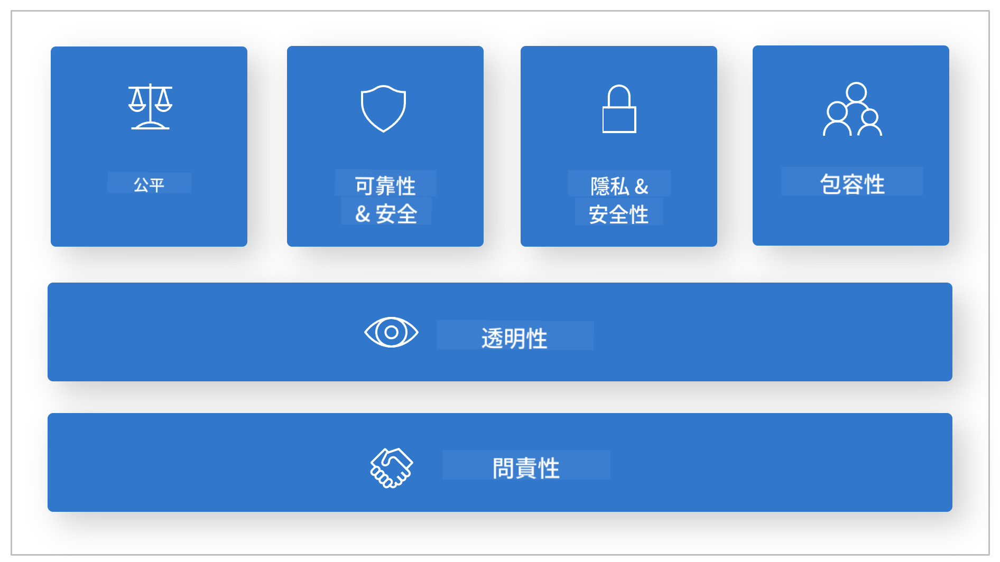

*Image Source: [What is Responsible AI?](https://learn.microsoft.com/azure/machine-learning/concept-responsible-ai?view=azureml-api-2&viewFallbackFrom=azureml-api-2%253fwt.mc_id%3Dstudentamb_279723)*

> [!NOTE]
> To learn more about Microsoft’s Responsible AI Principles, visit [What is Responsible AI?](https://learn.microsoft.com/azure/machine-learning/concept-responsible-ai?view=azureml-api-2?wt.mc_id=studentamb_279723).

#### Safety metrics

This tutorial will guide you in evaluating the safety of the fine-tuned Phi-3 model using Azure AI Foundry’s safety metrics. These metrics help assess the model’s potential to generate harmful content and its vulnerability to jailbreak attacks. Key metrics include:

- **Self-harm-related Content**: Determines whether the model tends to produce content related to self-harm.
- **Hateful and Unfair Content**: Assesses whether the model generates hateful or biased content.
- **Violent Content**: Evaluates whether the model tends to produce violent material.
- **Sexual Content**: Checks whether the model generates inappropriate sexual content.

Evaluating these aspects ensures the AI model aligns with societal values and regulatory standards by avoiding harmful or offensive content.


### Introduction to performance evaluation

To ensure your AI model meets expectations, it’s important to evaluate its performance using performance metrics. Azure AI Foundry provides tools to assess the model’s ability to generate accurate, relevant, and coherent responses.


*Image Source: [Evaluation of generative AI applications](https://learn.microsoft.com/azure/ai-studio/concepts/evaluation-approach-gen-ai?wt.mc_id%3Dstudentamb_279723)*

#### Performance metrics

This tutorial will guide you in evaluating the performance of the fine-tuned Phi-3 / Phi-3.5 model using Azure AI Foundry’s performance metrics. These metrics help assess the model’s effectiveness in generating accurate, relevant, and coherent responses. Key metrics include:

- **Groundedness**: Evaluates how well the generated answers align with the input source.
- **Relevance**: Assesses how pertinent the responses are to the given prompts.
- **Coherence**: Measures the natural flow and human-like quality of the generated text.
- **Fluency**: Evaluates the linguistic proficiency of the output.
- **GPT Similarity**: Compares the generated response with the expected output for similarity.
- **F1 Score**: Calculates the overlap between the generated response and the source data.

These metrics help ensure the model is effective in producing high-quality responses.

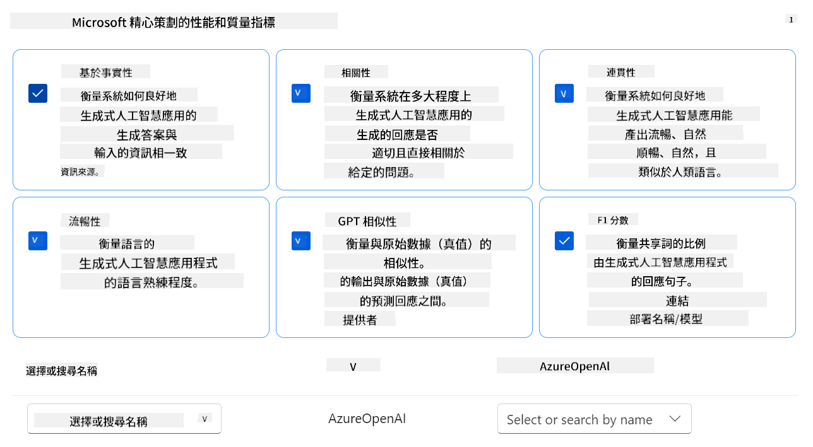

## **Scenario 2: Evaluating the Phi-3 / Phi-3.5 model in Azure AI Foundry**

### Before you begin

This tutorial builds on the previous blog posts, "[Fine-Tune and Integrate Custom Phi-3 Models with Prompt Flow: Step-by-Step Guide](https://techcommunity.microsoft.com/t5/educator-developer-blog/fine-tune-and-integrate-custom-phi-3-models-with-prompt-flow/ba-p/4178612?wt.mc_id=studentamb_279723)" and "[Fine-Tune and Integrate Custom Phi-3 Models with Prompt Flow in Azure AI Foundry](https://techcommunity.microsoft.com/t5/educator-developer-blog/fine-tune-and-integrate-custom-phi-3-models-with-prompt-flow-in/ba-p/4191726?wt.mc_id=studentamb_279723)." These posts covered the process of fine-tuning a Phi-3 / Phi-3.5 model in Azure AI Foundry and integrating it with Prompt flow.

In this tutorial, you’ll deploy an Azure OpenAI model as an evaluator in Azure AI Foundry and use it to assess your fine-tuned Phi-3 / Phi-3.5 model.

Before starting, ensure you have the following prerequisites from the previous tutorials:

1. A prepared dataset for evaluating the fine-tuned Phi-3 / Phi-3.5 model.
1. A Phi-3 / Phi-3.5 model that has been fine-tuned and deployed in Azure Machine Learning.
1. A Prompt flow integrated with your fine-tuned Phi-3 / Phi-3.5 model in Azure AI Foundry.

> [!NOTE]
> You’ll use the *test_data.jsonl* file located in the data folder of the **ULTRACHAT_200k** dataset downloaded in earlier blog posts as the dataset for evaluation.

#### Integrate the custom Phi-3 / Phi-3.5 model with Prompt flow in Azure AI Foundry (Code-first approach)

> [!NOTE]
> If you followed the low-code approach described in "[Fine-Tune and Integrate Custom Phi-3 Models with Prompt Flow in Azure AI Foundry](https://techcommunity.microsoft.com/t5/educator-developer-blog/fine-tune-and-integrate-custom-phi-3-models-with-prompt-flow-in/ba-p/4191726?wt.mc_id=studentamb_279723)," you can skip this section and move on to the next.  
> However, if you followed the code-first approach described in "[Fine-Tune and Integrate Custom Phi-3 Models with Prompt Flow: Step-by-Step Guide](https://techcommunity.microsoft.com/t5/educator-developer-blog/fine-tune-and-integrate-custom-phi-3-models-with-prompt-flow/ba-p/4178612?wt.mc_id=studentamb_279723)," the process of connecting your model to Prompt flow is slightly different. This section covers that process.

To proceed, you’ll need to integrate your fine-tuned Phi-3 / Phi-3.5 model into Prompt flow in Azure AI Foundry.

#### Create Azure AI Foundry Hub

Before creating a Project, you need to set up a Hub. A Hub acts like a Resource Group, enabling you to organize and manage multiple Projects within Azure AI Foundry.

1. Sign in to [Azure AI Foundry](https://ai.azure.com/?wt.mc_id=studentamb_279723).

1. Select **All hubs** from the left-side menu.

1. Click **+ New hub** in the navigation menu.

    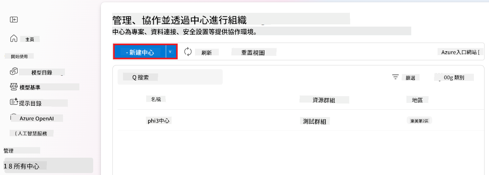

1. Complete the following steps:

    - Enter a **Hub name** (must be unique).
    - Choose your Azure **Subscription**.
    - Select the **Resource group** to use (or create a new one if needed).
    - Pick the **Location** you want to use.
    - Select the **Connect Azure AI Services** option (or create a new one if necessary).
    - Choose **Skip connecting** for Azure AI Search.
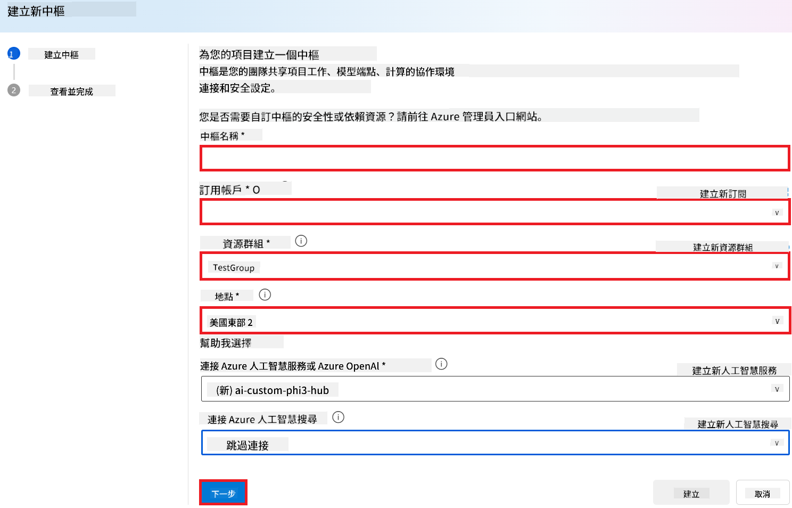

1. Select **Next**.

#### Create Azure AI Foundry Project

1. In the Hub that you created, select **All projects** from the left-side tab.

1. Select **+ New project** from the navigation menu.

    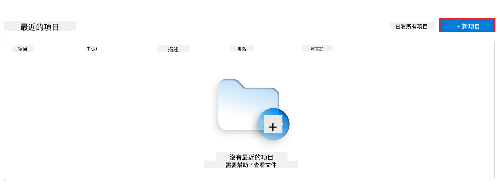

1. Enter **Project name**. It must be a unique value.

    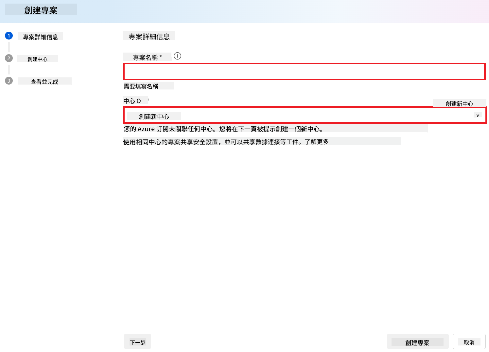

1. Select **Create a project**.

#### Add a custom connection for the fine-tuned Phi-3 / Phi-3.5 model

To integrate your custom Phi-3 / Phi-3.5 model with Prompt flow, you need to save the model's endpoint and key in a custom connection. This setup ensures access to your custom Phi-3 / Phi-3.5 model in Prompt flow.

#### Set api key and endpoint uri of the fine-tuned Phi-3 / Phi-3.5 model

1. Visit [Azure ML Studio](https://ml.azure.com/home?wt.mc_id=studentamb_279723).

1. Navigate to the Azure Machine Learning workspace that you created.

1. Select **Endpoints** from the left-side tab.

    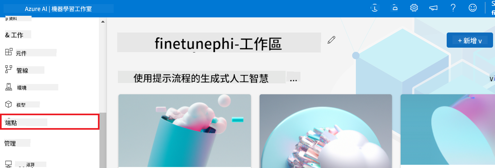

1. Select the endpoint that you created.

    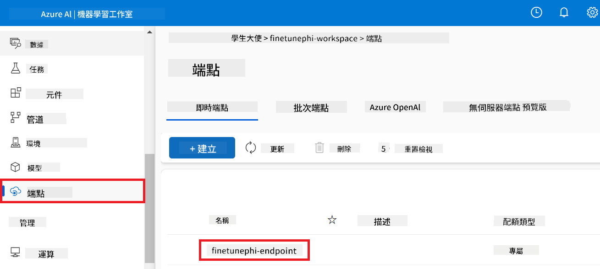

1. Select **Consume** from the navigation menu.

1. Copy your **REST endpoint** and **Primary key**.

    

#### Add the Custom Connection

1. Visit [Azure AI Foundry](https://ai.azure.com/?wt.mc_id=studentamb_279723).

1. Navigate to the Azure AI Foundry project that you created.

1. In the Project that you created, select **Settings** from the left-side tab.

1. Select **+ New connection**.

    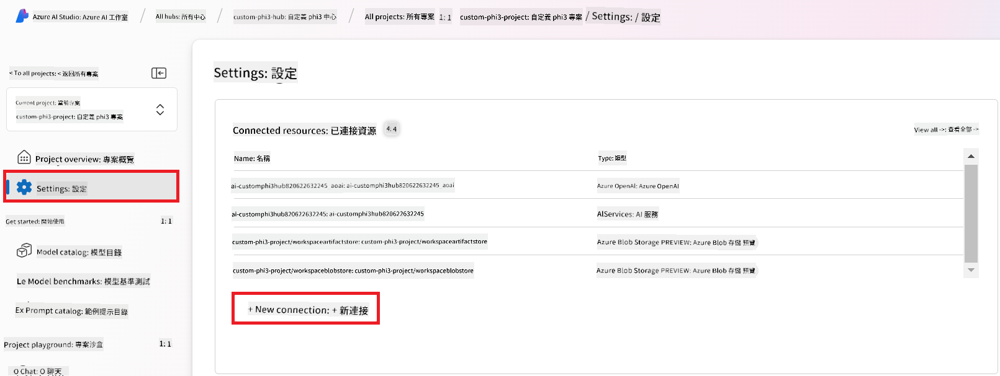

1. Select **Custom keys** from the navigation menu.

    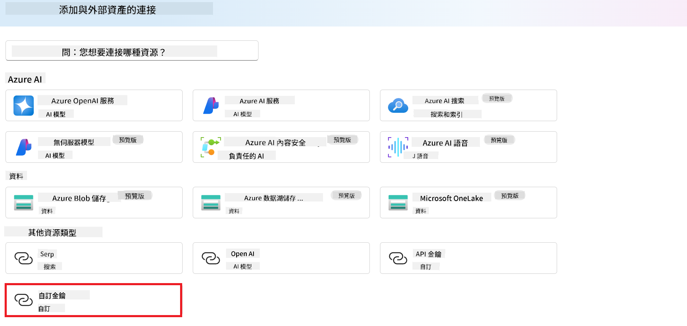

1. Perform the following tasks:

    - Select **+ Add key value pairs**.
    - For the key name, enter **endpoint** and paste the endpoint you copied from Azure ML Studio into the value field.
    - Select **+ Add key value pairs** again.
    - For the key name, enter **key** and paste the key you copied from Azure ML Studio into the value field.
    - After adding the keys, select **is secret** to prevent the key from being exposed.

    

1. Select **Add connection**.

#### Create Prompt flow

You have added a custom connection in Azure AI Foundry. Now, let's create a Prompt flow using the following steps. Then, you will connect this Prompt flow to the custom connection to use the fine-tuned model within the Prompt flow.

1. Navigate to the Azure AI Foundry project that you created.

1. Select **Prompt flow** from the left-side tab.

1. Select **+ Create** from the navigation menu.

    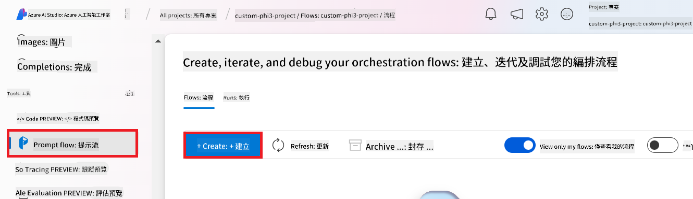

1. Select **Chat flow** from the navigation menu.

    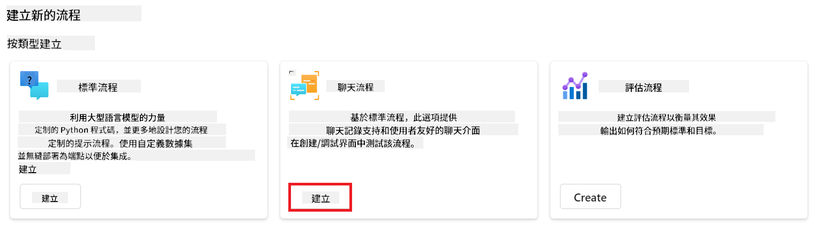

1. Enter **Folder name** to use.

    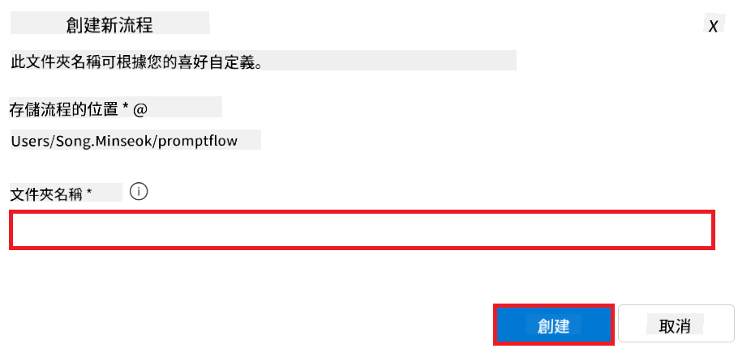

1. Select **Create**.

#### Set up Prompt flow to chat with your custom Phi-3 / Phi-3.5 model

You need to integrate the fine-tuned Phi-3 / Phi-3.5 model into a Prompt flow. However, the existing Prompt flow provided is not designed for this purpose. Therefore, you must redesign the Prompt flow to enable the integration of the custom model.

1. In the Prompt flow, perform the following tasks to rebuild the existing flow:

    - Select **Raw file mode**.
    - Delete all existing code in the *flow.dag.yml* file.
    - Add the following code to *flow.dag.yml*.

        ```yml
        inputs:
          input_data:
            type: string
            default: "Who founded Microsoft?"

        outputs:
          answer:
            type: string
            reference: ${integrate_with_promptflow.output}

        nodes:
        - name: integrate_with_promptflow
          type: python
          source:
            type: code
            path: integrate_with_promptflow.py
          inputs:
            input_data: ${inputs.input_data}
        ```

    - Select **Save**.

    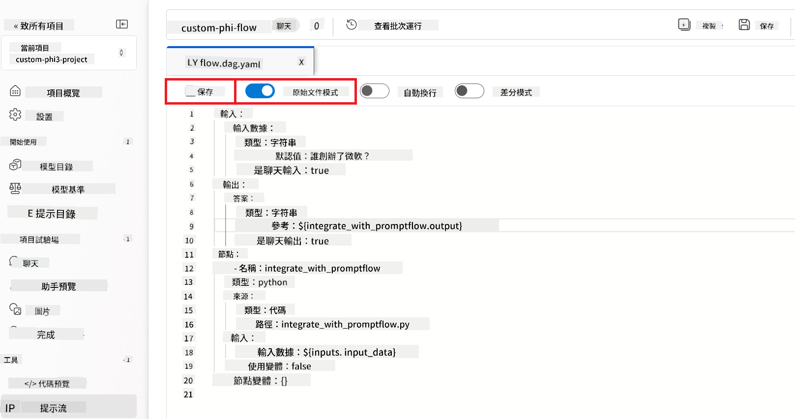

1. Add the following code to *integrate_with_promptflow.py* to use the custom Phi-3 / Phi-3.5 model in Prompt flow.

    ```python
    import logging
    import requests
    from promptflow import tool
    from promptflow.connections import CustomConnection

    # Logging setup
    logging.basicConfig(
        format="%(asctime)s - %(levelname)s - %(name)s - %(message)s",
        datefmt="%Y-%m-%d %H:%M:%S",
        level=logging.DEBUG
    )
    logger = logging.getLogger(__name__)

    def query_phi3_model(input_data: str, connection: CustomConnection) -> str:
        """
        Send a request to the Phi-3 / Phi-3.5 model endpoint with the given input data using Custom Connection.
        """

        # "connection" is the name of the Custom Connection, "endpoint", "key" are the keys in the Custom Connection
        endpoint_url = connection.endpoint
        api_key = connection.key

        headers = {
            "Content-Type": "application/json",
            "Authorization": f"Bearer {api_key}"
        }
    data = {
        "input_data": [input_data],
        "params": {
            "temperature": 0.7,
            "max_new_tokens": 128,
            "do_sample": True,
            "return_full_text": True
            }
        }
        try:
            response = requests.post(endpoint_url, json=data, headers=headers)
            response.raise_for_status()
            
            # Log the full JSON response
            logger.debug(f"Full JSON response: {response.json()}")

            result = response.json()["output"]
            logger.info("Successfully received response from Azure ML Endpoint.")
            return result
        except requests.exceptions.RequestException as e:
            logger.error(f"Error querying Azure ML Endpoint: {e}")
            raise

    @tool
    def my_python_tool(input_data: str, connection: CustomConnection) -> str:
        """
        Tool function to process input data and query the Phi-3 / Phi-3.5 model.
        """
        return query_phi3_model(input_data, connection)

    ```

    

> [!NOTE]
> For more detailed information on using Prompt flow in Azure AI Foundry, you can refer to [Prompt flow in Azure AI Foundry](https://learn.microsoft.com/azure/ai-studio/how-to/prompt-flow).

1. Select **Chat input**, **Chat output** to enable chat with your model.

    

1. Now you are ready to chat with your custom Phi-3 / Phi-3.5 model. In the next exercise, you will learn how to start Prompt flow and use it to chat with your fine-tuned Phi-3 / Phi-3.5 model.

> [!NOTE]
>
> The rebuilt flow should look like the image below:
>
> 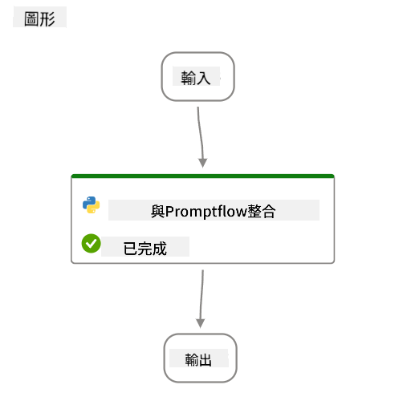
>

#### Start Prompt flow

1. Select **Start compute sessions** to start Prompt flow.

    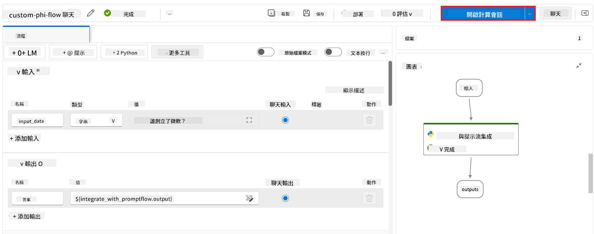

1. Select **Validate and parse input** to renew parameters.

    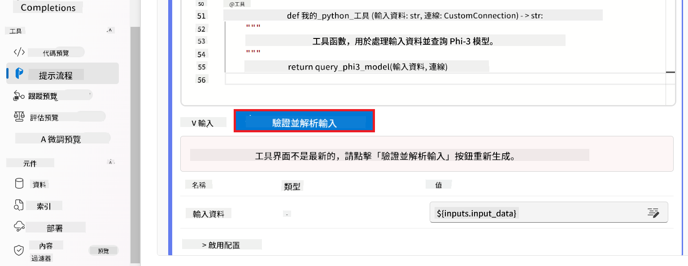

1. Select the **Value** of the **connection** to the custom connection you created. For example, *connection*.

    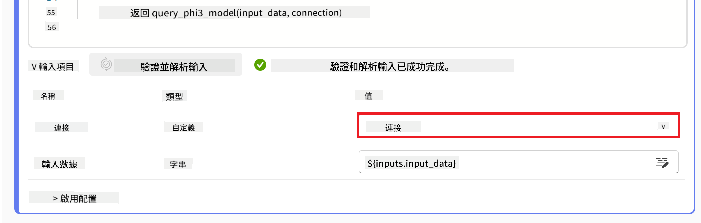

#### Chat with your custom Phi-3 / Phi-3.5 model

1. Select **Chat**.

    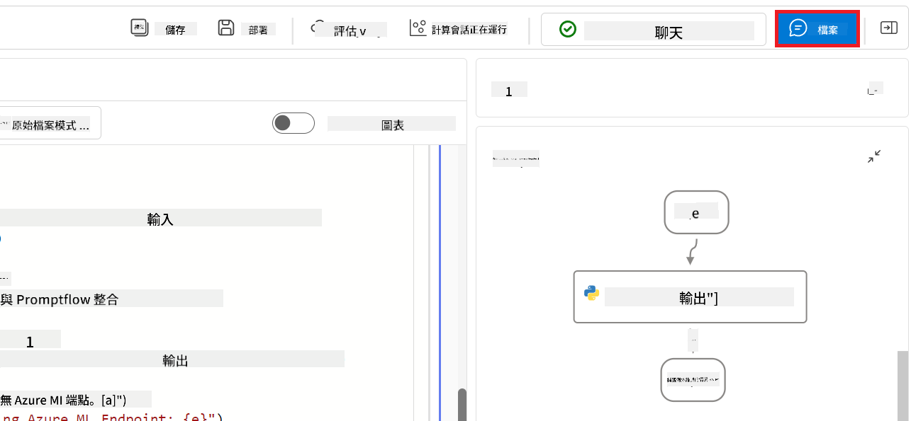

1. Here's an example of the results: Now you can chat with your custom Phi-3 / Phi-3.5 model. It is recommended to ask questions based on the data used for fine-tuning.

    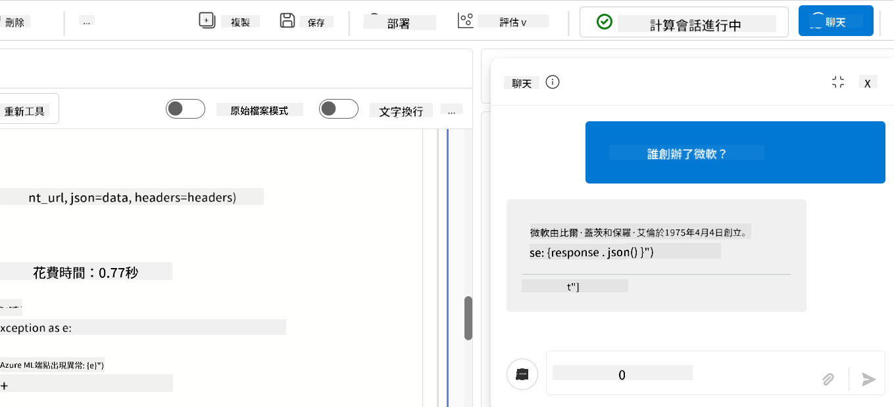

### Deploy Azure OpenAI to evaluate the Phi-3 / Phi-3.5 model

To evaluate the Phi-3 / Phi-3.5 model in Azure AI Foundry, you need to deploy an Azure OpenAI model. This model will be used to evaluate the performance of the Phi-3 / Phi-3.5 model.

#### Deploy Azure OpenAI

1. Sign in to [Azure AI Foundry](https://ai.azure.com/?wt.mc_id=studentamb_279723).

1. Navigate to the Azure AI Foundry project that you created.

    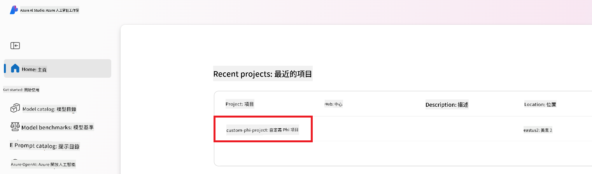

1. In the Project that you created, select **Deployments** from the left-side tab.

1. Select **+ Deploy model** from the navigation menu.

1. Select **Deploy base model**.

    

1. Select Azure OpenAI model you'd like to use. For example, **gpt-4o**.

    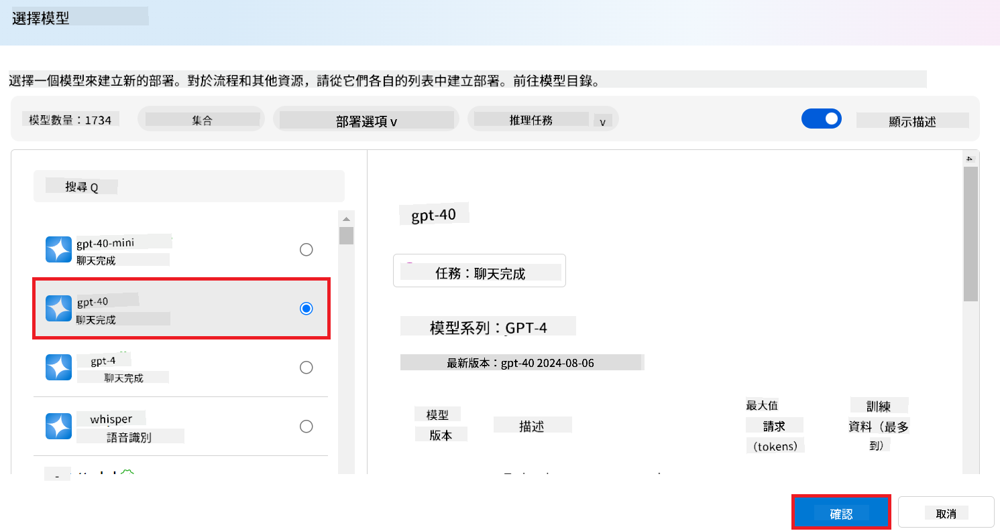

1. Select **Confirm**.

### Evaluate the fine-tuned Phi-3 / Phi-3.5 model using Azure AI Foundry's Prompt flow evaluation

### Start a new evaluation

1. Visit [Azure AI Foundry](https://ai.azure.com/?wt.mc_id=studentamb_279723).

1. Navigate to the Azure AI Foundry project that you created.

    

1. In the Project that you created, select **Evaluation** from the left-side tab.

1. Select **+ New evaluation** from the navigation menu.
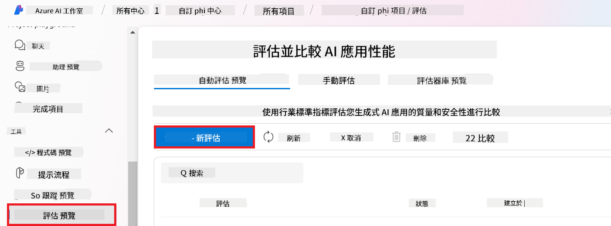

1. Chọn **Prompt flow** evaluation.

    

1. Thực hiện các bước sau:

    - Nhập tên đánh giá. Tên này phải là duy nhất.
    - Chọn **Question and answer without context** làm loại nhiệm vụ. Vì tập dữ liệu **UlTRACHAT_200k** được sử dụng trong hướng dẫn này không chứa ngữ cảnh.
    - Chọn luồng Prompt flow mà bạn muốn đánh giá.

    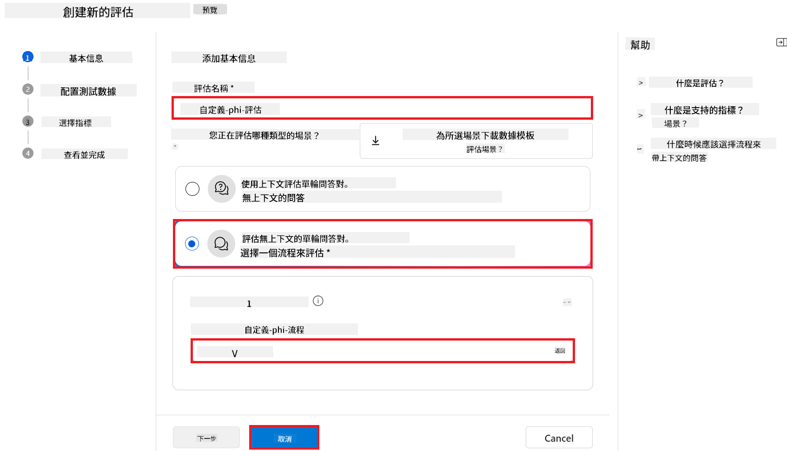

1. Chọn **Next**.

1. Thực hiện các bước sau:

    - Chọn **Add your dataset** để tải tập dữ liệu lên. Ví dụ, bạn có thể tải tệp tập dữ liệu kiểm tra, chẳng hạn như *test_data.json1*, được bao gồm khi bạn tải xuống tập dữ liệu **ULTRACHAT_200k**.
    - Chọn **Dataset column** phù hợp với tập dữ liệu của bạn. Ví dụ, nếu bạn sử dụng tập dữ liệu **ULTRACHAT_200k**, hãy chọn **${data.prompt}** làm cột dữ liệu.

    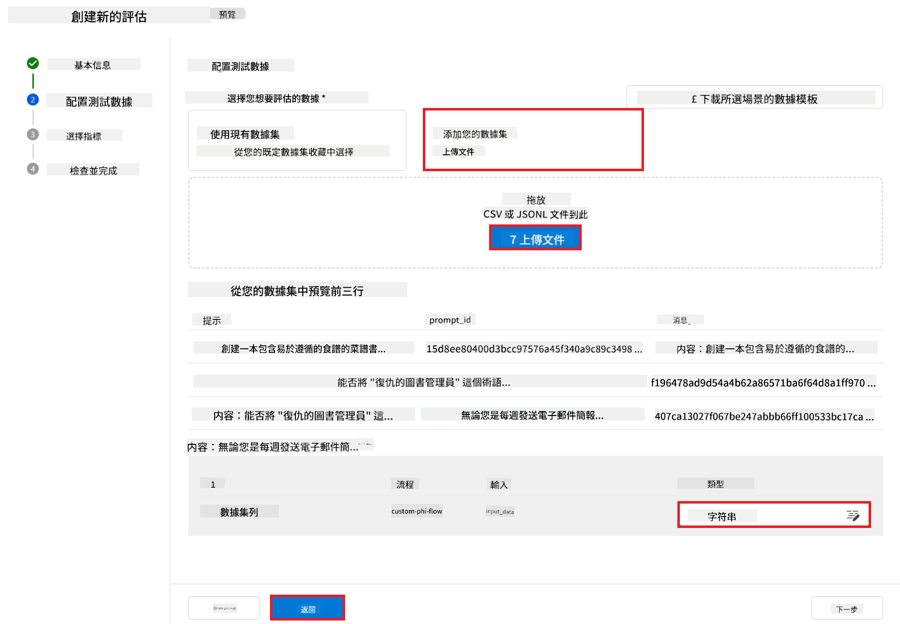

1. Chọn **Next**.

1. Thực hiện các bước sau để cấu hình các chỉ số hiệu suất và chất lượng:

    - Chọn các chỉ số hiệu suất và chất lượng mà bạn muốn sử dụng.
    - Chọn mô hình Azure OpenAI mà bạn đã tạo để đánh giá. Ví dụ, chọn **gpt-4o**.

    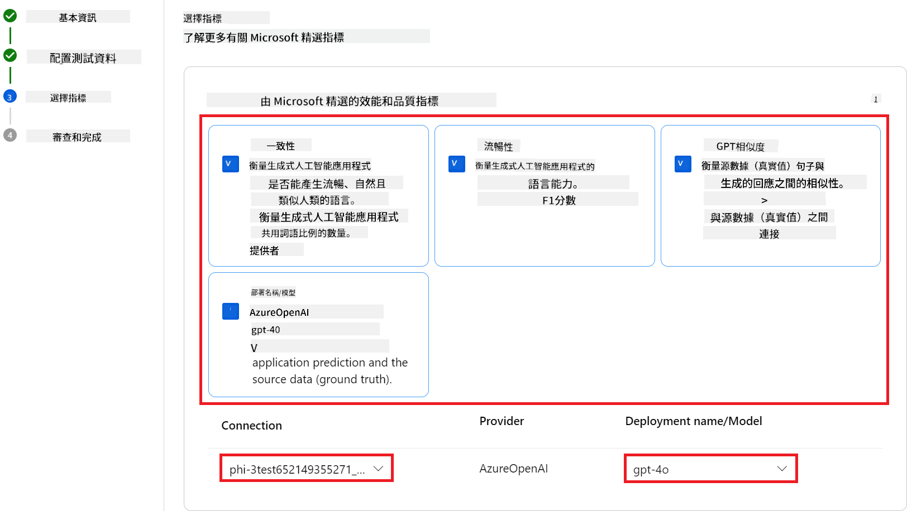

1. Thực hiện các bước sau để cấu hình các chỉ số rủi ro và an toàn:

    - Chọn các chỉ số rủi ro và an toàn mà bạn muốn sử dụng.
    - Chọn ngưỡng để tính tỷ lệ lỗi mà bạn muốn sử dụng. Ví dụ, chọn **Medium**.
    - Đối với **question**, chọn **Data source** là **{$data.prompt}**.
    - Đối với **answer**, chọn **Data source** là **{$run.outputs.answer}**.
    - Đối với **ground_truth**, chọn **Data source** là **{$data.message}**.

    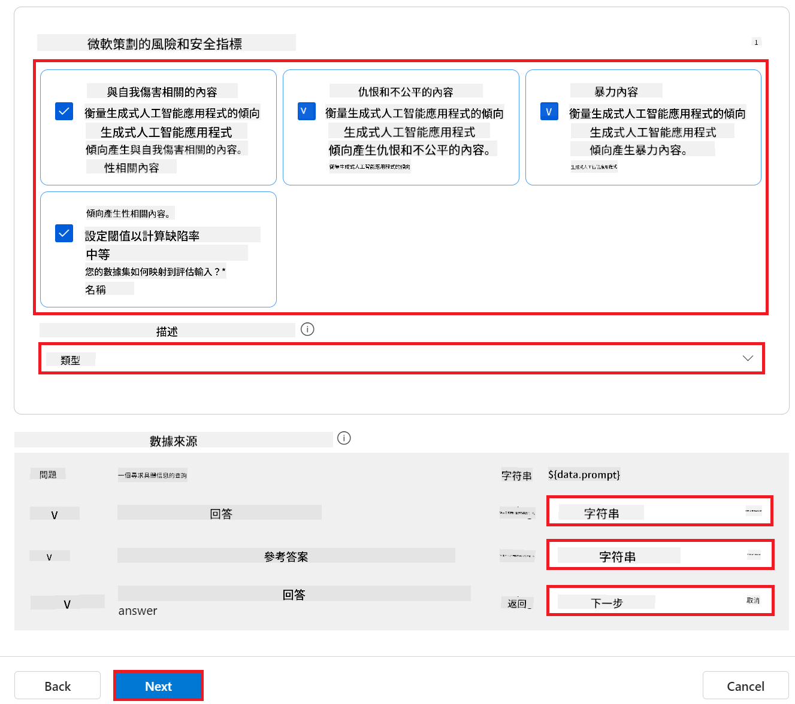

1. Chọn **Next**.

1. Chọn **Submit** để bắt đầu đánh giá.

1. Quá trình đánh giá sẽ mất một thời gian để hoàn thành. Bạn có thể theo dõi tiến trình trong tab **Evaluation**.

### Xem lại Kết quả Đánh giá

> [!NOTE]
> Các kết quả được trình bày dưới đây nhằm minh họa quy trình đánh giá. Trong hướng dẫn này, chúng tôi đã sử dụng một mô hình được tinh chỉnh trên một tập dữ liệu tương đối nhỏ, điều này có thể dẫn đến kết quả chưa tối ưu. Kết quả thực tế có thể khác biệt đáng kể tùy thuộc vào kích thước, chất lượng và tính đa dạng của tập dữ liệu được sử dụng, cũng như cấu hình cụ thể của mô hình.

Khi đánh giá hoàn tất, bạn có thể xem lại kết quả cho cả chỉ số hiệu suất và an toàn.

1. Chỉ số hiệu suất và chất lượng:

    - Đánh giá khả năng của mô hình trong việc tạo ra các phản hồi mạch lạc, lưu loát và phù hợp.

    

1. Chỉ số rủi ro và an toàn:

    - Đảm bảo rằng đầu ra của mô hình an toàn và tuân theo Nguyên tắc AI Trách nhiệm, tránh bất kỳ nội dung có hại hoặc xúc phạm nào.

    

1. Bạn có thể cuộn xuống để xem **Kết quả chỉ số chi tiết**.

    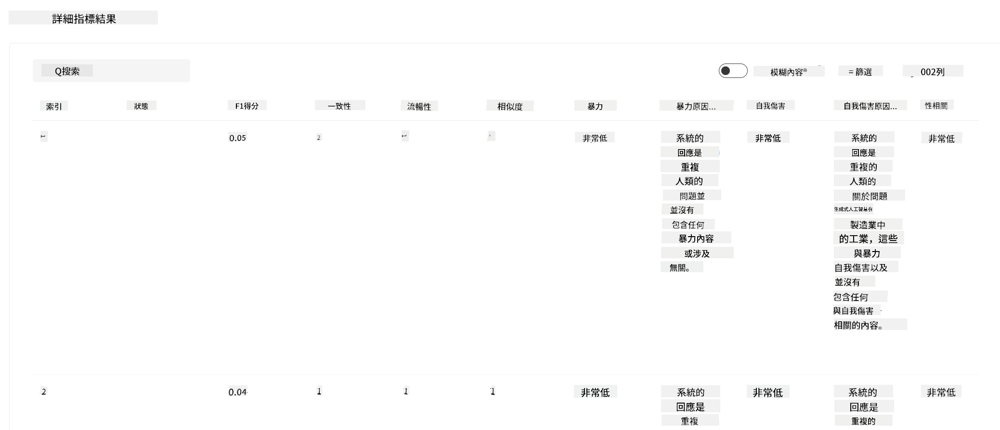

1. Bằng cách đánh giá mô hình Phi-3 / Phi-3.5 tùy chỉnh của bạn dựa trên cả chỉ số hiệu suất và an toàn, bạn có thể xác nhận rằng mô hình không chỉ hiệu quả mà còn tuân thủ các thực hành AI trách nhiệm, sẵn sàng cho triển khai thực tế.

## Chúc mừng!

### Bạn đã hoàn thành hướng dẫn này

Bạn đã đánh giá thành công mô hình Phi-3 được tinh chỉnh, tích hợp với Prompt flow trong Azure AI Foundry. Đây là một bước quan trọng để đảm bảo rằng các mô hình AI của bạn không chỉ hoạt động tốt mà còn tuân thủ các nguyên tắc AI Trách nhiệm của Microsoft, giúp bạn xây dựng các ứng dụng AI đáng tin cậy và đáng tin cậy.


## Dọn Dẹp Tài Nguyên Azure

Dọn dẹp tài nguyên Azure của bạn để tránh các khoản phí bổ sung cho tài khoản của bạn. Truy cập cổng Azure và xóa các tài nguyên sau:

- Tài nguyên Azure Machine learning.
- Endpoint mô hình Azure Machine learning.
- Tài nguyên Dự án Azure AI Foundry.
- Tài nguyên Prompt flow của Azure AI Foundry.

### Bước Tiếp Theo

#### Tài liệu

- [Đánh giá hệ thống AI bằng bảng điều khiển AI Trách nhiệm](https://learn.microsoft.com/azure/machine-learning/concept-responsible-ai-dashboard?view=azureml-api-2&source=recommendations?wt.mc_id=studentamb_279723)
- [Chỉ số đánh giá và giám sát cho AI tạo sinh](https://learn.microsoft.com/azure/ai-studio/concepts/evaluation-metrics-built-in?tabs=definition?wt.mc_id=studentamb_279723)
- [Tài liệu Azure AI Foundry](https://learn.microsoft.com/azure/ai-studio/?wt.mc_id=studentamb_279723)
- [Tài liệu Prompt flow](https://microsoft.github.io/promptflow/?wt.mc_id=studentamb_279723)

#### Nội dung đào tạo

- [Giới thiệu về Cách tiếp cận AI Trách nhiệm của Microsoft](https://learn.microsoft.com/training/modules/introduction-to-microsofts-responsible-ai-approach/?source=recommendations?wt.mc_id=studentamb_279723)
- [Giới thiệu về Azure AI Foundry](https://learn.microsoft.com/training/modules/introduction-to-azure-ai-studio/?wt.mc_id=studentamb_279723)

### Tham khảo

- [AI Trách nhiệm là gì?](https://learn.microsoft.com/azure/machine-learning/concept-responsible-ai?view=azureml-api-2?wt.mc_id=studentamb_279723)
- [Thông báo các công cụ mới trong Azure AI giúp bạn xây dựng các ứng dụng AI tạo sinh an toàn và đáng tin cậy hơn](https://azure.microsoft.com/blog/announcing-new-tools-in-azure-ai-to-help-you-build-more-secure-and-trustworthy-generative-ai-applications/?wt.mc_id=studentamb_279723)
- [Đánh giá các ứng dụng AI tạo sinh](https://learn.microsoft.com/azure/ai-studio/concepts/evaluation-approach-gen-ai?wt.mc_id%3Dstudentamb_279723)

It seems like you want the text translated to "mo," but could you clarify what "mo" refers to? Are you asking for translation into Maori, Mongolian, or another language?