<!--
CO_OP_TRANSLATOR_METADATA:
{
  "original_hash": "80a853c08e4ee25ef9b4bfcedd8990da",
  "translation_date": "2025-05-07T14:25:53+00:00",
  "source_file": "md/02.Application/01.TextAndChat/Phi3/E2E_Phi-3-Evaluation_AIFoundry.md",
  "language_code": "mo"
}
-->
# Evaluate the Fine-tuned Phi-3 / Phi-3.5 Model in Azure AI Foundry Focusing on Microsoft's Responsible AI Principles

This end-to-end (E2E) sample is based on the guide "[Evaluate Fine-tuned Phi-3 / 3.5 Models in Azure AI Foundry Focusing on Microsoft's Responsible AI](https://techcommunity.microsoft.com/blog/educatordeveloperblog/evaluate-fine-tuned-phi-3--3-5-models-in-azure-ai-studio-focusing-on-microsofts-/4227850?WT.mc_id=aiml-137032-kinfeylo)" from the Microsoft Tech Community.

## Overview

### How can you evaluate the safety and performance of a fine-tuned Phi-3 / Phi-3.5 model in Azure AI Foundry?

Fine-tuning a model can sometimes lead to unintended or undesired responses. To make sure the model stays safe and effective, it's important to assess its potential to generate harmful content and its ability to deliver accurate, relevant, and coherent answers. In this tutorial, you'll learn how to evaluate the safety and performance of a fine-tuned Phi-3 / Phi-3.5 model integrated with Prompt flow in Azure AI Foundry.

Here is Azure AI Foundry's evaluation process.

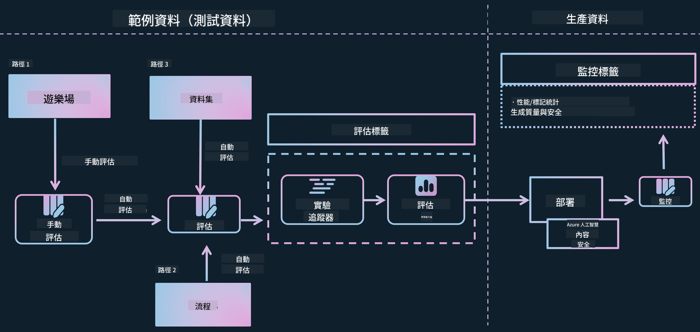

*Image Source: [Evaluation of generative AI applications](https://learn.microsoft.com/azure/ai-studio/concepts/evaluation-approach-gen-ai?wt.mc_id%3Dstudentamb_279723)*

> [!NOTE]
>
> For more detailed information and additional resources about Phi-3 / Phi-3.5, please visit the [Phi-3CookBook](https://github.com/microsoft/Phi-3CookBook?wt.mc_id=studentamb_279723).

### Prerequisites

- [Python](https://www.python.org/downloads)
- [Azure subscription](https://azure.microsoft.com/free?wt.mc_id=studentamb_279723)
- [Visual Studio Code](https://code.visualstudio.com)
- Fine-tuned Phi-3 / Phi-3.5 model

### Table of Contents

1. [**Scenario 1: Introduction to Azure AI Foundry's Prompt flow evaluation**](../../../../../../md/02.Application/01.TextAndChat/Phi3)

    - [Introduction to safety evaluation](../../../../../../md/02.Application/01.TextAndChat/Phi3)
    - [Introduction to performance evaluation](../../../../../../md/02.Application/01.TextAndChat/Phi3)

1. [**Scenario 2: Evaluating the Phi-3 / Phi-3.5 model in Azure AI Foundry**](../../../../../../md/02.Application/01.TextAndChat/Phi3)

    - [Before you begin](../../../../../../md/02.Application/01.TextAndChat/Phi3)
    - [Deploy Azure OpenAI to evaluate the Phi-3 / Phi-3.5 model](../../../../../../md/02.Application/01.TextAndChat/Phi3)
    - [Evaluate the fine-tuned Phi-3 / Phi-3.5 model using Azure AI Foundry's Prompt flow evaluation](../../../../../../md/02.Application/01.TextAndChat/Phi3)

1. [Congratulations!](../../../../../../md/02.Application/01.TextAndChat/Phi3)

## **Scenario 1: Introduction to Azure AI Foundry's Prompt flow evaluation**

### Introduction to safety evaluation

To ensure your AI model is ethical and safe, it's essential to evaluate it against Microsoft's Responsible AI Principles. In Azure AI Foundry, safety evaluations let you check your model’s vulnerability to jailbreak attacks and its potential to produce harmful content, which aligns directly with these principles.


*Image Source: [Evaluation of generative AI applications](https://learn.microsoft.com/azure/ai-studio/concepts/evaluation-approach-gen-ai?wt.mc_id%3Dstudentamb_279723)*

#### Microsoft’s Responsible AI Principles

Before starting the technical steps, it's important to understand Microsoft's Responsible AI Principles, an ethical framework designed to guide responsible development, deployment, and operation of AI systems. These principles steer the design, development, and deployment of AI systems to ensure they are fair, transparent, and inclusive. They form the foundation for evaluating AI model safety.

Microsoft's Responsible AI Principles include:

- **Fairness and Inclusiveness**: AI systems should treat everyone fairly and avoid treating similar groups differently. For example, when AI systems provide advice on medical treatment, loan applications, or hiring, they should give consistent recommendations to all with similar symptoms, financial situations, or qualifications.

- **Reliability and Safety**: To build trust, AI systems must operate reliably, safely, and consistently. They should work as intended, respond safely to unexpected conditions, and resist harmful manipulation. Their behavior and the conditions they handle reflect what developers anticipated during design and testing.

- **Transparency**: When AI helps make decisions that deeply affect people’s lives, it’s crucial that people understand how those decisions are made. For example, a bank might use AI to decide creditworthiness, or a company might use it to pick the best candidates to hire.

- **Privacy and Security**: As AI becomes more widespread, protecting privacy and securing personal and business data becomes increasingly important and complex. Privacy and data security require close attention because AI systems need access to data to make accurate and informed predictions and decisions.

- **Accountability**: Designers and deployers of AI systems must be accountable for how their systems perform. Organizations should follow industry standards to establish accountability norms. These norms ensure AI systems don’t have the final say on decisions affecting people’s lives and that humans maintain meaningful control over highly autonomous AI systems.

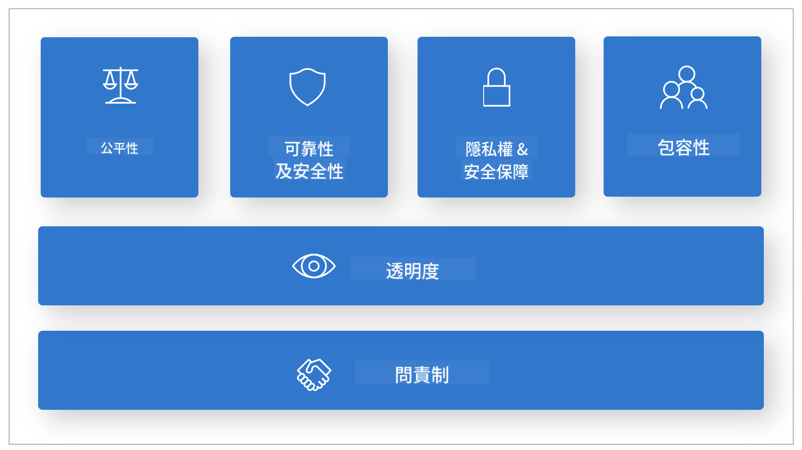

*Image Source: [What is Responsible AI?](https://learn.microsoft.com/azure/machine-learning/concept-responsible-ai?view=azureml-api-2&viewFallbackFrom=azureml-api-2%253fwt.mc_id%3Dstudentamb_279723)*

> [!NOTE]
> To learn more about Microsoft's Responsible AI Principles, visit [What is Responsible AI?](https://learn.microsoft.com/azure/machine-learning/concept-responsible-ai?view=azureml-api-2?wt.mc_id=studentamb_279723).

#### Safety metrics

In this tutorial, you will assess the safety of the fine-tuned Phi-3 model using Azure AI Foundry's safety metrics. These metrics help determine the model's likelihood of generating harmful content and its vulnerability to jailbreak attacks. The safety metrics include:

- **Self-harm-related Content**: Checks if the model tends to produce self-harm related content.
- **Hateful and Unfair Content**: Checks if the model tends to produce hateful or unfair content.
- **Violent Content**: Checks if the model tends to produce violent content.
- **Sexual Content**: Checks if the model tends to produce inappropriate sexual content.

Evaluating these aspects ensures the AI model does not generate harmful or offensive content, aligning with societal values and regulations.

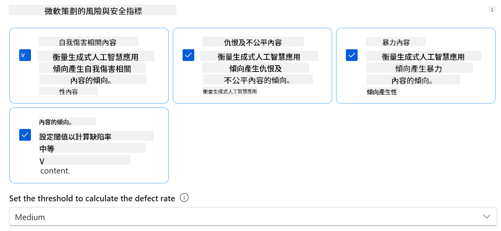

### Introduction to performance evaluation

To confirm your AI model performs as expected, it’s important to assess it using performance metrics. In Azure AI Foundry, performance evaluations measure how effectively your model generates accurate, relevant, and coherent responses.


*Image Source: [Evaluation of generative AI applications](https://learn.microsoft.com/azure/ai-studio/concepts/evaluation-approach-gen-ai?wt.mc_id%3Dstudentamb_279723)*

#### Performance metrics

In this tutorial, you will evaluate the performance of the fine-tuned Phi-3 / Phi-3.5 model using Azure AI Foundry's performance metrics. These help assess how well the model generates accurate, relevant, and coherent answers. The performance metrics include:

- **Groundedness**: Measures how well the answers align with the input source information.
- **Relevance**: Assesses how pertinent the responses are to the questions asked.
- **Coherence**: Evaluates how smoothly the text flows, reads naturally, and resembles human language.
- **Fluency**: Measures the language proficiency of the generated text.
- **GPT Similarity**: Compares the generated response with the ground truth for similarity.
- **F1 Score**: Calculates the overlap ratio of words between the generated response and the source data.

These metrics help determine the model's ability to produce accurate, relevant, and coherent responses.

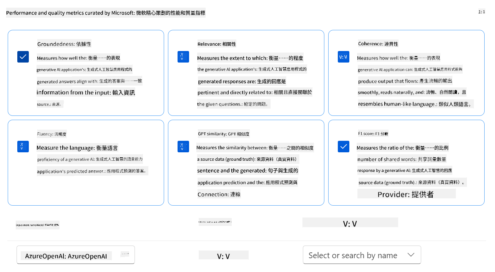

## **Scenario 2: Evaluating the Phi-3 / Phi-3.5 model in Azure AI Foundry**

### Before you begin

This tutorial follows the previous blog posts, "[Fine-Tune and Integrate Custom Phi-3 Models with Prompt Flow: Step-by-Step Guide](https://techcommunity.microsoft.com/t5/educator-developer-blog/fine-tune-and-integrate-custom-phi-3-models-with-prompt-flow/ba-p/4178612?wt.mc_id=studentamb_279723)" and "[Fine-Tune and Integrate Custom Phi-3 Models with Prompt Flow in Azure AI Foundry](https://techcommunity.microsoft.com/t5/educator-developer-blog/fine-tune-and-integrate-custom-phi-3-models-with-prompt-flow-in/ba-p/4191726?wt.mc_id=studentamb_279723)." In those posts, we walked through fine-tuning a Phi-3 / Phi-3.5 model in Azure AI Foundry and integrating it with Prompt flow.

In this tutorial, you will deploy an Azure OpenAI model as an evaluator in Azure AI Foundry and use it to evaluate your fine-tuned Phi-3 / Phi-3.5 model.

Before starting, ensure you have the following prerequisites, as described in the earlier tutorials:

1. A prepared dataset to evaluate the fine-tuned Phi-3 / Phi-3.5 model.
1. A Phi-3 / Phi-3.5 model fine-tuned and deployed to Azure Machine Learning.
1. A Prompt flow integrated with your fine-tuned Phi-3 / Phi-3.5 model in Azure AI Foundry.

> [!NOTE]
> You will use the *test_data.jsonl* file from the data folder in the **ULTRACHAT_200k** dataset downloaded in the previous blog posts as the evaluation dataset for the fine-tuned Phi-3 / Phi-3.5 model.

#### Integrate the custom Phi-3 / Phi-3.5 model with Prompt flow in Azure AI Foundry (Code first approach)

> [!NOTE]
> If you followed the low-code approach described in "[Fine-Tune and Integrate Custom Phi-3 Models with Prompt Flow in Azure AI Foundry](https://techcommunity.microsoft.com/t5/educator-developer-blog/fine-tune-and-integrate-custom-phi-3-models-with-prompt-flow-in/ba-p/4191726?wt.mc_id=studentamb_279723)", you can skip this exercise and move on.
> However, if you followed the code-first approach described in "[Fine-Tune and Integrate Custom Phi-3 Models with Prompt Flow: Step-by-Step Guide](https://techcommunity.microsoft.com/t5/educator-developer-blog/fine-tune-and-integrate-custom-phi-3-models-with-prompt-flow/ba-p/4178612?wt.mc_id=studentamb_279723)" to fine-tune and deploy your Phi-3 / Phi-3.5 model, the way you connect your model to Prompt flow differs slightly. You will learn that process here.

To proceed, you need to integrate your fine-tuned Phi-3 / Phi-3.5 model into Prompt flow in Azure AI Foundry.

#### Create Azure AI Foundry Hub

You must create a Hub before creating a Project. A Hub acts like a Resource Group, helping you organize and manage multiple Projects within Azure AI Foundry.

1. Sign in to [Azure AI Foundry](https://ai.azure.com/?wt.mc_id=studentamb_279723).

1. Select **All hubs** from the left-hand tab.

1. Select **+ New hub** from the navigation menu.

    

1. Complete the following:

    - Enter a unique **Hub name**.
    - Select your Azure **Subscription**.
    - Choose the **Resource group** to use (or create a new one).
    - Select the **Location** you want to use.
    - Select **Connect Azure AI Services** (or create a new one).
    - For **Connect Azure AI Search**, select **Skip connecting**.


1. เลือก **Next**

#### สร้างโครงการ Azure AI Foundry

1. ใน Hub ที่คุณสร้างขึ้น ให้เลือก **All projects** จากแท็บด้านซ้าย

1. เลือก **+ New project** จากเมนูนำทาง

    

1. กรอก **Project name** โดยต้องเป็นค่าที่ไม่ซ้ำกัน

    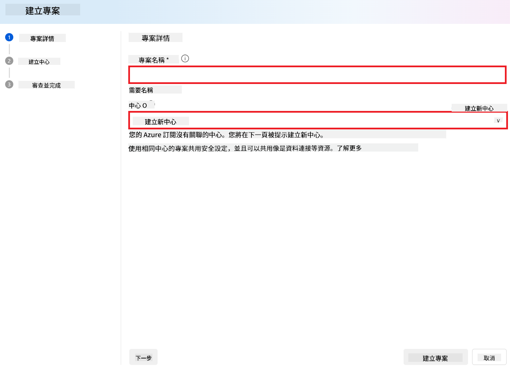

1. เลือก **Create a project**

#### เพิ่มการเชื่อมต่อแบบกำหนดเองสำหรับโมเดล Phi-3 / Phi-3.5 ที่ผ่านการปรับแต่ง

เพื่อเชื่อมต่อโมเดล Phi-3 / Phi-3.5 ที่ปรับแต่งเองกับ Prompt flow คุณต้องบันทึก endpoint และ key ของโมเดลในการเชื่อมต่อแบบกำหนดเอง เพื่อให้สามารถเข้าถึงโมเดล Phi-3 / Phi-3.5 ที่ปรับแต่งได้ใน Prompt flow

#### ตั้งค่า api key และ endpoint uri ของโมเดล Phi-3 / Phi-3.5 ที่ผ่านการปรับแต่ง

1. เข้าชม [Azure ML Studio](https://ml.azure.com/home?wt.mc_id=studentamb_279723)

1. ไปยัง Azure Machine learning workspace ที่คุณสร้างไว้

1. เลือก **Endpoints** จากแท็บด้านซ้าย

    

1. เลือก endpoint ที่คุณสร้างไว้

    

1. เลือก **Consume** จากเมนูนำทาง

1. คัดลอก **REST endpoint** และ **Primary key**

    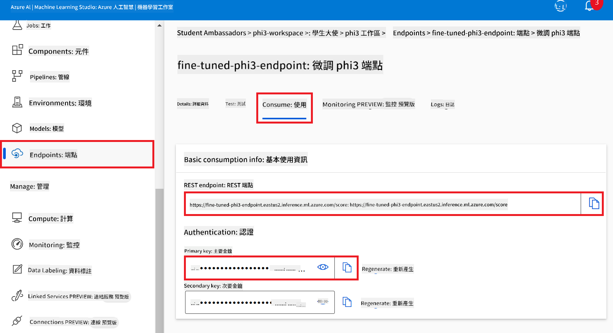

#### เพิ่มการเชื่อมต่อแบบกำหนดเอง

1. เข้าชม [Azure AI Foundry](https://ai.azure.com/?wt.mc_id=studentamb_279723)

1. ไปยังโครงการ Azure AI Foundry ที่คุณสร้างไว้

1. ในโครงการที่คุณสร้าง เลือก **Settings** จากแท็บด้านซ้าย

1. เลือก **+ New connection**

    

1. เลือก **Custom keys** จากเมนูนำทาง

    

1. ทำตามขั้นตอนต่อไปนี้:

    - เลือก **+ Add key value pairs**
    - สำหรับชื่อ key ให้กรอก **endpoint** และวาง endpoint ที่คัดลอกจาก Azure ML Studio ลงในช่องค่า
    - เลือก **+ Add key value pairs** อีกครั้ง
    - สำหรับชื่อ key ให้กรอก **key** และวาง key ที่คัดลอกจาก Azure ML Studio ลงในช่องค่า
    - หลังจากเพิ่ม key แล้ว ให้เลือก **is secret** เพื่อป้องกันไม่ให้ key ถูกเปิดเผย

    

1. เลือก **Add connection**

#### สร้าง Prompt flow

คุณได้เพิ่มการเชื่อมต่อแบบกำหนดเองใน Azure AI Foundry แล้ว ตอนนี้มาสร้าง Prompt flow โดยทำตามขั้นตอนดังนี้ จากนั้นจะเชื่อมต่อ Prompt flow นี้กับการเชื่อมต่อแบบกำหนดเองเพื่อใช้โมเดลที่ปรับแต่งภายใน Prompt flow

1. ไปยังโครงการ Azure AI Foundry ที่คุณสร้างไว้

1. เลือก **Prompt flow** จากแท็บด้านซ้าย

1. เลือก **+ Create** จากเมนูนำทาง

    

1. เลือก **Chat flow** จากเมนูนำทาง

    

1. กรอก **Folder name** ที่ต้องการใช้

    

1. เลือก **Create**

#### ตั้งค่า Prompt flow เพื่อสนทนากับโมเดล Phi-3 / Phi-3.5 ที่ปรับแต่งเอง

คุณต้องผสานโมเดล Phi-3 / Phi-3.5 ที่ปรับแต่งแล้วเข้ากับ Prompt flow อย่างไรก็ตาม Prompt flow ที่มีอยู่เดิมไม่ได้ออกแบบมาสำหรับจุดประสงค์นี้ ดังนั้นคุณต้องออกแบบ Prompt flow ใหม่เพื่อให้สามารถเชื่อมต่อกับโมเดลที่กำหนดเองได้

1. ใน Prompt flow ให้ทำตามขั้นตอนต่อไปนี้เพื่อตั้งค่า flow ใหม่:

    - เลือก **Raw file mode**
    - ลบโค้ดทั้งหมดในไฟล์ *flow.dag.yml* ออก
    - เพิ่มโค้ดดังต่อไปนี้ลงใน *flow.dag.yml*

        ```yml
        inputs:
          input_data:
            type: string
            default: "Who founded Microsoft?"

        outputs:
          answer:
            type: string
            reference: ${integrate_with_promptflow.output}

        nodes:
        - name: integrate_with_promptflow
          type: python
          source:
            type: code
            path: integrate_with_promptflow.py
          inputs:
            input_data: ${inputs.input_data}
        ```

    - เลือก **Save**

    

1. เพิ่มโค้ดต่อไปนี้ใน *integrate_with_promptflow.py* เพื่อใช้โมเดล Phi-3 / Phi-3.5 ที่กำหนดเองใน Prompt flow

    ```python
    import logging
    import requests
    from promptflow import tool
    from promptflow.connections import CustomConnection

    # Logging setup
    logging.basicConfig(
        format="%(asctime)s - %(levelname)s - %(name)s - %(message)s",
        datefmt="%Y-%m-%d %H:%M:%S",
        level=logging.DEBUG
    )
    logger = logging.getLogger(__name__)

    def query_phi3_model(input_data: str, connection: CustomConnection) -> str:
        """
        Send a request to the Phi-3 / Phi-3.5 model endpoint with the given input data using Custom Connection.
        """

        # "connection" is the name of the Custom Connection, "endpoint", "key" are the keys in the Custom Connection
        endpoint_url = connection.endpoint
        api_key = connection.key

        headers = {
            "Content-Type": "application/json",
            "Authorization": f"Bearer {api_key}"
        }
    data = {
        "input_data": [input_data],
        "params": {
            "temperature": 0.7,
            "max_new_tokens": 128,
            "do_sample": True,
            "return_full_text": True
            }
        }
        try:
            response = requests.post(endpoint_url, json=data, headers=headers)
            response.raise_for_status()
            
            # Log the full JSON response
            logger.debug(f"Full JSON response: {response.json()}")

            result = response.json()["output"]
            logger.info("Successfully received response from Azure ML Endpoint.")
            return result
        except requests.exceptions.RequestException as e:
            logger.error(f"Error querying Azure ML Endpoint: {e}")
            raise

    @tool
    def my_python_tool(input_data: str, connection: CustomConnection) -> str:
        """
        Tool function to process input data and query the Phi-3 / Phi-3.5 model.
        """
        return query_phi3_model(input_data, connection)

    ```

    

> [!NOTE]
> สำหรับข้อมูลเพิ่มเติมเกี่ยวกับการใช้ Prompt flow ใน Azure AI Foundry คุณสามารถดูได้ที่ [Prompt flow in Azure AI Foundry](https://learn.microsoft.com/azure/ai-studio/how-to/prompt-flow)

1. เลือก **Chat input**, **Chat output** เพื่อเปิดใช้งานการสนทนากับโมเดลของคุณ

    

1. ตอนนี้คุณพร้อมที่จะสนทนากับโมเดล Phi-3 / Phi-3.5 ที่ปรับแต่งเองแล้ว ในแบบฝึกหัดถัดไป คุณจะได้เรียนรู้วิธีเริ่มต้น Prompt flow และใช้งานเพื่อสนทนากับโมเดลที่ปรับแต่ง

> [!NOTE]
>
> Flow ที่สร้างใหม่ควรมีลักษณะเหมือนภาพด้านล่าง:
>
> 
>

#### เริ่มต้น Prompt flow

1. เลือก **Start compute sessions** เพื่อเริ่ม Prompt flow

    

1. เลือก **Validate and parse input** เพื่อรีเฟรชพารามิเตอร์

    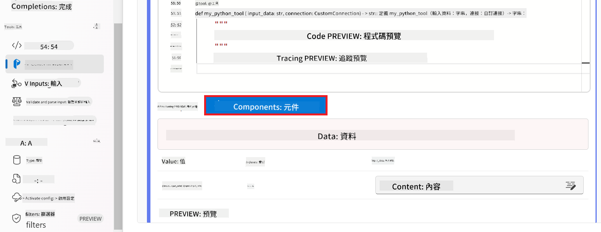

1. เลือก **Value** ของ **connection** ไปยังการเชื่อมต่อแบบกำหนดเองที่คุณสร้าง เช่น *connection*

    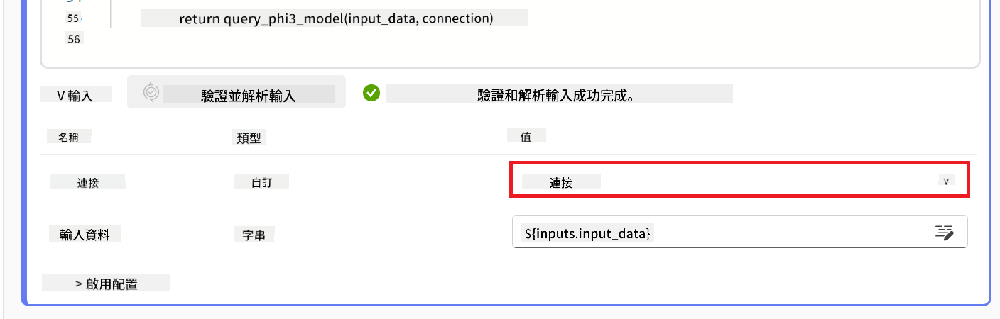

#### สนทนากับโมเดล Phi-3 / Phi-3.5 ที่ปรับแต่งเอง

1. เลือก **Chat**

    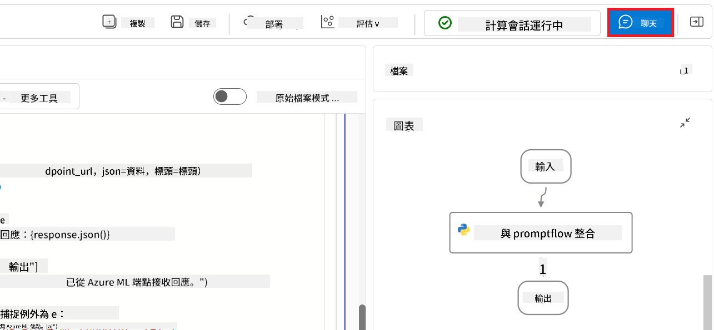

1. นี่คือตัวอย่างผลลัพธ์: ตอนนี้คุณสามารถสนทนากับโมเดล Phi-3 / Phi-3.5 ที่ปรับแต่งเองได้ แนะนำให้ถามคำถามที่เกี่ยวข้องกับข้อมูลที่ใช้ในการปรับแต่ง

    

### ติดตั้ง Azure OpenAI เพื่อประเมินโมเดล Phi-3 / Phi-3.5

เพื่อประเมินโมเดล Phi-3 / Phi-3.5 ใน Azure AI Foundry คุณจำเป็นต้องติดตั้งโมเดล Azure OpenAI ซึ่งจะใช้สำหรับประเมินประสิทธิภาพของโมเดลดังกล่าว

#### ติดตั้ง Azure OpenAI

1. ลงชื่อเข้าใช้ [Azure AI Foundry](https://ai.azure.com/?wt.mc_id=studentamb_279723)

1. ไปยังโครงการ Azure AI Foundry ที่คุณสร้างไว้

    

1. ในโครงการที่คุณสร้าง เลือก **Deployments** จากแท็บด้านซ้าย

1. เลือก **+ Deploy model** จากเมนูนำทาง

1. เลือก **Deploy base model**

    

1. เลือกโมเดล Azure OpenAI ที่ต้องการใช้ เช่น **gpt-4o**

    

1. เลือก **Confirm**

### ประเมินโมเดล Phi-3 / Phi-3.5 ที่ปรับแต่งโดยใช้การประเมิน Prompt flow ของ Azure AI Foundry

### เริ่มการประเมินใหม่

1. เข้าชม [Azure AI Foundry](https://ai.azure.com/?wt.mc_id=studentamb_279723)

1. ไปยังโครงการ Azure AI Foundry ที่คุณสร้างไว้

    

1. ในโครงการที่คุณสร้าง เลือก **Evaluation** จากแท็บด้านซ้าย

1. เลือก **+ New evaluation** จากเมนูนำทาง


1. Chọn đánh giá **Prompt flow**.

    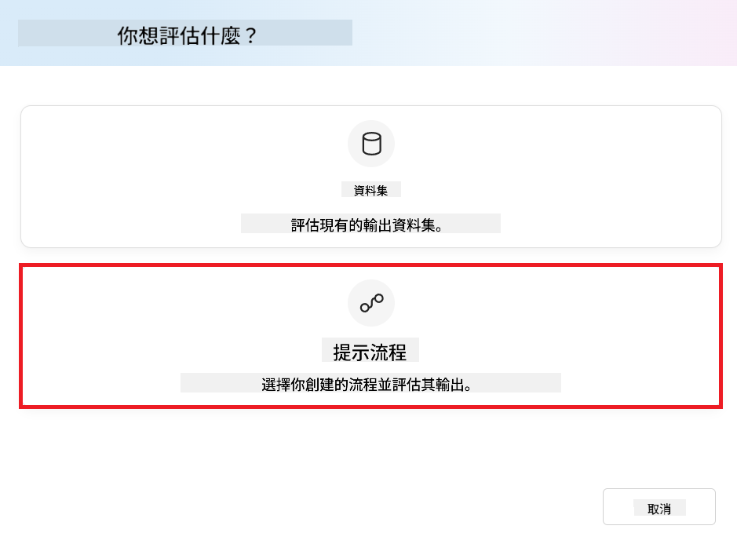

1. Thực hiện các bước sau:

    - Nhập tên đánh giá. Tên này phải là giá trị duy nhất.
    - Chọn **Question and answer without context** làm loại nhiệm vụ. Bởi vì, bộ dữ liệu **UlTRACHAT_200k** được sử dụng trong hướng dẫn này không chứa ngữ cảnh.
    - Chọn prompt flow mà bạn muốn đánh giá.

    

1. Chọn **Next**.

1. Thực hiện các bước sau:

    - Chọn **Add your dataset** để tải lên bộ dữ liệu. Ví dụ, bạn có thể tải lên file bộ dữ liệu kiểm tra, như *test_data.json1*, được bao gồm khi bạn tải bộ dữ liệu **ULTRACHAT_200k**.
    - Chọn **Dataset column** phù hợp với bộ dữ liệu của bạn. Ví dụ, nếu bạn đang dùng bộ dữ liệu **ULTRACHAT_200k**, chọn **${data.prompt}** làm cột dữ liệu.

    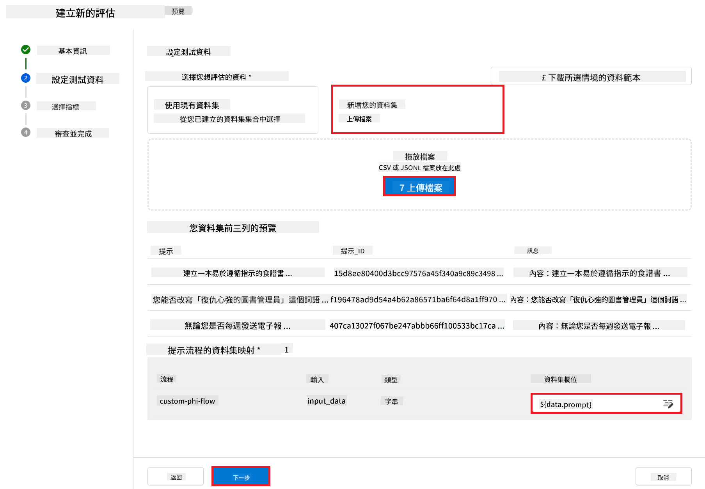

1. Chọn **Next**.

1. Thực hiện các bước sau để cấu hình các chỉ số hiệu suất và chất lượng:

    - Chọn các chỉ số hiệu suất và chất lượng mà bạn muốn sử dụng.
    - Chọn mô hình Azure OpenAI mà bạn đã tạo cho việc đánh giá. Ví dụ, chọn **gpt-4o**.

    

1. Thực hiện các bước sau để cấu hình các chỉ số rủi ro và an toàn:

    - Chọn các chỉ số rủi ro và an toàn mà bạn muốn sử dụng.
    - Chọn ngưỡng để tính tỷ lệ lỗi mà bạn muốn sử dụng. Ví dụ, chọn **Medium**.
    - Đối với **question**, chọn **Data source** là **{$data.prompt}**.
    - Đối với **answer**, chọn **Data source** là **{$run.outputs.answer}**.
    - Đối với **ground_truth**, chọn **Data source** là **{$data.message}**.

    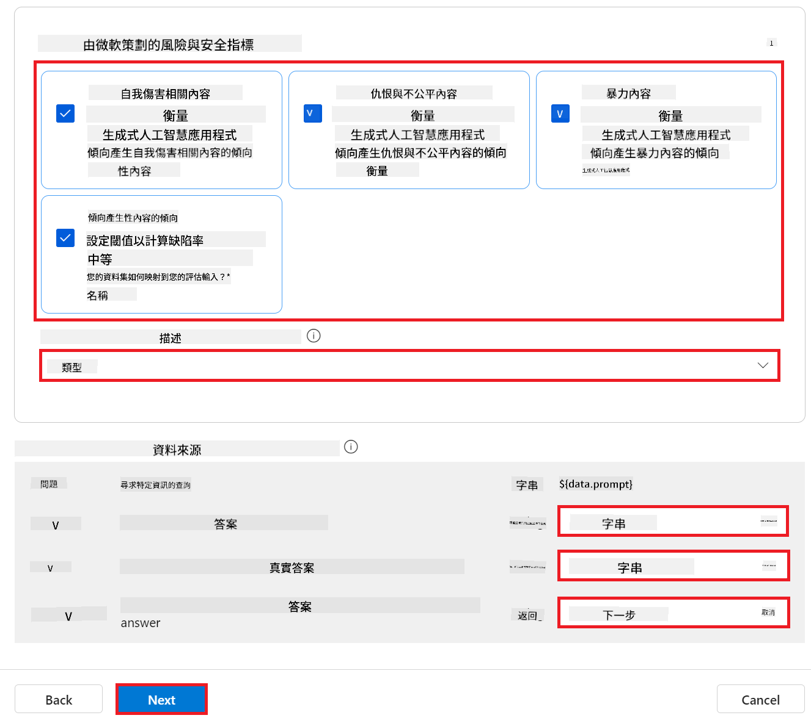

1. Chọn **Next**.

1. Chọn **Submit** để bắt đầu đánh giá.

1. Quá trình đánh giá sẽ mất một khoảng thời gian. Bạn có thể theo dõi tiến trình trong tab **Evaluation**.

### Xem lại kết quả đánh giá

> [!NOTE]
> Kết quả được trình bày dưới đây nhằm minh họa quy trình đánh giá. Trong hướng dẫn này, chúng tôi đã sử dụng một mô hình được tinh chỉnh trên bộ dữ liệu tương đối nhỏ, điều này có thể dẫn đến kết quả không tối ưu. Kết quả thực tế có thể thay đổi đáng kể tùy thuộc vào kích thước, chất lượng và sự đa dạng của bộ dữ liệu sử dụng, cũng như cấu hình cụ thể của mô hình.

Khi đánh giá hoàn tất, bạn có thể xem lại kết quả cho cả các chỉ số hiệu suất và an toàn.

1. Các chỉ số hiệu suất và chất lượng:

    - Đánh giá hiệu quả của mô hình trong việc tạo ra các phản hồi mạch lạc, trôi chảy và phù hợp.

    

1. Các chỉ số rủi ro và an toàn:

    - Đảm bảo rằng kết quả đầu ra của mô hình an toàn và phù hợp với Nguyên tắc AI có trách nhiệm, tránh bất kỳ nội dung gây hại hoặc xúc phạm nào.

    

1. Bạn có thể kéo xuống để xem **Detailed metrics result**.

    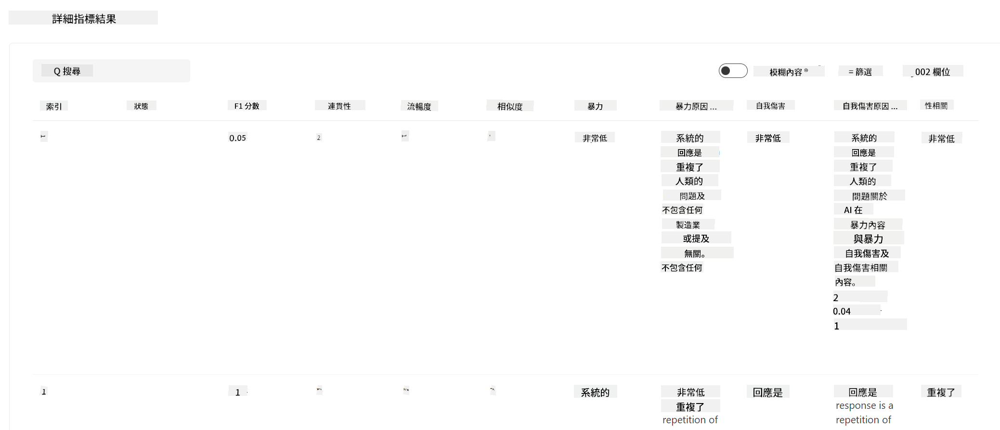

1. Bằng cách đánh giá mô hình Phi-3 / Phi-3.5 tùy chỉnh của bạn dựa trên cả các chỉ số hiệu suất và an toàn, bạn có thể xác nhận rằng mô hình không chỉ hiệu quả mà còn tuân thủ các thực hành AI có trách nhiệm, sẵn sàng cho triển khai trong thực tế.

## Chúc mừng!

### Bạn đã hoàn thành hướng dẫn này

Bạn đã đánh giá thành công mô hình Phi-3 được tinh chỉnh và tích hợp với Prompt flow trong Azure AI Foundry. Đây là bước quan trọng để đảm bảo các mô hình AI của bạn không chỉ hoạt động tốt mà còn tuân thủ các nguyên tắc AI có trách nhiệm của Microsoft, giúp bạn xây dựng các ứng dụng AI đáng tin cậy và bền vững.


## Dọn dẹp tài nguyên Azure

Dọn dẹp các tài nguyên Azure của bạn để tránh phát sinh chi phí không mong muốn. Truy cập cổng Azure và xóa các tài nguyên sau:

- Tài nguyên Azure Machine learning.
- Endpoint mô hình Azure Machine learning.
- Tài nguyên dự án Azure AI Foundry.
- Tài nguyên Prompt flow của Azure AI Foundry.

### Bước tiếp theo

#### Tài liệu

- [Assess AI systems by using the Responsible AI dashboard](https://learn.microsoft.com/azure/machine-learning/concept-responsible-ai-dashboard?view=azureml-api-2&source=recommendations?wt.mc_id=studentamb_279723)
- [Evaluation and monitoring metrics for generative AI](https://learn.microsoft.com/azure/ai-studio/concepts/evaluation-metrics-built-in?tabs=definition?wt.mc_id=studentamb_279723)
- [Azure AI Foundry documentation](https://learn.microsoft.com/azure/ai-studio/?wt.mc_id=studentamb_279723)
- [Prompt flow documentation](https://microsoft.github.io/promptflow/?wt.mc_id=studentamb_279723)

#### Nội dung đào tạo

- [Introduction to Microsoft's Responsible AI Approach](https://learn.microsoft.com/training/modules/introduction-to-microsofts-responsible-ai-approach/?source=recommendations?wt.mc_id=studentamb_279723)
- [Introduction to Azure AI Foundry](https://learn.microsoft.com/training/modules/introduction-to-azure-ai-studio/?wt.mc_id=studentamb_279723)

### Tham khảo

- [What is Responsible AI?](https://learn.microsoft.com/azure/machine-learning/concept-responsible-ai?view=azureml-api-2?wt.mc_id=studentamb_279723)
- [Announcing new tools in Azure AI to help you build more secure and trustworthy generative AI applications](https://azure.microsoft.com/blog/announcing-new-tools-in-azure-ai-to-help-you-build-more-secure-and-trustworthy-generative-ai-applications/?wt.mc_id=studentamb_279723)
- [Evaluation of generative AI applications](https://learn.microsoft.com/azure/ai-studio/concepts/evaluation-approach-gen-ai?wt.mc_id%3Dstudentamb_279723)

**Disclaimer**:  
This document has been translated using AI translation service [Co-op Translator](https://github.com/Azure/co-op-translator). While we strive for accuracy, please be aware that automated translations may contain errors or inaccuracies. The original document in its native language should be considered the authoritative source. For critical information, professional human translation is recommended. We are not liable for any misunderstandings or misinterpretations arising from the use of this translation.

---

Could you please clarify what language or code "mo" refers to? There are several possibilities (e.g., Moldovan, a constructed language, or something else). Once I know exactly which language "mo" is, I can provide the accurate translation.