<!--
CO_OP_TRANSLATOR_METADATA:
{
  "original_hash": "455be2b7b9c3390d367d528f8fab2aa0",
  "translation_date": "2025-05-07T14:06:23+00:00",
  "source_file": "md/02.Application/01.TextAndChat/Phi3/E2E_Phi-3-FineTuning_PromptFlow_Integration.md",
  "language_code": "mo"
}
-->
# Fine-tune and Integrate custom Phi-3 models with Prompt flow

This end-to-end (E2E) sample is based on the guide "[Fine-Tune and Integrate Custom Phi-3 Models with Prompt Flow: Step-by-Step Guide](https://techcommunity.microsoft.com/t5/educator-developer-blog/fine-tune-and-integrate-custom-phi-3-models-with-prompt-flow/ba-p/4178612?WT.mc_id=aiml-137032-kinfeylo)" from the Microsoft Tech Community. It walks you through fine-tuning, deploying, and integrating custom Phi-3 models with Prompt flow.

## Overview

In this E2E sample, you’ll learn how to fine-tune the Phi-3 model and connect it with Prompt flow. Using Azure Machine Learning and Prompt flow, you’ll create a workflow to deploy and use custom AI models. This sample is divided into three scenarios:

**Scenario 1: Set up Azure resources and Prepare for fine-tuning**

**Scenario 2: Fine-tune the Phi-3 model and Deploy in Azure Machine Learning Studio**

**Scenario 3: Integrate with Prompt flow and Chat with your custom model**

Here’s a high-level overview of this E2E sample.

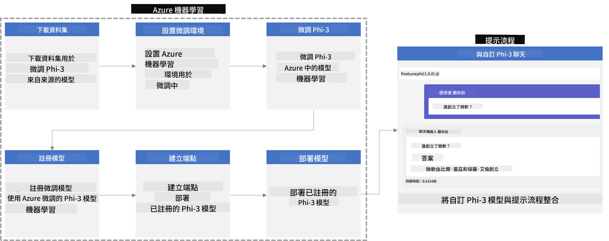

### Table of Contents

1. **[Scenario 1: Set up Azure resources and Prepare for fine-tuning](../../../../../../md/02.Application/01.TextAndChat/Phi3)**
    - [Create an Azure Machine Learning Workspace](../../../../../../md/02.Application/01.TextAndChat/Phi3)
    - [Request GPU quotas in Azure Subscription](../../../../../../md/02.Application/01.TextAndChat/Phi3)
    - [Add role assignment](../../../../../../md/02.Application/01.TextAndChat/Phi3)
    - [Set up project](../../../../../../md/02.Application/01.TextAndChat/Phi3)
    - [Prepare dataset for fine-tuning](../../../../../../md/02.Application/01.TextAndChat/Phi3)

1. **[Scenario 2: Fine-tune Phi-3 model and Deploy in Azure Machine Learning Studio](../../../../../../md/02.Application/01.TextAndChat/Phi3)**
    - [Set up Azure CLI](../../../../../../md/02.Application/01.TextAndChat/Phi3)
    - [Fine-tune the Phi-3 model](../../../../../../md/02.Application/01.TextAndChat/Phi3)
    - [Deploy the fine-tuned model](../../../../../../md/02.Application/01.TextAndChat/Phi3)

1. **[Scenario 3: Integrate with Prompt flow and Chat with your custom model](../../../../../../md/02.Application/01.TextAndChat/Phi3)**
    - [Integrate the custom Phi-3 model with Prompt flow](../../../../../../md/02.Application/01.TextAndChat/Phi3)
    - [Chat with your custom model](../../../../../../md/02.Application/01.TextAndChat/Phi3)

## Scenario 1: Set up Azure resources and Prepare for fine-tuning

### Create an Azure Machine Learning Workspace

1. In the portal’s **search bar** at the top, type *azure machine learning* and select **Azure Machine Learning** from the results.

    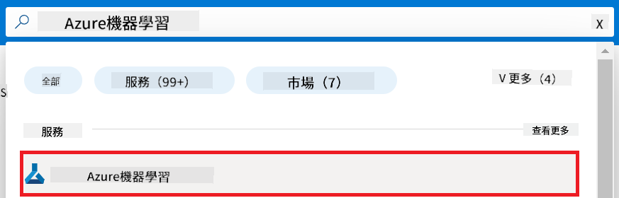

1. Click **+ Create** from the navigation menu.

1. Choose **New workspace**.

    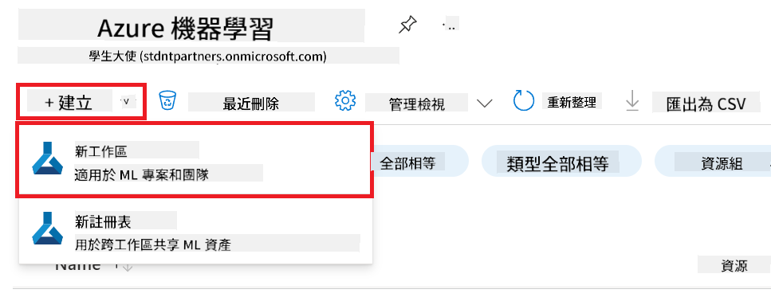

1. Complete the following:

    - Choose your Azure **Subscription**.
    - Select the **Resource group** to use (or create a new one).
    - Enter a unique **Workspace Name**.
    - Pick the **Region** you want.
    - Choose the **Storage account** (or create a new one).
    - Choose the **Key vault** (or create a new one).
    - Choose the **Application insights** (or create a new one).
    - Choose the **Container registry** (or create a new one).

    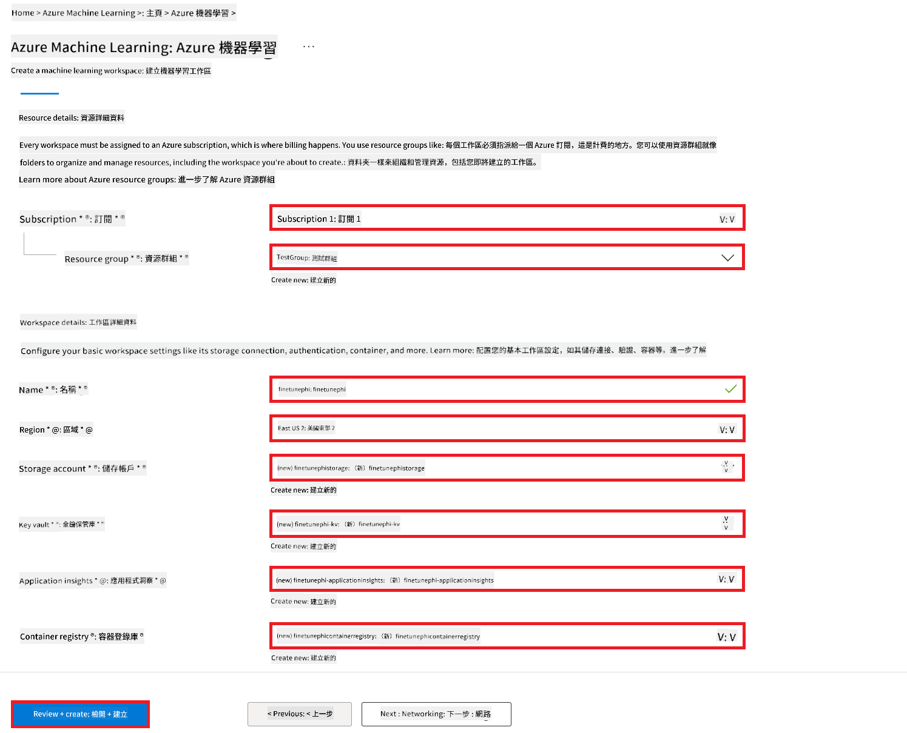

1. Click **Review + Create**.

1. Click **Create**.

### Request GPU quotas in Azure Subscription

For fine-tuning in this sample, you’ll use the *Standard_NC24ads_A100_v4 GPU*, which requires a quota request. For deployment, the *Standard_E4s_v3* CPU is used, which doesn’t require a quota request.

> [!NOTE]
>
> Only Pay-As-You-Go subscriptions (standard subscription type) qualify for GPU allocation; benefit subscriptions aren’t supported currently.
>
> If you have a benefit subscription (like Visual Studio Enterprise) or want to quickly test fine-tuning and deployment, this guide also covers fine-tuning with a small dataset on CPU. Keep in mind, GPU with larger datasets yields much better fine-tuning results.

1. Go to [Azure ML Studio](https://ml.azure.com/home?wt.mc_id=studentamb_279723).

1. To request *Standard NCADSA100v4 Family* quota:

    - Select **Quota** from the left menu.
    - Choose the **Virtual machine family** (e.g., **Standard NCADSA100v4 Family Cluster Dedicated vCPUs** including *Standard_NC24ads_A100_v4* GPU).
    - Click **Request quota**.

        

    - On the Request quota page, enter the **New cores limit** you want (e.g., 24).
    - Click **Submit** to request the GPU quota.

> [!NOTE]
> For selecting GPU or CPU sizes, see [Sizes for Virtual Machines in Azure](https://learn.microsoft.com/azure/virtual-machines/sizes/overview?tabs=breakdownseries%2Cgeneralsizelist%2Ccomputesizelist%2Cmemorysizelist%2Cstoragesizelist%2Cgpusizelist%2Cfpgasizelist%2Chpcsizelist).

### Add role assignment

To fine-tune and deploy models, first create a User Assigned Managed Identity (UAI) and assign the right permissions. This UAI will authenticate during deployment.

#### Create User Assigned Managed Identity(UAI)

1. In the portal’s **search bar**, type *managed identities* and select **Managed Identities**.

    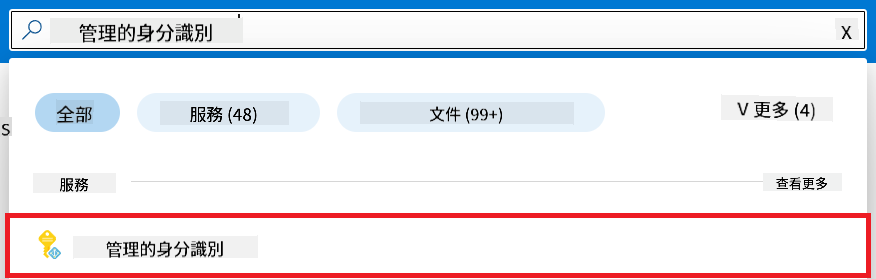

1. Click **+ Create**.

    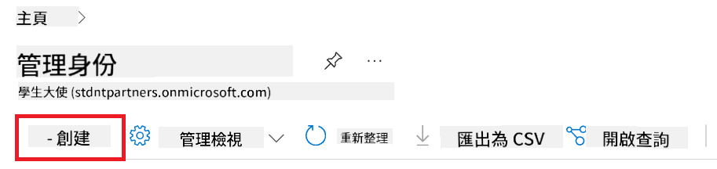

1. Complete the following:

    - Choose your Azure **Subscription**.
    - Select the **Resource group** (or create one).
    - Choose the **Region**.
    - Enter a unique **Name**.

1. Click **Review + create**.

1. Click **+ Create**.

#### Add Contributor role assignment to Managed Identity

1. Go to the Managed Identity resource you created.

1. Select **Azure role assignments** from the left menu.

1. Click **+Add role assignment**.

1. On the Add role assignment page:

    - Set **Scope** to **Resource group**.
    - Select your Azure **Subscription**.
    - Select the **Resource group**.
    - Choose **Contributor** as the **Role**.

    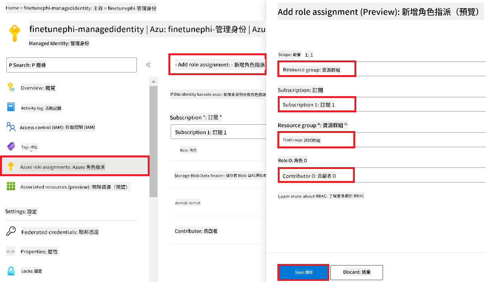

1. Click **Save**.

#### Add Storage Blob Data Reader role assignment to Managed Identity

1. In the portal’s **search bar**, type *storage accounts* and select **Storage accounts**.

    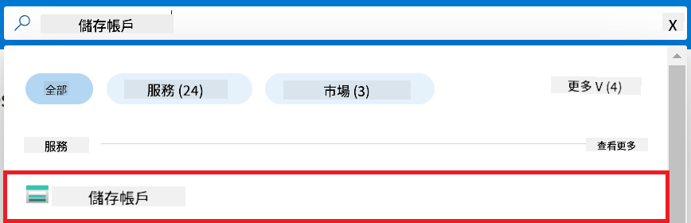

1. Select the storage account linked to your Azure Machine Learning workspace, e.g., *finetunephistorage*.

1. To add a role assignment:

    - Navigate to the storage account.
    - Select **Access Control (IAM)** from the left menu.
    - Click **+ Add** > **Add role assignment**.

    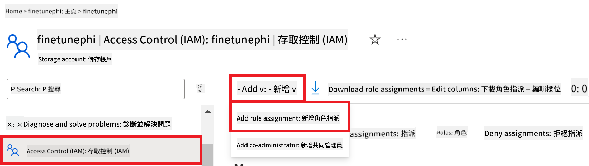

1. On the Add role assignment page:

    - In the Role search, type *Storage Blob Data Reader* and select it.
    - Click **Next**.
    - Under Members, choose **Assign access to** **Managed identity**.
    - Click **+ Select members**.
    - Choose your Azure **Subscription**.
    - Select the **Managed identity** option.
    - Pick the Managed Identity you created (e.g., *finetunephi-managedidentity*).
    - Click **Select**.

    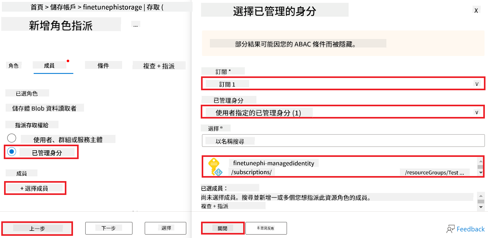

1. Click **Review + assign**.

#### Add AcrPull role assignment to Managed Identity

1. In the portal’s **search bar**, type *container registries* and select **Container registries**.

    

1. Select the container registry linked to your Azure Machine Learning workspace, e.g., *finetunephicontainerregistries*.

1. To add a role assignment:

    - Select **Access Control (IAM)**.
    - Click **+ Add** > **Add role assignment**.

1. On the Add role assignment page:

    - Search for *AcrPull* and select it.
    - Click **Next**.
    - Under Members, select **Assign access to** **Managed identity**.
    - Click **+ Select members**.
    - Choose your Azure **Subscription**.
    - Select **Managed identity**.
    - Pick the Managed Identity you created (e.g., *finetunephi-managedidentity*).
    - Click **Select**.
    - Click **Review + assign**.

### Set up project

Now, create a working folder and set up a virtual environment to develop a program that interacts with users and uses stored chat history from Azure Cosmos DB to inform its responses.

#### Create a folder to work inside it

1. Open a terminal and run this command to create a folder named *finetune-phi* in the default path.

    ```console
    mkdir finetune-phi
    ```

1. Navigate into the *finetune-phi* folder you created:

    ```console
    cd finetune-phi
    ```

#### Create a virtual environment

1. Run this command to create a virtual environment named *.venv*:

    ```console
    python -m venv .venv
    ```

1. Activate the virtual environment:

    ```console
    .venv\Scripts\activate.bat
    ```

> [!NOTE]
>
> If successful, you’ll see *(.venv)* before your command prompt.

#### Install the required packages

1. Run the following commands to install required packages:

    ```console
    pip install datasets==2.19.1
    pip install transformers==4.41.1
    pip install azure-ai-ml==1.16.0
    pip install torch==2.3.1
    pip install trl==0.9.4
    pip install promptflow==1.12.0
    ```

#### Create project files

In this step, you’ll create essential project files including scripts for downloading the dataset, setting up Azure Machine Learning, fine-tuning the Phi-3 model, and deploying it. You’ll also create a *conda.yml* file for the fine-tuning environment.

You will:

- Create *download_dataset.py* to download the dataset.
- Create *setup_ml.py* to set up Azure Machine Learning.
- Create *fine_tune.py* inside *finetuning_dir* to fine-tune the Phi-3 model using the dataset.
- Create *conda.yml* to set up the fine-tuning environment.
- Create *deploy_model.py* to deploy the fine-tuned model.
- Create *integrate_with_promptflow.py* to integrate the fine-tuned model and run it via Prompt flow.
- Create *flow.dag.yml* to define the workflow structure for Prompt flow.
- Create *config.py* to store your Azure information.

> [!NOTE]
>
> Complete folder structure:
>
> ```text
> └── YourUserName
> .    └── finetune-phi
> .        ├── finetuning_dir
> .        │      └── fine_tune.py
> .        ├── conda.yml
> .        ├── config.py
> .        ├── deploy_model.py
> .        ├── download_dataset.py
> .        ├── flow.dag.yml
> .        ├── integrate_with_promptflow.py
> .        └── setup_ml.py
> ```

1. Open **Visual Studio Code**.

1. From the menu bar, select **File** > **Open Folder**.

1. Select the *finetune-phi* folder you created (e.g., *C:\Users\yourUserName\finetune-phi*).

    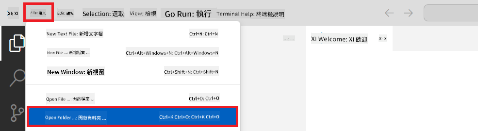

1. In the left pane, right-click and select **New File** to create *download_dataset.py*.

1. Similarly, create *setup_ml.py* and *deploy_model.py*.

    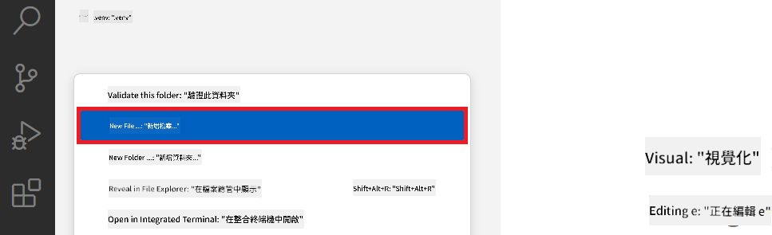

1. Right-click in the left pane, select **New Folder**, and name it *finetuning_dir*.

1. Inside *finetuning_dir*, create *fine_tune.py*.

#### Create and Configure *conda.yml* file

1. In the left pane, create a new file named *conda.yml*.

1. Add the following content to set up the fine-tuning environment for Phi-3:

    ```yml
    name: phi-3-training-env
    channels:
      - defaults
      - conda-forge
    dependencies:
      - python=3.10
      - pip
      - numpy<2.0
      - pip:
          - torch==2.4.0
          - torchvision==0.19.0
          - trl==0.8.6
          - transformers==4.41
          - datasets==2.21.0
          - azureml-core==1.57.0
          - azure-storage-blob==12.19.0
          - azure-ai-ml==1.16
          - azure-identity==1.17.1
          - accelerate==0.33.0
          - mlflow==2.15.1
          - azureml-mlflow==1.57.0
    ```

#### Create and Configure *config.py* file

1. Create a new file named *config.py*.

1. Add your Azure info with the following code:

    ```python
    # Azure settings
    AZURE_SUBSCRIPTION_ID = "your_subscription_id"
    AZURE_RESOURCE_GROUP_NAME = "your_resource_group_name" # "TestGroup"

    # Azure Machine Learning settings
    AZURE_ML_WORKSPACE_NAME = "your_workspace_name" # "finetunephi-workspace"

    # Azure Managed Identity settings
    AZURE_MANAGED_IDENTITY_CLIENT_ID = "your_azure_managed_identity_client_id"
    AZURE_MANAGED_IDENTITY_NAME = "your_azure_managed_identity_name" # "finetunephi-mangedidentity"
    AZURE_MANAGED_IDENTITY_RESOURCE_ID = f"/subscriptions/{AZURE_SUBSCRIPTION_ID}/resourceGroups/{AZURE_RESOURCE_GROUP_NAME}/providers/Microsoft.ManagedIdentity/userAssignedIdentities/{AZURE_MANAGED_IDENTITY_NAME}"

    # Dataset file paths
    TRAIN_DATA_PATH = "data/train_data.jsonl"
    TEST_DATA_PATH = "data/test_data.jsonl"

    # Fine-tuned model settings
    AZURE_MODEL_NAME = "your_fine_tuned_model_name" # "finetune-phi-model"
    AZURE_ENDPOINT_NAME = "your_fine_tuned_model_endpoint_name" # "finetune-phi-endpoint"
    AZURE_DEPLOYMENT_NAME = "your_fine_tuned_model_deployment_name" # "finetune-phi-deployment"

    AZURE_ML_API_KEY = "your_fine_tuned_model_api_key"
    AZURE_ML_ENDPOINT = "your_fine_tuned_model_endpoint_uri" # "https://{your-endpoint-name}.{your-region}.inference.ml.azure.com/score"
    ```

#### Add Azure environment variables

1. To add your Azure Subscription ID:

    - In the portal’s **search bar**, type *subscriptions* and select **Subscriptions**.
    - Select your active Azure Subscription.
    - Copy your Subscription ID and paste it into *config.py*.
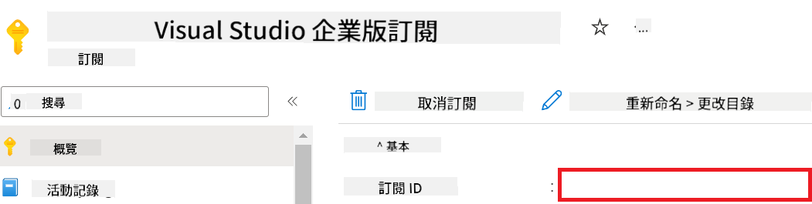

1. Érdek el a következő feladatokat az Azure Workspace név hozzáadásához:

    - Navigálj az általad létrehozott Azure Machine Learning erőforráshoz.
    - Másold be a fiókneved a *config.py* fájlba.

    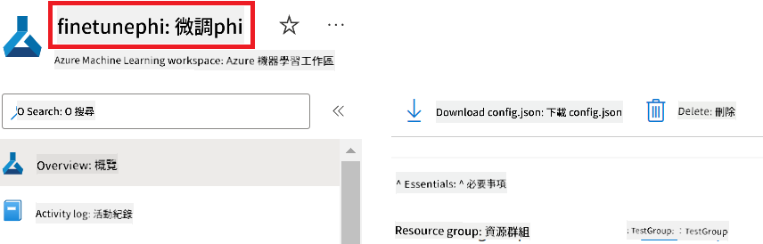

1. Érdek el a következő feladatokat az Azure Resource Group név hozzáadásához:

    - Navigálj az általad létrehozott Azure Machine Learning erőforráshoz.
    - Másold be az Azure Resource Group neved a *config.py* fájlba.

    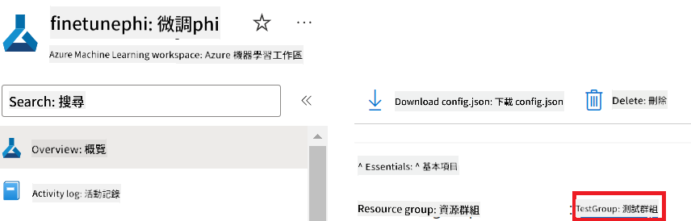

2. Érdek el a következő feladatokat az Azure Managed Identity név hozzáadásához:

    - Navigálj a létrehozott Managed Identities erőforráshoz.
    - Másold be az Azure Managed Identity neved a *config.py* fájlba.

    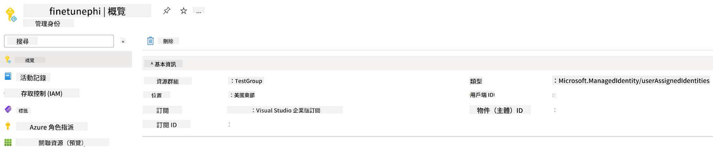

### Adatkészlet előkészítése finomhangoláshoz

Ebben a gyakorlatban lefuttatod a *download_dataset.py* fájlt, hogy letöltsd az *ULTRACHAT_200k* adatkészletet a helyi környezetedbe. Ezt az adatkészletet fogod használni a Phi-3 modell finomhangolásához az Azure Machine Learningben.

#### Töltsd le az adatkészleted a *download_dataset.py* segítségével

1. Nyisd meg a *download_dataset.py* fájlt a Visual Studio Code-ban.

1. Illeszd be a következő kódot a *download_dataset.py* fájlba.

    ```python
    import json
    import os
    from datasets import load_dataset
    from config import (
        TRAIN_DATA_PATH,
        TEST_DATA_PATH)

    def load_and_split_dataset(dataset_name, config_name, split_ratio):
        """
        Load and split a dataset.
        """
        # Load the dataset with the specified name, configuration, and split ratio
        dataset = load_dataset(dataset_name, config_name, split=split_ratio)
        print(f"Original dataset size: {len(dataset)}")
        
        # Split the dataset into train and test sets (80% train, 20% test)
        split_dataset = dataset.train_test_split(test_size=0.2)
        print(f"Train dataset size: {len(split_dataset['train'])}")
        print(f"Test dataset size: {len(split_dataset['test'])}")
        
        return split_dataset

    def save_dataset_to_jsonl(dataset, filepath):
        """
        Save a dataset to a JSONL file.
        """
        # Create the directory if it does not exist
        os.makedirs(os.path.dirname(filepath), exist_ok=True)
        
        # Open the file in write mode
        with open(filepath, 'w', encoding='utf-8') as f:
            # Iterate over each record in the dataset
            for record in dataset:
                # Dump the record as a JSON object and write it to the file
                json.dump(record, f)
                # Write a newline character to separate records
                f.write('\n')
        
        print(f"Dataset saved to {filepath}")

    def main():
        """
        Main function to load, split, and save the dataset.
        """
        # Load and split the ULTRACHAT_200k dataset with a specific configuration and split ratio
        dataset = load_and_split_dataset("HuggingFaceH4/ultrachat_200k", 'default', 'train_sft[:1%]')
        
        # Extract the train and test datasets from the split
        train_dataset = dataset['train']
        test_dataset = dataset['test']

        # Save the train dataset to a JSONL file
        save_dataset_to_jsonl(train_dataset, TRAIN_DATA_PATH)
        
        # Save the test dataset to a separate JSONL file
        save_dataset_to_jsonl(test_dataset, TEST_DATA_PATH)

    if __name__ == "__main__":
        main()

    ```

> [!TIP]
>
> **Útmutató finomhangoláshoz minimális adatkészlettel CPU használatával**
>
> Ha CPU-t szeretnél használni a finomhangoláshoz, ez a megközelítés ideális azoknak, akik előnyös előfizetéssel rendelkeznek (például Visual Studio Enterprise Subscription), vagy gyorsan szeretnék kipróbálni a finomhangolási és telepítési folyamatot.
>
> Cseréld le `dataset = load_and_split_dataset("HuggingFaceH4/ultrachat_200k", 'default', 'train_sft[:1%]')` with `dataset = load_and_split_dataset("HuggingFaceH4/ultrachat_200k", 'default', 'train_sft[:10]')` értékre.
>

1. Írd be a következő parancsot a terminálodba a szkript futtatásához és az adatkészlet letöltéséhez a helyi környezetbe.

    ```console
    python download_data.py
    ```

1. Ellenőrizd, hogy az adatkészletek sikeresen elmentésre kerültek-e a helyi *finetune-phi/data* könyvtárba.

> [!NOTE]
>
> **Adatkészlet mérete és finomhangolási idő**
>
> Ebben az E2E példában csak az adatkészlet 1%-át használod (`train_sft[:1%]`). Ez jelentősen csökkenti az adatok mennyiségét, így gyorsítva az feltöltési és finomhangolási folyamatokat. A százalékos arányt állítva megtalálhatod az optimális egyensúlyt a tanítási idő és a modell teljesítménye között. Egy kisebb adathalmaz használata lerövidíti a finomhangolás idejét, így könnyebben kezelhetővé téve az E2E mintát.

## 2. Forgatókönyv: Phi-3 modell finomhangolása és telepítése az Azure Machine Learning Studioban

### Azure CLI beállítása

Be kell állítanod az Azure CLI-t a környezeted hitelesítéséhez. Az Azure CLI lehetővé teszi az Azure erőforrások közvetlen kezelését a parancssorból, és biztosítja a szükséges hitelesítő adatokat az Azure Machine Learning számára az erőforrások eléréséhez. Kezdéshez telepítsd az [Azure CLI](https://learn.microsoft.com/cli/azure/install-azure-cli) eszközt.

1. Nyiss meg egy terminálablakot, és írd be a következő parancsot az Azure fiókodba való bejelentkezéshez.

    ```console
    az login
    ```

1. Válaszd ki az Azure fiókodat.

1. Válaszd ki az Azure előfizetésedet.

    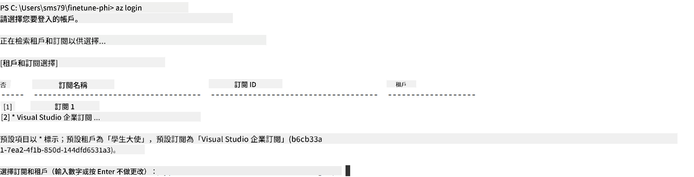

> [!TIP]
>
> Ha nehézséged van az Azure-ba való bejelentkezéssel, próbáld meg eszközkód használatával. Nyiss meg egy terminált, és írd be a következő parancsot a bejelentkezéshez:
>
> ```console
> az login --use-device-code
> ```
>

### Phi-3 modell finomhangolása

Ebben a gyakorlatban finomhangolod a Phi-3 modellt a rendelkezésre álló adatkészlettel. Először definiálod a finomhangolási folyamatot a *fine_tune.py* fájlban. Ezután konfigurálod az Azure Machine Learning környezetet, és elindítod a finomhangolást a *setup_ml.py* fájl futtatásával. Ez a szkript biztosítja, hogy a finomhangolás az Azure Machine Learning környezetben történjen.

A *setup_ml.py* futtatásával elindítod a finomhangolási folyamatot az Azure Machine Learning környezetben.

#### Kód hozzáadása a *fine_tune.py* fájlhoz

1. Navigálj a *finetuning_dir* mappába, és nyisd meg a *fine_tune.py* fájlt a Visual Studio Code-ban.

1. Illeszd be a következő kódot a *fine_tune.py* fájlba.

    ```python
    import argparse
    import sys
    import logging
    import os
    from datasets import load_dataset
    import torch
    import mlflow
    from transformers import AutoModelForCausalLM, AutoTokenizer, TrainingArguments
    from trl import SFTTrainer

    # To avoid the INVALID_PARAMETER_VALUE error in MLflow, disable MLflow integration
    os.environ["DISABLE_MLFLOW_INTEGRATION"] = "True"

    # Logging setup
    logging.basicConfig(
        format="%(asctime)s - %(levelname)s - %(name)s - %(message)s",
        datefmt="%Y-%m-%d %H:%M:%S",
        handlers=[logging.StreamHandler(sys.stdout)],
        level=logging.WARNING
    )
    logger = logging.getLogger(__name__)

    def initialize_model_and_tokenizer(model_name, model_kwargs):
        """
        Initialize the model and tokenizer with the given pretrained model name and arguments.
        """
        model = AutoModelForCausalLM.from_pretrained(model_name, **model_kwargs)
        tokenizer = AutoTokenizer.from_pretrained(model_name)
        tokenizer.model_max_length = 2048
        tokenizer.pad_token = tokenizer.unk_token
        tokenizer.pad_token_id = tokenizer.convert_tokens_to_ids(tokenizer.pad_token)
        tokenizer.padding_side = 'right'
        return model, tokenizer

    def apply_chat_template(example, tokenizer):
        """
        Apply a chat template to tokenize messages in the example.
        """
        messages = example["messages"]
        if messages[0]["role"] != "system":
            messages.insert(0, {"role": "system", "content": ""})
        example["text"] = tokenizer.apply_chat_template(
            messages, tokenize=False, add_generation_prompt=False
        )
        return example

    def load_and_preprocess_data(train_filepath, test_filepath, tokenizer):
        """
        Load and preprocess the dataset.
        """
        train_dataset = load_dataset('json', data_files=train_filepath, split='train')
        test_dataset = load_dataset('json', data_files=test_filepath, split='train')
        column_names = list(train_dataset.features)

        train_dataset = train_dataset.map(
            apply_chat_template,
            fn_kwargs={"tokenizer": tokenizer},
            num_proc=10,
            remove_columns=column_names,
            desc="Applying chat template to train dataset",
        )

        test_dataset = test_dataset.map(
            apply_chat_template,
            fn_kwargs={"tokenizer": tokenizer},
            num_proc=10,
            remove_columns=column_names,
            desc="Applying chat template to test dataset",
        )

        return train_dataset, test_dataset

    def train_and_evaluate_model(train_dataset, test_dataset, model, tokenizer, output_dir):
        """
        Train and evaluate the model.
        """
        training_args = TrainingArguments(
            bf16=True,
            do_eval=True,
            output_dir=output_dir,
            eval_strategy="epoch",
            learning_rate=5.0e-06,
            logging_steps=20,
            lr_scheduler_type="cosine",
            num_train_epochs=3,
            overwrite_output_dir=True,
            per_device_eval_batch_size=4,
            per_device_train_batch_size=4,
            remove_unused_columns=True,
            save_steps=500,
            seed=0,
            gradient_checkpointing=True,
            gradient_accumulation_steps=1,
            warmup_ratio=0.2,
        )

        trainer = SFTTrainer(
            model=model,
            args=training_args,
            train_dataset=train_dataset,
            eval_dataset=test_dataset,
            max_seq_length=2048,
            dataset_text_field="text",
            tokenizer=tokenizer,
            packing=True
        )

        train_result = trainer.train()
        trainer.log_metrics("train", train_result.metrics)

        mlflow.transformers.log_model(
            transformers_model={"model": trainer.model, "tokenizer": tokenizer},
            artifact_path=output_dir,
        )

        tokenizer.padding_side = 'left'
        eval_metrics = trainer.evaluate()
        eval_metrics["eval_samples"] = len(test_dataset)
        trainer.log_metrics("eval", eval_metrics)

    def main(train_file, eval_file, model_output_dir):
        """
        Main function to fine-tune the model.
        """
        model_kwargs = {
            "use_cache": False,
            "trust_remote_code": True,
            "torch_dtype": torch.bfloat16,
            "device_map": None,
            "attn_implementation": "eager"
        }

        # pretrained_model_name = "microsoft/Phi-3-mini-4k-instruct"
        pretrained_model_name = "microsoft/Phi-3.5-mini-instruct"

        with mlflow.start_run():
            model, tokenizer = initialize_model_and_tokenizer(pretrained_model_name, model_kwargs)
            train_dataset, test_dataset = load_and_preprocess_data(train_file, eval_file, tokenizer)
            train_and_evaluate_model(train_dataset, test_dataset, model, tokenizer, model_output_dir)

    if __name__ == "__main__":
        parser = argparse.ArgumentParser()
        parser.add_argument("--train-file", type=str, required=True, help="Path to the training data")
        parser.add_argument("--eval-file", type=str, required=True, help="Path to the evaluation data")
        parser.add_argument("--model_output_dir", type=str, required=True, help="Directory to save the fine-tuned model")
        args = parser.parse_args()
        main(args.train_file, args.eval_file, args.model_output_dir)

    ```

1. Mentsd el és zárd be a *fine_tune.py* fájlt.

> [!TIP]
> **Phi-3.5 modell finomhangolása is lehetséges**
>
> A *fine_tune.py* fájlban megváltoztathatod a `pretrained_model_name` from `"microsoft/Phi-3-mini-4k-instruct"` to any model you want to fine-tune. For example, if you change it to `"microsoft/Phi-3.5-mini-instruct"`, you'll be using the Phi-3.5-mini-instruct model for fine-tuning. To find and use the model name you prefer, visit [Hugging Face](https://huggingface.co/), search for the model you're interested in, and then copy and paste its name into the `pretrained_model_name` mezőt a scriptedben.
>
> :::image type="content" source="../../imgs/03/FineTuning-PromptFlow/finetunephi3.5.png" alt-text="Phi-3.5 finomhangolása.":::
>

#### Kód hozzáadása a *setup_ml.py* fájlhoz

1. Nyisd meg a *setup_ml.py* fájlt a Visual Studio Code-ban.

1. Illeszd be a következő kódot a *setup_ml.py* fájlba.

    ```python
    import logging
    from azure.ai.ml import MLClient, command, Input
    from azure.ai.ml.entities import Environment, AmlCompute
    from azure.identity import AzureCliCredential
    from config import (
        AZURE_SUBSCRIPTION_ID,
        AZURE_RESOURCE_GROUP_NAME,
        AZURE_ML_WORKSPACE_NAME,
        TRAIN_DATA_PATH,
        TEST_DATA_PATH
    )

    # Constants

    # Uncomment the following lines to use a CPU instance for training
    # COMPUTE_INSTANCE_TYPE = "Standard_E16s_v3" # cpu
    # COMPUTE_NAME = "cpu-e16s-v3"
    # DOCKER_IMAGE_NAME = "mcr.microsoft.com/azureml/openmpi4.1.0-ubuntu20.04:latest"

    # Uncomment the following lines to use a GPU instance for training
    COMPUTE_INSTANCE_TYPE = "Standard_NC24ads_A100_v4"
    COMPUTE_NAME = "gpu-nc24s-a100-v4"
    DOCKER_IMAGE_NAME = "mcr.microsoft.com/azureml/curated/acft-hf-nlp-gpu:59"

    CONDA_FILE = "conda.yml"
    LOCATION = "eastus2" # Replace with the location of your compute cluster
    FINETUNING_DIR = "./finetuning_dir" # Path to the fine-tuning script
    TRAINING_ENV_NAME = "phi-3-training-environment" # Name of the training environment
    MODEL_OUTPUT_DIR = "./model_output" # Path to the model output directory in azure ml

    # Logging setup to track the process
    logger = logging.getLogger(__name__)
    logging.basicConfig(
        format="%(asctime)s - %(levelname)s - %(name)s - %(message)s",
        datefmt="%Y-%m-%d %H:%M:%S",
        level=logging.WARNING
    )

    def get_ml_client():
        """
        Initialize the ML Client using Azure CLI credentials.
        """
        credential = AzureCliCredential()
        return MLClient(credential, AZURE_SUBSCRIPTION_ID, AZURE_RESOURCE_GROUP_NAME, AZURE_ML_WORKSPACE_NAME)

    def create_or_get_environment(ml_client):
        """
        Create or update the training environment in Azure ML.
        """
        env = Environment(
            image=DOCKER_IMAGE_NAME,  # Docker image for the environment
            conda_file=CONDA_FILE,  # Conda environment file
            name=TRAINING_ENV_NAME,  # Name of the environment
        )
        return ml_client.environments.create_or_update(env)

    def create_or_get_compute_cluster(ml_client, compute_name, COMPUTE_INSTANCE_TYPE, location):
        """
        Create or update the compute cluster in Azure ML.
        """
        try:
            compute_cluster = ml_client.compute.get(compute_name)
            logger.info(f"Compute cluster '{compute_name}' already exists. Reusing it for the current run.")
        except Exception:
            logger.info(f"Compute cluster '{compute_name}' does not exist. Creating a new one with size {COMPUTE_INSTANCE_TYPE}.")
            compute_cluster = AmlCompute(
                name=compute_name,
                size=COMPUTE_INSTANCE_TYPE,
                location=location,
                tier="Dedicated",  # Tier of the compute cluster
                min_instances=0,  # Minimum number of instances
                max_instances=1  # Maximum number of instances
            )
            ml_client.compute.begin_create_or_update(compute_cluster).wait()  # Wait for the cluster to be created
        return compute_cluster

    def create_fine_tuning_job(env, compute_name):
        """
        Set up the fine-tuning job in Azure ML.
        """
        return command(
            code=FINETUNING_DIR,  # Path to fine_tune.py
            command=(
                "python fine_tune.py "
                "--train-file ${{inputs.train_file}} "
                "--eval-file ${{inputs.eval_file}} "
                "--model_output_dir ${{inputs.model_output}}"
            ),
            environment=env,  # Training environment
            compute=compute_name,  # Compute cluster to use
            inputs={
                "train_file": Input(type="uri_file", path=TRAIN_DATA_PATH),  # Path to the training data file
                "eval_file": Input(type="uri_file", path=TEST_DATA_PATH),  # Path to the evaluation data file
                "model_output": MODEL_OUTPUT_DIR
            }
        )

    def main():
        """
        Main function to set up and run the fine-tuning job in Azure ML.
        """
        # Initialize ML Client
        ml_client = get_ml_client()

        # Create Environment
        env = create_or_get_environment(ml_client)
        
        # Create or get existing compute cluster
        create_or_get_compute_cluster(ml_client, COMPUTE_NAME, COMPUTE_INSTANCE_TYPE, LOCATION)

        # Create and Submit Fine-Tuning Job
        job = create_fine_tuning_job(env, COMPUTE_NAME)
        returned_job = ml_client.jobs.create_or_update(job)  # Submit the job
        ml_client.jobs.stream(returned_job.name)  # Stream the job logs
        
        # Capture the job name
        job_name = returned_job.name
        print(f"Job name: {job_name}")

    if __name__ == "__main__":
        main()

    ```

1. Cseréld le a `COMPUTE_INSTANCE_TYPE`, `COMPUTE_NAME`, and `LOCATION` értékeket a saját adataidra.

    ```python
   # Uncomment the following lines to use a GPU instance for training
    COMPUTE_INSTANCE_TYPE = "Standard_NC24ads_A100_v4"
    COMPUTE_NAME = "gpu-nc24s-a100-v4"
    ...
    LOCATION = "eastus2" # Replace with the location of your compute cluster
    ```

> [!TIP]
>
> **Útmutató finomhangoláshoz minimális adatkészlettel CPU használatával**
>
> Ha CPU-t szeretnél használni a finomhangoláshoz, ez a megközelítés ideális azoknak, akik előnyös előfizetéssel rendelkeznek (például Visual Studio Enterprise Subscription), vagy gyorsan szeretnék kipróbálni a finomhangolási és telepítési folyamatot.
>
> 1. Nyisd meg a *setup_ml* fájlt.
> 1. Cseréld le a `COMPUTE_INSTANCE_TYPE`, `COMPUTE_NAME`, and `DOCKER_IMAGE_NAME` with the following. If you do not have access to *Standard_E16s_v3*, you can use an equivalent CPU instance or request a new quota.
> 1. Replace `LOCATION` értékeket a saját adataidra.
>
>    ```python
>    # Uncomment the following lines to use a CPU instance for training
>    COMPUTE_INSTANCE_TYPE = "Standard_E16s_v3" # cpu
>    COMPUTE_NAME = "cpu-e16s-v3"
>    DOCKER_IMAGE_NAME = "mcr.microsoft.com/azureml/openmpi4.1.0-ubuntu20.04:latest"
>    LOCATION = "eastus2" # Replace with the location of your compute cluster
>    ```
>

1. Írd be a következő parancsot a *setup_ml.py* futtatásához és a finomhangolási folyamat elindításához az Azure Machine Learningben.

    ```python
    python setup_ml.py
    ```

1. Ebben a gyakorlatban sikeresen finomhangoltad a Phi-3 modellt az Azure Machine Learning segítségével. A *setup_ml.py* futtatásával beállítottad az Azure Machine Learning környezetet, és elindítottad a *fine_tune.py* fájlban definiált finomhangolási folyamatot. Kérjük, vedd figyelembe, hogy a finomhangolás jelentős időt vehet igénybe. A `python setup_ml.py` command, you need to wait for the process to complete. You can monitor the status of the fine-tuning job by following the link provided in the terminal to the Azure Machine Learning portal.

    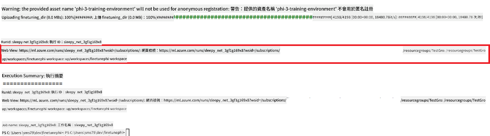

### Deploy the fine-tuned model

To integrate the fine-tuned Phi-3 model with Prompt Flow, you need to deploy the model to make it accessible for real-time inference. This process involves registering the model, creating an online endpoint, and deploying the model.

#### Set the model name, endpoint name, and deployment name for deployment

1. Open *config.py* file.

1. Replace `AZURE_MODEL_NAME = "your_fine_tuned_model_name"` with the desired name for your model.

1. Replace `AZURE_ENDPOINT_NAME = "your_fine_tuned_model_endpoint_name"` with the desired name for your endpoint.

1. Replace `AZURE_DEPLOYMENT_NAME = "your_fine_tuned_model_deployment_name"` parancs futtatásakor add meg a kívánt telepítési nevet.

#### Kód hozzáadása a *deploy_model.py* fájlhoz

A *deploy_model.py* futtatása automatizálja a teljes telepítési folyamatot. Regisztrálja a modellt, létrehozza a végpontot, és végrehajtja a telepítést a config.py fájlban megadott beállítások alapján, amelyek tartalmazzák a modell nevét, a végpont nevét és a telepítés nevét.

1. Nyisd meg a *deploy_model.py* fájlt a Visual Studio Code-ban.

1. Illeszd be a következő kódot a *deploy_model.py* fájlba.

    ```python
    import logging
    from azure.identity import AzureCliCredential
    from azure.ai.ml import MLClient
    from azure.ai.ml.entities import Model, ProbeSettings, ManagedOnlineEndpoint, ManagedOnlineDeployment, IdentityConfiguration, ManagedIdentityConfiguration, OnlineRequestSettings
    from azure.ai.ml.constants import AssetTypes

    # Configuration imports
    from config import (
        AZURE_SUBSCRIPTION_ID,
        AZURE_RESOURCE_GROUP_NAME,
        AZURE_ML_WORKSPACE_NAME,
        AZURE_MANAGED_IDENTITY_RESOURCE_ID,
        AZURE_MANAGED_IDENTITY_CLIENT_ID,
        AZURE_MODEL_NAME,
        AZURE_ENDPOINT_NAME,
        AZURE_DEPLOYMENT_NAME
    )

    # Constants
    JOB_NAME = "your-job-name"
    COMPUTE_INSTANCE_TYPE = "Standard_E4s_v3"

    deployment_env_vars = {
        "SUBSCRIPTION_ID": AZURE_SUBSCRIPTION_ID,
        "RESOURCE_GROUP_NAME": AZURE_RESOURCE_GROUP_NAME,
        "UAI_CLIENT_ID": AZURE_MANAGED_IDENTITY_CLIENT_ID,
    }

    # Logging setup
    logging.basicConfig(
        format="%(asctime)s - %(levelname)s - %(name)s - %(message)s",
        datefmt="%Y-%m-%d %H:%M:%S",
        level=logging.DEBUG
    )
    logger = logging.getLogger(__name__)

    def get_ml_client():
        """Initialize and return the ML Client."""
        credential = AzureCliCredential()
        return MLClient(credential, AZURE_SUBSCRIPTION_ID, AZURE_RESOURCE_GROUP_NAME, AZURE_ML_WORKSPACE_NAME)

    def register_model(ml_client, model_name, job_name):
        """Register a new model."""
        model_path = f"azureml://jobs/{job_name}/outputs/artifacts/paths/model_output"
        logger.info(f"Registering model {model_name} from job {job_name} at path {model_path}.")
        run_model = Model(
            path=model_path,
            name=model_name,
            description="Model created from run.",
            type=AssetTypes.MLFLOW_MODEL,
        )
        model = ml_client.models.create_or_update(run_model)
        logger.info(f"Registered model ID: {model.id}")
        return model

    def delete_existing_endpoint(ml_client, endpoint_name):
        """Delete existing endpoint if it exists."""
        try:
            endpoint_result = ml_client.online_endpoints.get(name=endpoint_name)
            logger.info(f"Deleting existing endpoint {endpoint_name}.")
            ml_client.online_endpoints.begin_delete(name=endpoint_name).result()
            logger.info(f"Deleted existing endpoint {endpoint_name}.")
        except Exception as e:
            logger.info(f"No existing endpoint {endpoint_name} found to delete: {e}")

    def create_or_update_endpoint(ml_client, endpoint_name, description=""):
        """Create or update an endpoint."""
        delete_existing_endpoint(ml_client, endpoint_name)
        logger.info(f"Creating new endpoint {endpoint_name}.")
        endpoint = ManagedOnlineEndpoint(
            name=endpoint_name,
            description=description,
            identity=IdentityConfiguration(
                type="user_assigned",
                user_assigned_identities=[ManagedIdentityConfiguration(resource_id=AZURE_MANAGED_IDENTITY_RESOURCE_ID)]
            )
        )
        endpoint_result = ml_client.online_endpoints.begin_create_or_update(endpoint).result()
        logger.info(f"Created new endpoint {endpoint_name}.")
        return endpoint_result

    def create_or_update_deployment(ml_client, endpoint_name, deployment_name, model):
        """Create or update a deployment."""

        logger.info(f"Creating deployment {deployment_name} for endpoint {endpoint_name}.")
        deployment = ManagedOnlineDeployment(
            name=deployment_name,
            endpoint_name=endpoint_name,
            model=model.id,
            instance_type=COMPUTE_INSTANCE_TYPE,
            instance_count=1,
            environment_variables=deployment_env_vars,
            request_settings=OnlineRequestSettings(
                max_concurrent_requests_per_instance=3,
                request_timeout_ms=180000,
                max_queue_wait_ms=120000
            ),
            liveness_probe=ProbeSettings(
                failure_threshold=30,
                success_threshold=1,
                period=100,
                initial_delay=500,
            ),
            readiness_probe=ProbeSettings(
                failure_threshold=30,
                success_threshold=1,
                period=100,
                initial_delay=500,
            ),
        )
        deployment_result = ml_client.online_deployments.begin_create_or_update(deployment).result()
        logger.info(f"Created deployment {deployment.name} for endpoint {endpoint_name}.")
        return deployment_result

    def set_traffic_to_deployment(ml_client, endpoint_name, deployment_name):
        """Set traffic to the specified deployment."""
        try:
            # Fetch the current endpoint details
            endpoint = ml_client.online_endpoints.get(name=endpoint_name)
            
            # Log the current traffic allocation for debugging
            logger.info(f"Current traffic allocation: {endpoint.traffic}")
            
            # Set the traffic allocation for the deployment
            endpoint.traffic = {deployment_name: 100}
            
            # Update the endpoint with the new traffic allocation
            endpoint_poller = ml_client.online_endpoints.begin_create_or_update(endpoint)
            updated_endpoint = endpoint_poller.result()
            
            # Log the updated traffic allocation for debugging
            logger.info(f"Updated traffic allocation: {updated_endpoint.traffic}")
            logger.info(f"Set traffic to deployment {deployment_name} at endpoint {endpoint_name}.")
            return updated_endpoint
        except Exception as e:
            # Log any errors that occur during the process
            logger.error(f"Failed to set traffic to deployment: {e}")
            raise


    def main():
        ml_client = get_ml_client()

        registered_model = register_model(ml_client, AZURE_MODEL_NAME, JOB_NAME)
        logger.info(f"Registered model ID: {registered_model.id}")

        endpoint = create_or_update_endpoint(ml_client, AZURE_ENDPOINT_NAME, "Endpoint for finetuned Phi-3 model")
        logger.info(f"Endpoint {AZURE_ENDPOINT_NAME} is ready.")

        try:
            deployment = create_or_update_deployment(ml_client, AZURE_ENDPOINT_NAME, AZURE_DEPLOYMENT_NAME, registered_model)
            logger.info(f"Deployment {AZURE_DEPLOYMENT_NAME} is created for endpoint {AZURE_ENDPOINT_NAME}.")

            set_traffic_to_deployment(ml_client, AZURE_ENDPOINT_NAME, AZURE_DEPLOYMENT_NAME)
            logger.info(f"Traffic is set to deployment {AZURE_DEPLOYMENT_NAME} at endpoint {AZURE_ENDPOINT_NAME}.")
        except Exception as e:
            logger.error(f"Failed to create or update deployment: {e}")

    if __name__ == "__main__":
        main()

    ```

1. Végezd el a következő feladatokat a `JOB_NAME`:

    - Navigate to Azure Machine Learning resource that you created.
    - Select **Studio web URL** to open the Azure Machine Learning workspace.
    - Select **Jobs** from the left side tab.
    - Select the experiment for fine-tuning. For example, *finetunephi*.
    - Select the job that you created.
    - Copy and paste your job Name into the `JOB_NAME = "your-job-name"` in *deploy_model.py* file.

1. Replace `COMPUTE_INSTANCE_TYPE` saját adataiddal való helyettesítéséhez.

1. Írd be a következő parancsot a *deploy_model.py* futtatásához és a telepítési folyamat elindításához az Azure Machine Learningben.

    ```python
    python deploy_model.py
    ```

> [!WARNING]
> A további költségek elkerülése érdekében győződj meg róla, hogy törlöd a létrehozott végpontot az Azure Machine Learning munkaterületen.
>

#### Telepítési állapot ellenőrzése az Azure Machine Learning munkaterületen

1. Látogass el az [Azure ML Studio](https://ml.azure.com/home?wt.mc_id=studentamb_279723) oldalra.

1. Navigálj az általad létrehozott Azure Machine Learning munkaterületre.

1. Válaszd a **Studio web URL** lehetőséget az Azure Machine Learning munkaterület megnyitásához.

1. Válaszd az oldalsó menüből az **Endpoints** menüpontot.

    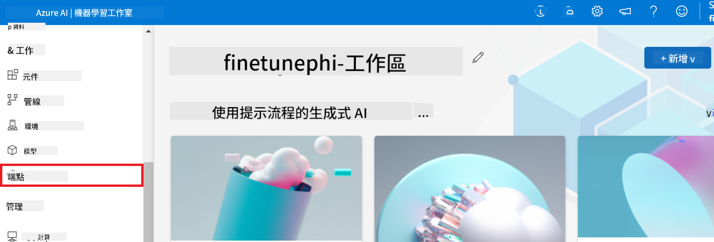

2. Válaszd ki a létrehozott végpontot.

    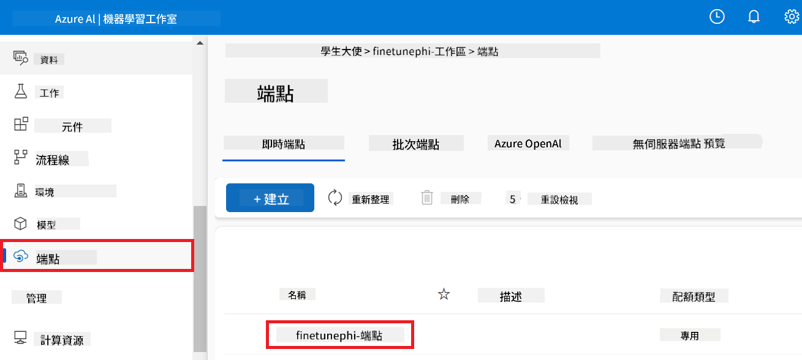

3. Ezen az oldalon kezelheted a telepítés során létrehozott végpontokat.

## 3. Forgatókönyv: Integráció a Prompt flow-val és csevegés az egyedi modellel

### Egyedi Phi-3 modell integrálása a Prompt flow-val

Miután sikeresen telepítetted a finomhangolt modellt, most integrálhatod a Prompt flow-val, hogy valós idejű alkalmazásokban használd a modelled, lehetővé téve különféle interaktív feladatokat az egyedi Phi-3 modelleddel.

#### Állítsd be az api kulcsot és a finomhangolt Phi-3 modell végpont URI-ját

1. Navigálj az általad létrehozott Azure Machine Learning munkaterületre.
1. Válaszd az oldalsó menüből az **Endpoints** lehetőséget.
1. Válaszd ki a létrehozott végpontot.
1. Válaszd a navigációs menüből a **Consume** opciót.
1. Másold be a **REST endpoint** értékét a *config.py* fájlba, helyettesítve az `AZURE_ML_ENDPOINT = "your_fine_tuned_model_endpoint_uri"` with your **REST endpoint**.
1. Copy and paste your **Primary key** into the *config.py* file, replacing `AZURE_ML_API_KEY = "your_fine_tuned_model_api_key"` értékeket a **Primary key**-vel.

    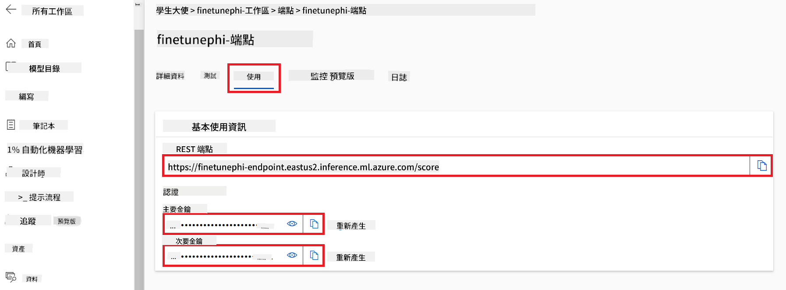

#### Kód hozzáadása a *flow.dag.yml* fájlhoz

1. Nyisd meg a *flow.dag.yml* fájlt a Visual Studio Code-ban.

1. Illeszd be a következő kódot a *flow.dag.yml* fájlba.

    ```yml
    inputs:
      input_data:
        type: string
        default: "Who founded Microsoft?"

    outputs:
      answer:
        type: string
        reference: ${integrate_with_promptflow.output}

    nodes:
    - name: integrate_with_promptflow
      type: python
      source:
        type: code
        path: integrate_with_promptflow.py
      inputs:
        input_data: ${inputs.input_data}
    ```

#### Kód hozzáadása az *integrate_with_promptflow.py* fájlhoz

1. Nyisd meg az *integrate_with_promptflow.py* fájlt a Visual Studio Code-ban.

1. Illeszd be a következő kódot az *integrate_with_promptflow.py* fájlba.

    ```python
    import logging
    import requests
    from promptflow.core import tool
    import asyncio
    import platform
    from config import (
        AZURE_ML_ENDPOINT,
        AZURE_ML_API_KEY
    )

    # Logging setup
    logging.basicConfig(
        format="%(asctime)s - %(levelname)s - %(name)s - %(message)s",
        datefmt="%Y-%m-%d %H:%M:%S",
        level=logging.DEBUG
    )
    logger = logging.getLogger(__name__)

    def query_azml_endpoint(input_data: list, endpoint_url: str, api_key: str) -> str:
        """
        Send a request to the Azure ML endpoint with the given input data.
        """
        headers = {
            "Content-Type": "application/json",
            "Authorization": f"Bearer {api_key}"
        }
        data = {
            "input_data": [input_data],
            "params": {
                "temperature": 0.7,
                "max_new_tokens": 128,
                "do_sample": True,
                "return_full_text": True
            }
        }
        try:
            response = requests.post(endpoint_url, json=data, headers=headers)
            response.raise_for_status()
            result = response.json()[0]
            logger.info("Successfully received response from Azure ML Endpoint.")
            return result
        except requests.exceptions.RequestException as e:
            logger.error(f"Error querying Azure ML Endpoint: {e}")
            raise

    def setup_asyncio_policy():
        """
        Setup asyncio event loop policy for Windows.
        """
        if platform.system() == 'Windows':
            asyncio.set_event_loop_policy(asyncio.WindowsSelectorEventLoopPolicy())
            logger.info("Set Windows asyncio event loop policy.")

    @tool
    def my_python_tool(input_data: str) -> str:
        """
        Tool function to process input data and query the Azure ML endpoint.
        """
        setup_asyncio_policy()
        return query_azml_endpoint(input_data, AZURE_ML_ENDPOINT, AZURE_ML_API_KEY)

    ```

### Csevegj az egyedi modelleddel

1. Írd be a következő parancsot a *deploy_model.py* futtatásához és a telepítési folyamat elindításához az Azure Machine Learningben.

    ```python
    pf flow serve --source ./ --port 8080 --host localhost
    ```

1. Íme egy példa az eredményekre: Mostantól cseveghetsz az egyedi Phi-3 modelleddel. Ajánlott olyan kérdéseket feltenni, amelyek a finomhangolás során használt adatokon alapulnak.

    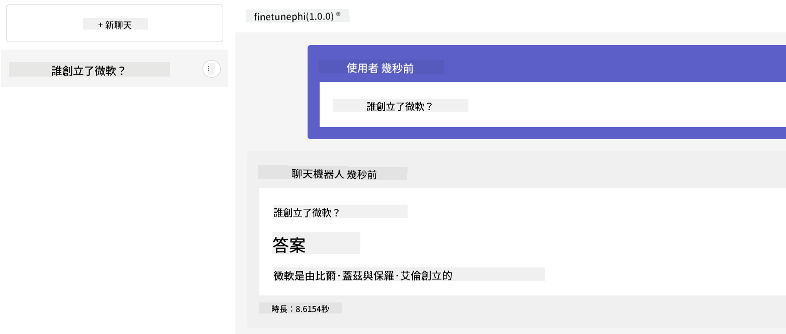

**Disclaimer**:  
This document has been translated using AI translation service [Co-op Translator](https://github.com/Azure/co-op-translator). While we strive for accuracy, please be aware that automated translations may contain errors or inaccuracies. The original document in its native language should be considered the authoritative source. For critical information, professional human translation is recommended. We are not liable for any misunderstandings or misinterpretations arising from the use of this translation.

---

Could you please clarify what language or dialect "mo" refers to? This will help me provide an accurate translation.