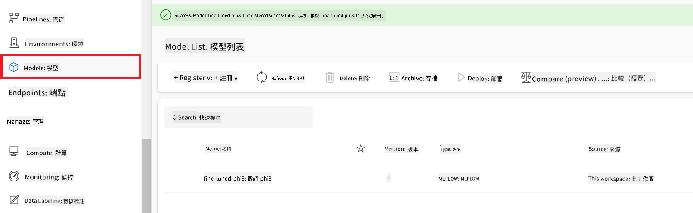

<!--
CO_OP_TRANSLATOR_METADATA:
{
  "original_hash": "0df910a227098303cc392b6ad204c271",
  "translation_date": "2026-01-06T04:16:36+00:00",
  "source_file": "md/02.Application/01.TextAndChat/Phi3/E2E_Phi-3-FineTuning_PromptFlow_Integration_AIFoundry.md",
  "language_code": "mo"
}
-->
# 微調及整合自訂 Phi-3 模型與 Azure AI Foundry 中的 Prompt flow

本端到端 (E2E) 範例基於 Microsoft 技術社群的指南「[在 Azure AI Foundry 以 Prompt Flow 微調及整合自訂 Phi-3 模型](https://techcommunity.microsoft.com/t5/educator-developer-blog/fine-tune-and-integrate-custom-phi-3-models-with-prompt-flow-in/ba-p/4191726?WT.mc_id=aiml-137032-kinfeylo)」，介紹微調、自訂 Phi-3 模型的部署及與 Azure AI Foundry 中的 Prompt flow 整合流程。與需要本地運行程式碼的端到端範例「[Fine-Tune and Integrate Custom Phi-3 Models with Prompt Flow](./E2E_Phi-3-FineTuning_PromptFlow_Integration.md)」不同，本教程完全聚焦在 Azure AI / ML Studio 內微調及整合您的模型。

## 概述

在這個端到端範例中，您將學習如何微調 Phi-3 模型，並將其與 Azure AI Foundry 的 Prompt flow 整合。透過 Azure AI / ML Studio，您將建立部署與使用自訂 AI 模型的工作流程。本端到端範例分為三個情境：

**情境 1：設定 Azure 資源並準備微調**

**情境 2：微調 Phi-3 模型並於 Azure Machine Learning Studio 部署**

**情境 3：與 Prompt flow 整合並在 Azure AI Foundry 中與自訂模型對話**

以下為本端到端範例的概覽。


### 目錄

1. **[情境 1：設定 Azure 資源並準備微調](../../../../../../md/02.Application/01.TextAndChat/Phi3)**
    - [建立 Azure Machine Learning 工作區](../../../../../../md/02.Application/01.TextAndChat/Phi3)
    - [申請 Azure 訂閱中的 GPU 配額](../../../../../../md/02.Application/01.TextAndChat/Phi3)
    - [新增角色指派](../../../../../../md/02.Application/01.TextAndChat/Phi3)
    - [設定專案](../../../../../../md/02.Application/01.TextAndChat/Phi3)
    - [準備微調用資料集](../../../../../../md/02.Application/01.TextAndChat/Phi3)

1. **[情境 2：微調 Phi-3 模型並於 Azure Machine Learning Studio 部署](../../../../../../md/02.Application/01.TextAndChat/Phi3)**
    - [微調 Phi-3 模型](../../../../../../md/02.Application/01.TextAndChat/Phi3)
    - [部署微調後的 Phi-3 模型](../../../../../../md/02.Application/01.TextAndChat/Phi3)

1. **[情境 3：與 Prompt flow 整合並在 Azure AI Foundry 中與自訂模型對話](../../../../../../md/02.Application/01.TextAndChat/Phi3)**
    - [將自訂 Phi-3 模型整合至 Prompt flow](../../../../../../md/02.Application/01.TextAndChat/Phi3)
    - [與您的自訂 Phi-3 模型聊天](../../../../../../md/02.Application/01.TextAndChat/Phi3)

## 情境 1：設定 Azure 資源並準備微調

### 建立 Azure Machine Learning 工作區

1. 在入口網站頁面頂端的**搜尋列**輸入 *azure machine learning*，並從出現的選項中選擇 **Azure Machine Learning**。

    

2. 從導覽選單中選擇 **+ Create**。

3. 從導覽選單中選擇 **New workspace**。

    

4. 執行以下設定：

    - 選擇您的 Azure **訂閱**。
    - 選擇要使用的 **資源群組**（如無，請建立新的）。
    - 輸入 **工作區名稱**，必須是唯一值。
    - 選擇您要使用的 **區域**。
    - 選擇要使用的 **儲存帳戶**（如無，請建立新的）。
    - 選擇要使用的 **金鑰保管庫**（如無，請建立新的）。
    - 選擇要使用的 **應用程式洞察**（如無，請建立新的）。
    - 選擇要使用的 **容器登錄**（如無，請建立新的）。

    

5. 選擇 **Review + Create**。

6. 選擇 **Create**。

### 申請 Azure 訂閱中的 GPU 配額

本教程將教您如何使用 GPU 微調及部署 Phi-3 模型。微調時會用到 *Standard_NC24ads_A100_v4* GPU，需先申請配額。部署時會用到 *Standard_NC6s_v3* GPU，也需申請配額。

> [!NOTE]
>
> 只有「隨用隨付」訂閱（標準訂閱類型）符合 GPU 配額申請資格；優惠訂閱目前不支援。
>

1. 前往 [Azure ML Studio](https://ml.azure.com/home?wt.mc_id=studentamb_279723)。

1. 申請 *Standard NCADSA100v4 Family* 配額：

    - 從左側標籤選擇 **Quota**。
    - 選擇要使用的 **虛擬機器系列**，例如選擇包含 *Standard_NC24ads_A100_v4* GPU 的 **Standard NCADSA100v4 Family Cluster Dedicated vCPUs**。
    - 從導覽選單選擇 **Request quota**。

        

    - 在配額申請頁面中，輸入您想要的 **新核心數限制**，例如 24。
    - 按 **Submit** 送出 GPU 配額申請。

1. 申請 *Standard NCSv3 Family* 配額：

    - 從左側標籤選擇 **Quota**。
    - 選擇要使用的 **虛擬機器系列**，例如選擇包含 *Standard_NC6s_v3* GPU 的 **Standard NCSv3 Family Cluster Dedicated vCPUs**。
    - 從導覽選單選擇 **Request quota**。
    - 在配額申請頁面中，輸入您想要的 **新核心數限制**，例如 24。
    - 按 **Submit** 送出 GPU 配額申請。

### 新增角色指派

為了能微調及部署您的模型，您必須先建立一個「使用者指派管理身份」(User Assigned Managed Identity, UAI)，並給予適當權限。此 UAI 將用於部署流程中的驗證。

#### 建立使用者指派管理身份(UAI)

1. 在入口網站頁面頂端的**搜尋列**輸入 *managed identities*，並從出現的選項中選擇 **Managed Identities**。

    

1. 選擇 **+ Create**。

    

1. 執行以下設定：

    - 選擇您的 Azure **訂閱**。
    - 選擇要使用的 **資源群組**（如無，請建立新的）。
    - 選擇您要使用的 **區域**。
    - 輸入 **名稱**，必須是唯一值。

    

1. 選擇 **Review + create**。

1. 選擇 **+ Create**。

#### 新增 Contributor 角色指派給 Managed Identity

1. 導覽到您剛建立的 Managed Identity 資源。

1. 從左側標籤選擇 **Azure role assignments**。

1. 從導覽選單選擇 **+ Add role assignment**。

1. 在「新增角色指派」頁面，執行以下操作：
    - 將 **Scope** 設為 **Resource group**。
    - 選擇您的 Azure **訂閱**。
    - 選擇要使用的 **資源群組**。
    - 將 **Role** 設為 **Contributor**。

    

2. 選擇 **Save**。

#### 新增 Storage Blob Data Reader 角色指派給 Managed Identity

1. 在入口網站頁面頂端的**搜尋列**輸入 *storage accounts*，並從出現的選項中選擇 **Storage accounts**。

    

1. 選擇與您建立的 Azure Machine Learning 工作區相關聯的儲存帳戶。例如 *finetunephistorage*。

1. 執行以下步驟以進入新增角色指派頁面：

    - 導覽至您建立的 Azure 儲存帳戶。
    - 從左側標籤選擇 **Access Control (IAM)**。
    - 從導覽選單選擇 **+ Add**。
    - 選擇 **Add role assignment**。

    

1. 在「新增角色指派」頁面執行以下操作：

    - 在 Role 頁面的**搜尋列**輸入 *Storage Blob Data Reader*，並從列表中選擇 **Storage Blob Data Reader**。
    - 選擇 **Next**。
    - 在 Members 頁面，將 **Assign access to** 設為 **Managed identity**。
    - 選擇 **+ Select members**。
    - 在選取管理身份頁面，選擇您的 Azure **訂閱**。
    - 選擇要指派的 **Managed identity**。
    - 選擇您剛建立的 Managed Identity，例如 *finetunephi-managedidentity*。
    - 選擇 **Select**。

    

1. 選擇 **Review + assign**。

#### 新增 AcrPull 角色指派給 Managed Identity

1. 在入口網站頁面頂端的**搜尋列**輸入 *container registries*，並從出現的選項中選擇 **Container registries**。

    

1. 選擇與 Azure Machine Learning 工作區相關聯的容器登錄。例如 *finetunephicontainerregistry*

1. 執行以下步驟以進入新增角色指派頁面：

    - 從左側標籤選擇 **Access Control (IAM)**。
    - 從導覽選單選擇 **+ Add**。
    - 選擇 **Add role assignment**。

1. 在「新增角色指派」頁面執行以下操作：

    - 在角色頁面**搜尋列**輸入 *AcrPull*，並選擇列表中的 **AcrPull**。
    - 選擇 **Next**。
    - 在成員頁面，將 **Assign access to** 設為 **Managed identity**。
    - 選擇 **+ Select members**。
    - 在選取管理身份頁面，選擇您的 Azure **訂閱**。
    - 選擇要指派的 **Managed identity**。
    - 選擇您剛建立的 Managed Identity，例如 *finetunephi-managedidentity*。
    - 選擇 **Select**。
    - 選擇 **Review + assign**。

### 設定專案

為了下載微調所需的資料集，您將設定一個本地環境。

在此練習中，您將：

- 建立一個資料夾作為工作目錄。
- 建立虛擬環境。
- 安裝所需套件。
- 建立 *download_dataset.py* 檔案以下載資料集。

#### 建立資料夾作為工作目錄

1. 打開終端機視窗，輸入以下指令，在預設路徑下建立名為 *finetune-phi* 的資料夾。

    ```console
    mkdir finetune-phi
    ```

2. 在您的終端機輸入以下指令，導航至您建立的 *finetune-phi* 資料夾。

    ```console
    cd finetune-phi
    ```

#### 建立虛擬環境

1. 在您的終端機輸入以下指令，建立一個名為 *.venv* 的虛擬環境。

    ```console
    python -m venv .venv
    ```

2. 在您的終端機輸入以下指令以啟用虛擬環境。

    ```console
    .venv\Scripts\activate.bat
    ```

> [!NOTE]
> 如果成功，您應該會在命令提示字元前看到 *(.venv)*。

#### 安裝所需套件

1. 在您的終端機輸入以下指令以安裝所需套件。

    ```console
    pip install datasets==2.19.1
    ```

#### 建立 `donload_dataset.py`

> [!NOTE]
> 完整資料夾結構：
>
> ```text
> └── YourUserName
> .    └── finetune-phi
> .        └── download_dataset.py
> ```

1. 開啟 **Visual Studio Code**。

1. 從功能表欄選擇 **檔案**。

1. 選擇 **開啟資料夾**。

1. 選擇您建立的 *finetune-phi* 資料夾，該資料夾位於 *C:\Users\yourUserName\finetune-phi*。

    

1. 在 Visual Studio Code 左側面板中，右鍵點擊並選擇 **新增檔案**，建立一個名為 *download_dataset.py* 的新檔案。

    

### 準備 fine-tuning 用的資料集

在本練習中，您將執行 *download_dataset.py* 檔案，將 *ultrachat_200k* 資料集下載至您的本地環境。接著您會使用這些資料集來在 Azure Machine Learning 中微調 Phi-3 模型。

在本練習中，您將會：

- 在 *download_dataset.py* 檔案中加入程式碼以下載資料集。
- 執行 *download_dataset.py* 檔案，將資料集下載至本地環境。

#### 使用 *download_dataset.py* 下載您的資料集

1. 在 Visual Studio Code 中開啟 *download_dataset.py* 檔案。

1. 將以下程式碼加入 *download_dataset.py* 檔案中。

    ```python
    import json
    import os
    from datasets import load_dataset

    def load_and_split_dataset(dataset_name, config_name, split_ratio):
        """
        Load and split a dataset.
        """
        # 加載具有指定名稱、配置和分割比例嘅數據集
        dataset = load_dataset(dataset_name, config_name, split=split_ratio)
        print(f"Original dataset size: {len(dataset)}")
        
        # 將數據集分割為訓練集同測試集（80% 訓練，20% 測試）
        split_dataset = dataset.train_test_split(test_size=0.2)
        print(f"Train dataset size: {len(split_dataset['train'])}")
        print(f"Test dataset size: {len(split_dataset['test'])}")
        
        return split_dataset

    def save_dataset_to_jsonl(dataset, filepath):
        """
        Save a dataset to a JSONL file.
        """
        # 如果目錄不存在就創建佢
        os.makedirs(os.path.dirname(filepath), exist_ok=True)
        
        # 以寫入模式打開文件
        with open(filepath, 'w', encoding='utf-8') as f:
            # 遍歷數據集入面嘅每條記錄
            for record in dataset:
                # 將記錄以 JSON 對象格式導出並寫入文件
                json.dump(record, f)
                # 寫入換行符號用嚟分隔記錄
                f.write('\n')
        
        print(f"Dataset saved to {filepath}")

    def main():
        """
        Main function to load, split, and save the dataset.
        """
        # 加載同分割 ULTRACHAT_200k 數據集，使用指定配置同分割比例
        dataset = load_and_split_dataset("HuggingFaceH4/ultrachat_200k", 'default', 'train_sft[:1%]')
        
        # 從分割中提取訓練同測試數據集
        train_dataset = dataset['train']
        test_dataset = dataset['test']

        # 將訓練集保存到 JSONL 文件
        save_dataset_to_jsonl(train_dataset, "data/train_data.jsonl")
        
        # 將測試集保存到另一個 JSONL 文件
        save_dataset_to_jsonl(test_dataset, "data/test_data.jsonl")

    if __name__ == "__main__":
        main()

    ```

1. 在您的終端機輸入以下指令以執行該腳本並將資料集下載至本地環境。

    ```console
    python download_dataset.py
    ```

1. 驗證資料集是否成功保存在本地的 *finetune-phi/data* 目錄中。

> [!NOTE]
>
> #### 關於資料集大小和微調時間的說明
>
> 在本教學中，您只使用了資料集的 1%（`split='train[:1%]'`）。這大幅減少了資料量，加快了上傳及微調的速度。您可以調整此百分比，以尋找訓練時間與模型效能之間的最佳平衡。使用較小的資料子集能縮短微調所需時間，使教學流程更方便管理。

## 場景 2：微調 Phi-3 模型並部署於 Azure Machine Learning Studio

### 微調 Phi-3 模型

在本練習中，您將在 Azure Machine Learning Studio 微調 Phi-3 模型。

在本練習中，您將會：

- 建立微調用的計算叢集。
- 在 Azure Machine Learning Studio 中微調 Phi-3 模型。

#### 建立微調計算叢集

1. 訪問 [Azure ML Studio](https://ml.azure.com/home?wt.mc_id=studentamb_279723)。

1. 從左側分頁選擇 **計算**。

1. 從導覽選單選擇 **計算叢集**。

1. 選擇 **+ 新增**。

    

1. 執行以下操作：

    - 選擇您想使用的 **區域**。
    - 選擇 **虛擬機等級** 為 **專用 (Dedicated)**。
    - 選擇 **虛擬機類型** 為 **GPU**。
    - 在 **虛擬機大小** 篩選器中選擇 **全部選項**。
    - 選擇 **虛擬機大小** 為 **Standard_NC24ads_A100_v4**。

    

1. 選擇 **下一步**。

1. 執行以下操作：

    - 輸入 **計算名稱**，此名稱必須是唯一值。
    - 選擇 **最低節點數** 為 **0**。
    - 選擇 **最高節點數** 為 **1**。
    - 選擇 **閒置秒數後縮減** 為 **120**。

    

1. 選擇 **建立**。

#### 微調 Phi-3 模型

1. 訪問 [Azure ML Studio](https://ml.azure.com/home?wt.mc_id=studentamb_279723)。

1. 選擇您建立的 Azure Machine Learning 工作區。

    

1. 執行以下操作：

    - 從左側分頁選擇 **模型目錄**。
    - 在 **搜尋列** 輸入 *phi-3-mini-4k*，並從出現的選項中選擇 **Phi-3-mini-4k-instruct**。

    

1. 從導覽選單選擇 **微調**。

    

1. 執行以下操作：

    - 選擇 **選擇任務類型** 為 **聊天補全 (Chat completion)**。
    - 選擇 **+ 選擇資料** 以上傳 **訓練資料**。
    - 將驗證資料上傳類型選為 **提供不同的驗證資料**。
    - 選擇 **+ 選擇資料** 以上傳 **驗證資料**。

    

> [!TIP]
>
> 您可以選擇 **進階設定**，自訂例如 **learning_rate** 和 **lr_scheduler_type** 等配置，以根據您的具體需求優化微調流程。

1. 選擇 **完成**。

1. 在本練習中，您已成功使用 Azure Machine Learning 微調 Phi-3 模型。請注意，微調過程可能需要相當長的時間。執行微調工作後，您需要等待其完成。您可以透過 Azure Machine Learning 工作區左側的工作工作列 (Jobs tab) 監控該微調工作的狀態。在後續系列中，您將部署微調後的模型並將其與 Prompt flow 整合。

    

### 部署微調後的 Phi-3 模型

為了將微調後的 Phi-3 模型與 Prompt flow 整合，您需要部署模型，使其可供實時推論。此流程包含模型註冊、建立線上端點及模型部署。

在本練習中，您將會：

- 在 Azure Machine Learning 工作區中註冊微調後模型。
- 建立線上端點。
- 部署已註冊的微調後 Phi-3 模型。

#### 註冊微調後模型

1. 訪問 [Azure ML Studio](https://ml.azure.com/home?wt.mc_id=studentamb_279723)。

1. 選擇您建立的 Azure Machine Learning 工作區。

    

1. 從左側分頁選擇 **模型**。
1. 選擇 **+ 註冊**。
1. 選擇 **從工作輸出 (From a job output)**。

    

1. 選擇您建立的工作。

    

1. 選擇 **下一步**。

1. 選擇 **模型類型** 為 **MLflow**。

1. 確認 **工作輸出** 已被選中；系統應會自動選中。

    

2. 選擇 **下一步**。

3. 選擇 **註冊**。

    

4. 您可透過左側分頁的 **模型** 選單查看已註冊的模型。

    

#### 部署微調後模型

1. 導覽至您建立的 Azure Machine Learning 工作區。

1. 從左側分頁選擇 **端點 (Endpoints)**。

1. 從導覽選單選擇 **實時端點 (Real-time endpoints)**。

    

1. 選擇 **建立**。

1. 選擇您所註冊的模型。

    

1. 選擇 **選擇**。

1. 執行以下操作：

    - 選擇 **虛擬機** 為 *Standard_NC6s_v3*。
    - 選擇您想使用的 **實例數量**，例如 *1*。
    - 將 **端點** 選擇為 **新增** 以建立新端點。
    - 輸入 **端點名稱**，必須為唯一值。
    - 輸入 **部署名稱**，必須為唯一值。

    

1. 選擇 **部署**。

> [!WARNING]
> 為避免對您的帳戶產生額外費用，請確保在 Azure Machine Learning 工作區刪除您所建立的端點。
>

#### 在 Azure Machine Learning 工作區中檢查部署狀態

1. 導覽到您建立的 Azure Machine Learning 工作區。

1. 從左側分頁選擇 **端點 (Endpoints)**。

1. 選擇您建立的端點。

    

1. 在此頁面中，您可以在部署過程中管理端點。

> [!NOTE]
> 部署完成後，請確保 **實時流量 (Live traffic)** 設定為 **100%**。若未設為 100%，請選擇 **更新流量 (Update traffic)** 進行調整。若流量設為 0%，將無法測試模型。
>
> 
>

## 場景 3：與 Prompt flow 整合並在 Azure AI Foundry 與您的自訂模型對話

### 將自訂 Phi-3 模型與 Prompt flow 整合

成功部署微調模型後，您現在可以將它與 Prompt Flow 整合，於即時應用中使用您的模型，實現與自訂 Phi-3 模型的多種互動任務。

在本練習中，您將會：

- 建立 Azure AI Foundry Hub。
- 建立 Azure AI Foundry 專案。
- 建立 Prompt flow。
- 新增微調後 Phi-3 模型的自訂連接。
- 設定 Prompt flow 與您的自訂 Phi-3 模型對話。

> [!NOTE]
> 您也可以使用 Azure ML Studio 與 Promptflow 整合。相同的整合流程亦適用於 Azure ML Studio。

#### 建立 Azure AI Foundry Hub

建立專案前，您需要先建立一個 Hub。Hub 如同資源群組，可讓您組織並管理 Azure AI Foundry 內的多個專案。

1. 訪問 [Azure AI Foundry](https://ai.azure.com/?WT.mc_id=aiml-137032-kinfeylo)。

1. 從左側分頁選擇 **所有 Hubs**。

1. 從導覽選單選擇 **+ 新增 Hub**。


1. 執行以下任務：

    - 輸入 **樞紐名稱**。必須是一個唯一值。
    - 選擇您的 Azure **訂閱**。
    - 選擇要使用的 **資源群組**（如有需要，請建立新的）。
    - 選擇您想要使用的 **區域**。
    - 選擇要使用的 **連接 Azure AI 服務**（如有需要，請建立新的）。
    - 選擇 **連接 Azure AI 搜尋**，並選取 **略過連線**。


1. 選擇 **下一步**。

#### 建立 Azure AI Foundry 專案

1. 在您建立的樞紐中，從左側標籤選取 **所有專案**。

1. 從導覽選單中選取 **+ 新專案**。


1. 輸入 **專案名稱**。必須是一個唯一值。


1. 選擇 **建立專案**。

#### 為微調的 Phi-3 模型新增自訂連線

要將您的自訂 Phi-3 模型與 Prompt flow 結合，您需要將模型的端點和金鑰儲存在自訂連線中。此設定可確保在 Prompt flow 中存取您的自訂 Phi-3 模型。

#### 設定微調的 Phi-3 模型的 api 金鑰和端點 URI

1. 訪問 [Azure ML Studio](https://ml.azure.com/home?WT.mc_id=aiml-137032-kinfeylo)。

1. 導覽到您建立的 Azure 機器學習工作區。

1. 從左側標籤選取 **端點**。


1. 選取您建立的端點。


1. 從導覽選單選取 **使用**。

1. 複製您的 **REST 端點** 和 **主要金鑰**。


#### 新增自訂連線

1. 訪問 [Azure AI Foundry](https://ai.azure.com/?WT.mc_id=aiml-137032-kinfeylo)。

1. 導覽至您建立的 Azure AI Foundry 專案。

1. 在您建立的專案中，從左側標籤選取 **設定**。

1. 選擇 **+ 新增連線**。


1. 從導覽選單選取 **自訂金鑰**。


1. 執行下列任務：

    - 選擇 **+ 新增金鑰值對**。
    - 在金鑰名稱欄輸入 **endpoint**，並將您從 Azure ML Studio 複製的端點貼到值欄位。
    - 再次選擇 **+ 新增金鑰值對**。
    - 在金鑰名稱欄輸入 **key**，並將您從 Azure ML Studio 複製的金鑰貼到值欄位。
    - 新增金鑰後，選取 **是秘密** 以防止金鑰外洩。


1. 選擇 **新增連線**。

#### 建立 Prompt flow

您已在 Azure AI Foundry 新增了自訂連線。現在，讓我們按照以下步驟建立一個 Prompt flow，然後將該 Prompt flow 連接到自訂連線，以便您能在 Prompt flow 中使用微調模型。

1. 導覽至您建立的 Azure AI Foundry 專案。

1. 從左側標籤選擇 **Prompt flow**。

1. 從導覽選單選擇 **+ 建立**。


1. 從導覽選單選擇 **聊天流程**。


1. 輸入要使用的 **資料夾名稱**。


2. 選擇 **建立**。

#### 設定 Prompt flow 與您的自訂 Phi-3 模型聊天

您需要將微調的 Phi-3 模型整合到 Prompt flow 中，不過現有的 Prompt flow 並非為此用途而設計。因此，您必須重新設計 Prompt flow，以實現自訂模型的整合。

1. 在 Prompt flow 中，執行以下步驟以重建現有流程：

    - 選擇 **原始檔案模式**。
    - 刪除 *flow.dag.yml* 檔案中所有現有程式碼。
    - 將以下程式碼加入 *flow.dag.yml* 檔案。

        ```yml
        inputs:
          input_data:
            type: string
            default: "Who founded Microsoft?"

        outputs:
          answer:
            type: string
            reference: ${integrate_with_promptflow.output}

        nodes:
        - name: integrate_with_promptflow
          type: python
          source:
            type: code
            path: integrate_with_promptflow.py
          inputs:
            input_data: ${inputs.input_data}
        ```

    - 選擇 **儲存**。


1. 將以下程式碼加入 *integrate_with_promptflow.py* 檔案，以在 Prompt flow 中使用自訂的 Phi-3 模型。

    ```python
    import logging
    import requests
    from promptflow import tool
    from promptflow.connections import CustomConnection

    # 設置日誌記錄
    logging.basicConfig(
        format="%(asctime)s - %(levelname)s - %(name)s - %(message)s",
        datefmt="%Y-%m-%d %H:%M:%S",
        level=logging.DEBUG
    )
    logger = logging.getLogger(__name__)

    def query_phi3_model(input_data: str, connection: CustomConnection) -> str:
        """
        Send a request to the Phi-3 model endpoint with the given input data using Custom Connection.
        """

        # 「connection」是自訂連接的名稱，「endpoint」、「key」是自訂連接中的鍵
        endpoint_url = connection.endpoint
        api_key = connection.key

        headers = {
            "Content-Type": "application/json",
            "Authorization": f"Bearer {api_key}"
        }
        data = {
            "input_data": {
                "input_string": [
                    {"role": "user", "content": input_data}
                ],
                "parameters": {
                    "temperature": 0.7,
                    "max_new_tokens": 128
                }
            }
        }
        try:
            response = requests.post(endpoint_url, json=data, headers=headers)
            response.raise_for_status()
            
            # 記錄完整的 JSON 回應
            logger.debug(f"Full JSON response: {response.json()}")

            result = response.json()["output"]
            logger.info("Successfully received response from Azure ML Endpoint.")
            return result
        except requests.exceptions.RequestException as e:
            logger.error(f"Error querying Azure ML Endpoint: {e}")
            raise

    @tool
    def my_python_tool(input_data: str, connection: CustomConnection) -> str:
        """
        Tool function to process input data and query the Phi-3 model.
        """
        return query_phi3_model(input_data, connection)

    ```


> [!NOTE]
> 若需有關在 Azure AI Foundry 中使用 Prompt flow 的更詳細資訊，請參考 [Azure AI Foundry 中的 Prompt flow](https://learn.microsoft.com/azure/ai-studio/how-to/prompt-flow)。

1. 選擇 **聊天輸入**、**聊天輸出** 以啟用與您的模型聊天。


1. 現在，您已準備好與自訂 Phi-3 模型聊天。在下一個練習中，您將學習如何啟動 Prompt flow，並使用它與您的微調 Phi-3 模型聊天。

> [!NOTE]
>
> 重建後的流程應該看起來像下方圖片：
>
> 
>

### 與您的自訂 Phi-3 模型聊天

現在您已經微調並將您的自訂 Phi-3 模型整合至 Prompt flow，您已準備好開始與它互動。本練習將引導您使用 Prompt flow 設定並啟動與您的模型聊天。透過遵循這些步驟，您將能充分利用微調的 Phi-3 模型進行各種任務和對話。

- 使用 Prompt flow 與您的自訂 Phi-3 模型聊天。

#### 啟動 Prompt flow

1. 選擇 **啟動運算階段** 以啟動 Prompt flow。


1. 選擇 **驗證並解析輸入** 以更新參數。


1. 選擇 **connection** 的 **值**，即您建立的自訂連線。例如：*connection*。


#### 與您的自訂模型聊天

1. 選擇 **聊天**。


1. 以下是結果範例：現在您可以與您的自訂 Phi-3 模型聊天。建議根據用於微調的資料來提問。


---

<!-- CO-OP TRANSLATOR DISCLAIMER START -->
**免責聲明**：
本文件由 AI 翻譯服務 [Co-op Translator](https://github.com/Azure/co-op-translator) 進行翻譯。雖然我們致力於準確性，但請注意，自動翻譯可能包含錯誤或不準確之處。原始文件的母語版本應視為權威來源。對於重要資訊，建議採用專業人工翻譯。本公司不對因使用本翻譯而引起的任何誤解或誤釋承擔責任。
<!-- CO-OP TRANSLATOR DISCLAIMER END -->