<!--
CO_OP_TRANSLATOR_METADATA:
{
  "original_hash": "ed86d361ac6d4cc8bfb47428e6a2a247",
  "translation_date": "2025-04-04T12:34:59+00:00",
  "source_file": "md\\02.Application\\01.TextAndChat\\Phi3\\E2E_Phi-3-FineTuning_PromptFlow_Integration_AIFoundry.md",
  "language_code": "mo"
}
-->
# Fine-tune and Integrate custom Phi-3 models with Prompt flow in Azure AI Foundry

This complete sample is based on the guide "[Fine-Tune and Integrate Custom Phi-3 Models with Prompt Flow in Azure AI Foundry](https://techcommunity.microsoft.com/t5/educator-developer-blog/fine-tune-and-integrate-custom-phi-3-models-with-prompt-flow-in/ba-p/4191726?WT.mc_id=aiml-137032-kinfeylo)" from the Microsoft Tech Community. It explains the processes of fine-tuning, deploying, and integrating custom Phi-3 models with Prompt flow in Azure AI Foundry.  
Unlike the complete sample, "[Fine-Tune and Integrate Custom Phi-3 Models with Prompt Flow](./E2E_Phi-3-FineTuning_PromptFlow_Integration.md)", which involved running code locally, this tutorial is entirely focused on fine-tuning and integrating your model within the Azure AI / ML Studio.

## Overview

In this sample, you’ll learn how to fine-tune the Phi-3 model and integrate it with Prompt flow in Azure AI Foundry. Using Azure AI / ML Studio, you’ll create a workflow for deploying and utilizing custom AI models. The sample is divided into three scenarios:

**Scenario 1: Set up Azure resources and Prepare for fine-tuning**  

**Scenario 2: Fine-tune the Phi-3 model and Deploy in Azure Machine Learning Studio**  

**Scenario 3: Integrate with Prompt flow and Chat with your custom model in Azure AI Foundry**  

Below is an overview of this sample.

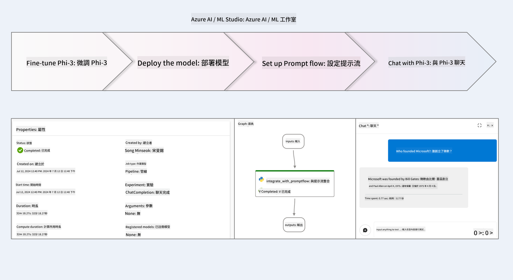

### Table of Contents

1. **[Scenario 1: Set up Azure resources and Prepare for fine-tuning](../../../../../../md/02.Application/01.TextAndChat/Phi3)**  
    - [Create an Azure Machine Learning Workspace](../../../../../../md/02.Application/01.TextAndChat/Phi3)  
    - [Request GPU quotas in Azure Subscription](../../../../../../md/02.Application/01.TextAndChat/Phi3)  
    - [Add role assignment](../../../../../../md/02.Application/01.TextAndChat/Phi3)  
    - [Set up project](../../../../../../md/02.Application/01.TextAndChat/Phi3)  
    - [Prepare dataset for fine-tuning](../../../../../../md/02.Application/01.TextAndChat/Phi3)  

1. **[Scenario 2: Fine-tune Phi-3 model and Deploy in Azure Machine Learning Studio](../../../../../../md/02.Application/01.TextAndChat/Phi3)**  
    - [Fine-tune the Phi-3 model](../../../../../../md/02.Application/01.TextAndChat/Phi3)  
    - [Deploy the fine-tuned Phi-3 model](../../../../../../md/02.Application/01.TextAndChat/Phi3)  

1. **[Scenario 3: Integrate with Prompt flow and Chat with your custom model in Azure AI Foundry](../../../../../../md/02.Application/01.TextAndChat/Phi3)**  
    - [Integrate the custom Phi-3 model with Prompt flow](../../../../../../md/02.Application/01.TextAndChat/Phi3)  
    - [Chat with your custom Phi-3 model](../../../../../../md/02.Application/01.TextAndChat/Phi3)  

## Scenario 1: Set up Azure resources and Prepare for fine-tuning

### Create an Azure Machine Learning Workspace

1. Type *azure machine learning* in the **search bar** at the top of the portal page and select **Azure Machine Learning** from the options that appear.  

    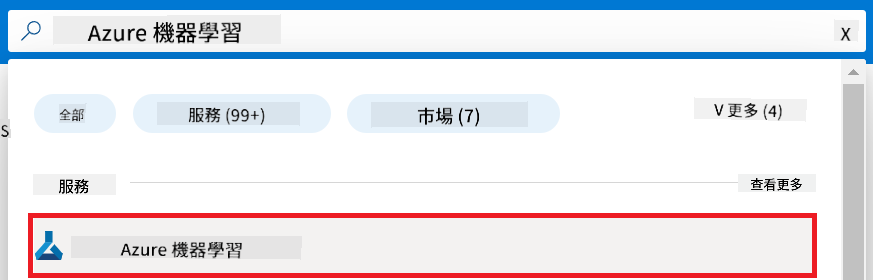

2. Select **+ Create** from the navigation menu.  

3. Select **New workspace** from the navigation menu.  

    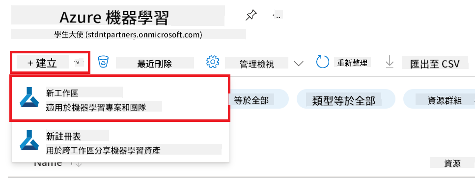

4. Perform the following tasks:  

    - Choose your Azure **Subscription**.  
    - Pick the **Resource group** to use (create one if necessary).  
    - Enter **Workspace Name**. Ensure it's unique.  
    - Choose the **Region** you'd like to use.  
    - Pick the **Storage account** to use (create one if necessary).  
    - Choose the **Key vault** to use (create one if necessary).  
    - Pick the **Application insights** to use (create one if necessary).  
    - Choose the **Container registry** to use (create one if necessary).  

    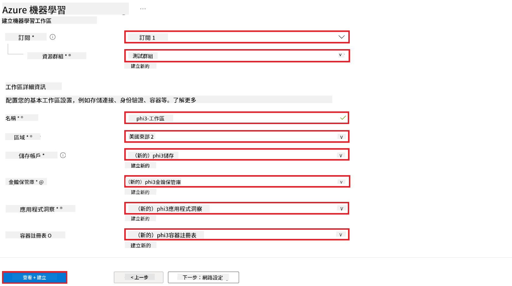

5. Select **Review + Create**.  

6. Select **Create**.  

### Request GPU quotas in Azure Subscription

In this tutorial, you'll fine-tune and deploy a Phi-3 model using GPUs. For fine-tuning, the *Standard_NC24ads_A100_v4* GPU is required, which necessitates a quota request. For deployment, the *Standard_NC6s_v3* GPU also requires a quota request.  

> [!NOTE]  
> Only Pay-As-You-Go subscriptions (the standard subscription type) are eligible for GPU allocation; benefit subscriptions are not currently supported.  

1. Visit [Azure ML Studio](https://ml.azure.com/home?wt.mc_id=studentamb_279723).  

1. Perform the following tasks to request *Standard NCADSA100v4 Family* quota:  

    - Select **Quota** from the left side tab.  
    - Pick the **Virtual machine family** to use. For example, choose **Standard NCADSA100v4 Family Cluster Dedicated vCPUs**, which includes the *Standard_NC24ads_A100_v4* GPU.  
    - Select **Request quota** from the navigation menu.  

        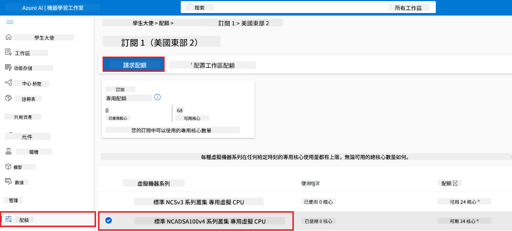

    - On the Request quota page, enter the **New cores limit** you'd like to use. For example, 24.  
    - On the Request quota page, select **Submit** to request the GPU quota.  

1. Perform the following tasks to request *Standard NCSv3 Family* quota:  

    - Select **Quota** from the left side tab.  
    - Pick the **Virtual machine family** to use. For example, choose **Standard NCSv3 Family Cluster Dedicated vCPUs**, which includes the *Standard_NC6s_v3* GPU.  
    - Select **Request quota** from the navigation menu.  
    - On the Request quota page, enter the **New cores limit** you'd like to use. For example, 24.  
    - On the Request quota page, select **Submit** to request the GPU quota.  

### Add role assignment

To fine-tune and deploy your models, you need to create a User Assigned Managed Identity (UAI) and assign it the necessary permissions. This UAI will be used for authentication during deployment.  

#### Create User Assigned Managed Identity (UAI)

1. Type *managed identities* in the **search bar** at the top of the portal page and select **Managed Identities** from the options that appear.  

    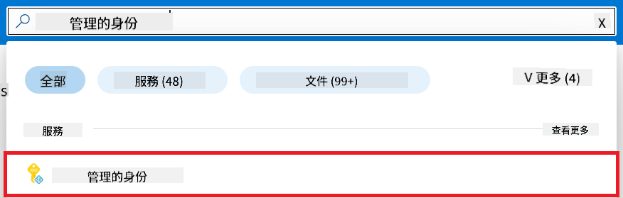

1. Select **+ Create**.  

    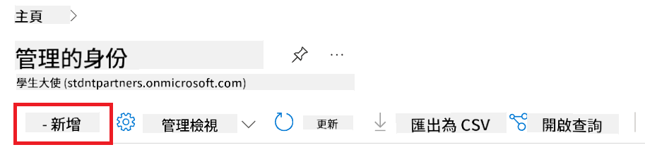

1. Perform the following tasks:  

    - Choose your Azure **Subscription**.  
    - Pick the **Resource group** to use (create one if necessary).  
    - Choose the **Region** you'd like to use.  
    - Enter the **Name**. Ensure it's unique.  

    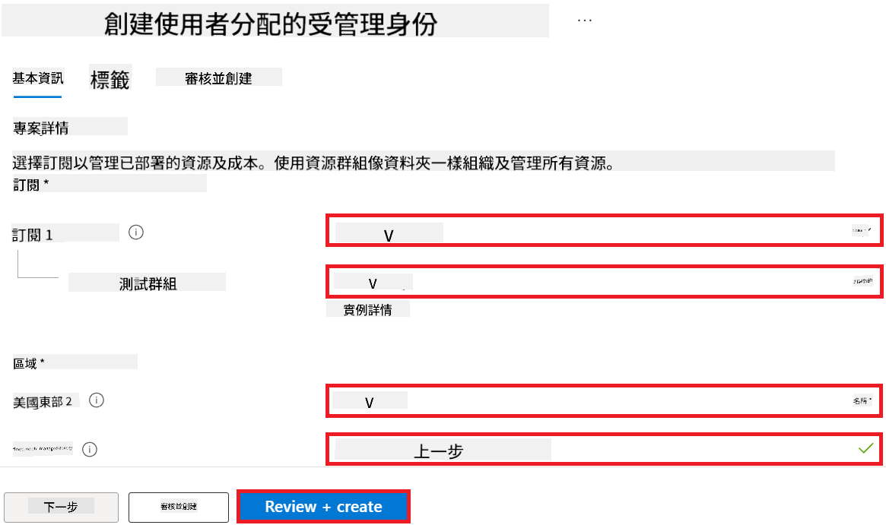

1. Select **Review + create**.  

1. Select **+ Create**.  

#### Add Contributor role assignment to Managed Identity

1. Navigate to the Managed Identity resource you created.  

1. Select **Azure role assignments** from the left side tab.  

1. Select **+Add role assignment** from the navigation menu.  

1. On the Add role assignment page, perform the following tasks:  
    - Set **Scope** to **Resource group**.  
    - Pick your Azure **Subscription**.  
    - Choose the **Resource group** to use.  
    - Set **Role** to **Contributor**.  

    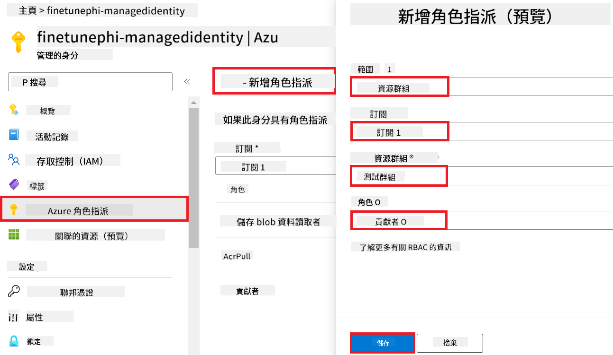

2. Select **Save**.  

#### Add Storage Blob Data Reader role assignment to Managed Identity

1. Type *storage accounts* in the **search bar** at the top of the portal page and select **Storage accounts** from the options that appear.  

    

1. Select the storage account associated with the Azure Machine Learning workspace you created. For example, *finetunephistorage*.  

1. Perform the following tasks to navigate to the Add role assignment page:  

    - Go to the Azure Storage account you created.  
    - Select **Access Control (IAM)** from the left side tab.  
    - Select **+ Add** from the navigation menu.  
    - Select **Add role assignment** from the navigation menu.  

    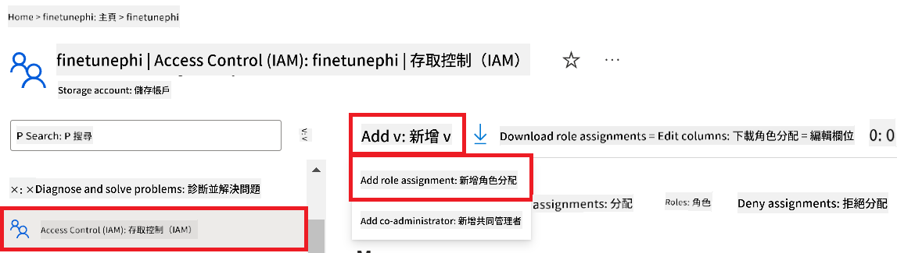

1. On the Add role assignment page, perform the following tasks:  

    - On the Role page, type *Storage Blob Data Reader* in the **search bar** and select **Storage Blob Data Reader** from the options that appear.  
    - On the Role page, select **Next**.  
    - On the Members page, set **Assign access to** **Managed identity**.  
    - On the Members page, select **+ Select members**.  
    - On the Select managed identities page, pick your Azure **Subscription**.  
    - On the Select managed identities page, choose the **Managed identity** to **Manage Identity**.  
    - On the Select managed identities page, select the Managed Identity you created. For example, *finetunephi-managedidentity*.  
    - On the Select managed identities page, select **Select**.  

    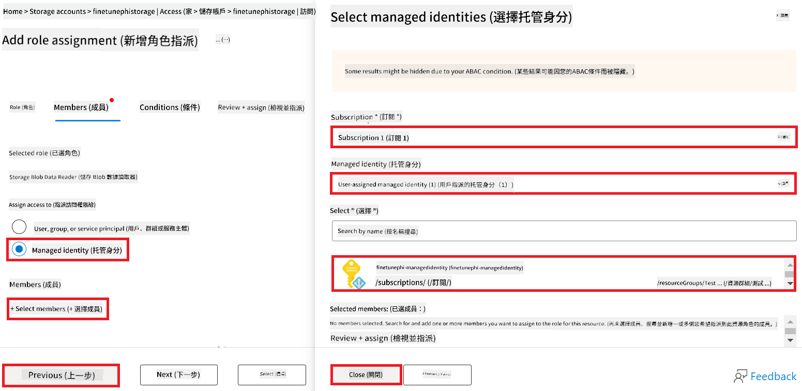

1. Select **Review + assign**.  

#### Add AcrPull role assignment to Managed Identity

1. Type *container registries* in the **search bar** at the top of the portal page and select **Container registries** from the options that appear.  

    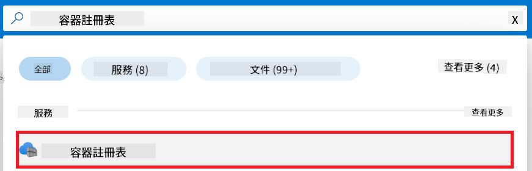

1. Select the container registry associated with the Azure Machine Learning workspace. For example, *finetunephicontainerregistry*.  

1. Perform the following tasks to navigate to the Add role assignment page:  

    - Select **Access Control (IAM)** from the left side tab.  
    - Select **+ Add** from the navigation menu.  
    - Select **Add role assignment** from the navigation menu.  

1. On the Add role assignment page, perform the following tasks:  

    - On the Role page, type *AcrPull* in the **search bar** and select **AcrPull** from the options that appear.  
    - On the Role page, select **Next**.  
    - On the Members page, set **Assign access to** **Managed identity**.  
    - On the Members page, select **+ Select members**.  
    - On the Select managed identities page, pick your Azure **Subscription**.  
    - On the Select managed identities page, choose the **Managed identity** to **Manage Identity**.  
    - On the Select managed identities page, select the Managed Identity you created. For example, *finetunephi-managedidentity*.  
    - On the Select managed identities page, select **Select**.  
    - Select **Review + assign**.  

### Set up project

To download the datasets needed for fine-tuning, you’ll set up a local environment.  

In this exercise, you’ll:  

- Create a folder to work inside.  
- Create a virtual environment.  
- Install the required packages.  
- Create a *download_dataset.py* file to download the dataset.  

#### Create a folder to work inside

1. Open a terminal window and type the following command to create a folder named *finetune-phi* in the default path.  

    ```console
    mkdir finetune-phi
    ```  

2. Type the following command inside your terminal to navigate to the *finetune-phi* folder you created.  

    ```console
    cd finetune-phi
    ```  

#### Create a virtual environment

1. Type the following command inside your terminal to create a virtual environment named *.venv*.  

    ```console
    python -m venv .venv
    ```  

2. Type the following command inside your terminal to activate the virtual environment.  

    ```console
    .venv\Scripts\activate.bat
    ```  

> [!NOTE]  
> If it worked, you should see *(.venv)* before the command prompt.  

#### Install the required packages

1. Type the following commands inside your terminal to install the required packages.  

    ```console
    pip install datasets==2.19.1
    ```  

#### Create `download_dataset.py`

> [!NOTE]  
> Complete folder structure:  
>  
> ```text
> └── YourUserName
> .    └── finetune-phi
> .        └── download_dataset.py
> ```  

1. Open **Visual Studio Code**.  

1. Select **File** from the menu bar.  

1. Select **Open Folder**.  

1. Select the *finetune-phi* folder you created, located at *C:\Users\yourUserName\finetune-phi*.  

    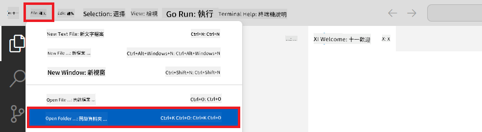

1. In the left pane of Visual Studio Code, right-click and select **New File** to create a new file named *download_dataset.py*.  

    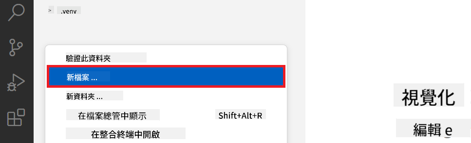

### Prepare dataset for fine-tuning

In this exercise, you’ll run the *download_dataset.py* file to download the *ultrachat_200k* datasets to your local environment. You’ll then use these datasets to fine-tune the Phi-3 model in Azure Machine Learning.  

In this exercise, you’ll:  

- Add code to the *download_dataset.py* file to download the datasets.  
- Run the *download_dataset.py* file to download datasets to your local environment.  

#### Download your dataset using *download_dataset.py*

1. Open the *download_dataset.py* file in Visual Studio Code.  

1. Add the following code into *download_dataset.py* file.  

    ```python
    import json
    import os
    from datasets import load_dataset

    def load_and_split_dataset(dataset_name, config_name, split_ratio):
        """
        Load and split a dataset.
        """
        # Load the dataset with the specified name, configuration, and split ratio
        dataset = load_dataset(dataset_name, config_name, split=split_ratio)
        print(f"Original dataset size: {len(dataset)}")
        
        # Split the dataset into train and test sets (80% train, 20% test)
        split_dataset = dataset.train_test_split(test_size=0.2)
        print(f"Train dataset size: {len(split_dataset['train'])}")
        print(f"Test dataset size: {len(split_dataset['test'])}")
        
        return split_dataset

    def save_dataset_to_jsonl(dataset, filepath):
        """
        Save a dataset to a JSONL file.
        """
        # Create the directory if it does not exist
        os.makedirs(os.path.dirname(filepath), exist_ok=True)
        
        # Open the file in write mode
        with open(filepath, 'w', encoding='utf-8') as f:
            # Iterate over each record in the dataset
            for record in dataset:
                # Dump the record as a JSON object and write it to the file
                json.dump(record, f)
                # Write a newline character to separate records
                f.write('\n')
        
        print(f"Dataset saved to {filepath}")

    def main():
        """
        Main function to load, split, and save the dataset.
        """
        # Load and split the ULTRACHAT_200k dataset with a specific configuration and split ratio
        dataset = load_and_split_dataset("HuggingFaceH4/ultrachat_200k", 'default', 'train_sft[:1%]')
        
        # Extract the train and test datasets from the split
        train_dataset = dataset['train']
        test_dataset = dataset['test']

        # Save the train dataset to a JSONL file
        save_dataset_to_jsonl(train_dataset, "data/train_data.jsonl")
        
        # Save the test dataset to a separate JSONL file
        save_dataset_to_jsonl(test_dataset, "data/test_data.jsonl")

    if __name__ == "__main__":
        main()

    ```  

1. Type the following command inside your terminal to run the script and download the dataset to your local environment.  

    ```console
    python download_dataset.py
    ```  

1. Verify that the datasets were saved successfully to your local *finetune-phi/data* directory.  

> [!NOTE]  
>  
> #### Note on dataset size and fine-tuning time  
>  
> In this tutorial, you use only 1% of the dataset (`split='train[:1%]'`). This significantly reduces the amount of data, speeding up both the upload and fine-tuning processes. You can adjust the percentage to find the right balance between training time and model performance. Using a smaller subset of the dataset reduces the time required for fine-tuning, making the process more manageable for a tutorial.  

## Scenario 2: Fine-tune Phi-3 model and Deploy in Azure Machine Learning Studio

### Fine-tune the Phi-3 model

In this exercise, you’ll fine-tune the Phi-3 model in Azure Machine Learning Studio.  

In this exercise, you’ll:  

- Create a computer cluster for fine-tuning.  
- Fine-tune the Phi-3 model in Azure Machine Learning Studio.  

#### Create computer cluster for fine-tuning  
1. Bisit [Azure ML Studio](https://ml.azure.com/home?wt.mc_id=studentamb_279723).

1. Pilih **Compute** dari tab sisi kiri.

1. Pilih **Compute clusters** dari menu navigasi.

1. Klik **+ New**.

    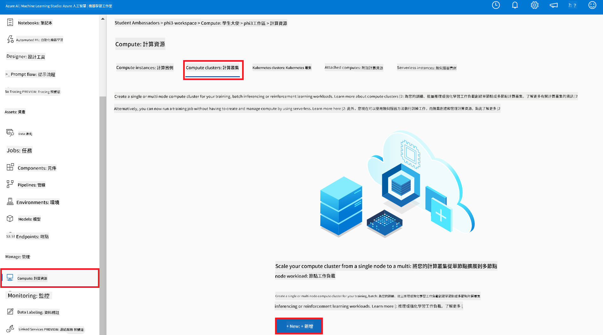

1. Lakukan tugas berikut:

    - Pilih **Region** yang ingin digunakan.
    - Pilih **Virtual machine tier** ke **Dedicated**.
    - Pilih **Virtual machine type** ke **GPU**.
    - Pilih filter **Virtual machine size** ke **Select from all options**.
    - Pilih **Virtual machine size** ke **Standard_NC24ads_A100_v4**.

    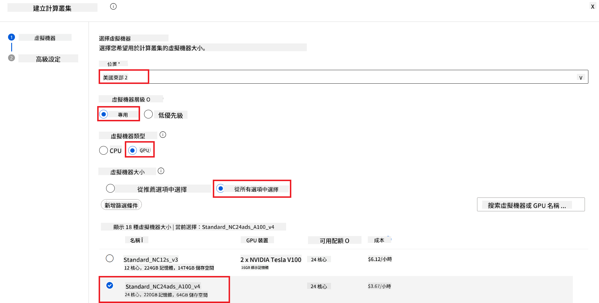

1. Klik **Next**.

1. Lakukan tugas berikut:

    - Masukkan **Compute name**. Nilainya harus unik.
    - Pilih **Minimum number of nodes** ke **0**.
    - Pilih **Maximum number of nodes** ke **1**.
    - Pilih **Idle seconds before scale down** ke **120**.

    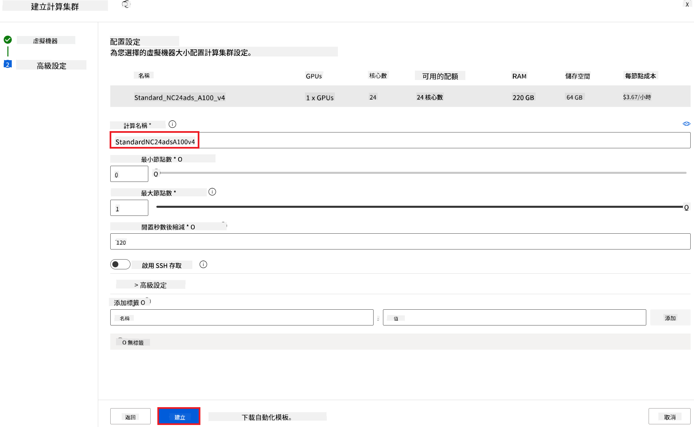

1. Klik **Create**.

#### Fine-tune model Phi-3

1. Bisit [Azure ML Studio](https://ml.azure.com/home?wt.mc_id=studentamb_279723).

1. Pilih workspace Azure Machine Learning yang telah dibuat.

    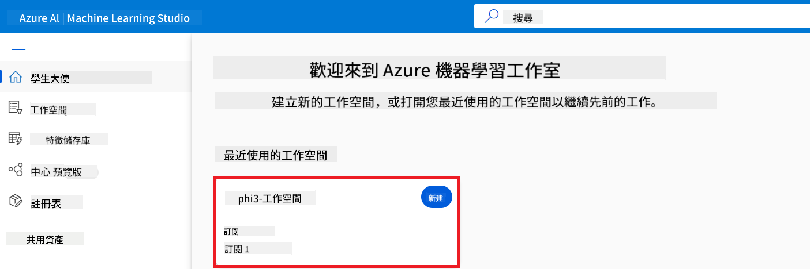

1. Lakukan tugas berikut:

    - Pilih **Model catalog** dari tab sisi kiri.
    - Ketik *phi-3-mini-4k* di **search bar** dan pilih **Phi-3-mini-4k-instruct** dari opsi yang muncul.

    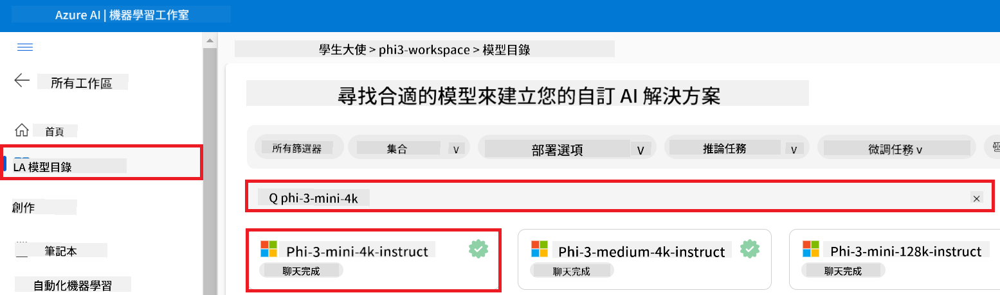

1. Pilih **Fine-tune** dari menu navigasi.

    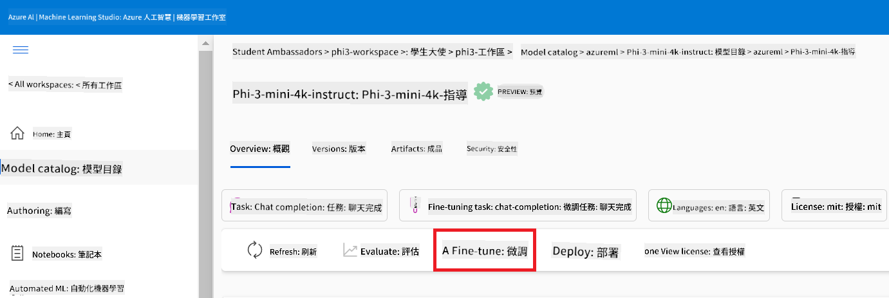

1. Lakukan tugas berikut:

    - Pilih **Select task type** ke **Chat completion**.
    - Pilih **+ Select data** untuk mengunggah **Training data**.
    - Pilih tipe upload data validasi ke **Provide different validation data**.
    - Pilih **+ Select data** untuk mengunggah **Validation data**.

    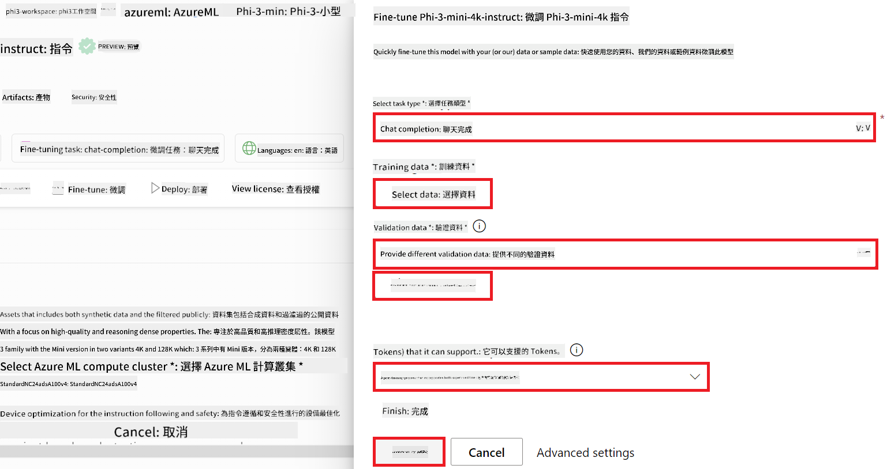

    > [!TIP]
    >
    > Anda dapat memilih **Advanced settings** untuk mengatur konfigurasi seperti **learning_rate** dan **lr_scheduler_type** untuk mengoptimalkan proses fine-tuning sesuai kebutuhan spesifik Anda.

1. Klik **Finish**.

1. Dalam latihan ini, Anda berhasil melakukan fine-tune model Phi-3 menggunakan Azure Machine Learning. Perlu dicatat bahwa proses fine-tuning dapat memakan waktu cukup lama. Setelah menjalankan pekerjaan fine-tuning, Anda harus menunggu hingga selesai. Anda dapat memantau status pekerjaan fine-tuning dengan membuka tab Jobs di sisi kiri workspace Azure Machine Learning Anda. Pada seri berikutnya, Anda akan melakukan deployment model yang telah di-fine-tune dan mengintegrasikannya dengan Prompt flow.

    

### Deploy model Phi-3 yang telah di-fine-tune

Untuk mengintegrasikan model Phi-3 yang telah di-fine-tune dengan Prompt flow, Anda perlu melakukan deployment model agar dapat diakses untuk inferensi real-time. Proses ini melibatkan registrasi model, membuat endpoint online, dan melakukan deployment model.

Dalam latihan ini, Anda akan:

- Registrasi model yang telah di-fine-tune di workspace Azure Machine Learning.
- Membuat endpoint online.
- Melakukan deployment model Phi-3 yang telah di-fine-tune.

#### Registrasi model yang telah di-fine-tune

1. Bisit [Azure ML Studio](https://ml.azure.com/home?wt.mc_id=studentamb_279723).

1. Pilih workspace Azure Machine Learning yang telah dibuat.

    

1. Pilih **Models** dari tab sisi kiri.
1. Klik **+ Register**.
1. Pilih **From a job output**.

    

1. Pilih pekerjaan yang telah Anda buat.

    

1. Klik **Next**.

1. Pilih **Model type** ke **MLflow**.

1. Pastikan **Job output** telah dipilih; seharusnya sudah dipilih secara otomatis.

    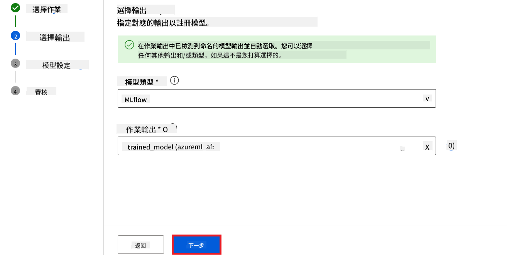

2. Klik **Next**.

3. Klik **Register**.

    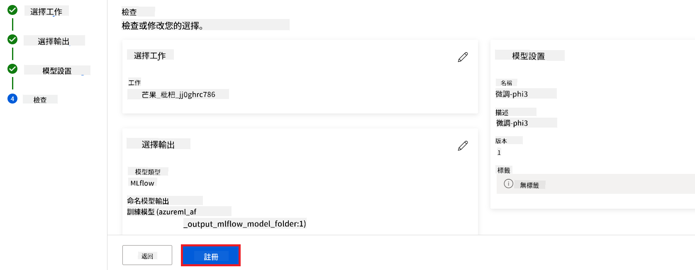

4. Anda dapat melihat model yang telah terdaftar dengan membuka menu **Models** dari tab sisi kiri.

    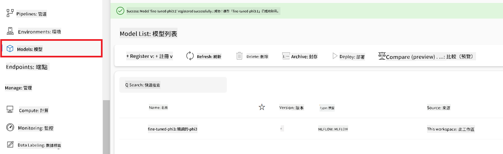

#### Deploy model yang telah di-fine-tune

1. Buka workspace Azure Machine Learning yang telah dibuat.

1. Pilih **Endpoints** dari tab sisi kiri.

1. Pilih **Real-time endpoints** dari menu navigasi.

    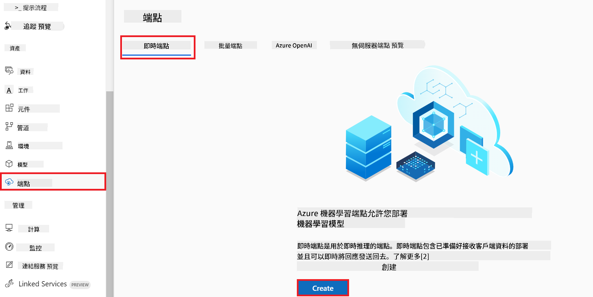

1. Klik **Create**.

1. Pilih model yang telah terdaftar.

    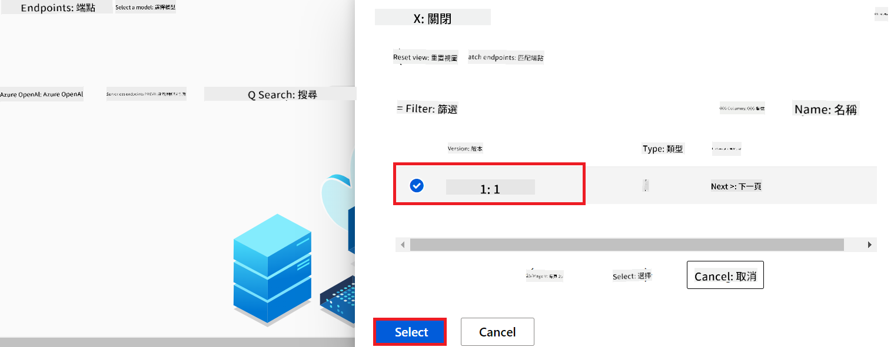

1. Klik **Select**.

1. Lakukan tugas berikut:

    - Pilih **Virtual machine** ke *Standard_NC6s_v3*.
    - Pilih jumlah **Instance count** yang ingin digunakan. Misalnya, *1*.
    - Pilih **Endpoint** ke **New** untuk membuat endpoint baru.
    - Masukkan **Endpoint name**. Nilainya harus unik.
    - Masukkan **Deployment name**. Nilainya harus unik.

    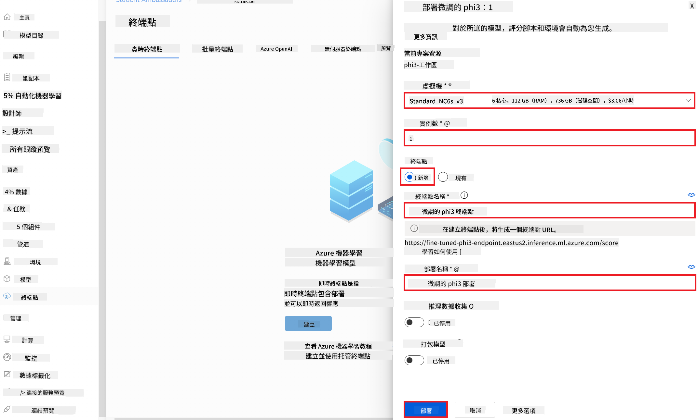

1. Klik **Deploy**.

> [!WARNING]
> Untuk menghindari biaya tambahan pada akun Anda, pastikan untuk menghapus endpoint yang telah dibuat di workspace Azure Machine Learning Anda.
>

#### Periksa status deployment di Azure Machine Learning Workspace

1. Buka workspace Azure Machine Learning yang telah dibuat.

1. Pilih **Endpoints** dari tab sisi kiri.

1. Pilih endpoint yang telah dibuat.

    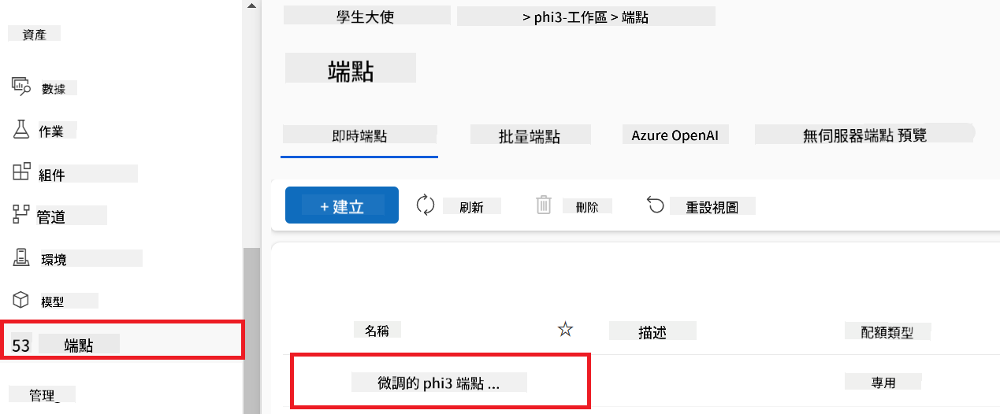

1. Pada halaman ini, Anda dapat mengelola endpoint selama proses deployment.

> [!NOTE]
> Setelah deployment selesai, pastikan bahwa **Live traffic** telah diatur ke **100%**. Jika belum, pilih **Update traffic** untuk menyesuaikan pengaturan lalu lintas. Perlu dicatat bahwa Anda tidak dapat menguji model jika lalu lintas diatur ke 0%.
>
> 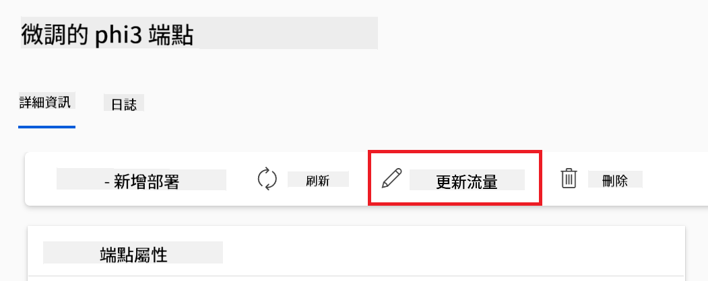
>

## Skenario 3: Integrasi dengan Prompt flow dan Chat dengan model custom Anda di Azure AI Foundry

### Integrasi model custom Phi-3 dengan Prompt flow

Setelah berhasil melakukan deployment model yang telah di-fine-tune, Anda sekarang dapat mengintegrasikannya dengan Prompt Flow untuk menggunakan model Anda dalam aplikasi real-time, memungkinkan berbagai tugas interaktif dengan model custom Phi-3 Anda.

Dalam latihan ini, Anda akan:

- Membuat Azure AI Foundry Hub.
- Membuat Azure AI Foundry Project.
- Membuat Prompt flow.
- Menambahkan custom connection untuk model Phi-3 yang telah di-fine-tune.
- Mengatur Prompt flow untuk chat dengan model custom Phi-3 Anda.

> [!NOTE]
> Anda juga dapat melakukan integrasi dengan Promptflow menggunakan Azure ML Studio. Proses integrasi yang sama dapat diterapkan pada Azure ML Studio.

#### Membuat Azure AI Foundry Hub

Anda perlu membuat Hub sebelum membuat Project. Hub berfungsi seperti Resource Group, memungkinkan Anda untuk mengorganisasi dan mengelola beberapa Project di Azure AI Foundry.

1. Bisit [Azure AI Foundry](https://ai.azure.com/?WT.mc_id=aiml-137032-kinfeylo).

1. Pilih **All hubs** dari tab sisi kiri.

1. Klik **+ New hub** dari menu navigasi.

    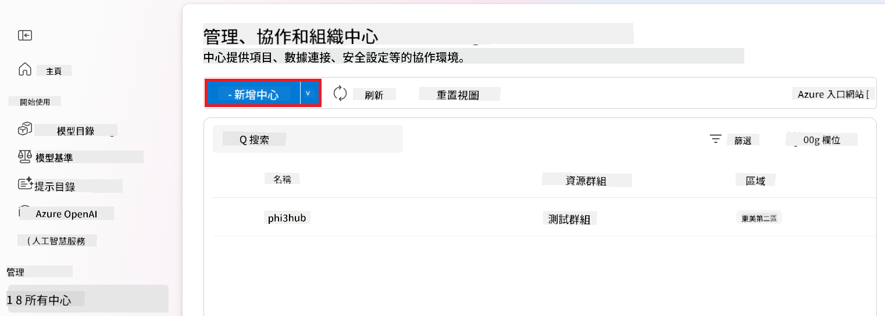

1. Lakukan tugas berikut:

    - Masukkan **Hub name**. Nilainya harus unik.
    - Pilih **Subscription** Azure Anda.
    - Pilih **Resource group** yang akan digunakan (buat yang baru jika diperlukan).
    - Pilih **Location** yang ingin digunakan.
    - Pilih **Connect Azure AI Services** yang akan digunakan (buat yang baru jika diperlukan).
    - Pilih **Connect Azure AI Search** ke **Skip connecting**.

    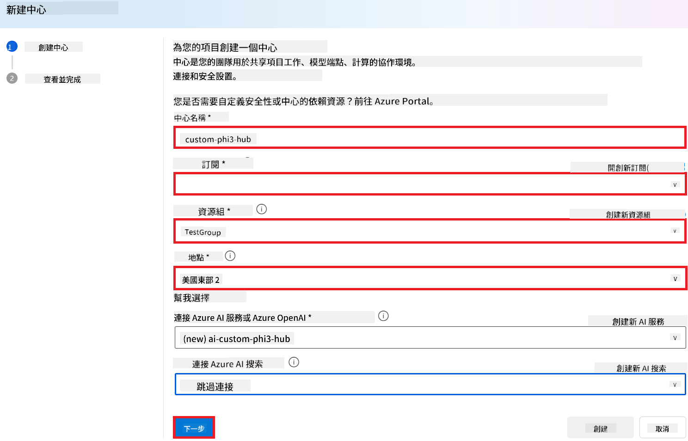

1. Klik **Next**.

#### Membuat Azure AI Foundry Project

1. Di Hub yang telah dibuat, pilih **All projects** dari tab sisi kiri.

1. Klik **+ New project** dari menu navigasi.

    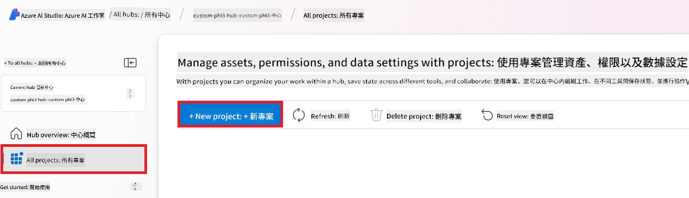

1. Masukkan **Project name**. Nilainya harus unik.

    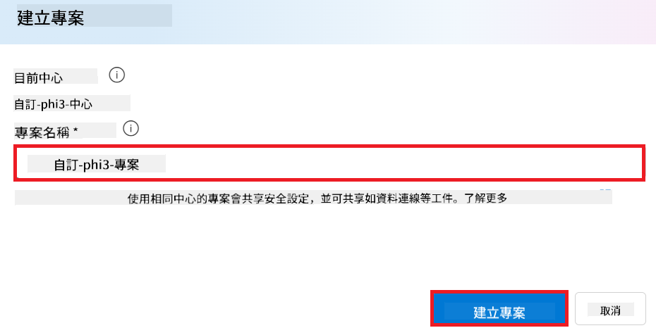

1. Klik **Create a project**.

#### Menambahkan custom connection untuk model Phi-3 yang telah di-fine-tune

Untuk mengintegrasikan model custom Phi-3 Anda dengan Prompt flow, Anda perlu menyimpan endpoint dan key model dalam custom connection. Pengaturan ini memastikan akses ke model custom Phi-3 Anda di Prompt flow.

#### Mengatur api key dan endpoint uri untuk model Phi-3 yang telah di-fine-tune

1. Bisit [Azure ML Studio](https://ml.azure.com/home?WT.mc_id=aiml-137032-kinfeylo).

1. Buka workspace Azure Machine Learning yang telah dibuat.

1. Pilih **Endpoints** dari tab sisi kiri.

    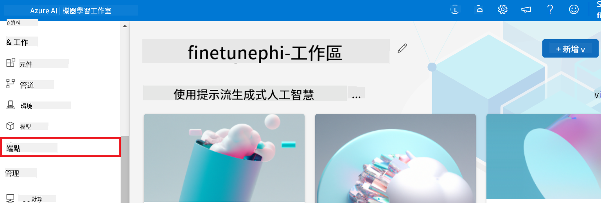

1. Pilih endpoint yang telah dibuat.

    

1. Pilih **Consume** dari menu navigasi.

1. Salin **REST endpoint** dan **Primary key** Anda.
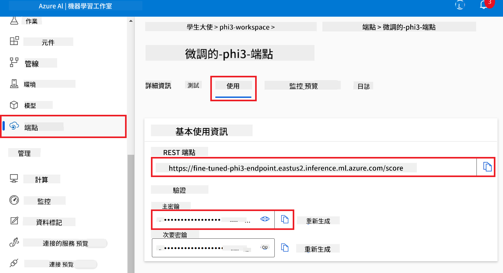

#### Add the Custom Connection

1. Buka [Azure AI Foundry](https://ai.azure.com/?WT.mc_id=aiml-137032-kinfeylo).

1. Masuk ke proyek Azure AI Foundry yang telah Anda buat.

1. Di proyek yang Anda buat, pilih **Settings** dari tab sisi kiri.

1. Pilih **+ New connection**.

    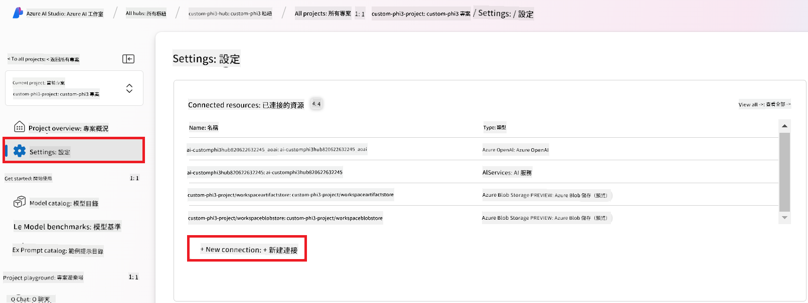

1. Pilih **Custom keys** dari menu navigasi.

    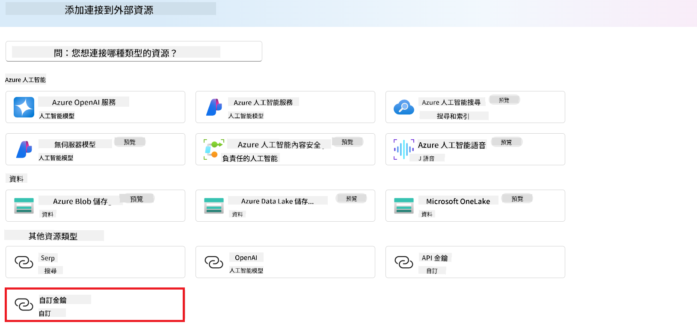

1. Lakukan tugas berikut:

    - Pilih **+ Add key value pairs**.
    - Untuk nama kunci, masukkan **endpoint** dan tempelkan endpoint yang Anda salin dari Azure ML Studio ke kolom nilai.
    - Pilih **+ Add key value pairs** lagi.
    - Untuk nama kunci, masukkan **key** dan tempelkan kunci yang Anda salin dari Azure ML Studio ke kolom nilai.
    - Setelah menambahkan kunci, pilih **is secret** untuk mencegah kunci terungkap.

    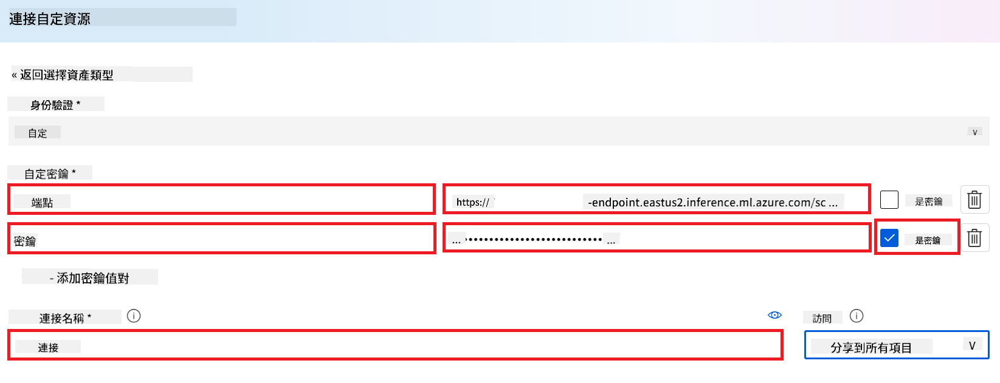

1. Pilih **Add connection**.

#### Create Prompt flow

Anda telah menambahkan koneksi khusus di Azure AI Foundry. Sekarang, mari buat Prompt flow menggunakan langkah-langkah berikut. Kemudian, Anda akan menghubungkan Prompt flow ini ke koneksi khusus sehingga Anda dapat menggunakan model yang telah disesuaikan di dalam Prompt flow.

1. Masuk ke proyek Azure AI Foundry yang telah Anda buat.

1. Pilih **Prompt flow** dari tab sisi kiri.

1. Pilih **+ Create** dari menu navigasi.

    

1. Pilih **Chat flow** dari menu navigasi.

    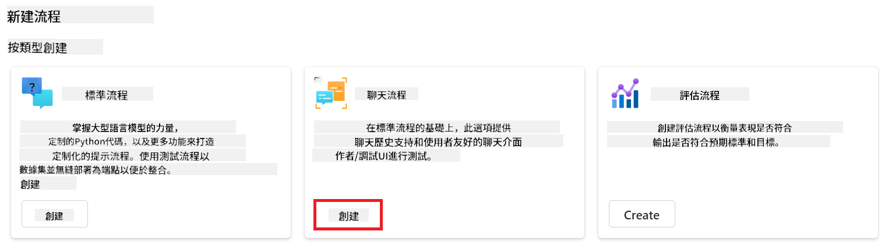

1. Masukkan **Folder name** yang akan digunakan.

    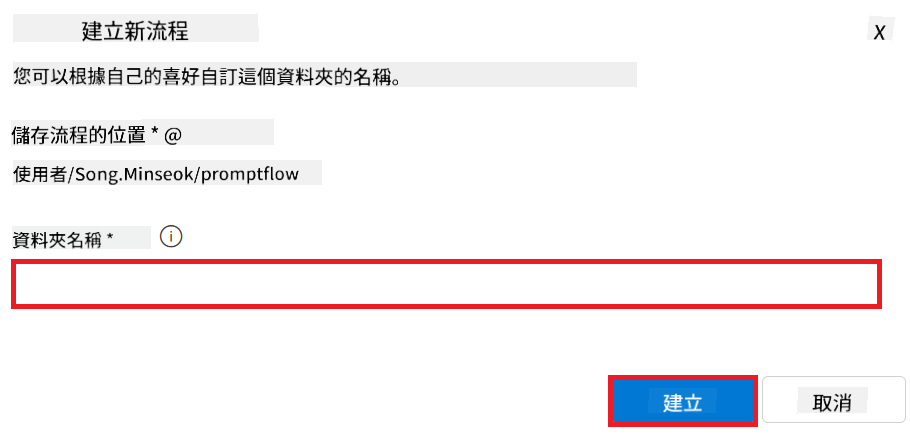

2. Pilih **Create**.

#### Set up Prompt flow to chat with your custom Phi-3 model

Anda perlu mengintegrasikan model Phi-3 yang telah disesuaikan ke dalam Prompt flow. Namun, Prompt flow yang ada tidak dirancang untuk tujuan ini. Oleh karena itu, Anda harus mendesain ulang Prompt flow agar memungkinkan integrasi model khusus.

1. Di Prompt flow, lakukan tugas berikut untuk membangun ulang alur yang ada:

    - Pilih **Raw file mode**.
    - Hapus semua kode yang ada di file *flow.dag.yml*.
    - Tambahkan kode berikut ke file *flow.dag.yml*.

        ```yml
        inputs:
          input_data:
            type: string
            default: "Who founded Microsoft?"

        outputs:
          answer:
            type: string
            reference: ${integrate_with_promptflow.output}

        nodes:
        - name: integrate_with_promptflow
          type: python
          source:
            type: code
            path: integrate_with_promptflow.py
          inputs:
            input_data: ${inputs.input_data}
        ```

    - Pilih **Save**.

    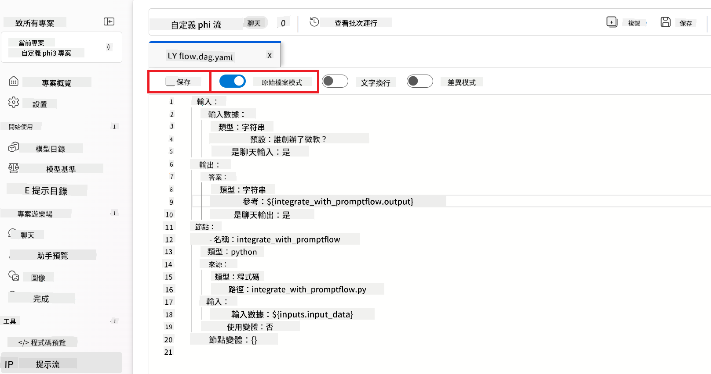

1. Tambahkan kode berikut ke file *integrate_with_promptflow.py* untuk menggunakan model Phi-3 yang telah disesuaikan di Prompt flow.

    ```python
    import logging
    import requests
    from promptflow import tool
    from promptflow.connections import CustomConnection

    # Logging setup
    logging.basicConfig(
        format="%(asctime)s - %(levelname)s - %(name)s - %(message)s",
        datefmt="%Y-%m-%d %H:%M:%S",
        level=logging.DEBUG
    )
    logger = logging.getLogger(__name__)

    def query_phi3_model(input_data: str, connection: CustomConnection) -> str:
        """
        Send a request to the Phi-3 model endpoint with the given input data using Custom Connection.
        """

        # "connection" is the name of the Custom Connection, "endpoint", "key" are the keys in the Custom Connection
        endpoint_url = connection.endpoint
        api_key = connection.key

        headers = {
            "Content-Type": "application/json",
            "Authorization": f"Bearer {api_key}"
        }
        data = {
            "input_data": {
                "input_string": [
                    {"role": "user", "content": input_data}
                ],
                "parameters": {
                    "temperature": 0.7,
                    "max_new_tokens": 128
                }
            }
        }
        try:
            response = requests.post(endpoint_url, json=data, headers=headers)
            response.raise_for_status()
            
            # Log the full JSON response
            logger.debug(f"Full JSON response: {response.json()}")

            result = response.json()["output"]
            logger.info("Successfully received response from Azure ML Endpoint.")
            return result
        except requests.exceptions.RequestException as e:
            logger.error(f"Error querying Azure ML Endpoint: {e}")
            raise

    @tool
    def my_python_tool(input_data: str, connection: CustomConnection) -> str:
        """
        Tool function to process input data and query the Phi-3 model.
        """
        return query_phi3_model(input_data, connection)

    ```

    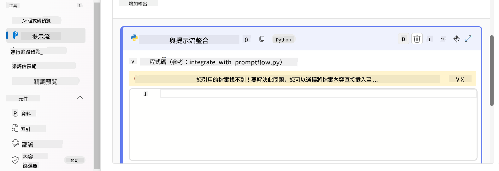

> [!NOTE]
> Untuk informasi lebih rinci tentang penggunaan Prompt flow di Azure AI Foundry, Anda dapat merujuk ke [Prompt flow in Azure AI Foundry](https://learn.microsoft.com/azure/ai-studio/how-to/prompt-flow).

1. Pilih **Chat input**, **Chat output** untuk mengaktifkan percakapan dengan model Anda.

    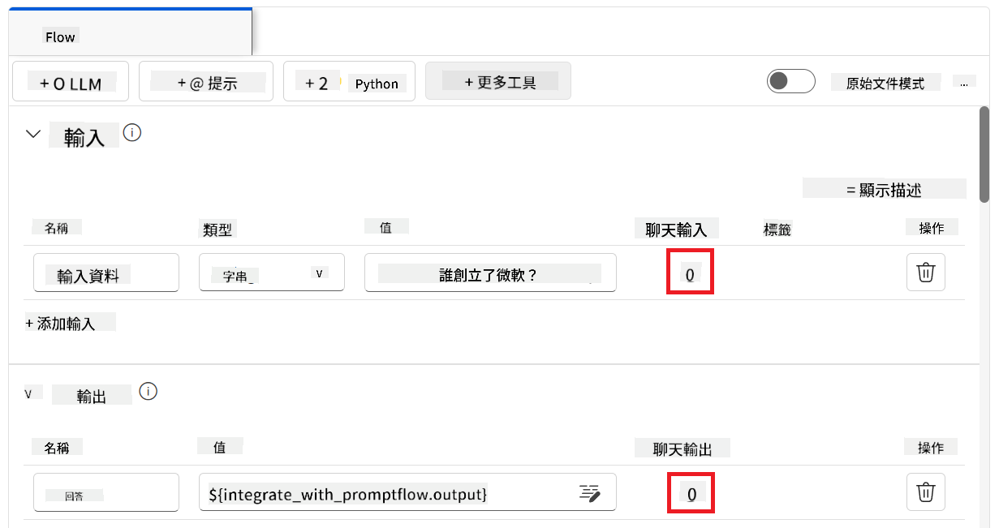

1. Sekarang Anda siap untuk berbicara dengan model Phi-3 yang telah disesuaikan. Dalam latihan berikutnya, Anda akan mempelajari cara memulai Prompt flow dan menggunakannya untuk berbicara dengan model Phi-3 yang telah disesuaikan.

> [!NOTE]
>
> Alur yang telah dibangun ulang harus terlihat seperti gambar di bawah:
>
> 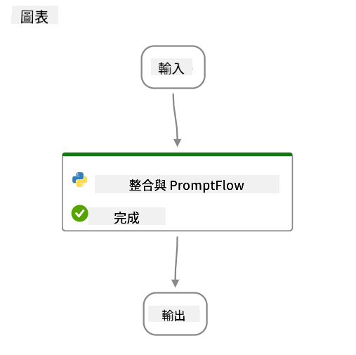
>

### Chat with your custom Phi-3 model

Sekarang setelah Anda menyesuaikan dan mengintegrasikan model Phi-3 khusus Anda dengan Prompt flow, Anda siap untuk mulai berinteraksi dengannya. Latihan ini akan memandu Anda melalui proses pengaturan dan memulai percakapan dengan model Anda menggunakan Prompt flow. Dengan mengikuti langkah-langkah ini, Anda akan dapat sepenuhnya memanfaatkan kemampuan model Phi-3 yang telah disesuaikan untuk berbagai tugas dan percakapan.

- Berbicara dengan model Phi-3 khusus Anda menggunakan Prompt flow.

#### Start Prompt flow

1. Pilih **Start compute sessions** untuk memulai Prompt flow.

    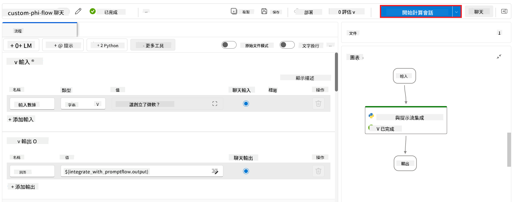

1. Pilih **Validate and parse input** untuk memperbarui parameter.

    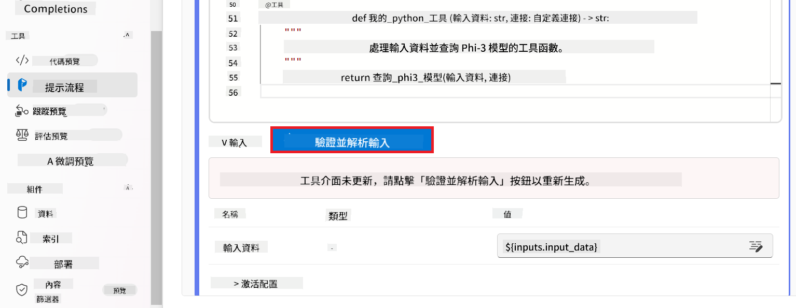

1. Pilih **Value** dari **connection** ke koneksi khusus yang telah Anda buat. Misalnya, *connection*.

    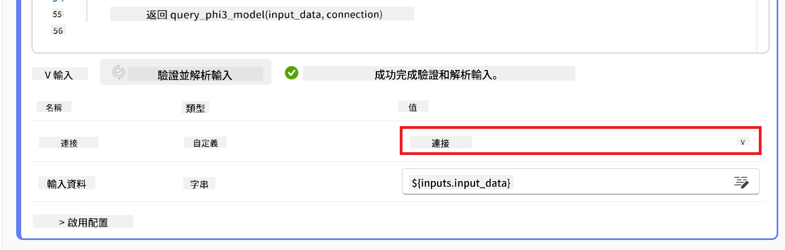

#### Chat with your custom model

1. Pilih **Chat**.

    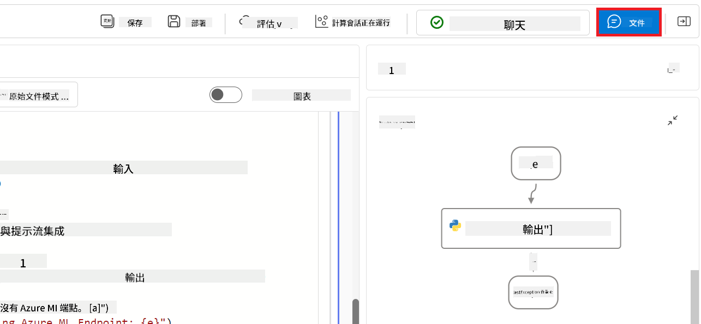

1. Berikut adalah contoh hasilnya: Sekarang Anda dapat berbicara dengan model Phi-3 khusus Anda. Disarankan untuk mengajukan pertanyaan berdasarkan data yang digunakan untuk penyesuaian.

    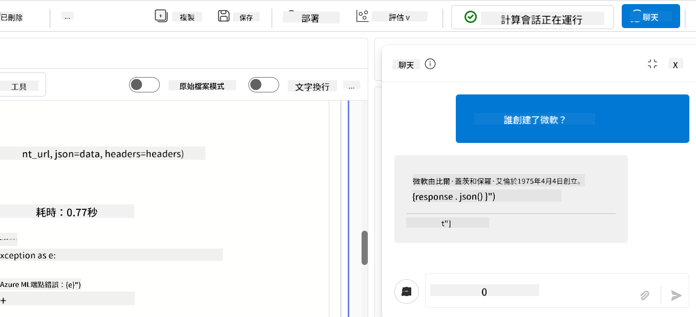

It seems like "mo" might refer to a specific language or dialect, but I need clarification on what "mo" stands for. Could you specify the language or provide more context so I can assist you accurately?