<!--
CO_OP_TRANSLATOR_METADATA:
{
  "original_hash": "ecbd9179a21edbaafaf114d47f09f3e3",
  "translation_date": "2025-05-07T14:18:34+00:00",
  "source_file": "md/02.Application/01.TextAndChat/Phi3/E2E_Phi-3-FineTuning_PromptFlow_Integration_AIFoundry.md",
  "language_code": "mo"
}
-->
# Fine-tune and Integrate custom Phi-3 models with Prompt flow in Azure AI Foundry

This end-to-end (E2E) sample is based on the guide "[Fine-Tune and Integrate Custom Phi-3 Models with Prompt Flow in Azure AI Foundry](https://techcommunity.microsoft.com/t5/educator-developer-blog/fine-tune-and-integrate-custom-phi-3-models-with-prompt-flow-in/ba-p/4191726?WT.mc_id=aiml-137032-kinfeylo)" from the Microsoft Tech Community. It introduces the processes of fine-tuning, deploying, and integrating custom Phi-3 models with Prompt flow in Azure AI Foundry.  
Unlike the E2E sample, "[Fine-Tune and Integrate Custom Phi-3 Models with Prompt Flow](./E2E_Phi-3-FineTuning_PromptFlow_Integration.md)", which involved running code locally, this tutorial focuses entirely on fine-tuning and integrating your model within the Azure AI / ML Studio.

## Overview

In this E2E sample, you will learn how to fine-tune the Phi-3 model and integrate it with Prompt flow in Azure AI Foundry. By leveraging Azure AI / ML Studio, you will establish a workflow for deploying and utilizing custom AI models. This E2E sample is divided into three scenarios:

**Scenario 1: Set up Azure resources and Prepare for fine-tuning**

**Scenario 2: Fine-tune the Phi-3 model and Deploy in Azure Machine Learning Studio**

**Scenario 3: Integrate with Prompt flow and Chat with your custom model in Azure AI Foundry**

Here is an overview of this E2E sample.


### Table of Contents

1. **[Scenario 1: Set up Azure resources and Prepare for fine-tuning](../../../../../../md/02.Application/01.TextAndChat/Phi3)**
    - [Create an Azure Machine Learning Workspace](../../../../../../md/02.Application/01.TextAndChat/Phi3)
    - [Request GPU quotas in Azure Subscription](../../../../../../md/02.Application/01.TextAndChat/Phi3)
    - [Add role assignment](../../../../../../md/02.Application/01.TextAndChat/Phi3)
    - [Set up project](../../../../../../md/02.Application/01.TextAndChat/Phi3)
    - [Prepare dataset for fine-tuning](../../../../../../md/02.Application/01.TextAndChat/Phi3)

1. **[Scenario 2: Fine-tune Phi-3 model and Deploy in Azure Machine Learning Studio](../../../../../../md/02.Application/01.TextAndChat/Phi3)**
    - [Fine-tune the Phi-3 model](../../../../../../md/02.Application/01.TextAndChat/Phi3)
    - [Deploy the fine-tuned Phi-3 model](../../../../../../md/02.Application/01.TextAndChat/Phi3)

1. **[Scenario 3: Integrate with Prompt flow and Chat with your custom model in Azure AI Foundry](../../../../../../md/02.Application/01.TextAndChat/Phi3)**
    - [Integrate the custom Phi-3 model with Prompt flow](../../../../../../md/02.Application/01.TextAndChat/Phi3)
    - [Chat with your custom Phi-3 model](../../../../../../md/02.Application/01.TextAndChat/Phi3)

## Scenario 1: Set up Azure resources and Prepare for fine-tuning

### Create an Azure Machine Learning Workspace

1. Type *azure machine learning* in the **search bar** at the top of the portal page and select **Azure Machine Learning** from the options that appear.

    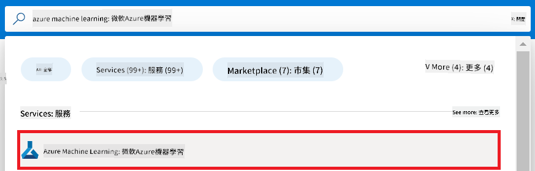

2. Select **+ Create** from the navigation menu.

3. Select **New workspace** from the navigation menu.

    

4. Complete the following:

    - Select your Azure **Subscription**.
    - Choose the **Resource group** to use (or create a new one).
    - Enter a unique **Workspace Name**.
    - Select the **Region** you want to use.
    - Choose the **Storage account** to use (or create a new one).
    - Select the **Key vault** to use (or create a new one).
    - Choose the **Application insights** to use (or create a new one).
    - Select the **Container registry** to use (or create a new one).

    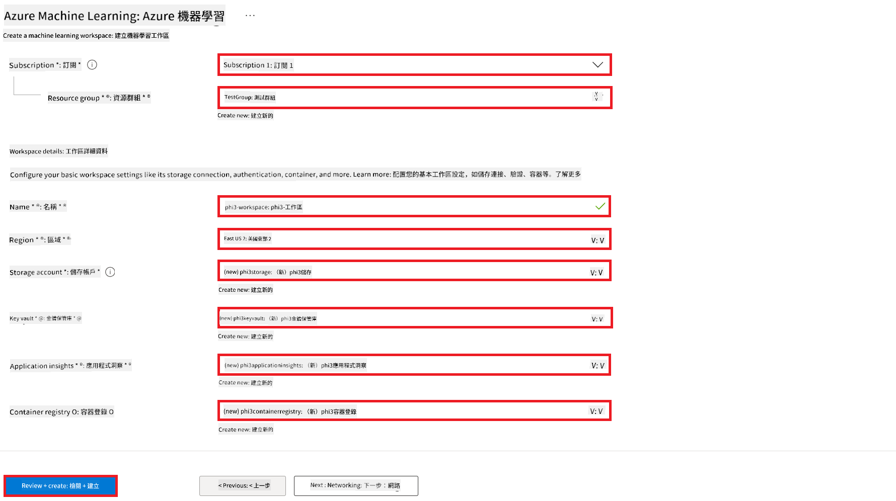

5. Select **Review + Create**.

6. Select **Create**.

### Request GPU quotas in Azure Subscription

In this tutorial, you will fine-tune and deploy a Phi-3 model using GPUs. For fine-tuning, you will use the *Standard_NC24ads_A100_v4* GPU, which requires a quota request. For deployment, you will use the *Standard_NC6s_v3* GPU, which also requires a quota request.

> [!NOTE]
>
> Only Pay-As-You-Go subscriptions (standard subscription type) are eligible for GPU allocation; benefit subscriptions are not currently supported.
>

1. Visit [Azure ML Studio](https://ml.azure.com/home?wt.mc_id=studentamb_279723).

2. To request *Standard NCADSA100v4 Family* quota:

    - Select **Quota** from the left sidebar.
    - Choose the **Virtual machine family**. For example, select **Standard NCADSA100v4 Family Cluster Dedicated vCPUs**, which includes the *Standard_NC24ads_A100_v4* GPU.
    - Click **Request quota** from the navigation menu.

        

    - On the Request quota page, enter the **New cores limit** you want, e.g., 24.
    - Click **Submit** to request the GPU quota.

3. To request *Standard NCSv3 Family* quota:

    - Select **Quota** from the left sidebar.
    - Choose the **Virtual machine family**. For example, select **Standard NCSv3 Family Cluster Dedicated vCPUs**, which includes the *Standard_NC6s_v3* GPU.
    - Click **Request quota** from the navigation menu.
    - Enter the **New cores limit**, e.g., 24.
    - Click **Submit** to request the GPU quota.

### Add role assignment

To fine-tune and deploy your models, you first need to create a User Assigned Managed Identity (UAI) and assign it the proper permissions. This UAI will be used for authentication during deployment.

#### Create User Assigned Managed Identity(UAI)

1. Type *managed identities* in the **search bar** at the top of the portal and select **Managed Identities**.

    

2. Select **+ Create**.

    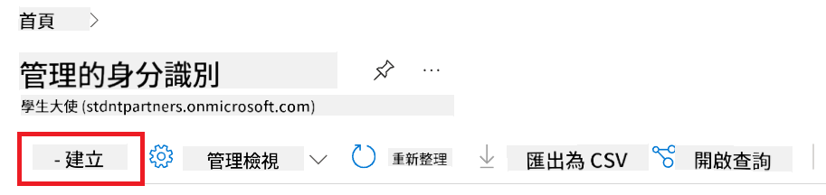

3. Complete the following:

    - Select your Azure **Subscription**.
    - Choose the **Resource group** to use (or create a new one).
    - Select the **Region**.
    - Enter a unique **Name**.

    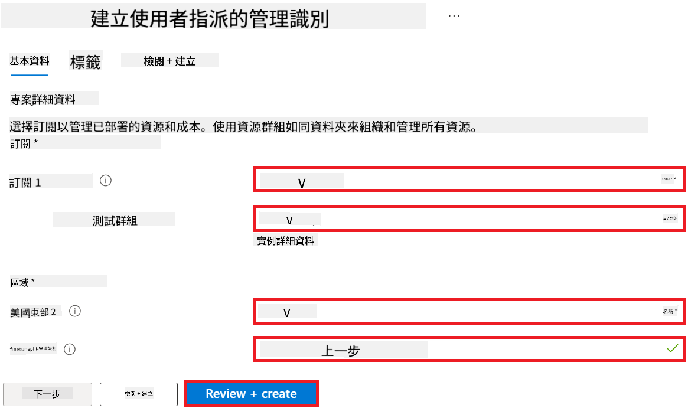

4. Select **Review + create**.

5. Select **+ Create**.

#### Add Contributor role assignment to Managed Identity

1. Navigate to the Managed Identity resource you created.

2. Select **Azure role assignments** from the left sidebar.

3. Click **+Add role assignment** from the navigation menu.

4. On the Add role assignment page, complete the following:

    - Set **Scope** to **Resource group**.
    - Select your Azure **Subscription**.
    - Choose the **Resource group**.
    - Select the **Role** as **Contributor**.

    

5. Click **Save**.

#### Add Storage Blob Data Reader role assignment to Managed Identity

1. Type *storage accounts* in the **search bar** and select **Storage accounts**.

    

2. Select the storage account linked to your Azure Machine Learning workspace, e.g., *finetunephistorage*.

3. To open Add role assignment page:

    - Navigate to the storage account.
    - Select **Access Control (IAM)** from the left sidebar.
    - Click **+ Add** from the navigation menu.
    - Select **Add role assignment**.

    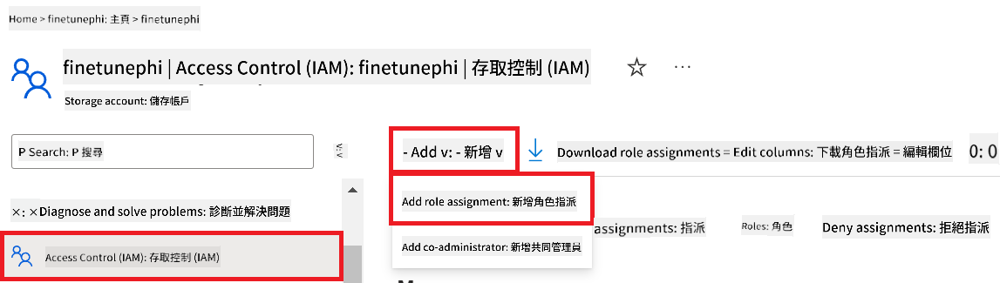

4. On the Add role assignment page:

    - Search for *Storage Blob Data Reader* in the **search bar** and select it.
    - Click **Next**.
    - Under **Assign access to**, select **Managed identity**.
    - Click **+ Select members**.
    - Choose your Azure **Subscription**.
    - Select the **Managed identity** type.
    - Choose the Managed Identity you created, e.g., *finetunephi-managedidentity*.
    - Click **Select**.

    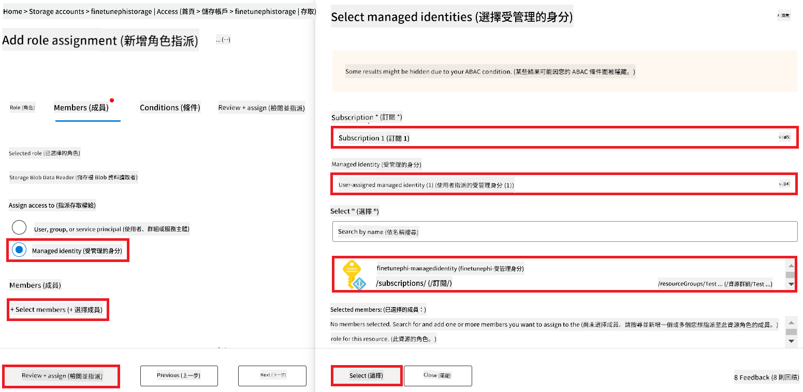

5. Click **Review + assign**.

#### Add AcrPull role assignment to Managed Identity

1. Type *container registries* in the **search bar** and select **Container registries**.

    

2. Select the container registry linked to your Azure Machine Learning workspace, e.g., *finetunephicontainerregistry*.

3. To open Add role assignment page:

    - Select **Access Control (IAM)** from the left sidebar.
    - Click **+ Add**.
    - Select **Add role assignment**.

4. On the Add role assignment page:

    - Search for *AcrPull* in the **search bar** and select it.
    - Click **Next**.
    - Under **Assign access to**, select **Managed identity**.
    - Click **+ Select members**.
    - Choose your Azure **Subscription**.
    - Select the **Managed identity** type.
    - Choose the Managed Identity you created, e.g., *finetunephi-managedidentity*.
    - Click **Select**.
    - Click **Review + assign**.

### Set up project

To download the datasets needed for fine-tuning, you will set up a local environment.

In this exercise, you will:

- Create a folder to work in.
- Create a virtual environment.
- Install the required packages.
- Create a *download_dataset.py* file to download the dataset.

#### Create a folder to work in

1. Open a terminal and run the following command to create a folder named *finetune-phi* in the default path.

    ```console
    mkdir finetune-phi
    ```

2. Run the following command to navigate to the *finetune-phi* folder.

    ```console
    cd finetune-phi
    ```

#### Create a virtual environment

1. Run the following command to create a virtual environment named *.venv*.

    ```console
    python -m venv .venv
    ```

2. Run the following command to activate the virtual environment.

    ```console
    .venv\Scripts\activate.bat
    ```

> [!NOTE]
> If successful, you should see *(.venv)* before the command prompt.

#### Install the required packages

1. Run the following commands to install the required packages.

    ```console
    pip install datasets==2.19.1
    ```

#### Create `download_dataset.py`

> [!NOTE]
> Complete folder structure:
>
> ```text
> └── YourUserName
> .    └── finetune-phi
> .        └── download_dataset.py
> ```

1. Open **Visual Studio Code**.

2. Select **File** from the menu bar.

3. Select **Open Folder**.

4. Choose the *finetune-phi* folder you created, located at *C:\Users\yourUserName\finetune-phi*.

    

5. In the left pane, right-click and select **New File** to create *download_dataset.py*.

    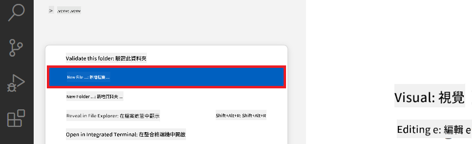

### Prepare dataset for fine-tuning

In this exercise, you will run *download_dataset.py* to download the *ultrachat_200k* datasets to your local environment. You will then use this dataset to fine-tune the Phi-3 model in Azure Machine Learning.

You will:

- Add code to *download_dataset.py* to download the dataset.
- Run *download_dataset.py* to download the dataset locally.

#### Download your dataset using *download_dataset.py*

1. Open *download_dataset.py* in Visual Studio Code.

2. Add the following code to the file.

    ```python
    import json
    import os
    from datasets import load_dataset

    def load_and_split_dataset(dataset_name, config_name, split_ratio):
        """
        Load and split a dataset.
        """
        # Load the dataset with the specified name, configuration, and split ratio
        dataset = load_dataset(dataset_name, config_name, split=split_ratio)
        print(f"Original dataset size: {len(dataset)}")
        
        # Split the dataset into train and test sets (80% train, 20% test)
        split_dataset = dataset.train_test_split(test_size=0.2)
        print(f"Train dataset size: {len(split_dataset['train'])}")
        print(f"Test dataset size: {len(split_dataset['test'])}")
        
        return split_dataset

    def save_dataset_to_jsonl(dataset, filepath):
        """
        Save a dataset to a JSONL file.
        """
        # Create the directory if it does not exist
        os.makedirs(os.path.dirname(filepath), exist_ok=True)
        
        # Open the file in write mode
        with open(filepath, 'w', encoding='utf-8') as f:
            # Iterate over each record in the dataset
            for record in dataset:
                # Dump the record as a JSON object and write it to the file
                json.dump(record, f)
                # Write a newline character to separate records
                f.write('\n')
        
        print(f"Dataset saved to {filepath}")

    def main():
        """
        Main function to load, split, and save the dataset.
        """
        # Load and split the ULTRACHAT_200k dataset with a specific configuration and split ratio
        dataset = load_and_split_dataset("HuggingFaceH4/ultrachat_200k", 'default', 'train_sft[:1%]')
        
        # Extract the train and test datasets from the split
        train_dataset = dataset['train']
        test_dataset = dataset['test']

        # Save the train dataset to a JSONL file
        save_dataset_to_jsonl(train_dataset, "data/train_data.jsonl")
        
        # Save the test dataset to a separate JSONL file
        save_dataset_to_jsonl(test_dataset, "data/test_data.jsonl")

    if __name__ == "__main__":
        main()

    ```

3. Run the following command in your terminal to execute the script and download the dataset.

    ```console
    python download_dataset.py
    ```

4. Verify that the datasets were successfully saved to your local *finetune-phi/data* directory.

> [!NOTE]
>
> #### Note on dataset size and fine-tuning time
>
> In this tutorial, you use only 1% of the dataset (`split='train[:1%]'`). This significantly reduces data size, speeding both upload and fine-tuning. You can adjust this percentage to balance training time and model quality. Using a smaller subset makes fine-tuning faster and more manageable for this tutorial.

## Scenario 2: Fine-tune Phi-3 model and Deploy in Azure Machine Learning Studio

### Fine-tune the Phi-3 model

In this exercise, you will fine-tune the Phi-3 model in Azure Machine Learning Studio.

You will:

- Create a compute cluster for fine-tuning.
- Fine-tune the Phi-3 model in Azure Machine Learning Studio.

#### Create compute cluster for fine-tuning
1. Visit [Azure ML Studio](https://ml.azure.com/home?wt.mc_id=studentamb_279723).

1. Select **Compute** from the left side tab.

1. Select **Compute clusters** from the navigation menu.

1. Select **+ New**.

    

1. Perform the following tasks:

    - Select the **Region** you'd like to use.
    - Select the **Virtual machine tier** to **Dedicated**.
    - Select the **Virtual machine type** to **GPU**.
    - Select the **Virtual machine size** filter to **Select from all options**.
    - Select the **Virtual machine size** to **Standard_NC24ads_A100_v4**.

    

1. Select **Next**.

1. Perform the following tasks:

    - Enter **Compute name**. It must be a unique value.
    - Select the **Minimum number of nodes** to **0**.
    - Select the **Maximum number of nodes** to **1**.
    - Select the **Idle seconds before scale down** to **120**.

    

1. Select **Create**.

#### Fine-tune the Phi-3 model

1. Visit [Azure ML Studio](https://ml.azure.com/home?wt.mc_id=studentamb_279723).

1. Select the Azure Macnine Learning workspace that you created.

    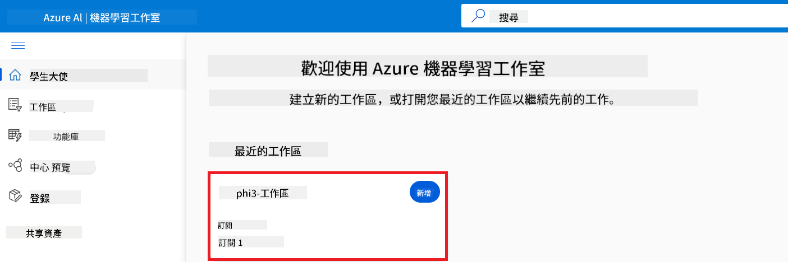

1. Perform the following tasks:

    - Select **Model catalog** from the left side tab.
    - Type *phi-3-mini-4k* in the **search bar** and select **Phi-3-mini-4k-instruct** from the options that appear.

    

1. Select **Fine-tune** from the navigation menu.

    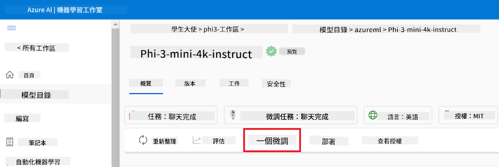

1. Perform the following tasks:

    - Select **Select task type** to **Chat completion**.
    - Select **+ Select data** to upload **Traning data**.
    - Select the Validation data upload type to **Provide different validation data**.
    - Select **+ Select data** to upload **Validation data**.

    

    > [!TIP]
    >
    > You can select **Advanced settings** to customize configurations such as **learning_rate** and **lr_scheduler_type** to optimize the fine-tuning process according to your specific needs.

1. Select **Finish**.

1. In this exercise, you successfully fine-tuned the Phi-3 model using Azure Machine Learning. Please note that the fine-tuning process can take a considerable amount of time. After running the fine-tuning job, you need to wait for it to complete. You can monitor the status of the fine-tuning job by navigating to the Jobs tab on the left side of your Azure Machine Learning Workspace. In the next series, you will deploy the fine-tuned model and integrate it with Prompt flow.

    

### Deploy the fine-tuned Phi-3 model

To integrate the fine-tuned Phi-3 model with Prompt flow, you need to deploy the model to make it accessible for real-time inference. This process involves registering the model, creating an online endpoint, and deploying the model.

In this exercise, you will:

- Register the fine-tuned model in the Azure Machine Learning workspace.
- Create an online endpoint.
- Deploy the registered fine-tuned Phi-3 model.

#### Register the fine-tuned model

1. Visit [Azure ML Studio](https://ml.azure.com/home?wt.mc_id=studentamb_279723).

1. Select the Azure Macnine Learning workspace that you created.

    

1. Select **Models** from the left side tab.
1. Select **+ Register**.
1. Select **From a job output**.

    

1. Select the job that you created.

    

1. Select **Next**.

1. Select **Model type** to **MLflow**.

1. Ensure that **Job output** is selected; it should be automatically selected.

    

2. Select **Next**.

3. Select **Register**.

    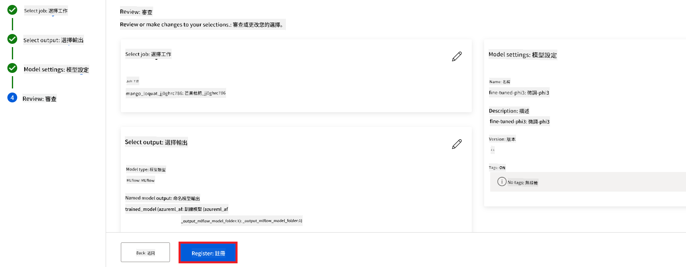

4. You can view your registered model by navigating to the **Models** menu from the left side tab.

    

#### Deploy the fine-tuned model

1. Navigate to the Azure Macnine Learning workspace that you created.

1. Select **Endpoints** from the left side tab.

1. Select **Real-time endpoints** from the navigation menu.

    

1. Select **Create**.

1. select the registered model that you created.

    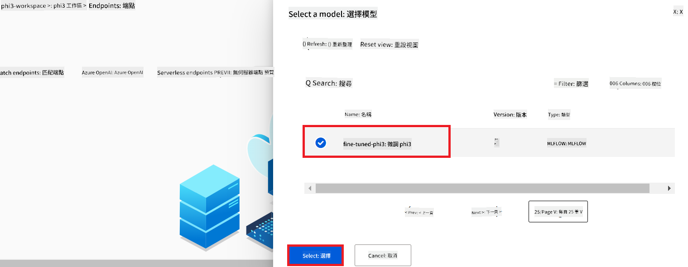

1. Select **Select**.

1. Perform the following tasks:

    - Select **Virtual machine** to *Standard_NC6s_v3*.
    - Select the **Instance count** you'd like to use. For example, *1*.
    - Select the **Endpoint** to **New** to create an endpoint.
    - Enter **Endpoint name**. It must be a unique value.
    - Enter **Deployment name**. It must be a unique value.

    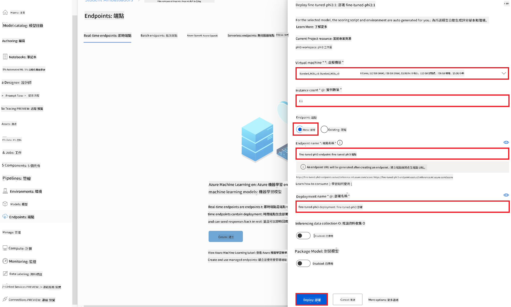

1. Select **Deploy**.

> [!WARNING]
> To avoid additional charges to your account, make sure to delete the created endpoint in the Azure Machine Learning workspace.
>

#### Check deployment status in Azure Machine Learning Workspace

1. Navigate to Azure Machine Learning workspace that you created.

1. Select **Endpoints** from the left side tab.

1. Select the endpoint that you created.

    

1. On this page, you can manage the endpoints during the deployment process.

> [!NOTE]
> Once the deployment is complete, ensure that **Live traffic** is set to **100%**. If it is not, select **Update traffic** to adjust the traffic settings. Note that you cannot test the model if the traffic is set to 0%.
>
> 
>

## Scenario 3: Integrate with Prompt flow and Chat with your custom model in Azure AI Foundry

### Integrate the custom Phi-3 model with Prompt flow

After successfully deploying your fine-tuned model, you can now integrate it with Prompt Flow to use your model in real-time applications, enabling a variety of interactive tasks with your custom Phi-3 model.

In this exercise, you will:

- Create Azure AI Foundry Hub.
- Create Azure AI Foundry Project.
- Create Prompt flow.
- Add a custom connection for the fine-tuned Phi-3 model.
- Set up Prompt flow to chat with your custom Phi-3 model

> [!NOTE]
> You can also integrate with Promptflow using Azure ML Studio. The same integration process can be applied to Azure ML Studio.

#### Create Azure AI Foundry Hub

You need to create a Hub before creating the Project. A Hub acts like a Resource Group, allowing you to organize and manage multiple Projects within Azure AI Foundry.

1. Visit [Azure AI Foundry](https://ai.azure.com/?WT.mc_id=aiml-137032-kinfeylo).

1. Select **All hubs** from the left side tab.

1. Select **+ New hub** from the navigation menu.

    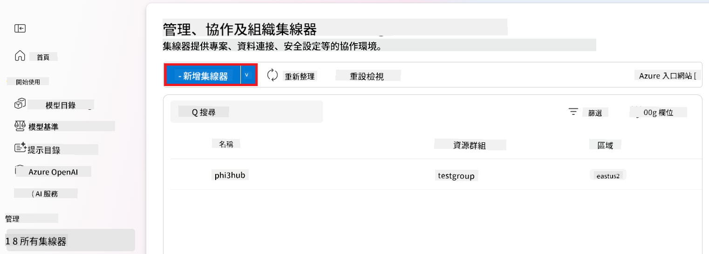

1. Perform the following tasks:

    - Enter **Hub name**. It must be a unique value.
    - Select your Azure **Subscription**.
    - Select the **Resource group** to use (create a new one if needed).
    - Select the **Location** you'd like to use.
    - Select the **Connect Azure AI Services** to use (create a new one if needed).
    - Select **Connect Azure AI Search** to **Skip connecting**.

    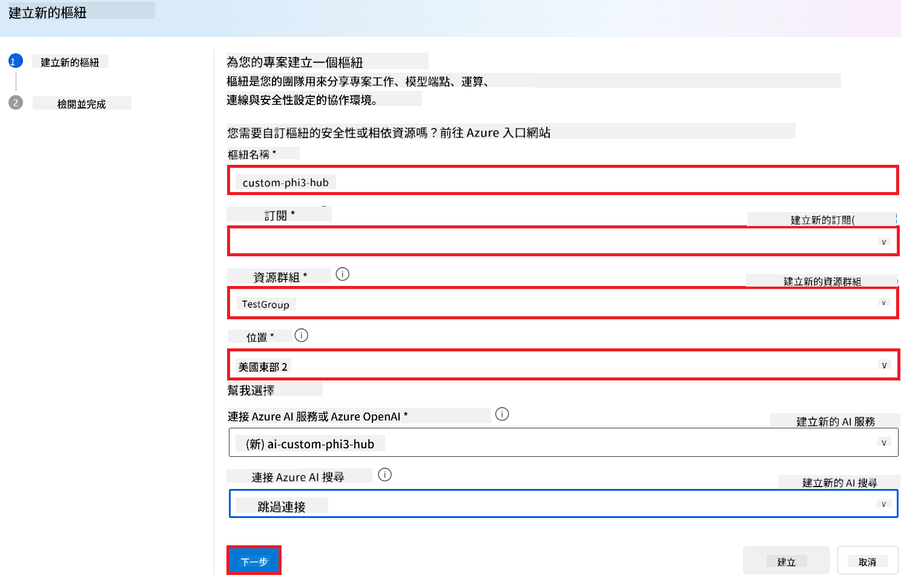

1. Select **Next**.

#### Create Azure AI Foundry Project

1. In the Hub that you created, select **All projects** from the left side tab.

1. Select **+ New project** from the navigation menu.

    

1. Enter **Project name**. It must be a unique value.

    

1. Select **Create a project**.

#### Add a custom connection for the fine-tuned Phi-3 model

To integrate your custom Phi-3 model with Prompt flow, you need to save the model's endpoint and key in a custom connection. This setup ensures access to your custom Phi-3 model in Prompt flow.

#### Set api key and endpoint uri of the fine-tuned Phi-3 model

1. Visit [Azure ML Studio](https://ml.azure.com/home?WT.mc_id=aiml-137032-kinfeylo).

1. Navigate to the Azure Machine learning workspace that you created.

1. Select **Endpoints** from the left side tab.

    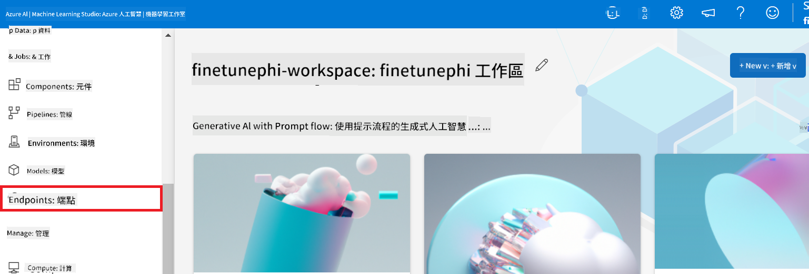

1. Select endpoint that you created.

    

1. Select **Consume** from the navigation menu.

1. Copy your **REST endpoint** and **Primary key**.
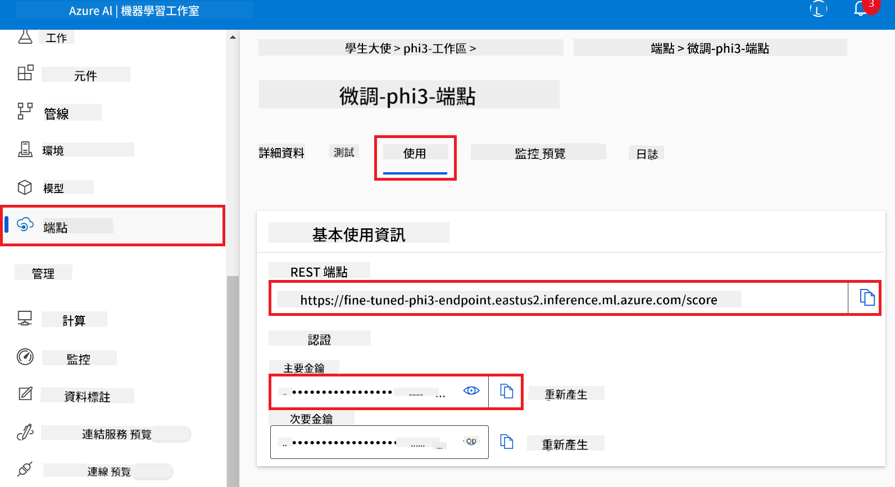

#### הוסף את החיבור המותאם אישית

1. בקר ב-[Azure AI Foundry](https://ai.azure.com/?WT.mc_id=aiml-137032-kinfeylo).

1. נווט לפרויקט Azure AI Foundry שיצרת.

1. בפרויקט שיצרת, בחר ב**Settings** מהכרטיסייה בצד שמאל.

1. בחר ב**+ New connection**.

    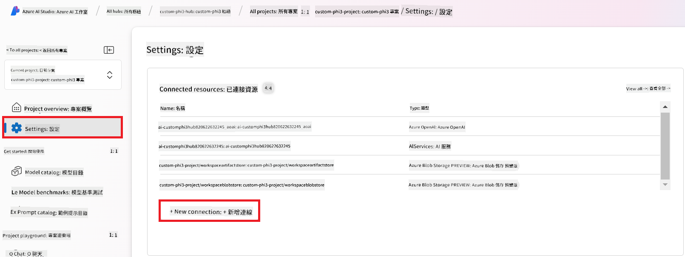

1. בחר ב**Custom keys** מתפריט הניווט.

    

1. בצע את הפעולות הבאות:

    - בחר ב**+ Add key value pairs**.
    - בשדה שם המפתח, הזן **endpoint** והדבק את ה-endpoint שהעתקת מ-Azure ML Studio בשדה הערך.
    - בחר שוב ב**+ Add key value pairs**.
    - בשדה שם המפתח, הזן **key** והדבק את המפתח שהעתקת מ-Azure ML Studio בשדה הערך.
    - לאחר הוספת המפתחות, סמן את **is secret** כדי למנוע חשיפת המפתח.

    

1. בחר ב**Add connection**.

#### צור Prompt flow

הוספת חיבור מותאם אישית ב-Azure AI Foundry. כעת, ניצור Prompt flow באמצעות השלבים הבאים. לאחר מכן, תחבר את Prompt flow הזה לחיבור המותאם כדי שתוכל להשתמש במודל המותאם בתוך Prompt flow.

1. נווט לפרויקט Azure AI Foundry שיצרת.

1. בחר ב**Prompt flow** מהכרטיסייה בצד שמאל.

1. בחר ב**+ Create** מתפריט הניווט.

    

1. בחר ב**Chat flow** מתפריט הניווט.

    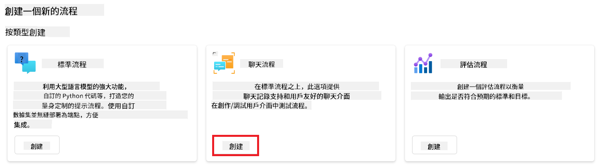

1. הזן **Folder name** לשימוש.

    

2. בחר ב**Create**.

#### הגדר Prompt flow לשיחה עם מודל Phi-3 המותאם אישית שלך

עליך לשלב את מודל Phi-3 המותאם בתוך Prompt flow. עם זאת, Prompt flow הקיים אינו מותאם למטרה זו. לכן, עליך לעצב מחדש את Prompt flow כדי לאפשר את שילוב המודל המותאם.

1. ב-Prompt flow, בצע את הפעולות הבאות כדי לבנות מחדש את ה-flow הקיים:

    - בחר ב**Raw file mode**.
    - מחק את כל הקוד הקיים בקובץ *flow.dag.yml*.
    - הוסף את הקוד הבא לקובץ *flow.dag.yml*.

        ```yml
        inputs:
          input_data:
            type: string
            default: "Who founded Microsoft?"

        outputs:
          answer:
            type: string
            reference: ${integrate_with_promptflow.output}

        nodes:
        - name: integrate_with_promptflow
          type: python
          source:
            type: code
            path: integrate_with_promptflow.py
          inputs:
            input_data: ${inputs.input_data}
        ```

    - בחר ב**Save**.

    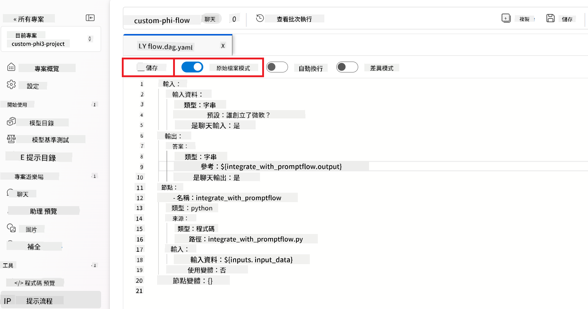

1. הוסף את הקוד הבא לקובץ *integrate_with_promptflow.py* כדי להשתמש במודל Phi-3 המותאם ב-Prompt flow.

    ```python
    import logging
    import requests
    from promptflow import tool
    from promptflow.connections import CustomConnection

    # Logging setup
    logging.basicConfig(
        format="%(asctime)s - %(levelname)s - %(name)s - %(message)s",
        datefmt="%Y-%m-%d %H:%M:%S",
        level=logging.DEBUG
    )
    logger = logging.getLogger(__name__)

    def query_phi3_model(input_data: str, connection: CustomConnection) -> str:
        """
        Send a request to the Phi-3 model endpoint with the given input data using Custom Connection.
        """

        # "connection" is the name of the Custom Connection, "endpoint", "key" are the keys in the Custom Connection
        endpoint_url = connection.endpoint
        api_key = connection.key

        headers = {
            "Content-Type": "application/json",
            "Authorization": f"Bearer {api_key}"
        }
        data = {
            "input_data": {
                "input_string": [
                    {"role": "user", "content": input_data}
                ],
                "parameters": {
                    "temperature": 0.7,
                    "max_new_tokens": 128
                }
            }
        }
        try:
            response = requests.post(endpoint_url, json=data, headers=headers)
            response.raise_for_status()
            
            # Log the full JSON response
            logger.debug(f"Full JSON response: {response.json()}")

            result = response.json()["output"]
            logger.info("Successfully received response from Azure ML Endpoint.")
            return result
        except requests.exceptions.RequestException as e:
            logger.error(f"Error querying Azure ML Endpoint: {e}")
            raise

    @tool
    def my_python_tool(input_data: str, connection: CustomConnection) -> str:
        """
        Tool function to process input data and query the Phi-3 model.
        """
        return query_phi3_model(input_data, connection)

    ```

    

> [!NOTE]
> למידע מפורט יותר על שימוש ב-Prompt flow ב-Azure AI Foundry, ניתן לעיין ב-[Prompt flow ב-Azure AI Foundry](https://learn.microsoft.com/azure/ai-studio/how-to/prompt-flow).

1. בחר ב**Chat input**, **Chat output** כדי לאפשר שיחה עם המודל שלך.

    

1. כעת אתה מוכן לשוחח עם מודל Phi-3 המותאם שלך. בתרגיל הבא תלמד כיצד להפעיל את Prompt flow ולהשתמש בו לשיחה עם מודל Phi-3 המותאם שלך.

> [!NOTE]
>
> ה-flow שהוקם מחדש אמור להיראות כמו בתמונה למטה:
>
> 
>

### שוחח עם מודל Phi-3 המותאם שלך

כעת כשכיוונת ושילבת את מודל Phi-3 המותאם שלך עם Prompt flow, אתה מוכן להתחיל אינטראקציה איתו. תרגיל זה ינחה אותך בתהליך ההגדרה וההפעלה של שיחה עם המודל שלך באמצעות Prompt flow. בעקבות שלבים אלו תוכל למצות את כל היכולות של מודל Phi-3 המותאם שלך למשימות ושיחות שונות.

- שוחח עם מודל Phi-3 המותאם שלך באמצעות Prompt flow.

#### הפעל את Prompt flow

1. בחר ב**Start compute sessions** כדי להפעיל את Prompt flow.

    

1. בחר ב**Validate and parse input** כדי לעדכן פרמטרים.

    

1. בחר את **Value** של **connection** לחיבור המותאם שיצרת. לדוגמה, *connection*.

    

#### שוחח עם המודל המותאם שלך

1. בחר ב**Chat**.

    

1. הנה דוגמה לתוצאות: כעת תוכל לשוחח עם מודל Phi-3 המותאם שלך. מומלץ לשאול שאלות המבוססות על הנתונים ששימשו לאימון המודל.

    

**Disclaimer**:  
This document has been translated using AI translation service [Co-op Translator](https://github.com/Azure/co-op-translator). While we strive for accuracy, please be aware that automated translations may contain errors or inaccuracies. The original document in its native language should be considered the authoritative source. For critical information, professional human translation is recommended. We are not liable for any misunderstandings or misinterpretations arising from the use of this translation.