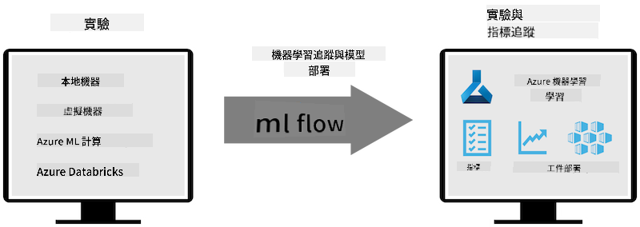

<!--
CO_OP_TRANSLATOR_METADATA:
{
  "original_hash": "f61c383bbf0c3dac97e43f833c258731",
  "translation_date": "2025-05-07T13:58:23+00:00",
  "source_file": "md/02.Application/01.TextAndChat/Phi3/E2E_Phi-3-MLflow.md",
  "language_code": "mo"
}
-->
# MLflow

[MLflow](https://mlflow.org/) הוא פלטפורמה בקוד פתוח שנועדה לנהל את מחזור החיים המלא של למידת מכונה.


MLFlow משמש לניהול מחזור החיים של למידת מכונה, כולל ניסויים, שיחזור, פריסה ורישום מרכזי של מודלים. MLflow מציע כיום ארבעה רכיבים.

- **MLflow Tracking:** רישום ושאילת ניסויים, קוד, הגדרות נתונים ותוצאות.
- **MLflow Projects:** אריזת קוד מדעי נתונים בפורמט לשחזור ריצות על כל פלטפורמה.
- **Mlflow Models:** פריסת מודלים של למידת מכונה בסביבות שירות מגוונות.
- **Model Registry:** אחסון, תיוג וניהול מודלים במאגר מרכזי.

הפלטפורמה כוללת יכולות למעקב אחר ניסויים, אריזת קוד להרצות שחזוריות, ושיתוף ופריסת מודלים. MLFlow משולב ב-Databricks ותומך במגוון ספריות למידת מכונה, מה שהופך אותו לניטרלי לספריות. ניתן להשתמש בו עם כל ספריית למידת מכונה ובכל שפת תכנות, שכן הוא מספק REST API ו-CLI לנוחות.



תכונות מרכזיות של MLFlow כוללות:

- **מעקב ניסויים:** רישום והשוואת פרמטרים ותוצאות.
- **ניהול מודלים:** פריסת מודלים לפלטפורמות שירות והסקת מסקנות שונות.
- **Model Registry:** ניהול שיתופי של מחזור החיים של מודלים ב-MLflow, כולל גרסאות ותיוגים.
- **Projects:** אריזת קוד ML לשיתוף או שימוש בפרודקשן.

MLFlow תומך גם בלולאת MLOps, הכוללת הכנת נתונים, רישום וניהול מודלים, אריזת מודלים להרצה, פריסת שירותים ומעקב אחר מודלים. המטרה היא לפשט את המעבר מפרוטוטייפ לזרימת עבודה פרודקשן, במיוחד בסביבות ענן וקצה.

## תרחיש E2E - בניית עטיפה ושימוש ב-Phi-3 כמודל MLFlow

בדוגמת E2E זו נציג שתי גישות שונות לבניית עטיפה סביב מודל השפה הקטן Phi-3 (SLM) ואז להריץ אותו כמודל MLFlow, בין אם מקומית ובין אם בענן, לדוגמה ב-Azure Machine Learning workspace.


| פרויקט | תיאור | מיקום |
| ------------ | ----------- | -------- |
| Transformer Pipeline | Transformer Pipeline היא האפשרות הפשוטה ביותר לבניית עטיפה אם ברצונך להשתמש במודל HuggingFace עם הטעם הניסיוני של MLFlow לטרנספורמרים. | [**TransformerPipeline.ipynb**](../../../../../../code/06.E2E/E2E_Phi-3-MLflow_TransformerPipeline.ipynb) |
| Custom Python Wrapper | נכון למועד כתיבת שורות אלו, ה-transformer pipeline לא תמך ביצירת עטיפת MLFlow למודלים של HuggingFace בפורמט ONNX, גם לא עם חבילת Python הניסיונית optimum. במקרים כאלה ניתן לבנות עטיפת Python מותאמת אישית למודל MLFlow. | [**CustomPythonWrapper.ipynb**](../../../../../../code/06.E2E/E2E_Phi-3-MLflow_CustomPythonWrapper.ipynb) |

## פרויקט: Transformer Pipeline

1. תזדקק לחבילות Python רלוונטיות מ-MLFlow ו-HuggingFace:

    ``` Python
    import mlflow
    import transformers
    ```

2. לאחר מכן, יש לאתחל pipeline של טרנספורמר באמצעות הפנייה למודל Phi-3 המתאים במאגר HuggingFace. כפי שניתן לראות בכרטיס המודל של _Phi-3-mini-4k-instruct_, המשימה שלו היא מסוג "Text Generation":

    ``` Python
    pipeline = transformers.pipeline(
        task = "text-generation",
        model = "microsoft/Phi-3-mini-4k-instruct"
    )
    ```

3. כעת תוכל לשמור את pipeline הטרנספורמר של מודל Phi-3 בפורמט MLFlow ולספק פרטים נוספים כמו נתיב היעד לארטיפקטים, הגדרות קונפיגורציה ספציפיות של המודל וסוג API להסקת מסקנות:

    ``` Python
    model_info = mlflow.transformers.log_model(
        transformers_model = pipeline,
        artifact_path = "phi3-mlflow-model",
        model_config = model_config,
        task = "llm/v1/chat"
    )
    ```

## פרויקט: Custom Python Wrapper

1. כאן נוכל להשתמש ב-API generate() של [ONNX Runtime של Microsoft](https://github.com/microsoft/onnxruntime-genai) לצורך הסקה והצפנה/פענוח של טוקנים במודל ONNX. יש לבחור בחבילת _onnxruntime_genai_ עבור החישוב הרצוי, בדוגמה הבאה מוגדר CPU:

    ``` Python
    import mlflow
    from mlflow.models import infer_signature
    import onnxruntime_genai as og
    ```

1. המחלקה המותאמת שלנו מממשת שתי פונקציות: _load_context()_ לאתחול **מודל ONNX** של Phi-3 Mini 4K Instruct, **פרמטרים של הגנרטור** ו**טוקנייזר**; ו-_predict()_ ליצירת טוקנים פלט בהתאם לפרומפט שהתקבל:

    ``` Python
    class Phi3Model(mlflow.pyfunc.PythonModel):
        def load_context(self, context):
            # Retrieving model from the artifacts
            model_path = context.artifacts["phi3-mini-onnx"]
            model_options = {
                 "max_length": 300,
                 "temperature": 0.2,         
            }
        
            # Defining the model
            self.phi3_model = og.Model(model_path)
            self.params = og.GeneratorParams(self.phi3_model)
            self.params.set_search_options(**model_options)
            
            # Defining the tokenizer
            self.tokenizer = og.Tokenizer(self.phi3_model)
    
        def predict(self, context, model_input):
            # Retrieving prompt from the input
            prompt = model_input["prompt"][0]
            self.params.input_ids = self.tokenizer.encode(prompt)
    
            # Generating the model's response
            response = self.phi3_model.generate(self.params)
    
            return self.tokenizer.decode(response[0][len(self.params.input_ids):])
    ```

1. כעת ניתן להשתמש בפונקציה _mlflow.pyfunc.log_model()_ כדי ליצור עטיפת Python מותאמת אישית (בפורמט pickle) למודל Phi-3, יחד עם מודל ONNX המקורי ותלויות נדרשות:

    ``` Python
    model_info = mlflow.pyfunc.log_model(
        artifact_path = artifact_path,
        python_model = Phi3Model(),
        artifacts = {
            "phi3-mini-onnx": "cpu_and_mobile/cpu-int4-rtn-block-32-acc-level-4",
        },
        input_example = input_example,
        signature = infer_signature(input_example, ["Run"]),
        extra_pip_requirements = ["torch", "onnxruntime_genai", "numpy"],
    )
    ```

## חתימות של מודלי MLFlow שנוצרו

1. בשלב 3 של פרויקט Transformer Pipeline לעיל, הגדרנו את משימת מודל MLFlow ל-"_llm/v1/chat_". הוראה זו יוצרת עטיפת API למודל, התואמת ל-OpenAI Chat API כפי שמוצג להלן:

    ``` Python
    {inputs: 
      ['messages': Array({content: string (required), name: string (optional), role: string (required)}) (required), 'temperature': double (optional), 'max_tokens': long (optional), 'stop': Array(string) (optional), 'n': long (optional), 'stream': boolean (optional)],
    outputs: 
      ['id': string (required), 'object': string (required), 'created': long (required), 'model': string (required), 'choices': Array({finish_reason: string (required), index: long (required), message: {content: string (required), name: string (optional), role: string (required)} (required)}) (required), 'usage': {completion_tokens: long (required), prompt_tokens: long (required), total_tokens: long (required)} (required)],
    params: 
      None}
    ```

1. כתוצאה מכך, ניתן לשלוח את הפרומפט בפורמט הבא:

    ``` Python
    messages = [{"role": "user", "content": "What is the capital of Spain?"}]
    ```

1. לאחר מכן, השתמש בעיבוד לאחר-API התואם ל-OpenAI, לדוגמה _response[0][‘choices’][0][‘message’][‘content’]_, כדי לעצב את הפלט למשהו כזה:

    ``` JSON
    Question: What is the capital of Spain?
    
    Answer: The capital of Spain is Madrid. It is the largest city in Spain and serves as the political, economic, and cultural center of the country. Madrid is located in the center of the Iberian Peninsula and is known for its rich history, art, and architecture, including the Royal Palace, the Prado Museum, and the Plaza Mayor.
    
    Usage: {'prompt_tokens': 11, 'completion_tokens': 73, 'total_tokens': 84}
    ```

1. בשלב 3 של פרויקט Custom Python Wrapper לעיל, מאפשרים לחבילת MLFlow ליצור את חתימת המודל מתוך דוגמת קלט נתונה. החתימה של עטיפת MLFlow שלנו תיראה כך:

    ``` Python
    {inputs: 
      ['prompt': string (required)],
    outputs: 
      [string (required)],
    params: 
      None}
    ```

1. לכן, הפרומפט שלנו יצטרך להכיל את מפתח המילון "prompt", בדומה לזה:

    ``` Python
    {"prompt": "<|system|>You are a stand-up comedian.<|end|><|user|>Tell me a joke about atom<|end|><|assistant|>",}
    ```

1. פלט המודל יינתן אז בפורמט מחרוזת:

    ``` JSON
    Alright, here's a little atom-related joke for you!
    
    Why don't electrons ever play hide and seek with protons?
    
    Because good luck finding them when they're always "sharing" their electrons!
    
    Remember, this is all in good fun, and we're just having a little atomic-level humor!
    ```

**Disclaimer**:  
Dis dokument es translatet using AI translation servis [Co-op Translator](https://github.com/Azure/co-op-translator). Wile we striv for accurasi, pleez be aware dat automatet translatshuns may kontain errors or inaccurasis. De original dokument in its native languag shud be konsideret de autoritativ sours. For kritikel informashun, profesional human translatshun is rekomendet. We ar not liable for eni misanderstandings or misinterpretashuns arising from de yus of dis translatshun.