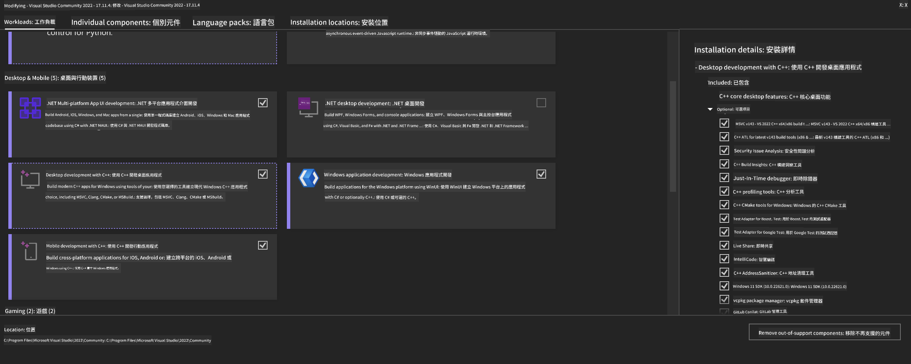
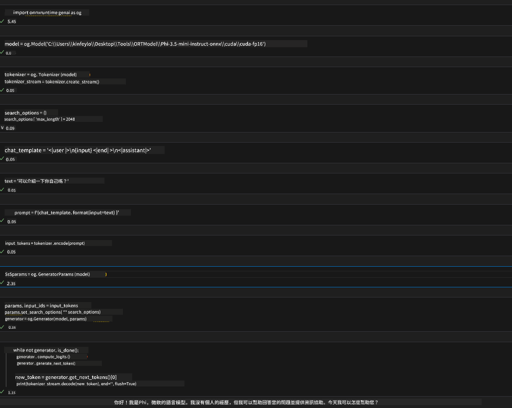
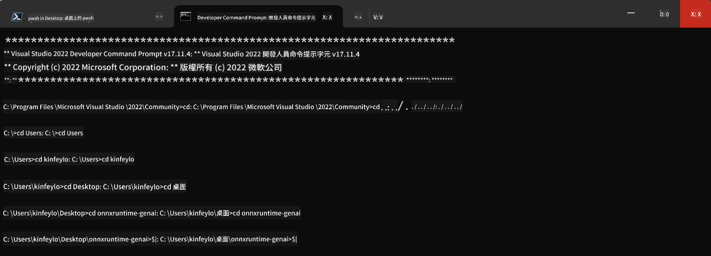

<!--
CO_OP_TRANSLATOR_METADATA:
{
  "original_hash": "9fe95f5575ecf5985eb9f67d205d0136",
  "translation_date": "2025-04-04T12:42:56+00:00",
  "source_file": "md\\02.Application\\01.TextAndChat\\Phi3\\ORTWindowGPUGuideline.md",
  "language_code": "mo"
}
-->
# **OnnxRuntime GenAI Windows GPU ကို အသုံးပြုရန် လမ်းညွှန်**

ဒီလမ်းညွှန်စာတမ်းမှာ Windows ပေါ်မှာ GPU တွေကို ONNX Runtime (ORT) နဲ့အတူ စနစ်တကျ သုံးနိုင်ဖို့ အဆင့်ဆင့်လုပ်ဆောင်ပုံတွေကို ဖော်ပြထားပါတယ်။ GPU acceleration ကို သုံးပြီး မော်ဒယ်တွေကို အာရုံခံနိုင်စွမ်းနှင့် ထိရောက်မှုကို မြှင့်တင်နိုင်ဖို့ ရည်ရွယ်ထားပါတယ်။

ဒီစာတမ်းမှာ ဖော်ပြထားတာတွေကတော့-

- **ပတ်ဝန်းကျင် ပြင်ဆင်ခြင်း**: CUDA, cuDNN, ONNX Runtime အပါအဝင် လိုအပ်တဲ့ dependency တွေကို တပ်ဆင်ပုံလမ်းညွှန်။
- **ပြင်ဆင်မှု**: GPU resources တွေကို အကျိုးရှိရှိ အသုံးပြုနိုင်ဖို့ ONNX Runtime နဲ့ ပတ်ဝန်းကျင်ကို ပြင်ဆင်ပုံ။
- **အဆင့်မြှင့်ရေး အကြံပြုချက်များ**: GPU settings တွေကို ထိရောက်မှုအမြင့်ဆုံးရအောင် ချိန်ညှိပုံ။

### **1. Python 3.10.x /3.11.8**

   ***မှတ်ချက်*** [miniforge](https://github.com/conda-forge/miniforge/releases/latest/download/Miniforge3-Windows-x86_64.exe) ကို Python environment အနေနဲ့ သုံးဖို့ အကြံပြုပါတယ်။

   ```bash

   conda create -n pydev python==3.11.8

   conda activate pydev

   ```

   ***သတိပေးချက်*** Python ONNX library ကို အခါအားလျော်စွာ တပ်ဆင်ထားခဲ့ရင် အရင် uninstall လုပ်ပါ။

### **2. CMake ကို winget နဲ့တပ်ဆင်ပါ**

   ```bash

   winget install -e --id Kitware.CMake

   ```

### **3. Visual Studio 2022 - Desktop Development with C++ ကိုတပ်ဆင်ပါ**

   ***မှတ်ချက်*** Compile လုပ်ချင်မယ်ဆိုရင် ဒီအဆင့်ကို ကျော်မသွားပါနဲ့။



### **4. NVIDIA Driver ကိုတပ်ဆင်ပါ**

1. **NVIDIA GPU Driver** [https://www.nvidia.com/en-us/drivers/](https://www.nvidia.com/en-us/drivers/)

2. **NVIDIA CUDA 12.4** [https://developer.nvidia.com/cuda-12-4-0-download-archive](https://developer.nvidia.com/cuda-12-4-0-download-archive)

3. **NVIDIA CUDNN 9.4** [https://developer.nvidia.com/cudnn-downloads](https://developer.nvidia.com/cudnn-downloads)

***သတိပေးချက်*** Installation flow ရဲ့ default settings ကိုသုံးဖို့ အကြံပြုပါတယ်။

### **5. NVIDIA Environment ကို ပြင်ဆင်ပါ**

NVIDIA CUDNN 9.4 lib, bin, include ကို NVIDIA CUDA 12.4 lib, bin, include ထဲကို copy လုပ်ပါ။

- *'C:\Program Files\NVIDIA\CUDNN\v9.4\bin\12.6'* ဖိုင်တွေကို *'C:\Program Files\NVIDIA GPU Computing Toolkit\CUDA\v12.4\bin'* ထဲကို copy လုပ်ပါ။

- *'C:\Program Files\NVIDIA\CUDNN\v9.4\include\12.6'* ဖိုင်တွေကို *'C:\Program Files\NVIDIA GPU Computing Toolkit\CUDA\v12.4\include'* ထဲကို copy လုပ်ပါ။

- *'C:\Program Files\NVIDIA\CUDNN\v9.4\lib\12.6'* ဖိုင်တွေကို *'C:\Program Files\NVIDIA GPU Computing Toolkit\CUDA\v12.4\lib\x64'* ထဲကို copy လုပ်ပါ။

### **6. Phi-3.5-mini-instruct-onnx ကို ဒေါင်းလုပ်ဆွဲပါ**

   ```bash

   winget install -e --id Git.Git

   winget install -e --id GitHub.GitLFS

   git lfs install

   git clone https://huggingface.co/microsoft/Phi-3.5-mini-instruct-onnx

   ```

### **7. InferencePhi35Instruct.ipynb ကို Run လုပ်ပါ**

   [Notebook](../../../../../../code/09.UpdateSamples/Aug/ortgpu-phi35-instruct.ipynb) ကို ဖွင့်ပြီး အဆင့်ဆင့် run လုပ်ပါ။



### **8. ORT GenAI GPU ကို Compile လုပ်ပါ**

   ***မှတ်ချက်*** 
   
   1. အရင်ဆုံး onnx, onnxruntime, onnxruntime-genai ကို အားလုံး uninstall လုပ်ပါ။

   
   ```bash

   pip list 
   
   ```

   ပြီးရင် onnxruntime libraries အားလုံးကို uninstall လုပ်ပါ။

   ```bash

   pip uninstall onnxruntime

   pip uninstall onnxruntime-genai

   pip uninstall onnxruntume-genai-cuda
   
   ```

   2. Visual Studio Extension support ကို စစ်ပါ။

   C:\Program Files\NVIDIA GPU Computing Toolkit\CUDA\v12.4\extras ထဲမှာ C:\Program Files\NVIDIA GPU Computing Toolkit\CUDA\v12.4\extras\visual_studio_integration ကိုတွေ့မလား စစ်ပါ။

   မတွေ့ရင်တော့ CUDA toolkit driver folder တစ်ခုခုထဲမှာ visual_studio_integration folder ကိုရှာပြီး C:\Program Files\NVIDIA GPU Computing Toolkit\CUDA\v12.4\extras\visual_studio_integration ထဲကို copy လုပ်ပါ။

   - Compile လုပ်ချင်မယ်ဆိုရင် ဒီအဆင့်ကို ကျော်မသွားပါနဲ့။

   ```bash

   git clone https://github.com/microsoft/onnxruntime-genai

   ```

   - [https://github.com/microsoft/onnxruntime/releases/download/v1.19.2/onnxruntime-win-x64-gpu-1.19.2.zip](https://github.com/microsoft/onnxruntime/releases/download/v1.19.2/onnxruntime-win-x64-gpu-1.19.2.zip) ကို ဒေါင်းလုပ်ဆွဲပါ။

   - onnxruntime-win-x64-gpu-1.19.2.zip ကို unzip လုပ်ပြီး **ort** လို့ rename လုပ်ပါ၊ ort folder ကို onnxruntime-genai ထဲကို copy လုပ်ပါ။

   - Windows Terminal ကို အသုံးပြုပြီး Developer Command Prompt for VS 2022 ကို ဖွင့်ပြီး onnxruntime-genai folder ထဲကို သွားပါ။



   - သင့် Python environment နဲ့ Compile လုပ်ပါ။

   ```bash

   cd onnxruntime-genai

   python build.py --use_cuda  --cuda_home "C:\Program Files\NVIDIA GPU Computing Toolkit\CUDA\v12.4" --config Release
 

   cd build/Windows/Release/Wheel

   pip install .whl

   ```

It seems like you might be asking for a translation into "mo," but it's unclear what "mo" refers to. Could you clarify whether "mo" is a specific language, dialect, or abbreviation? For example, are you referring to Maori, Mongolian, or something else? Let me know so I can assist you accurately!