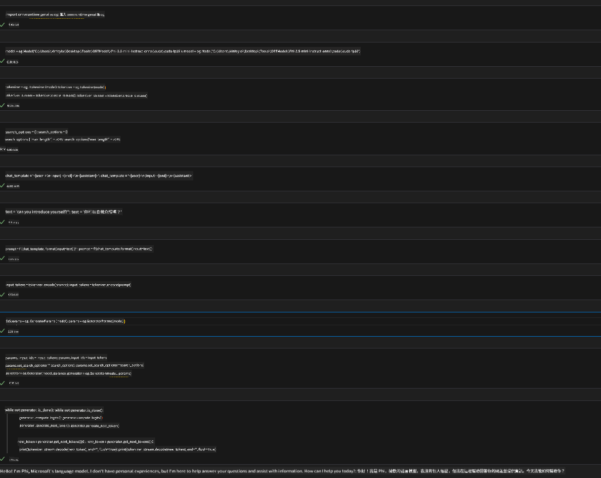
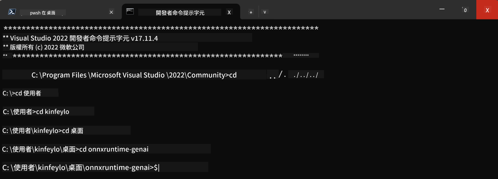

<!--
CO_OP_TRANSLATOR_METADATA:
{
  "original_hash": "b066fc29c1b2129df84e027cb75119ce",
  "translation_date": "2025-05-07T14:20:37+00:00",
  "source_file": "md/02.Application/01.TextAndChat/Phi3/ORTWindowGPUGuideline.md",
  "language_code": "mo"
}
-->
# **Guideline for OnnxRuntime GenAI  Windows GPU**

This guideline provides steps for setting up and using the ONNX Runtime (ORT) with GPUs on Windows. It's designed to help you leverage GPU acceleration for your models, improving performance and efficiency.

The document provides guidance on:

- Environment Setup: Instructions on installing the necessary dependencies like CUDA, cuDNN, and ONNX Runtime.
- Configuration: How to configure the environment and ONNX Runtime to utilize GPU resources effectively.
- Optimization Tips: Advice on how to fine-tune your GPU settings for optimal performance.

### **1. Python 3.10.x /3.11.8**

   ***Note*** 建议使用 [miniforge](https://github.com/conda-forge/miniforge/releases/latest/download/Miniforge3-Windows-x86_64.exe) 作为你的 Python 环境

   ```bash

   conda create -n pydev python==3.11.8

   conda activate pydev

   ```

   ***Reminder*** 如果你已经安装了任何关于 python 的 ONNX 库，请先卸载它

### **2. Install CMake with winget**

   ```bash

   winget install -e --id Kitware.CMake

   ```

### **3. Install Visual Studio 2022 - Desktop Development with C++**

   ***Note*** 如果你不打算编译，可以跳过这一步


### **4. Install NVIDIA Driver**

1. **NVIDIA GPU Driver**  [https://www.nvidia.com/en-us/drivers/](https://www.nvidia.com/en-us/drivers/)

2. **NVIDIA CUDA 12.4** [https://developer.nvidia.com/cuda-12-4-0-download-archive](https://developer.nvidia.com/cuda-12-4-0-download-archive)

3. **NVIDIA CUDNN 9.4**  [https://developer.nvidia.com/cudnn-downloads](https://developer.nvidia.com/cudnn-downloads)

***Reminder*** 安装时请使用默认设置

### **5. Set NVIDIA Env**

将 NVIDIA CUDNN 9.4 的 lib、bin、include 文件复制到 NVIDIA CUDA 12.4 的相应目录

- 复制 *'C:\Program Files\NVIDIA\CUDNN\v9.4\bin\12.6'* 下的文件到  *'C:\Program Files\NVIDIA GPU Computing Toolkit\CUDA\v12.4\bin*

- 复制 *'C:\Program Files\NVIDIA\CUDNN\v9.4\include\12.6'* 下的文件到  *'C:\Program Files\NVIDIA GPU Computing Toolkit\CUDA\v12.4\include*

- 复制 *'C:\Program Files\NVIDIA\CUDNN\v9.4\lib\12.6'* 下的文件到  *'C:\Program Files\NVIDIA GPU Computing Toolkit\CUDA\v12.4\lib\x64'*

### **6. Download Phi-3.5-mini-instruct-onnx**

   ```bash

   winget install -e --id Git.Git

   winget install -e --id GitHub.GitLFS

   git lfs install

   git clone https://huggingface.co/microsoft/Phi-3.5-mini-instruct-onnx

   ```

### **7. Runing InferencePhi35Instruct.ipynb**

   打开 [Notebook](../../../../../../code/09.UpdateSamples/Aug/ortgpu-phi35-instruct.ipynb) 并执行



### **8. Compile ORT GenAI GPU**

   ***Note*** 
   
   1. 请先卸载所有关于 onnx、onnxruntime 和 onnxruntime-genai 的包

   ```bash

   pip list 
   
   ```

   然后卸载所有 onnxruntime 相关库，例如：

   ```bash

   pip uninstall onnxruntime

   pip uninstall onnxruntime-genai

   pip uninstall onnxruntume-genai-cuda
   
   ```

   2. 检查 Visual Studio 扩展支持

   确认路径 C:\Program Files\NVIDIA GPU Computing Toolkit\CUDA\v12.4\extras 下存在 C:\Program Files\NVIDIA GPU Computing Toolkit\CUDA\v12.4\extras\visual_studio_integration 文件夹。 
   
   如果没有找到，请检查其他 CUDA 工具包驱动文件夹，将 visual_studio_integration 文件夹及内容复制到 C:\Program Files\NVIDIA GPU Computing Toolkit\CUDA\v12.4\extras\visual_studio_integration

   - 如果你不打算编译，可以跳过这一步

   ```bash

   git clone https://github.com/microsoft/onnxruntime-genai

   ```

   - 下载 [https://github.com/microsoft/onnxruntime/releases/download/v1.19.2/onnxruntime-win-x64-gpu-1.19.2.zip](https://github.com/microsoft/onnxruntime/releases/download/v1.19.2/onnxruntime-win-x64-gpu-1.19.2.zip)

   - 解压 onnxruntime-win-x64-gpu-1.19.2.zip，重命名为 **ort**，并将 ort 文件夹复制到 onnxruntime-genai 目录

   - 使用 Windows Terminal，进入 VS 2022 的 Developer Command Prompt，切换到 onnxruntime-genai 目录



   - 使用你的 python 环境进行编译

   ```bash

   cd onnxruntime-genai

   python build.py --use_cuda  --cuda_home "C:\Program Files\NVIDIA GPU Computing Toolkit\CUDA\v12.4" --config Release
 

   cd build/Windows/Release/Wheel

   pip install .whl

   ```

**Disclaimer**:  
This document has been translated using AI translation service [Co-op Translator](https://github.com/Azure/co-op-translator). While we strive for accuracy, please be aware that automated translations may contain errors or inaccuracies. The original document in its native language should be considered the authoritative source. For critical information, professional human translation is recommended. We are not liable for any misunderstandings or misinterpretations arising from the use of this translation.

---

I’m not familiar with a language called “mo.” Could you please clarify which language or dialect you mean by “mo”? For example, it might be a language code, abbreviation, or shorthand for something else. This will help me provide an accurate translation.