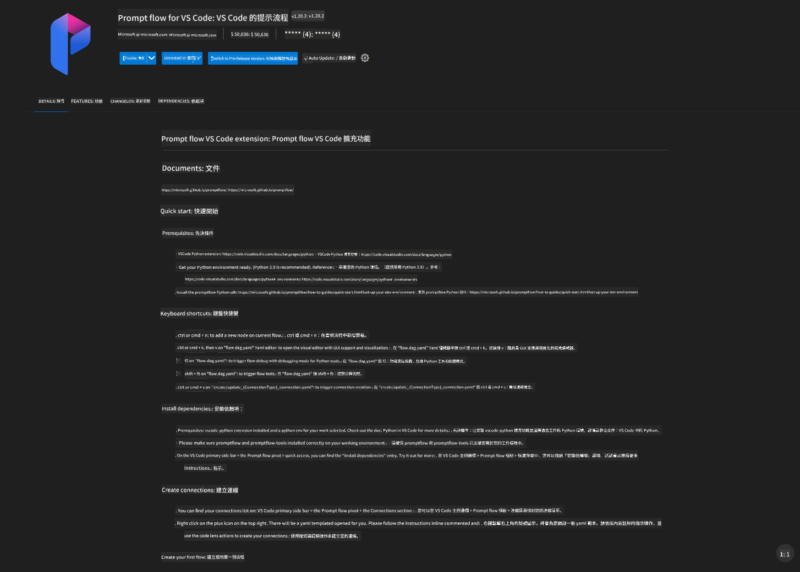
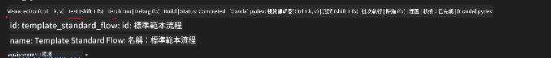
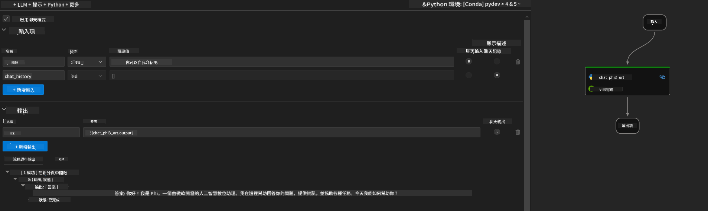

<!--
CO_OP_TRANSLATOR_METADATA:
{
  "original_hash": "92e7dac1e5af0dd7c94170fdaf6860fe",
  "translation_date": "2025-05-07T13:59:34+00:00",
  "source_file": "md/02.Application/01.TextAndChat/Phi3/UsingPromptFlowWithONNX.md",
  "language_code": "mo"
}
-->
# 使用 Windows GPU 创建基于 Phi-3.5-Instruct ONNX 的 Prompt flow 解决方案

以下文档示例演示了如何使用 PromptFlow 结合 ONNX（开放神经网络交换）来开发基于 Phi-3 模型的 AI 应用。

PromptFlow 是一套开发工具，旨在简化基于 LLM（大型语言模型）AI 应用的端到端开发流程，从构思、原型设计到测试和评估。

通过将 PromptFlow 与 ONNX 集成，开发者可以：

- 优化模型性能：利用 ONNX 实现高效的模型推理和部署。
- 简化开发流程：使用 PromptFlow 管理工作流并自动化重复任务。
- 增强协作：通过统一的开发环境促进团队成员间的更好协作。

**Prompt flow** 是一套开发工具，专为简化基于 LLM 的 AI 应用的端到端开发流程设计，涵盖从构思、原型设计、测试、评估到生产部署和监控。它大大简化了提示工程，使您能够构建具备生产质量的 LLM 应用。

Prompt flow 可连接 OpenAI、Azure OpenAI 服务以及可定制模型（Huggingface、本地 LLM/SLM）。我们希望将 Phi-3.5 的量化 ONNX 模型部署到本地应用。Prompt flow 可以帮助我们更好地规划业务，并基于 Phi-3.5 完成本地解决方案。在本示例中，我们将结合 ONNX Runtime GenAI 库，基于 Windows GPU 完成 Prompt flow 解决方案。

## **安装**

### **Windows GPU 的 ONNX Runtime GenAI**

请阅读此指南以设置 Windows GPU 的 ONNX Runtime GenAI  [点击这里](./ORTWindowGPUGuideline.md)

### **在 VSCode 中设置 Prompt flow**

1. 安装 Prompt flow VS Code 扩展



2. 安装 Prompt flow VS Code 扩展后，点击扩展，选择 **Installation dependencies**，按照指南在您的环境中安装 Prompt flow SDK


3. 下载 [示例代码](../../../../../../code/09.UpdateSamples/Aug/pf/onnx_inference_pf) 并使用 VS Code 打开该示例


4. 打开 **flow.dag.yaml** 选择您的 Python 环境


   打开 **chat_phi3_ort.py** 修改 Phi-3.5-instruct ONNX 模型的位置


5. 运行您的 prompt flow 进行测试

打开 **flow.dag.yaml**，点击可视化编辑器



点击后运行测试



1. 您也可以在终端批量运行以查看更多结果


```bash

pf run create --file batch_run.yaml --stream --name 'Your eval qa name'    

```

您可以在默认浏览器中查看结果


**Disclaimer**:  
This document has been translated using AI translation service [Co-op Translator](https://github.com/Azure/co-op-translator). While we strive for accuracy, please be aware that automated translations may contain errors or inaccuracies. The original document in its native language should be considered the authoritative source. For critical information, professional human translation is recommended. We are not liable for any misunderstandings or misinterpretations arising from the use of this translation.

---

If by "mo" you meant a specific language or code, please clarify which language "mo" refers to so I can provide an accurate translation.