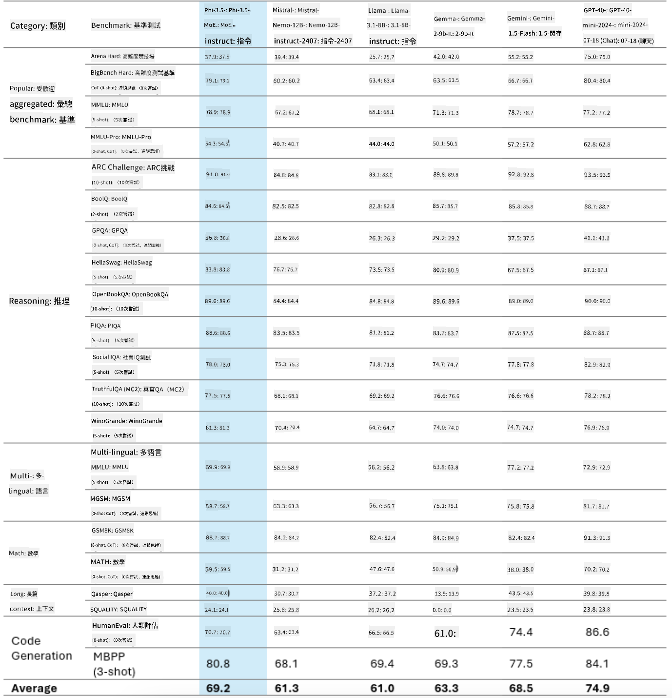
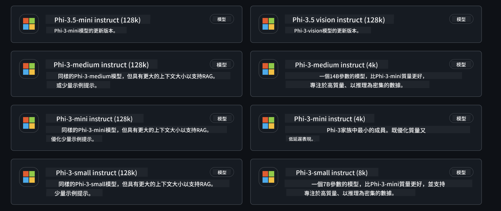
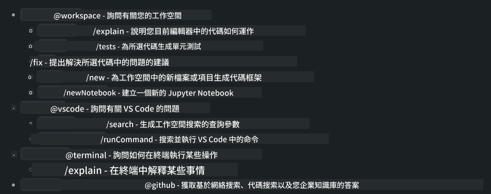
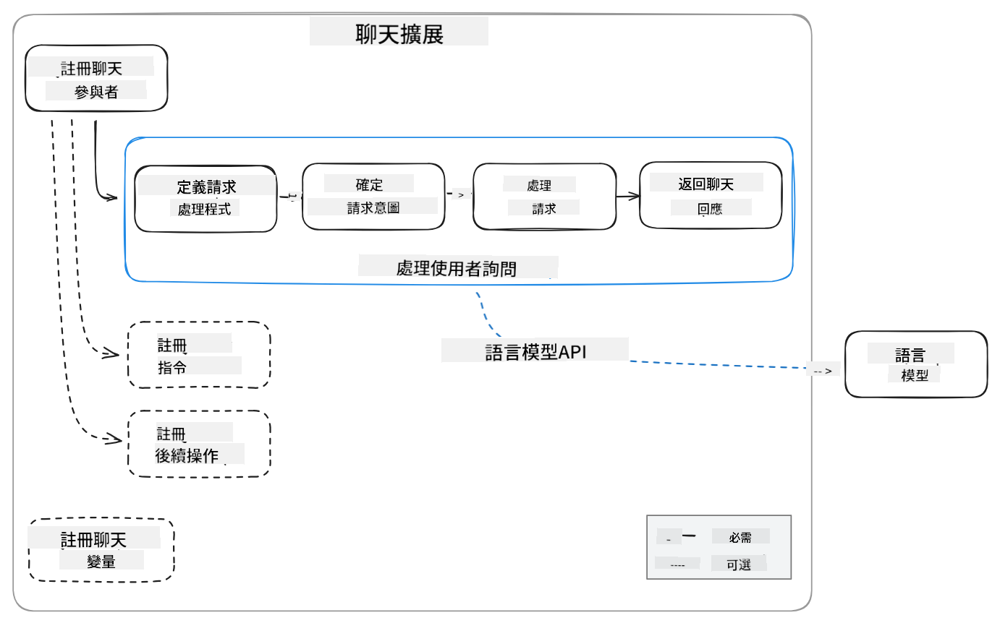
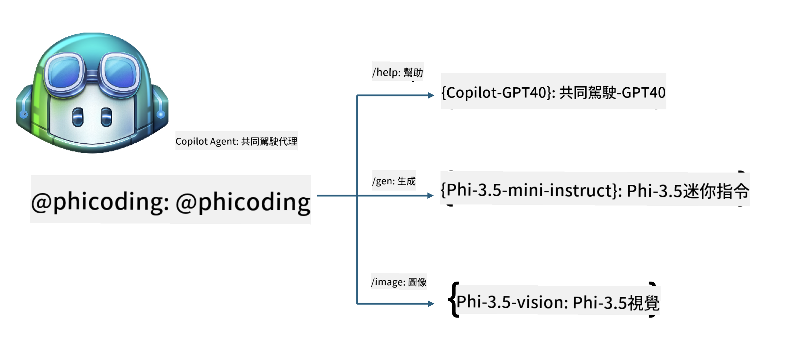
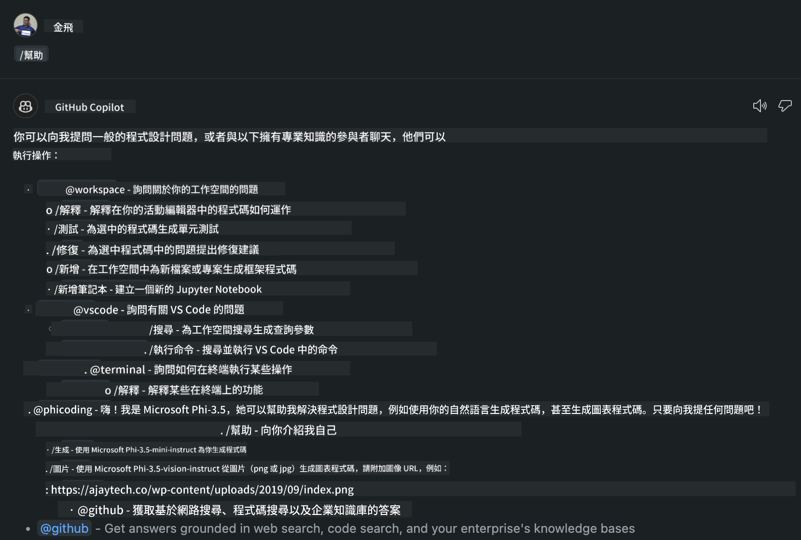
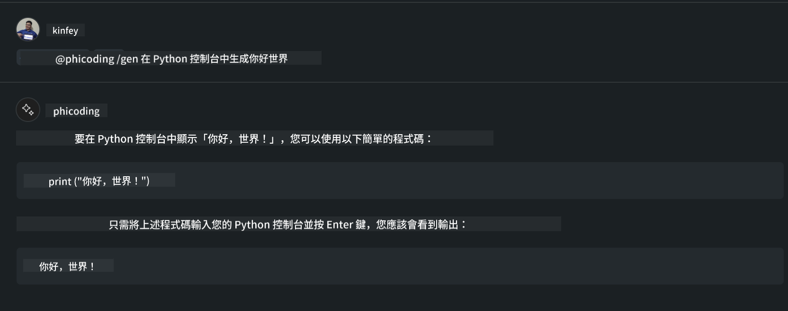
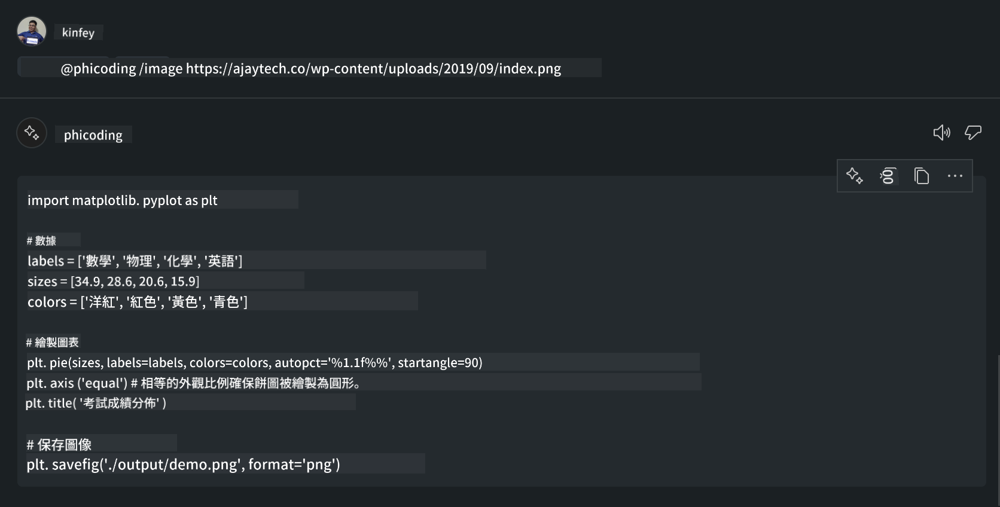

<!--
CO_OP_TRANSLATOR_METADATA:
{
  "original_hash": "e8ff0378cb171924884b4abb3c2a8c37",
  "translation_date": "2025-04-04T12:48:06+00:00",
  "source_file": "md\\02.Application\\02.Code\\Phi3\\CreateVSCodeChatAgentWithGitHubModels.md",
  "language_code": "mo"
}
-->
# **Ka yi naƙasasshen wakilin Visual Studio Code Chat Copilot Agent ɗinka tare da Phi-3.5 daga GitHub Models**

Shin kana amfani da Visual Studio Code Copilot? Musamman a cikin Chat, zaka iya amfani da wakilai daban-daban don inganta ikon ƙirƙira, rubutu, da kula da ayyukan a cikin Visual Studio Code. Visual Studio Code yana bayar da API wanda ke ba kamfanoni da mutane damar ƙirƙirar wakilai daban-daban bisa ga bukatun kasuwancinsu don faɗaɗa iyawa a fannonin mallakar su daban-daban. A cikin wannan labarin, zamu mayar da hankali kan **Phi-3.5-mini-instruct (128k)** da **Phi-3.5-vision-instruct (128k)** na GitHub Models don ƙirƙirar wakilin Visual Studio Code ɗinka.

## **Game da Phi-3.5 a cikin GitHub Models**

Mun san cewa Phi-3/3.5-mini-instruct a cikin Phi-3/3.5 Family yana da ƙarfi wajen fahimtar lamba da samar da lamba, kuma yana da fa'ida akan Gemma-2-9b da Mistral-Nemo-12B-instruct-2407.



Sabbin GitHub Models sun riga sun bayar da damar zuwa Phi-3.5-mini-instruct (128k) da Phi-3.5-vision-instruct (128k) models. Masu haɓaka zasu iya samun su ta hanyar OpenAI SDK, Azure AI Inference SDK, da REST API.



***Note:*** An ba da shawarar amfani da Azure AI Inference SDK anan, saboda yana iya sauƙaƙe sauyawa tare da Azure Model Catalog a cikin yanayin samarwa.

Abubuwan da ke ƙasa sune sakamakon **Phi-3.5-mini-instruct (128k)** da **Phi-3.5-vision-instruct (128k)** a cikin yanayin samar da lamba bayan haɗawa da GitHub Models, kuma suna shirya don misalai masu zuwa.

**Demo: GitHub Models Phi-3.5-mini-instruct (128k) samar da lamba daga Prompt** ([danna wannan mahada](../../../../../../code/09.UpdateSamples/Aug/ghmodel_phi35_instruct_demo.ipynb))

**Demo: GitHub Models Phi-3.5-vision-instruct (128k) samar da lamba daga Hoton** ([danna wannan mahada](../../../../../../code/09.UpdateSamples/Aug/ghmodel_phi35_vision_demo.ipynb))

## **Game da GitHub Copilot Chat Agent**

GitHub Copilot Chat Agent na iya kammala ayyuka daban-daban a cikin yanayin aikin daban-daban bisa ga lamba. Tsarin yana da wakilai guda huɗu: workspace, github, terminal, vscode.



Ta hanyar ƙara sunan wakilin tare da '@', zaka iya kammala aikin da ya dace da sauri. Ga kamfanoni, idan ka ƙara abubuwan da suka shafi kasuwancin ku kamar buƙatu, rubutun lamba, ƙayyadaddun gwaji, da fitarwa, zaka iya samun ƙarin ƙarfi na mallakar kamfani bisa ga GitHub Copilot.

Visual Studio Code Chat Agent yanzu ya fitar da API ɗinsa a hukumance, yana ba kamfanoni ko masu haɓaka kamfanoni damar haɓaka wakilai bisa ga yanayin kasuwancin software daban-daban. Bisa ga hanyar haɓaka Visual Studio Code Extension Development, zaka iya samun sauƙin samun shiga interface na Visual Studio Code Chat Agent API. Zamu iya haɓaka bisa ga wannan tsari.



Yanayin haɓaka yana iya tallafawa samun shiga APIs na samfurin na ɓangare na uku (kamar GitHub Models, Azure Model Catalog, da sabis na gina kai bisa ga samfurin buɗaɗɗen tushe) kuma yana iya amfani da gpt-35-turbo, gpt-4, da gpt-4o models da GitHub Copilot ya bayar.

## **Ƙara Wakilin @phicoding bisa ga Phi-3.5**

Mun yi ƙoƙarin haɗa ikon shirye-shirye na Phi-3.5 don kammala rubutun lamba, samar da lamba daga hotuna, da sauran ayyuka. Kammala wakilin da aka gina kusa da Phi-3.5 - @PHI, waɗannan sune wasu ayyuka:

1. Samar da gabatarwa kai ta amfani da GPT-4o da GitHub Copilot ya bayar ta hanyar umarnin **@phicoding /help**.

2. Samar da lamba don harsunan shirye-shirye daban-daban bisa ga **Phi-3.5-mini-instruct (128k)** ta hanyar umarnin **@phicoding /gen**.

3. Samar da lamba bisa ga **Phi-3.5-vision-instruct (128k)** da kammala hoto ta hanyar umarnin **@phicoding /image**.



## **Matakan da suka shafi**

1. Shigar da tallafin haɓaka Visual Studio Code Extension ta amfani da npm.

```bash

npm install --global yo generator-code 

```

2. Ƙirƙiri plugin na Visual Studio Code Extension (ta amfani da yanayin haɓaka Typescript, mai suna phiext).

```bash

yo code 

```

3. Buɗe aikin da aka ƙirƙira kuma gyara package.json. Anan akwai umarnin da ke da alaƙa da saitunan GitHub Models. Lura cewa dole ne ka ƙara token ɗin GitHub Models ɗinka anan.

```json

{
  "name": "phiext",
  "displayName": "phiext",
  "description": "",
  "version": "0.0.1",
  "engines": {
    "vscode": "^1.93.0"
  },
  "categories": [
    "AI",
    "Chat"
  ],
  "activationEvents": [],
  "enabledApiProposals": [
      "chatVariableResolver"
  ],
  "main": "./dist/extension.js",
  "contributes": {
    "chatParticipants": [
        {
            "id": "chat.phicoding",
            "name": "phicoding",
            "description": "Hey! I am Microsoft Phi-3.5, She can help me with coding problems, such as generation code with your natural language, or even generation code about chart from images. Just ask me anything!",
            "isSticky": true,
            "commands": [
                {
                    "name": "help",
                    "description": "Introduce myself to you"
                },
                {
                    "name": "gen",
                    "description": "Generate code for you with Microsoft Phi-3.5-mini-instruct"
                },
                {
                    "name": "image",
                    "description": "Generate code for chart from image(png or jpg) with Microsoft Phi-3.5-vision-instruct, please add image url like this : https://ajaytech.co/wp-content/uploads/2019/09/index.png"
                }
            ]
        }
    ],
    "commands": [
        {
            "command": "phicoding.namesInEditor",
            "title": "Use Microsoft Phi 3.5 in Editor"
        }
    ],
    "configuration": {
      "type": "object",
      "title": "githubmodels",
      "properties": {
        "githubmodels.endpoint": {
          "type": "string",
          "default": "https://models.inference.ai.azure.com",
          "description": "Your GitHub Models Endpoint",
          "order": 0
        },
        "githubmodels.api_key": {
          "type": "string",
          "default": "Your GitHub Models Token",
          "description": "Your GitHub Models Token",
          "order": 1
        },
        "githubmodels.phi35instruct": {
          "type": "string",
          "default": "Phi-3.5-mini-instruct",
          "description": "Your Phi-35-Instruct Model",
          "order": 2
        },
        "githubmodels.phi35vision": {
          "type": "string",
          "default": "Phi-3.5-vision-instruct",
          "description": "Your Phi-35-Vision Model",
          "order": 3
        }
      }
    }
  },
  "scripts": {
    "vscode:prepublish": "npm run package",
    "compile": "webpack",
    "watch": "webpack --watch",
    "package": "webpack --mode production --devtool hidden-source-map",
    "compile-tests": "tsc -p . --outDir out",
    "watch-tests": "tsc -p . -w --outDir out",
    "pretest": "npm run compile-tests && npm run compile && npm run lint",
    "lint": "eslint src",
    "test": "vscode-test"
  },
  "devDependencies": {
    "@types/vscode": "^1.93.0",
    "@types/mocha": "^10.0.7",
    "@types/node": "20.x",
    "@typescript-eslint/eslint-plugin": "^8.3.0",
    "@typescript-eslint/parser": "^8.3.0",
    "eslint": "^9.9.1",
    "typescript": "^5.5.4",
    "ts-loader": "^9.5.1",
    "webpack": "^5.94.0",
    "webpack-cli": "^5.1.4",
    "@vscode/test-cli": "^0.0.10",
    "@vscode/test-electron": "^2.4.1"
  },
  "dependencies": {
    "@types/node-fetch": "^2.6.11",
    "node-fetch": "^3.3.2",
    "@azure-rest/ai-inference": "latest",
    "@azure/core-auth": "latest",
    "@azure/core-sse": "latest"
  }
}


```

4. Gyara src/extension.ts.

```typescript

// The module 'vscode' contains the VS Code extensibility API
// Import the module and reference it with the alias vscode in your code below
import * as vscode from 'vscode';
import ModelClient from "@azure-rest/ai-inference";
import { AzureKeyCredential } from "@azure/core-auth";


interface IPhiChatResult extends vscode.ChatResult {
    metadata: {
        command: string;
    };
}


const MODEL_SELECTOR: vscode.LanguageModelChatSelector = { vendor: 'copilot', family: 'gpt-4o' };

function isValidImageUrl(url: string): boolean {
    const regex = /^(https?:\/\/.*\.(?:png|jpg))$/i;
    return regex.test(url);
}
  

// This method is called when your extension is activated
// Your extension is activated the very first time the command is executed
export function activate(context: vscode.ExtensionContext) {

    const codinghandler: vscode.ChatRequestHandler = async (request: vscode.ChatRequest, context: vscode.ChatContext, stream: vscode.ChatResponseStream, token: vscode.CancellationToken): Promise<IPhiChatResult> => {


        const config : any = vscode.workspace.getConfiguration('githubmodels');
        const endPoint: string = config.get('endpoint');
        const apiKey: string = config.get('api_key');
        const phi35instruct: string = config.get('phi35instruct');
        const phi35vision: string = config.get('phi35vision');
        
        if (request.command === 'help') {

            const content = "Welcome to Coding assistant with Microsoft Phi-3.5"; 
            stream.progress(content);


            try {
                const [model] = await vscode.lm.selectChatModels(MODEL_SELECTOR);
                if (model) {
                    const messages = [
                        vscode.LanguageModelChatMessage.User("Please help me express this content in a humorous way: I am a programming assistant who can help you convert natural language into code and generate code based on the charts in the images. output format like this : Hey I am Phi ......")
                    ];
                    const chatResponse = await model.sendRequest(messages, {}, token);
                    for await (const fragment of chatResponse.text) {
                        stream.markdown(fragment);
                    }
                }
            } catch(err) {
                console.log(err);
            }


            return { metadata: { command: 'help' } };

        }

        
        if (request.command === 'gen') {

            const content = "Welcome to use phi-3.5 to generate code";

            stream.progress(content);

            const client = new ModelClient(endPoint, new AzureKeyCredential(apiKey));

            const response = await client.path("/chat/completions").post({
              body: {
                messages: [
                  { role:"system", content: "You are a coding assistant.Help answer all code generation questions." },
                  { role:"user", content: request.prompt }
                ],
                model: phi35instruct,
                temperature: 0.4,
                max_tokens: 1000,
                top_p: 1.
              }
            });

            stream.markdown(response.body.choices[0].message.content);

            return { metadata: { command: 'gen' } };

        }


        
        if (request.command === 'image') {


            const content = "Welcome to use phi-3.5 to generate code from image(png or jpg),image url like this:https://ajaytech.co/wp-content/uploads/2019/09/index.png";

            stream.progress(content);

            if (!isValidImageUrl(request.prompt)) {
                stream.markdown('Please provide a valid image URL');
                return { metadata: { command: 'image' } };
            }
            else
            {

                const client = new ModelClient(endPoint, new AzureKeyCredential(apiKey));
    
                const response = await client.path("/chat/completions").post({
                    body: {
                      messages: [
                        { role: "system", content: "You are a helpful assistant that describes images in details." },
                        { role: "user", content: [
                            { type: "text", text: "Please generate code according to the chart in the picture according to the following requirements\n1. Keep all information in the chart, including data and text\n2. Do not generate additional information that is not included in the chart\n3. Please extract data from the picture, do not generate it from csv\n4. Please save the regenerated chart as a chart and save it to ./output/demo.png"},
                            { type: "image_url", image_url: {url: request.prompt}
                            }
                          ]
                        }
                      ],
                      model: phi35vision,
                      temperature: 0.4,
                      max_tokens: 2048,
                      top_p: 1.
                    }
                  });
    
                
                stream.markdown(response.body.choices[0].message.content);
    
                return { metadata: { command: 'image' } };
            }


        }


        return { metadata: { command: '' } };
    };


    const phi_ext = vscode.chat.createChatParticipant("chat.phicoding", codinghandler);

    phi_ext.iconPath = new vscode.ThemeIcon('sparkle');


    phi_ext.followupProvider = {
        provideFollowups(result: IPhiChatResult, context: vscode.ChatContext, token: vscode.CancellationToken) {
            return [{
                prompt: 'Let us coding with Phi-3.5 😋😋😋😋',
                label: vscode.l10n.t('Enjoy coding with Phi-3.5'),
                command: 'help'
            } satisfies vscode.ChatFollowup];
        }
    };

    context.subscriptions.push(phi_ext);
}

// This method is called when your extension is deactivated
export function deactivate() {}


```

6. Gudanarwa.

***/help***



***@phicoding /help***


***@phicoding /gen***



***@phicoding /image***



Zaka iya saukar da lambar samfurin: [danna](../../../../../../code/09.UpdateSamples/Aug/vscode)

## **Albarkatu**

1. Yi rijista GitHub Models [https://gh.io/models](https://gh.io/models)

2. Koyi Visual Studio Code Extension Development [https://code.visualstudio.com/api/get-started/your-first-extension](https://code.visualstudio.com/api/get-started/your-first-extension)

3. Koyi game da Visual Studio Code Copilot Chat API [https://code.visualstudio.com/api/extension-guides/chat](https://code.visualstudio.com/api/extension-guides/chat)

It seems you've requested a translation to "mo," but could you clarify what "mo" refers to? Are you referring to Maori, Mongolian, or another language? Providing more context will help ensure an accurate translation.