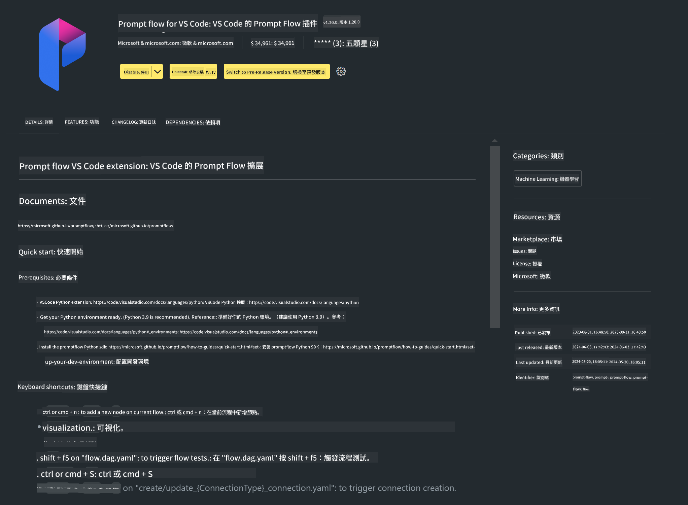

<!--
CO_OP_TRANSLATOR_METADATA:
{
  "original_hash": "e354f9cd277d8c4db97c6cc64730b8f1",
  "translation_date": "2025-04-04T12:50:42+00:00",
  "source_file": "md\\02.Application\\02.Code\\Phi3\\VSCodeExt\\HOL\\AIPC\\01.Installations.md",
  "language_code": "mo"
}
-->
# **Lab 0 - Installation**

Ku lab yɛɛ yɛ yɛn ho sɛ yɛbɛ siesie ɔman no ho:

### **1. Python 3.11+**

Ɛyɛ papa sɛ yɛde miniforge bɛ siesie wo Python ɔman no ho.

Sɛ worehwehwɛ miniforge a, kɔ [https://github.com/conda-forge/miniforge](https://github.com/conda-forge/miniforge).

Sɛ wosiesie miniforge a, yɛhyɛ saa command yi wɔ Power Shell mu:

```bash

conda create -n pyenv python==3.11.8 -y

conda activate pyenv

```

### **2. Install Prompt flow SDK**

Wɔ Lab 1 mu, yɛde Prompt flow bɛyɛ adwuma enti ɛho hia sɛ wo siesie Prompt flow SDK.

```bash

pip install promptflow --upgrade

```

Sɛ wopɛ sɛ wohwɛ promptflow sdk a, fa saa command yi yɛ adwuma:

```bash

pf --version

```

### **3. Install Visual Studio Code Prompt flow Extension**



### **4. Intel NPU Acceleration Library**

Intel foforɔ processors no wɔ NPU ho mfaso. Sɛ wopɛ sɛ wode NPU bɛyɛ adwuma wɔ wo local LLMs / SLMs mu a, yɛde ***Intel NPU Acceleration Library*** bɛyɛ adwuma. Sɛ wopɛ nsɛm foforɔ a, hwɛ [https://github.com/microsoft/PhiCookBook/blob/main/md/01.Introduction/03/AIPC_Inference.md](https://github.com/microsoft/PhiCookBook/blob/main/md/01.Introduction/03/AIPC_Inference.md).

Sɛ wopɛ sɛ wo install Intel NPU Acceleration Library wɔ bash mu a:

```bash

pip install intel-npu-acceleration-library

```

***Note***: Fa nsɛm wɔ ho sɛ library yi yɛ transformers ***4.40.2***, hwɛ sɛ version no yɛ papa.

### **5. Other Python Library**

Yɛ requirements.txt na fa saa nsɛm yi hyɛ mu:

```txt

notebook
numpy 
scipy 
scikit-learn 
matplotlib 
pandas 
pillow 
graphviz

```

### **6. Install NVM**

Install nvm wɔ Powershell mu:

```bash

winget install -e --id CoreyButler.NVMforWindows

```

Install nodejs 18.20:

```bash

nvm install 18.20.0

nvm use 18.20.0

```

### **7. Install Visual Studio Code Development Support**

```bash

npm install --global yo generator-code

```

Mo medaase! Wo siesie SDK no. Afei, kɔso yɛ nsɛm no ho adwuma.

It seems like you are asking for the text to be translated into "mo." Could you clarify what "mo" refers to? Are you referring to a specific language or dialect?