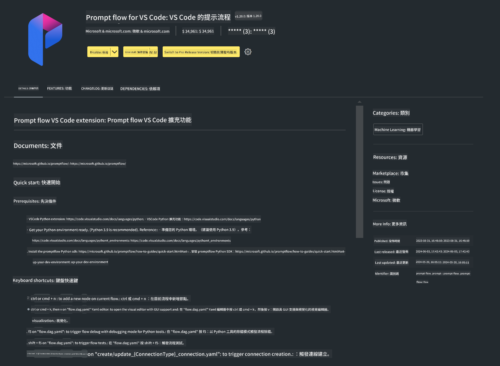

<!--
CO_OP_TRANSLATOR_METADATA:
{
  "original_hash": "a4ef39027902e82f2c33d568d2a2259a",
  "translation_date": "2025-07-17T03:48:28+00:00",
  "source_file": "md/02.Application/02.Code/Phi3/VSCodeExt/HOL/AIPC/01.Installations.md",
  "language_code": "mo"
}
-->
# **實驗室 0 - 安裝**

進入實驗室後，我們需要配置相關環境：

### **1. Python 3.11+**

建議使用 miniforge 來配置你的 Python 環境

關於 miniforge 的配置，請參考 [https://github.com/conda-forge/miniforge](https://github.com/conda-forge/miniforge)

配置好 miniforge 後，在 Power Shell 執行以下指令

```bash

conda create -n pyenv python==3.11.8 -y

conda activate pyenv

```

### **2. 安裝 Prompt flow SDK**

在實驗室 1 中，我們會使用 Prompt flow，因此需要先配置 Prompt flow SDK。

```bash

pip install promptflow --upgrade

```

你可以用以下指令檢查 promptflow sdk

```bash

pf --version

```

### **3. 安裝 Visual Studio Code Prompt flow 擴充功能**



### **4. Intel NPU 加速庫**

Intel 新一代處理器支援 NPU。如果你想使用 NPU 在本地執行 LLMs / SLMs，可以使用 ***Intel NPU 加速庫***。想了解更多，可以參考 [https://github.com/microsoft/PhiCookBook/blob/main/md/01.Introduction/03/AIPC_Inference.md](https://github.com/microsoft/PhiCookBook/blob/main/md/01.Introduction/03/AIPC_Inference.md)。

在 bash 中安裝 Intel NPU 加速庫

```bash

pip install intel-npu-acceleration-library

```

***Note***：請注意此庫支援 transformers ***4.40.2***，請確認版本

### **5. 其他 Python 函式庫**

建立 requirements.txt 並加入以下內容

```txt

notebook
numpy 
scipy 
scikit-learn 
matplotlib 
pandas 
pillow 
graphviz

```

### **6. 安裝 NVM**

在 Powershell 安裝 nvm

```bash

winget install -e --id CoreyButler.NVMforWindows

```

安裝 nodejs 18.20

```bash

nvm install 18.20.0

nvm use 18.20.0

```

### **7. 安裝 Visual Studio Code 開發支援**

```bash

npm install --global yo generator-code

```

恭喜！你已成功配置 SDK，接下來進行實作步驟。

**免責聲明**：  
本文件係使用 AI 翻譯服務 [Co-op Translator](https://github.com/Azure/co-op-translator) 進行翻譯。雖然我們致力於確保準確性，但請注意，自動翻譯可能包含錯誤或不準確之處。原始文件的母語版本應視為權威來源。對於重要資訊，建議採用專業人工翻譯。我們不對因使用本翻譯而產生的任何誤解或誤釋負責。