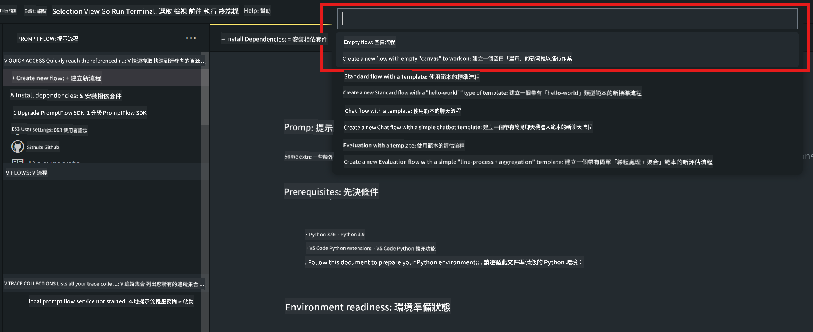
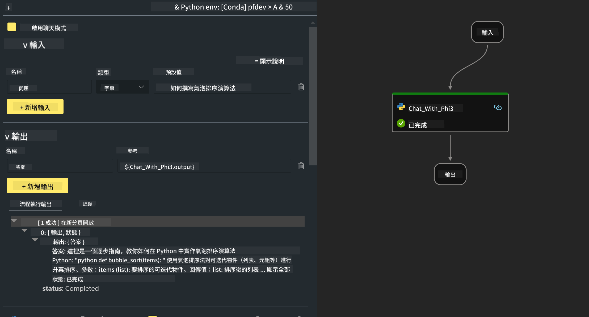

<!--
CO_OP_TRANSLATOR_METADATA:
{
  "original_hash": "bc29f7fe7fc16bed6932733eac8c81b8",
  "translation_date": "2025-05-07T13:50:57+00:00",
  "source_file": "md/02.Application/02.Code/Phi3/VSCodeExt/HOL/AIPC/02.PromptflowWithNPU.md",
  "language_code": "mo"
}
-->
# **Lab 2 -  Run Prompt flow with Phi-3-mini in AIPC**

## **What's Prompt flow**

Prompt flow הוא סט כלים לפיתוח שמטרתו לייעל את מחזור הפיתוח המלא של אפליקציות AI מבוססות LLM, מהרעיון, דרך פרוטוטייפ, בדיקות, הערכה ועד לפריסה ותחזוקה בייצור. הוא מקל על הנדסת הפרומפט ומאפשר לך לבנות אפליקציות LLM באיכות ייצור.

עם prompt flow תוכל:

- ליצור זרימות שמקשרות בין LLMs, פרומפטים, קוד Python וכלים נוספים בזרימת עבודה ניתנת להרצה.

- לבצע איתור שגיאות ואיטרציה בזרימות שלך, במיוחד באינטראקציה עם LLMs, בקלות.

- להעריך את הזרימות שלך, לחשב מדדי איכות וביצועים עם מערכי נתונים גדולים יותר.

- לשלב את הבדיקות וההערכה במערכת ה-CI/CD שלך כדי להבטיח איכות של הזרימה.

- לפרוס את הזרימות לפלטפורמת ההגשה שבחרת או לשלב אותן בקלות בקוד של האפליקציה שלך.

- (אופציונלי אך מומלץ מאוד) לשתף פעולה עם הצוות שלך על ידי שימוש בגרסת הענן של Prompt flow ב-Azure AI.

## **What's AIPC**

מחשב AI PC כולל CPU, GPU ו-NPU, שכל אחד מהם מצויד ביכולות האצה ייחודיות ל-AI. NPU, או יחידת עיבוד עצבית, הוא מאיץ ייעודי שמבצע משימות בינה מלאכותית (AI) ולמידת מכונה (ML) ישירות על המחשב שלך, במקום לשלוח את הנתונים לעיבוד בענן. ה-GPU וה-CPU יכולים גם לעבד משימות אלו, אך ה-NPU מצטיין בחישובי AI בצריכת חשמל נמוכה. מחשב AI PC מייצג שינוי מהותי באופן שבו המחשבים שלנו פועלים. זו לא פתרון לבעיה שלא הייתה קיימת, אלא שיפור משמעותי לשימוש היומיומי במחשב.

אז איך זה עובד? בהשוואה ל-AI גנרטיבי ולמודלים גדולים מאוד (LLMs) המאומנים על כמויות עצומות של נתונים ציבוריים, ה-AI שמופעל על המחשב שלך נגיש יותר ברוב ההיבטים. הרעיון פשוט יותר, ומכיוון שהמודלים מאומנים על הנתונים שלך וללא צורך בגישה לענן, היתרונות נראים מידיים ומושכים קהל רחב יותר.

בטווח הקצר, עולם AI PC כולל עוזרים אישיים ומודלים קטנים יותר שרצים ישירות על המחשב שלך, משתמשים בנתונים שלך כדי להציע שיפורים AI אישיים, פרטיים ובטוחים יותר לפעולות שאתה עושה מדי יום – תיעוד פגישות, ארגון ליגת פנטזי פוטבול, אוטומציה לשיפורים בעריכת תמונות ווידאו, או תכנון מסלול מושלם למפגש משפחתי בהתבסס על זמני ההגעה והעזיבה של כולם.

## **Building generation code flows on AIPC**

***Note*** ：אם עדיין לא השלמת את התקנת הסביבה, אנא בקר ב-[Lab 0 -Installations](./01.Installations.md)

1. פתח את תוסף Prompt flow ב-Visual Studio Code ויצר פרויקט זרימה ריק



2. הוסף פרמטרים של Inputs ו-Outputs והוסף קוד Python כזרימה חדשה



אתה יכול להתבסס על המבנה הזה (flow.dag.yaml) כדי לבנות את הזרימה שלך

```yaml

inputs:
  question:
    type: string
    default: how to write Bubble Algorithm
outputs:
  answer:
    type: string
    reference: ${Chat_With_Phi3.output}
nodes:
- name: Chat_With_Phi3
  type: python
  source:
    type: code
    path: Chat_With_Phi3.py
  inputs:
    question: ${inputs.question}


```

3. הוסף קוד בקובץ ***Chat_With_Phi3.py***

```python


from promptflow.core import tool

# import torch
from transformers import AutoTokenizer, pipeline,TextStreamer
import intel_npu_acceleration_library as npu_lib

import warnings

import asyncio
import platform

class Phi3CodeAgent:
    
    model = None
    tokenizer = None
    text_streamer = None
    
    model_id = "microsoft/Phi-3-mini-4k-instruct"

    @staticmethod
    def init_phi3():
        
        if Phi3CodeAgent.model is None or Phi3CodeAgent.tokenizer is None or Phi3CodeAgent.text_streamer is None:
            Phi3CodeAgent.model = npu_lib.NPUModelForCausalLM.from_pretrained(
                                    Phi3CodeAgent.model_id,
                                    torch_dtype="auto",
                                    dtype=npu_lib.int4,
                                    trust_remote_code=True
                                )
            Phi3CodeAgent.tokenizer = AutoTokenizer.from_pretrained(Phi3CodeAgent.model_id)
            Phi3CodeAgent.text_streamer = TextStreamer(Phi3CodeAgent.tokenizer, skip_prompt=True)

    

    @staticmethod
    def chat_with_phi3(prompt):
        
        Phi3CodeAgent.init_phi3()

        messages = "<|system|>You are a AI Python coding assistant. Please help me to generate code in Python.The answer only genertated Python code, but any comments and instructions do not need to be generated<|end|><|user|>" + prompt +"<|end|><|assistant|>"


        generation_args = {
            "max_new_tokens": 1024,
            "return_full_text": False,
            "temperature": 0.3,
            "do_sample": False,
            "streamer": Phi3CodeAgent.text_streamer,
        }

        pipe = pipeline(
            "text-generation",
            model=Phi3CodeAgent.model,
            tokenizer=Phi3CodeAgent.tokenizer,
            # **generation_args
        )

        result = ''

        with warnings.catch_warnings():
            warnings.simplefilter("ignore")
            response = pipe(messages, **generation_args)
            result =response[0]['generated_text']
            return result


@tool
def my_python_tool(question: str) -> str:
    if platform.system() == 'Windows':
        asyncio.set_event_loop_policy(asyncio.WindowsSelectorEventLoopPolicy())
    return Phi3CodeAgent.chat_with_phi3(question)


```

4. תוכל לבדוק את הזרימה דרך Debug או Run כדי לוודא שהקוד גנרציה פועל כשורה


5. הרץ את הזרימה כ-API לפיתוח בטרמינל

```

pf flow serve --source ./ --port 8080 --host localhost   

```

ניתן לבדוק זאת ב-Postman / Thunder Client

### **Note**

1. ההרצה הראשונה אורכת זמן רב. מומלץ להוריד את מודל phi-3 דרך Hugging face CLI.

2. בהתחשב במגבלות כוח המחשוב של Intel NPU, מומלץ להשתמש ב-Phi-3-mini-4k-instruct

3. אנו משתמשים בהאצת Intel NPU לקוונטיזציה להמרת INT4, אך אם תריץ מחדש את השירות, עליך למחוק את תיקיות cache ו-nc_workshop.

## **Resources**

1. ללמוד על Promptflow [https://microsoft.github.io/promptflow/](https://microsoft.github.io/promptflow/)

2. ללמוד על האצת Intel NPU [https://github.com/intel/intel-npu-acceleration-library](https://github.com/intel/intel-npu-acceleration-library)

3. קוד לדוגמה, הורדה [Local NPU Agent Sample Code](../../../../../../../../../code/07.Lab/01/AIPC)

**Disclaimer**:  
Dis dokumento ha bin tradusí uzando AI traduk servis [Co-op Translator](https://github.com/Azure/co-op-translator). Anke nus strebas por akurateco, por favor konsidera ke automatizita tradukoj povus enhavi eraroj aŭ neprecizecoj. La originala dokumento en ĝia denaska lingvo devas esti konsiderata la aŭtoritata fonto. Por kritikaj informoj, profesia homa traduko estas rekomendata. Ni ne respondas pro ajnaj miskomprenoj aŭ miskomprenoj rezultantaj el la uzo de ĉi tiu traduko.