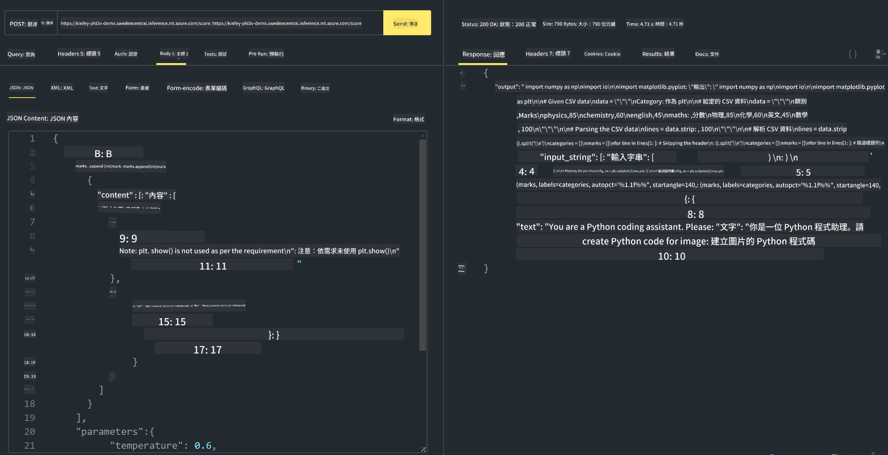

<!--
CO_OP_TRANSLATOR_METADATA:
{
  "original_hash": "20cb4e6ac1686248e8be913ccf6c2bc2",
  "translation_date": "2025-05-07T13:52:46+00:00",
  "source_file": "md/02.Application/02.Code/Phi3/VSCodeExt/HOL/AIPC/03.DeployPhi3VisionOnAzure.md",
  "language_code": "mo"
}
-->
# **Lab 3 - Déploiement de Phi-3-vision sur Azure Machine Learning Service**

Nous utilisons le NPU pour réaliser le déploiement en production du code local, puis nous souhaitons intégrer la capacité d’introduire PHI-3-VISION afin de générer du code à partir d’images.

Dans cette introduction, nous pouvons rapidement créer un service Model As Service Phi-3 Vision dans Azure Machine Learning Service.

***Note*** : Phi-3 Vision nécessite une puissance de calcul importante pour générer du contenu plus rapidement. Nous avons besoin de la puissance de calcul cloud pour nous aider à y parvenir.

### **1. Créer un Azure Machine Learning Service**

Nous devons créer un Azure Machine Learning Service dans le portail Azure. Si vous souhaitez apprendre comment faire, veuillez consulter ce lien [https://learn.microsoft.com/azure/machine-learning/quickstart-create-resources?view=azureml-api-2](https://learn.microsoft.com/azure/machine-learning/quickstart-create-resources?view=azureml-api-2)

### **2. Choisir Phi-3 Vision dans Azure Machine Learning Service**


### **3. Déployer Phi-3-Vision sur Azure**


### **4. Tester le point de terminaison dans Postman**



***Note***

1. Les paramètres à transmettre doivent inclure Authorization, azureml-model-deployment et Content-Type. Vous devez vérifier les informations de déploiement pour les obtenir.

2. Pour transmettre les paramètres, Phi-3-Vision nécessite l’envoi d’un lien d’image. Veuillez vous référer à la méthode GPT-4-Vision pour transmettre les paramètres, par exemple

```json

{
  "input_data":{
    "input_string":[
      {
        "role":"user",
        "content":[ 
          {
            "type": "text",
            "text": "You are a Python coding assistant.Please create Python code for image "
          },
          {
              "type": "image_url",
              "image_url": {
                "url": "https://ajaytech.co/wp-content/uploads/2019/09/index.png"
              }
          }
        ]
      }
    ],
    "parameters":{
          "temperature": 0.6,
          "top_p": 0.9,
          "do_sample": false,
          "max_new_tokens": 2048
    }
  }
}

```

3. Appelez **/score** en utilisant la méthode Post

**Félicitations** ! Vous avez terminé le déploiement rapide de PHI-3-VISION et testé comment générer du code à partir d’images. Ensuite, nous pourrons créer des applications en combinant les NPU et le cloud.

**Disclaimer**:  
Thiz documént haz been translaited uzing AI translaition serviz [Co-op Translator](https://github.com/Azure/co-op-translator). Whil we stryv for akurasy, pleez be awar that otomated translaitions may contain errerz or inakuratiz. The orijinal documént in its nativ langwage shud be konsiderd the authoritativ sourz. For kritikal informáshun, profeshunal hyuman translaition is rekomended. We ar not layble for eni misundarstandings or misinterpretáshuns arising from the uz of this translaition.