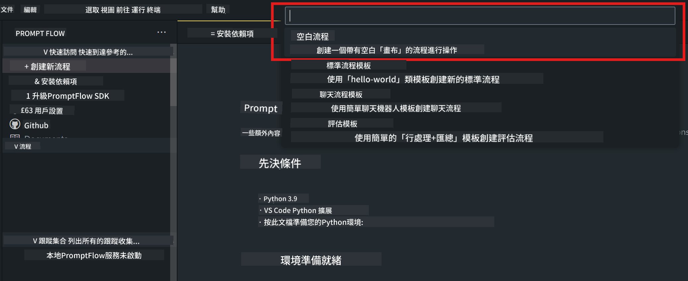
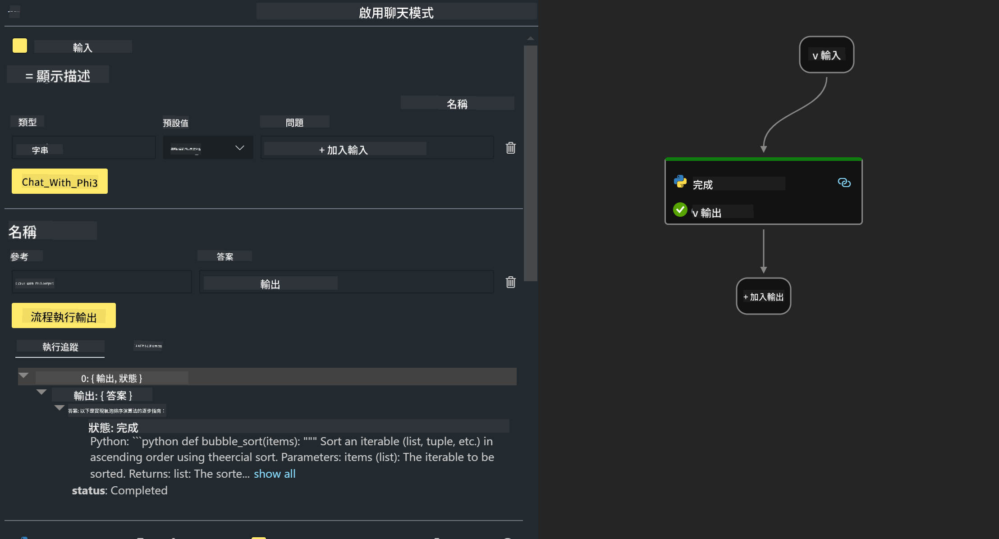

<!--
CO_OP_TRANSLATOR_METADATA:
{
  "original_hash": "830eb246b6fa04f22004b271f3294cfc",
  "translation_date": "2025-04-04T12:55:51+00:00",
  "source_file": "md\\02.Application\\02.Code\\Phi3\\VSCodeExt\\HOL\\Apple\\02.PromptflowWithMLX.md",
  "language_code": "mo"
}
-->
# **Lab 2 - Run Prompt flow with Phi-3-mini in AIPC**

## **What's Prompt flow**

Prompt flow is a set of tools designed to simplify the entire development process of AI applications based on large language models, from brainstorming, prototyping, testing, and evaluation to deployment and monitoring in production. It makes prompt engineering more accessible and helps you build high-quality applications using LLMs.

With prompt flow, you can:

- Create workflows that connect LLMs, prompts, Python code, and other tools in an executable process.

- Debug and refine your workflows, particularly interactions with LLMs, with ease.

- Evaluate your workflows and measure quality and performance metrics using larger datasets.

- Integrate testing and evaluation into your CI/CD system to maintain the quality of your workflows.

- Deploy your workflows to your preferred serving platform or seamlessly integrate them into your application's codebase.

- (Optional but highly recommended) Collaborate with your team using the cloud version of Prompt flow available in Azure AI.


## **Building generation code flows on Apple Silicon**

***Note***: If you haven’t set up the environment yet, please visit [Lab 0 - Installations](./01.Installations.md).

1. Open the Prompt flow Extension in Visual Studio Code and create an empty flow project.



2. Add Input and Output parameters and include Python Code as a new flow.



You can use this structure (flow.dag.yaml) as a reference to build your flow:

```yaml

inputs:
  prompt:
    type: string
    default: Write python code for Fibonacci serie. Please use markdown as output
outputs:
  result:
    type: string
    reference: ${gen_code_by_phi3.output}
nodes:
- name: gen_code_by_phi3
  type: python
  source:
    type: code
    path: gen_code_by_phi3.py
  inputs:
    prompt: ${inputs.prompt}


```

3. Quantify phi-3-mini.

To optimize the performance of SLM on local devices, we typically quantize the model (INT4, FP16, FP32).

```bash

python -m mlx_lm.convert --hf-path microsoft/Phi-3-mini-4k-instruct

```

**Note:** The default folder is mlx_model.

4. Add the code in ***Chat_With_Phi3.py***.

```python


from promptflow import tool

from mlx_lm import load, generate


# The inputs section will change based on the arguments of the tool function, after you save the code
# Adding type to arguments and return value will help the system show the types properly
# Please update the function name/signature per need
@tool
def my_python_tool(prompt: str) -> str:

    model_id = './mlx_model_phi3_mini'

    model, tokenizer = load(model_id)

    # <|user|>\nWrite python code for Fibonacci serie. Please use markdown as output<|end|>\n<|assistant|>

    response = generate(model, tokenizer, prompt="<|user|>\n" + prompt  + "<|end|>\n<|assistant|>", max_tokens=2048, verbose=True)

    return response


```

4. Test the flow using Debug or Run to verify whether the generated code works as expected.


5. Execute the flow as a development API in the terminal.

```

pf flow serve --source ./ --port 8080 --host localhost   

```

You can test the API using Postman or Thunder Client.


### **Note**

1. The initial run may take a significant amount of time. It’s recommended to download the phi-3 model using the Hugging Face CLI.

2. Given the limited computational capacity of Intel NPU, it’s advisable to use Phi-3-mini-4k-instruct.

3. We use Intel NPU Acceleration to perform INT4 quantization. However, if you restart the service, make sure to clear the cache and delete the nc_workshop folders.


## **Resources**

1. Learn Promptflow [https://microsoft.github.io/promptflow/](https://microsoft.github.io/promptflow/)

2. Learn Intel NPU Acceleration [https://github.com/intel/intel-npu-acceleration-library](https://github.com/intel/intel-npu-acceleration-library)

3. Sample Code, download [Local NPU Agent Sample Code](../../../../../../../../../code/07.Lab/01/AIPC/local-npu-agent)

It seems you are asking for a translation to "mo," but could you clarify what "mo" refers to? Are you asking for a translation into Maori, Mongolian, or another language? Please provide more context so I can assist you accurately!