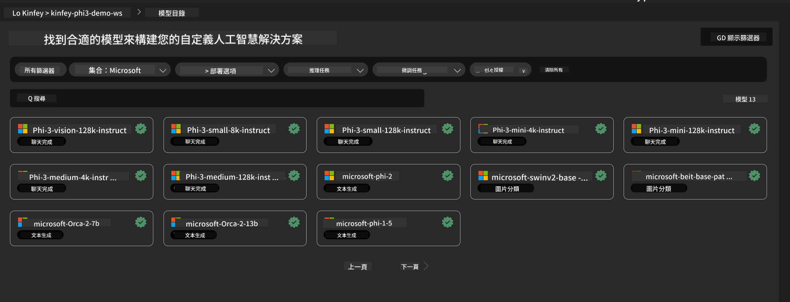
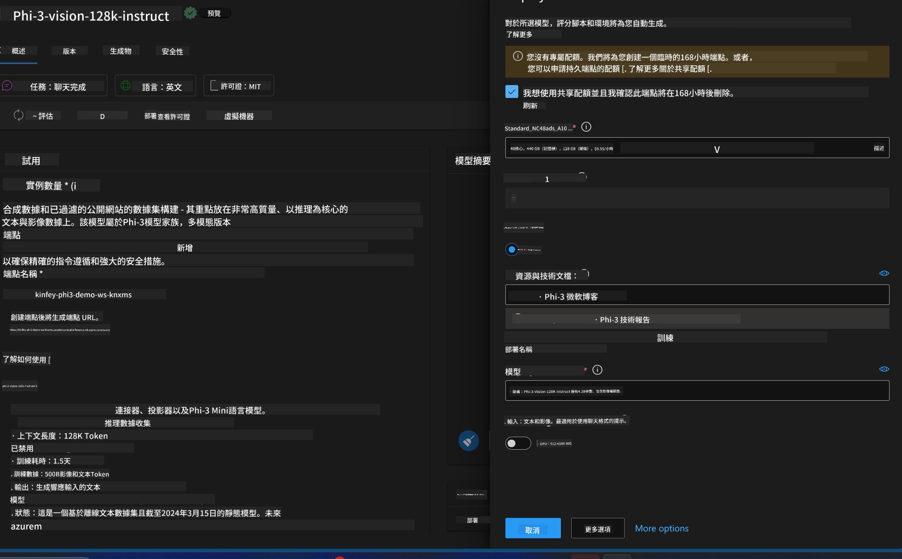
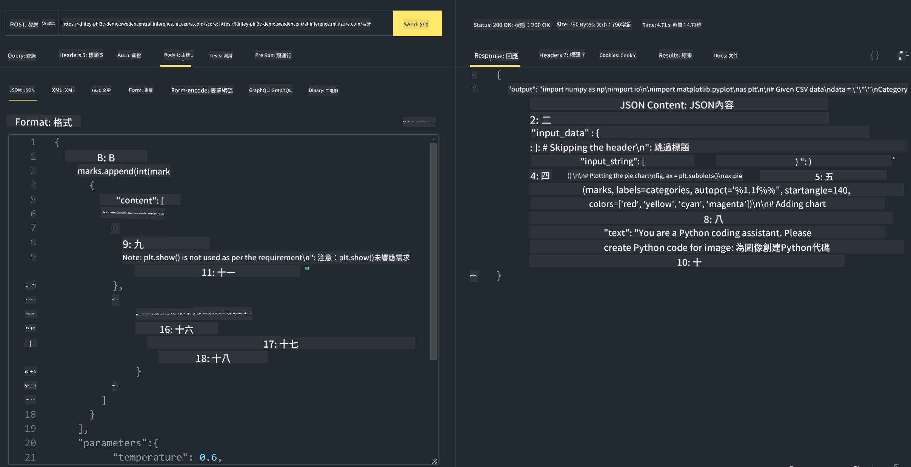

<!--
CO_OP_TRANSLATOR_METADATA:
{
  "original_hash": "594a3b553655c2ebbc0efdeb0b5040c9",
  "translation_date": "2025-04-04T12:56:51+00:00",
  "source_file": "md\\02.Application\\02.Code\\Phi3\\VSCodeExt\\HOL\\Apple\\03.DeployPhi3VisionOnAzure.md",
  "language_code": "mo"
}
-->
# **Lab 3 - Phi-3-vision-ийг Azure Machine Learning Service дээр байрлуулах**

Бид NPU ашиглан орон нутгийн кодыг үйлдвэрлэлийн түвшинд байрлуулж дуусгах бөгөөд дараа нь PHI-3-VISION-ийг ашиглан зурагнаас код үүсгэх чадварыг нэмэхийг хүсч байна.

Энэхүү зааварчилгаагаар бид Azure Machine Learning Service дээр Model As Service байдлаар Phi-3 Vision үйлчилгээг хурдан хугацаанд бүтээх боломжтой.

***Note***： Phi-3 Vision нь контентыг илүү хурдан үүсгэхийн тулд тооцоолох хүчин чадал шаарддаг. Үүнийг хэрэгжүүлэхэд бидэнд үүлэн тооцоолол туслах болно.

### **1. Azure Machine Learning Service үүсгэх**

Бидэнд Azure Portal дээр Azure Machine Learning Service үүсгэх шаардлагатай. Хэрэв хэрхэн үүсгэхийг мэдэхийг хүсвэл дараах холбоосоор зочлоорой: [https://learn.microsoft.com/azure/machine-learning/quickstart-create-resources?view=azureml-api-2](https://learn.microsoft.com/azure/machine-learning/quickstart-create-resources?view=azureml-api-2)

### **2. Azure Machine Learning Service дээр Phi-3 Vision-ийг сонгох**



### **3. Phi-3-Vision-ийг Azure дээр байрлуулах**



### **4. Postman ашиглан Endpoint-ийг турших**



***Note***

1. Илгээх параметрт Authorization, azureml-model-deployment, болон Content-Type заавал багтах ёстой. Та байршуулалтын мэдээллийг шалгаж эдгээрийг авах шаардлагатай.

2. Параметр дамжуулахын тулд Phi-3-Vision нь зурагны холбоос дамжуулах ёстой. Параметр дамжуулахын тулд GPT-4-Vision аргачлалыг ашиглана уу, жишээ нь:

```json

{
  "input_data":{
    "input_string":[
      {
        "role":"user",
        "content":[ 
          {
            "type": "text",
            "text": "You are a Python coding assistant.Please create Python code for image "
          },
          {
              "type": "image_url",
              "image_url": {
                "url": "https://ajaytech.co/wp-content/uploads/2019/09/index.png"
              }
          }
        ]
      }
    ],
    "parameters":{
          "temperature": 0.6,
          "top_p": 0.9,
          "do_sample": false,
          "max_new_tokens": 2048
    }
  }
}

```

3. Post аргыг ашиглан **/score** руу дуудлага хийх

**Баяр хүргэе**！Та PHI-3-VISION-ийг хурдан хугацаанд байршуулж, зурагнаас код үүсгэхийг хэрхэн ашиглахыг туршиж үзлээ. Одоо бид NPU болон үүлэн тооцооллыг хослуулан програм бүтээх боломжтой.

It seems like you are asking for a translation into "mo," but could you clarify what "mo" refers to? Are you referring to a specific language or dialect? For example, "Mo" might refer to Māori, Montenegrin, or something else. Please provide more context so I can assist you accurately!