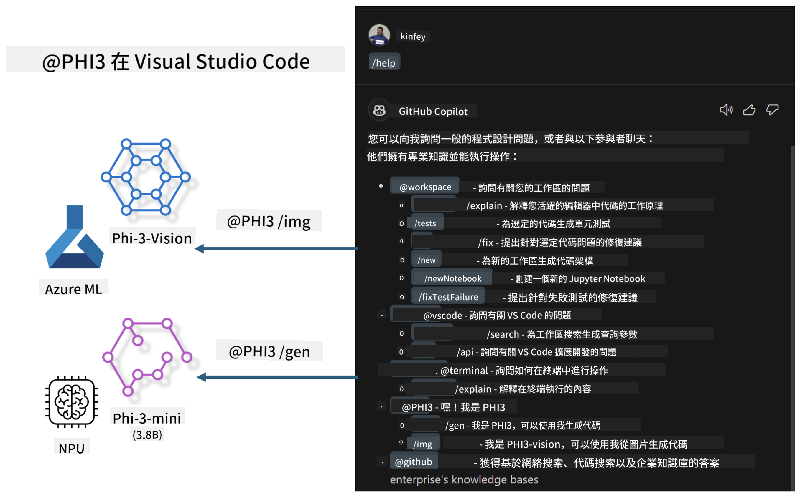

<!--
CO_OP_TRANSLATOR_METADATA:
{
  "original_hash": "7302d85639441c7cedbae09795e6b9a6",
  "translation_date": "2025-04-04T12:49:12+00:00",
  "source_file": "md\\02.Application\\02.Code\\Phi3\\VSCodeExt\\README.md",
  "language_code": "mo"
}
-->
# **Bɔ wɔ hɔn Visual Studio Code GitHub Copilot Chat wɔ Microsoft Phi-3 Family**

Woabɔ workspace agent wɔ GitHub Copilot Chat ho anaa? Ɛyɛ wo sɛ wobɔ wo ho team's code agent? Saa nsɛm yi yɛ nsɛm a wɔyɛ no nsa ho adwuma de boa wo sɛ wobɛyɛ enterprise-level code business agent wɔ open source model so.

## **Fapem**

### **Adɛn nti na yɛpaw Microsoft Phi-3**

Phi-3 yɛ series bi a ɛwɔ phi-3-mini, phi-3-small, ne phi-3-medium a wɔde training parameters a ɛho hia yɛ text generation, dialogue completion, ne code generation. Ɛwɔ phi-3-vision nso a ɛyɛ Vision-based. Phi-3 yɛ papa pa ma adwumakuo ne team a ɛyɛ foforɔ a wɔpɛ offline generative AI solutions.

Ɛyɛ papa sɛ wo kenkan link yi [https://github.com/microsoft/PhiCookBook/blob/main/md/01.Introduction/01/01.PhiFamily.md](https://github.com/microsoft/PhiCookBook/blob/main/md/01.Introduction/01/01.PhiFamily.md)

### **Microsoft GitHub Copilot Chat**

GitHub Copilot Chat extension ma wo chat interface a ɛboa wo sɛ wubisa nsɛm a ɛfa coding ho na woanya mmuae wɔ VS Code mu, na wo nni ho hia sɛ wobɛkɔ documentation anaa online forums ho hwehwɛ.

Copilot Chat betumi de syntax highlighting, indentation, ne formatting a ɛboa ma mmuae no ho tew mu. Ɛbɛyɛ sɛ nsɛm a ɛfiri user no yɛ no, mmuae no betumi aba sɛ links a ɛfa context ho a Copilot de yɛɛ nsɛm ho na ɛma mmuae no, sɛ source code files anaa documentation, anaa buttons a ɛma wo yɛ VS Code functionalities.

- Copilot Chat yɛ adwuma wɔ developer flow mu na ɛboa wo wɔ baabi a ɛho hia wo:

- Firi editor anaa terminal mu na yɛ inline chat sɛ wobɛnya mmoa wɔ coding ho

- Fa Chat view yɛ adwuma sɛ AI assistant wɔ wo nkyɛn de boa wo bere biara a ɛyɛ hia

- Fa Quick Chat yɛ nsɛm a ɛyɛ ntɛm na san kɔ nea woreyɛ no ho

Wo betumi de GitHub Copilot Chat yɛ nsɛm ahorow, sɛ:

- Mmuae a ɛfa coding nsɛm ho na ɛboa ma yɛ adwuma no yiye

- Nsɛm a ɛkyerɛ obi code na ɛyɛ nsɛmfua foforɔ a ɛboa

- Nsɛm a ɛboa ma yɛ code fixes

- Unit test cases a wɔyɛɛ ho nsɛm

- Nsɛm a ɛfa code documentation ho

Ɛyɛ papa sɛ wo kenkan link yi [https://code.visualstudio.com/docs/copilot/copilot-chat](https://code.visualstudio.com/docs/copilot/copilot-chat?WT.mc_id=aiml-137032-kinfeylo)

### **Microsoft GitHub Copilot Chat @workspace**

Sɛ yɛde **@workspace** yɛ nsɛm wɔ Copilot Chat mu a, ɛboa wo sɛ wubisa nsɛm a ɛfa wo codebase nyinaa ho. Sɛ yɛyɛ nsɛm no a, Copilot hwehwɛ files ne symbols a ɛho hia na ɛde yɛɛ nsɛm ho sɛ links ne code examples.

**@workspace** de nsɛm hwehwɛ sɛ nea developer bɛyɛ sɛ ɔrehwehwɛ codebase wɔ VS Code mu:

- Files nyinaa a ɛwɔ workspace mu, gye sɛ files a wɔyɛɛ ignore wɔ .gitignore file mu

- Directory structure a ɛwɔ nested folder ne file names

- GitHub code search index, sɛ workspace no yɛ GitHub repository a wɔde code search yɛɛ indexed

- Symbols ne definitions a ɛwɔ workspace mu

- Text a wɔyɛ highlighted anaa visible text wɔ active editor mu

Note: Sɛ wo file yɛ open anaa wo de text yɛ selected wɔ file a wɔ ignore no mu a, .gitignore no nni hia.

Ɛyɛ papa sɛ wo kenkan link yi [[https://code.visualstudio.com/docs/copilot/copilot-chat](https://code.visualstudio.com/docs/copilot/workspace-context?WT.mc_id=aiml-137032-kinfeylo)]

## **Fa ho nimdeɛ wɔ saa Lab yi ho**

GitHub Copilot aboa enterprises programming efficiency paa, na enterprises pɛ sɛ wɔyɛ customization wɔ GitHub Copilot ho. Adwumakuo bebree yɛ Extensions a ɛyɛ GitHub Copilot ho sɛnea ɛbɛyɛ a ɛbɛyɛ papa wɔ wɔn business scenarios ne open source models ho. Ɛyɛ papa sɛ enterprises yɛ customized Extensions na ɛyɛ controllable, nanso ɛsɛ sɛ yɛka sɛ eyi betumi ma user experience no yɛ ahodoɔ. Ɛno nti, sɛ yɛde consistent experience ne customized functions bɔ mu a, ɛyɛ papa wɔ user experience ho. GitHub Copilot Chat de APIs a ɛboa enterprises ma wɔyɛ nsɛm wɔ Chat experience ho. Sɛ consistent experience ne customized functions yɛ bɔ mu a, ɛyɛ papa paa.

Saa lab yi yɛ Phi-3 model a wɔde local NPU ne Azure hybrid bɔ mu de yɛ customized Agent wɔ GitHub Copilot Chat ***@PHI3*** a ɛboa enterprise developers ma wɔyɛ code generation ***(@PHI3 /gen)*** ne code generation a ɛfiri images ***(@PHI3 /img)***.

### ***Note:*** 

Saa lab yi yɛ AIPC wɔ Intel CPU ne Apple Silicon. Yɛbɛtoaa Qualcomm version of NPU ho nsɛm.

## **Lab**

| Name | Description | AIPC | Apple |
| ------------ | ----------- | -------- |-------- |
| Lab0 - Installations(✅) | Configure ne install environments ne tools a ɛho hia | [Go](./HOL/AIPC/01.Installations.md) |[Go](./HOL/Apple/01.Installations.md) |
| Lab1 - Run Prompt flow with Phi-3-mini (✅) | Firi AIPC / Apple Silicon, de local NPU yɛ code generation wɔ Phi-3-mini ho | [Go](./HOL/AIPC/02.PromptflowWithNPU.md) |  [Go](./HOL/Apple/02.PromptflowWithMLX.md) |
| Lab2 - Deploy Phi-3-vision on Azure Machine Learning Service(✅) | Yɛ code generation wɔ Azure Machine Learning Service's Model Catalog - Phi-3-vision image ho | [Go](./HOL/AIPC/03.DeployPhi3VisionOnAzure.md) |[Go](./HOL/Apple/03.DeployPhi3VisionOnAzure.md) |
| Lab3 - Create a @phi-3 agent in GitHub Copilot Chat(✅)  | Yɛ customized Phi-3 agent wɔ GitHub Copilot Chat de yɛ code generation, graph generation code, RAG, etc. | [Go](./HOL/AIPC/04.CreatePhi3AgentInVSCode.md) | [Go](./HOL/Apple/04.CreatePhi3AgentInVSCode.md) |
| Sample Code (✅)  | Download sample code | [Go](../../../../../../../code/07.Lab/01/AIPC) | [Go](../../../../../../../code/07.Lab/01/Apple) |

## **Resources**

1. Phi-3 Cookbook [https://github.com/microsoft/Phi-3CookBook](https://github.com/microsoft/Phi-3CookBook)

2. Fa ho nimdeɛ wɔ GitHub Copilot ho [https://learn.microsoft.com/training/paths/copilot/](https://learn.microsoft.com/training/paths/copilot/?WT.mc_id=aiml-137032-kinfeylo)

3. Fa ho nimdeɛ wɔ GitHub Copilot Chat ho [https://learn.microsoft.com/training/paths/accelerate-app-development-using-github-copilot/](https://learn.microsoft.com/training/paths/accelerate-app-development-using-github-copilot/?WT.mc_id=aiml-137032-kinfeylo)

4. Fa ho nimdeɛ wɔ GitHub Copilot Chat API ho [https://code.visualstudio.com/api/extension-guides/chat](https://code.visualstudio.com/api/extension-guides/chat?WT.mc_id=aiml-137032-kinfeylo)

5. Fa ho nimdeɛ wɔ Azure AI Foundry ho [https://learn.microsoft.com/training/paths/create-custom-copilots-ai-studio/](https://learn.microsoft.com/training/paths/create-custom-copilots-ai-studio/?WT.mc_id=aiml-137032-kinfeylo)

6. Fa ho nimdeɛ wɔ Azure AI Foundry's Model Catalog ho [https://learn.microsoft.com/azure/ai-studio/how-to/model-catalog-overview](https://learn.microsoft.com/azure/ai-studio/how-to/model-catalog-overview)

It seems you are requesting a translation to "mo." Could you clarify what language or dialect "mo" refers to? This will help ensure the translation is accurate and appropriate.