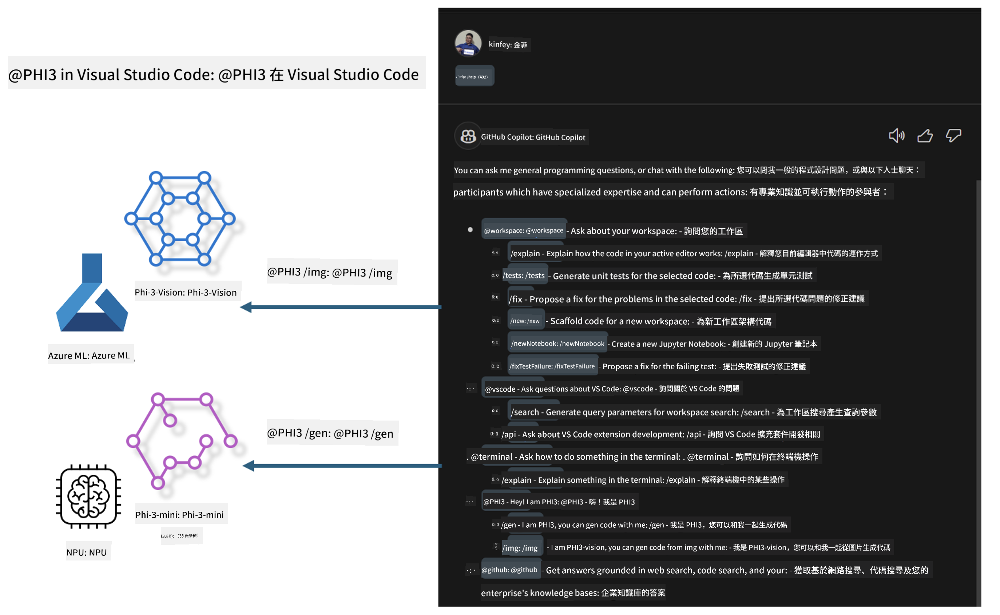

<!--
CO_OP_TRANSLATOR_METADATA:
{
  "original_hash": "00b7a699de8ac405fa821f4c0f7fc0ab",
  "translation_date": "2025-05-07T13:48:50+00:00",
  "source_file": "md/02.Application/02.Code/Phi3/VSCodeExt/README.md",
  "language_code": "mo"
}
-->
# **अपने खुद के Visual Studio Code GitHub Copilot Chat को Microsoft Phi-3 परिवार के साथ बनाएं**

क्या आपने GitHub Copilot Chat में workspace एजेंट का उपयोग किया है? क्या आप अपनी टीम का कोड एजेंट बनाना चाहते हैं? यह हैंड्स-ऑन लैब ओपन सोर्स मॉडल को मिलाकर एक एंटरप्राइज-स्तरीय कोड बिजनेस एजेंट बनाने की कोशिश करता है।

## **बुनियाद**

### **Microsoft Phi-3 क्यों चुनें**

Phi-3 एक परिवार श्रृंखला है, जिसमें phi-3-mini, phi-3-small, और phi-3-medium शामिल हैं, जो टेक्स्ट जनरेशन, संवाद पूर्णता, और कोड जनरेशन के लिए विभिन्न प्रशिक्षण पैरामीटर पर आधारित हैं। इसके अलावा phi-3-vision भी है, जो विजन पर आधारित है। यह एंटरप्राइज या विभिन्न टीमों के लिए ऑफलाइन जनरेटिव AI समाधान बनाने के लिए उपयुक्त है।

इस लिंक को पढ़ने की सलाह दी जाती है [https://github.com/microsoft/PhiCookBook/blob/main/md/01.Introduction/01/01.PhiFamily.md](https://github.com/microsoft/PhiCookBook/blob/main/md/01.Introduction/01/01.PhiFamily.md)

### **Microsoft GitHub Copilot Chat**

GitHub Copilot Chat एक्सटेंशन आपको एक चैट इंटरफ़ेस देता है, जिससे आप GitHub Copilot के साथ बातचीत कर सकते हैं और सीधे VS Code के अंदर कोडिंग से संबंधित सवालों के जवाब पा सकते हैं, बिना डॉक्यूमेंटेशन ब्राउज़ किए या ऑनलाइन फोरम खोजे।

Copilot Chat सिंटैक्स हाइलाइटिंग, इंडेंटेशन, और अन्य फॉर्मेटिंग फीचर्स का उपयोग कर सकता है ताकि जनरेट किए गए जवाब को स्पष्ट बनाया जा सके। उपयोगकर्ता के प्रश्न के प्रकार के आधार पर, परिणाम में उन संदर्भों के लिंक हो सकते हैं जिनका Copilot ने जवाब बनाने में उपयोग किया है, जैसे स्रोत कोड फाइलें या डॉक्यूमेंटेशन, या VS Code की कार्यक्षमता तक पहुंचने के लिए बटन।

- Copilot Chat आपके डेवलपर फ्लो में एकीकृत होता है और जहां जरूरत हो मदद देता है:

- एडिटर या टर्मिनल से सीधे इनलाइन चैट शुरू करें ताकि कोडिंग के दौरान मदद मिल सके

- चैट व्यू का उपयोग करें ताकि आपके पास किसी भी समय AI असिस्टेंट मौजूद रहे

- क्विक चैट लॉन्च करें ताकि एक त्वरित सवाल पूछकर फिर से अपने काम में लग जाएं

आप GitHub Copilot Chat को विभिन्न परिदृश्यों में उपयोग कर सकते हैं, जैसे:

- किसी समस्या को सबसे अच्छा कैसे हल करें, इस पर कोडिंग सवालों के जवाब देना

- किसी और के कोड को समझाना और सुधार सुझाना

- कोड फिक्स प्रस्तावित करना

- यूनिट टेस्ट केस जनरेट करना

- कोड डॉक्यूमेंटेशन जनरेट करना

इस लिंक को पढ़ने की सलाह दी जाती है [https://code.visualstudio.com/docs/copilot/copilot-chat](https://code.visualstudio.com/docs/copilot/copilot-chat?WT.mc_id=aiml-137032-kinfeylo)

###  **Microsoft GitHub Copilot Chat @workspace**

Copilot Chat में **@workspace** का संदर्भ देने से आप अपने पूरे कोडबेस के बारे में सवाल पूछ सकते हैं। प्रश्न के आधार पर, Copilot बुद्धिमानी से प्रासंगिक फाइलें और प्रतीकों को खोजता है, जिन्हें वह अपने जवाब में लिंक और कोड उदाहरण के रूप में संदर्भित करता है।

आपके सवाल का जवाब देने के लिए, **@workspace** उन स्रोतों को खोजता है जिनका उपयोग एक डेवलपर VS Code में कोडबेस नेविगेट करते समय करता है:

- वर्कस्पेस की सभी फाइलें, सिवाय उन फाइलों के जिन्हें .gitignore द्वारा नजरअंदाज किया गया हो

- डायरेक्टरी संरचना जिसमें नेस्टेड फोल्डर और फाइल नाम शामिल हैं

- GitHub का कोड सर्च इंडेक्स, यदि वर्कस्पेस GitHub रिपॉजिटरी है और कोड सर्च द्वारा इंडेक्स किया गया है

- वर्कस्पेस में प्रतीक और परिभाषाएं

- सक्रिय एडिटर में वर्तमान में चयनित या दिखाई दे रहे टेक्स्ट

ध्यान दें: यदि आप एक नजरअंदाज की गई फाइल खोलते हैं या उसमें टेक्स्ट चुनते हैं, तो .gitignore को बायपास किया जाता है।

इस लिंक को पढ़ने की सलाह दी जाती है [[https://code.visualstudio.com/docs/copilot/copilot-chat](https://code.visualstudio.com/docs/copilot/workspace-context?WT.mc_id=aiml-137032-kinfeylo)]

## **इस लैब के बारे में अधिक जानें**

GitHub Copilot ने एंटरप्राइज की प्रोग्रामिंग दक्षता में काफी सुधार किया है, और हर एंटरप्राइज GitHub Copilot की संबंधित क्षमताओं को कस्टमाइज़ करना चाहता है। कई एंटरप्राइज ने अपने व्यवसायिक परिदृश्यों और ओपन सोर्स मॉडल के आधार पर GitHub Copilot जैसे कस्टम एक्सटेंशन बनाए हैं। एंटरप्राइज के लिए, कस्टम एक्सटेंशन नियंत्रण में आसान होते हैं, लेकिन इससे उपयोगकर्ता अनुभव प्रभावित हो सकता है। आखिरकार, GitHub Copilot सामान्य परिदृश्यों और पेशेवरता से निपटने में अधिक सक्षम है। यदि अनुभव सुसंगत रखा जा सके, तो अपनी खुद की कस्टम एक्सटेंशन बनाना बेहतर होगा। GitHub Copilot Chat एंटरप्राइज को चैट अनुभव में विस्तार करने के लिए संबंधित API प्रदान करता है। सुसंगत अनुभव बनाए रखना और कस्टम क्षमताएं रखना बेहतर उपयोगकर्ता अनुभव है।

यह लैब मुख्य रूप से Phi-3 मॉडल का उपयोग स्थानीय NPU और Azure हाइब्रिड के साथ मिलाकर GitHub Copilot Chat में एक कस्टम एजेंट ***@PHI3*** बनाने पर केंद्रित है, जो एंटरप्राइज डेवलपर्स को कोड जनरेशन ***(@PHI3 /gen)*** और इमेज आधारित कोड जनरेशन ***(@PHI3 /img)*** में मदद करता है।

### ***Note:*** 

यह लैब वर्तमान में Intel CPU और Apple Silicon के AIPC में लागू है। हम Qualcomm संस्करण के NPU को अपडेट करते रहेंगे।

## **लैब**

| नाम | विवरण | AIPC | Apple |
| ------------ | ----------- | -------- |-------- |
| Lab0 - Installations(✅) | संबंधित वातावरण और इंस्टॉलेशन टूल्स को कॉन्फ़िगर और इंस्टॉल करें | [Go](./HOL/AIPC/01.Installations.md) |[Go](./HOL/Apple/01.Installations.md) |
| Lab1 - Run Prompt flow with Phi-3-mini (✅) | AIPC / Apple Silicon के साथ मिलकर, स्थानीय NPU का उपयोग करते हुए Phi-3-mini के माध्यम से कोड जनरेशन बनाएं | [Go](./HOL/AIPC/02.PromptflowWithNPU.md) |  [Go](./HOL/Apple/02.PromptflowWithMLX.md) |
| Lab2 - Deploy Phi-3-vision on Azure Machine Learning Service(✅) | Azure Machine Learning Service के Model Catalog - Phi-3-vision इमेज को डिप्लॉय करके कोड जनरेट करें | [Go](./HOL/AIPC/03.DeployPhi3VisionOnAzure.md) |[Go](./HOL/Apple/03.DeployPhi3VisionOnAzure.md) |
| Lab3 - Create a @phi-3 agent in GitHub Copilot Chat(✅)  | GitHub Copilot Chat में एक कस्टम Phi-3 एजेंट बनाएं जो कोड जनरेशन, ग्राफ जनरेशन कोड, RAG आदि पूरा करे | [Go](./HOL/AIPC/04.CreatePhi3AgentInVSCode.md) | [Go](./HOL/Apple/04.CreatePhi3AgentInVSCode.md) |
| Sample Code (✅)  | सैंपल कोड डाउनलोड करें | [Go](../../../../../../../code/07.Lab/01/AIPC) | [Go](../../../../../../../code/07.Lab/01/Apple) |

## **संसाधन**

1. Phi-3 Cookbook [https://github.com/microsoft/Phi-3CookBook](https://github.com/microsoft/Phi-3CookBook)

2. GitHub Copilot के बारे में अधिक जानें [https://learn.microsoft.com/training/paths/copilot/](https://learn.microsoft.com/training/paths/copilot/?WT.mc_id=aiml-137032-kinfeylo)

3. GitHub Copilot Chat के बारे में अधिक जानें [https://learn.microsoft.com/training/paths/accelerate-app-development-using-github-copilot/](https://learn.microsoft.com/training/paths/accelerate-app-development-using-github-copilot/?WT.mc_id=aiml-137032-kinfeylo)

4. GitHub Copilot Chat API के बारे में अधिक जानें [https://code.visualstudio.com/api/extension-guides/chat](https://code.visualstudio.com/api/extension-guides/chat?WT.mc_id=aiml-137032-kinfeylo)

5. Azure AI Foundry के बारे में अधिक जानें [https://learn.microsoft.com/training/paths/create-custom-copilots-ai-studio/](https://learn.microsoft.com/training/paths/create-custom-copilots-ai-studio/?WT.mc_id=aiml-137032-kinfeylo)

6. Azure AI Foundry के Model Catalog के बारे में अधिक जानें [https://learn.microsoft.com/azure/ai-studio/how-to/model-catalog-overview](https://learn.microsoft.com/azure/ai-studio/how-to/model-catalog-overview)

**Disclaimer**:  
This document has been translated using AI translation service [Co-op Translator](https://github.com/Azure/co-op-translator). While we strive for accuracy, please be aware that automated translations may contain errors or inaccuracies. The original document in its native language should be considered the authoritative source. For critical information, professional human translation is recommended. We are not liable for any misunderstandings or misinterpretations arising from the use of this translation.

---

Could you please clarify what language or code "mo" refers to? There are several possibilities (e.g., Moldovan, a constructed language, or something else). This will help me provide an accurate translation.