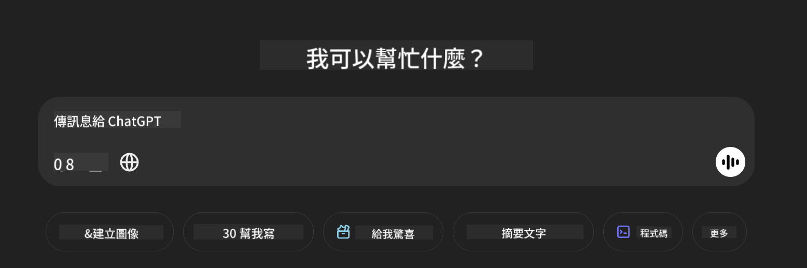

<!--
CO_OP_TRANSLATOR_METADATA:
{
  "original_hash": "550f504a78659133aa4c5757a6d875ce",
  "translation_date": "2025-04-04T13:02:57+00:00",
  "source_file": "md\\02.Application\\04.Vision\\Phi4\\CreateFrontend\\README.md",
  "language_code": "mo"
}
-->
## **Phi-4-multimodal'i istifadə edərək şəkilləri oxumaq və kod yaratmaq**

Phi-4-multimodal güclü şəkil oxuma qabiliyyətinə malikdir. Gəlin Python ilə aşağıdakı funksiyaları həyata keçirməyə çalışaq. Şəkil ChatGPT səhifəsidir. 



### **Nümunə Kod**

```python

import requests
import torch
from PIL import Image
import soundfile
from transformers import AutoModelForCausalLM, AutoProcessor, GenerationConfig,pipeline,AutoTokenizer

model_path = 'Your Phi-4-multimodal location'

kwargs = {}
kwargs['torch_dtype'] = torch.bfloat16

processor = AutoProcessor.from_pretrained(model_path, trust_remote_code=True)

model = AutoModelForCausalLM.from_pretrained(
    model_path,
    trust_remote_code=True,
    torch_dtype='auto',
    _attn_implementation='flash_attention_2',
).cuda()

generation_config = GenerationConfig.from_pretrained(model_path, 'generation_config.json')

user_prompt = '<|user|>'
assistant_prompt = '<|assistant|>'
prompt_suffix = '<|end|>'

prompt = f'{user_prompt}Can you generate HTML + JS code about this image <|image_1|> ? Please step by step {prompt_suffix}{assistant_prompt}'

image = Image.open("./demo.png")

inputs = processor(text=prompt, images=[image], return_tensors='pt').to('cuda:0')

generate_ids = model.generate(
    **inputs,
    max_new_tokens=4096,
    generation_config=generation_config,
)

generate_ids = generate_ids[:, inputs['input_ids'].shape[1] :]

response = processor.batch_decode(
    generate_ids, skip_special_tokens=True, clean_up_tokenization_spaces=False
)[0]

print(response)

```

It seems you've requested a translation to "mo," but I'm not certain what language "mo" refers to. Could you please clarify or provide more context? For example, are you referring to Maori, Mongolian, or another language?