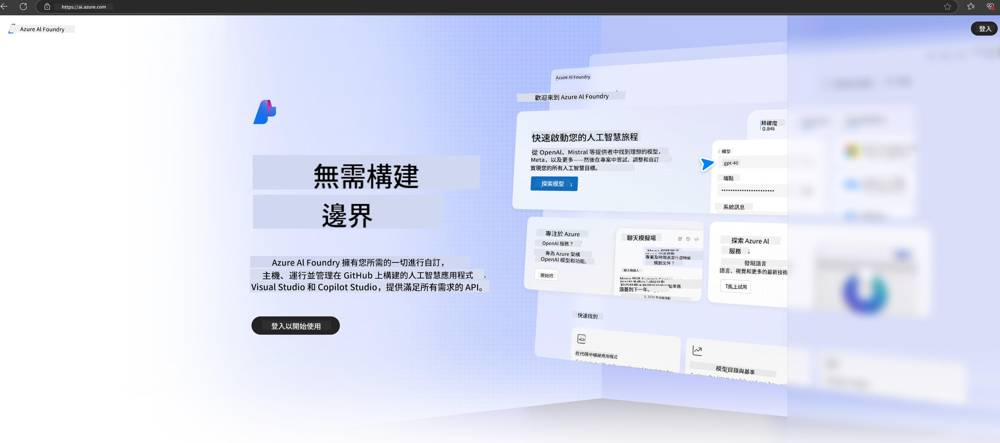

<!--
CO_OP_TRANSLATOR_METADATA:
{
  "original_hash": "6525689374197af33b41a93811e473a2",
  "translation_date": "2025-04-04T13:05:58+00:00",
  "source_file": "md\\02.QuickStart\\AzureAIFoundry_QuickStart.md",
  "language_code": "mo"
}
-->
# **Using Phi-3 in Azure AI Foundry**

With the rise of Generative AI, the goal is to leverage a unified platform to handle various LLMs and SLMs, integrate enterprise data, perform fine-tuning/RAG tasks, and assess the outcomes of incorporating LLMs and SLMs into enterprise workflows. This ensures that generative AI applications can be implemented more effectively. [Azure AI Foundry](https://ai.azure.com) serves as an enterprise-grade platform for generative AI applications.

Azure AI Foundry enables you to evaluate the responses of large language models (LLMs) and coordinate prompt-driven application components using prompt flow for enhanced performance. The platform supports scalability, allowing you to effortlessly transition from proof-of-concept to full-scale production. Continuous monitoring and refinement ensure sustained success.

By following simple steps, the Phi-3 model can be quickly deployed on Azure AI Foundry, enabling you to utilize the platform for Phi-3-related activities such as Playground/Chat, fine-tuning, evaluation, and more.

## **1. Preparation**

If you already have the [Azure Developer CLI](https://learn.microsoft.com/azure/developer/azure-developer-cli/overview?WT.mc_id=aiml-138114-kinfeylo) installed on your device, you can easily use this template by running the provided command in a new directory.

## Manual Creation

Setting up a Microsoft Azure AI Foundry project and hub is an excellent way to organize and manage your AI initiatives. Follow these steps to get started:

### Creating a Project in Azure AI Foundry

1. **Access Azure AI Foundry**: Log in to the Azure AI Foundry portal.
2. **Create a Project**:
   - If you're already in a project, click "Azure AI Foundry" at the top left of the page to navigate to the Home page.
   - Click "+ Create project".
   - Provide a name for your project.
   - If you have an existing hub, it will be selected by default. If you have access to multiple hubs, you can choose another one from the dropdown menu. To create a new hub, select "Create new hub" and enter a name.
   - Click "Create".

### Creating a Hub in Azure AI Foundry

1. **Access Azure AI Foundry**: Log in using your Azure account.
2. **Create a Hub**:
   - From the left menu, go to the Management center.
   - Select "All resources," click the down arrow next to "+ New project," and choose "+ New hub."
   - In the "Create a new hub" dialog, enter a name for your hub (e.g., contoso-hub) and adjust other settings as needed.
   - Click "Next," review the details, and then click "Create."

For detailed guidance, refer to the official [Microsoft documentation](https://learn.microsoft.com/azure/ai-studio/how-to/create-projects).

Once successfully created, you can access the studio you built via [ai.azure.com](https://ai.azure.com/).

Multiple projects can exist within a single AI Foundry hub. Start by creating a project in AI Foundry as part of the preparation.

Explore Azure AI Foundry [QuickStarts](https://learn.microsoft.com/azure/ai-studio/quickstarts/get-started-code).

## **2. Deploy a Phi model in Azure AI Foundry**

Navigate to the Explore section of your project to access the Model Catalog and choose Phi-3.

Select Phi-3-mini-4k-instruct.

Click 'Deploy' to initiate deployment of the Phi-3-mini-4k-instruct model.

> [!NOTE]
>
> You can select the computing resources during deployment.

## **3. Playground Chat Phi in Azure AI Foundry**

Go to the deployment page, select Playground, and interact with Phi-3 in Azure AI Foundry.

## **4. Deploying the Model from Azure AI Foundry**

To deploy a model from the Azure Model Catalog, follow these steps:

- Log in to Azure AI Foundry.
- Select the model you wish to deploy from the Azure AI Foundry model catalog.
- On the model's Details page, click Deploy and choose Serverless API with Azure AI Content Safety.
- Select the project where you want the model deployed. To utilize the Serverless API feature, your workspace must be located in the East US 2 or Sweden Central region. Customize the Deployment name if needed.
- In the deployment wizard, review the Pricing and terms section for details on costs and usage terms.
- Click Deploy. Wait for the deployment process to complete and for the page to redirect to the Deployments section.
- Click Open in playground to start using the model.
- You can revisit the Deployments page, select the deployment, and note the endpoint's Target URL and Secret Key for making API calls and generating responses.
- Endpoint details, URLs, and access keys can always be retrieved by navigating to the Build tab and selecting Deployments under the Components section.

> [!NOTE]
> Ensure your account has Azure AI Developer role permissions on the Resource Group to complete these steps.

## **5. Using Phi API in Azure AI Foundry**

Access https://{Your project name}.region.inference.ml.azure.com/swagger.json using Postman GET and combine it with your Key to explore the available interfaces.

You can easily obtain the request parameters as well as the response parameters.

It seems like you've requested a translation to "mo," but could you clarify what "mo" refers to? Is it a specific language, dialect, or code? For example, it could stand for Maori, Montenegrin, or something else. Please provide more context so I can assist you better!