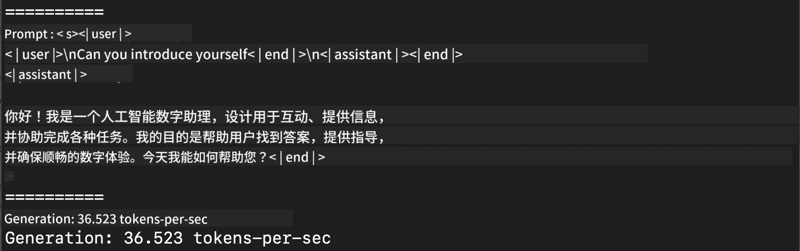
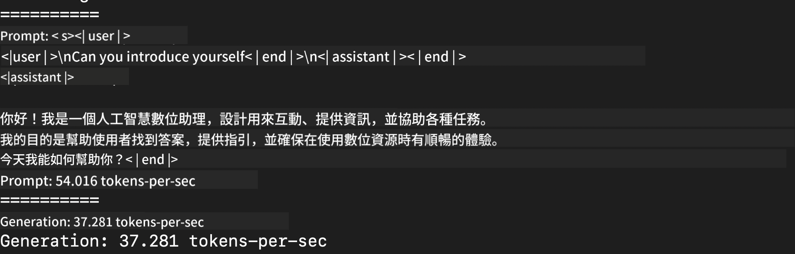

<!--
CO_OP_TRANSLATOR_METADATA:
{
  "original_hash": "dcb656f3d206fc4968e236deec5d4384",
  "translation_date": "2025-05-07T13:41:54+00:00",
  "source_file": "md/03.FineTuning/03.Inference/MLX_Inference.md",
  "language_code": "mo"
}
-->
# **Inference Phi-3 með Apple MLX Framework**

## **Hvað er MLX Framework**

MLX er fylkisrammi fyrir vélanám á Apple silicon, þróaður af Apple vélanámshópnum.

MLX er hannaður af vélanámssérfræðingum fyrir vélanámssérfræðinga. Ramminn er ætlaður að vera notendavænn en samt skilvirkur til að þjálfa og keyra líkön. Hönnun rammans sjálfs er líka hugmyndafræðilega einföld. Markmiðið er að auðvelda rannsakendum að bæta við og þróa MLX til að flýta fyrir nýjum hugmyndum.

LLM líkön geta verið hraðað á Apple Silicon tækjum með MLX, og líkön geta keyrt á staðnum mjög þægilega.

## **Notkun MLX til að keyra Phi-3-mini**

### **1. Setja upp MLX umhverfið þitt**

1. Python 3.11.x  
2. Settu upp MLX bókasafnið

```bash

pip install mlx-lm

```

### **2. Keyra Phi-3-mini í Terminal með MLX**

```bash

python -m mlx_lm.generate --model microsoft/Phi-3-mini-4k-instruct --max-token 2048 --prompt  "<|user|>\nCan you introduce yourself<|end|>\n<|assistant|>"

```

Útkoman (umhverfið mitt er Apple M1 Max, 64GB) er



### **3. Kvantun Phi-3-mini með MLX í Terminal**

```bash

python -m mlx_lm.convert --hf-path microsoft/Phi-3-mini-4k-instruct

```

***Note：*** Líkanið er hægt að kvantunera með mlx_lm.convert, og sjálfgefna kvantunin er INT4. Þessi dæmi kvantunar kvantunar Phi-3-mini í INT4.

Líkanið er hægt að kvantunera með mlx_lm.convert, og sjálfgefna kvantunin er INT4. Í þessu dæmi er Phi-3-mini kvantunar í INT4. Eftir kvantun er það vistað í sjálfgefna möppunni ./mlx_model

Við getum prófað kvantaða líkanið með MLX úr terminal

```bash

python -m mlx_lm.generate --model ./mlx_model/ --max-token 2048 --prompt  "<|user|>\nCan you introduce yourself<|end|>\n<|assistant|>"

```

Útkoman er



### **4. Keyra Phi-3-mini með MLX í Jupyter Notebook**


***Note:*** Vinsamlegast skoðaðu þetta sýnidæmi [click this link](../../../../../code/03.Inference/MLX/MLX_DEMO.ipynb)

## **Auðlindir**

1. Lærðu um Apple MLX Framework [https://ml-explore.github.io](https://ml-explore.github.io/mlx/build/html/index.html)

2. Apple MLX GitHub Repo [https://github.com/ml-explore](https://github.com/ml-explore)

**Disclaimer**:  
This document has been translated using AI translation service [Co-op Translator](https://github.com/Azure/co-op-translator). While we strive for accuracy, please be aware that automated translations may contain errors or inaccuracies. The original document in its native language should be considered the authoritative source. For critical information, professional human translation is recommended. We are not liable for any misunderstandings or misinterpretations arising from the use of this translation.

---

Could you please clarify what language or code "mo" refers to? "mo" is not a widely recognized language code. If you mean Moldovan (which is essentially Romanian), or something else, please specify so I can provide the correct translation.